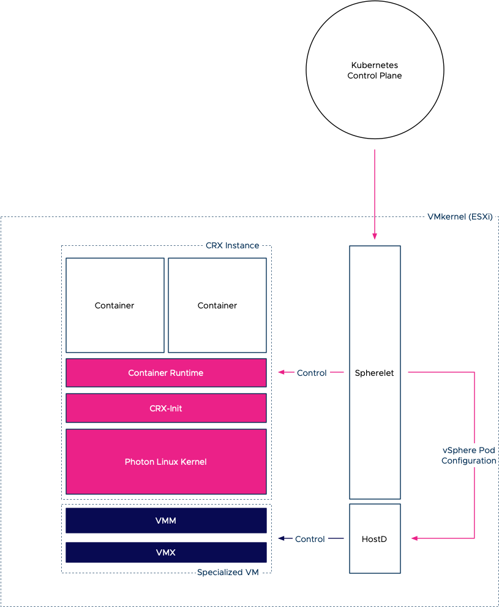

[Project Pacific](https://frankdenneman.nl/2019/08/26/5-things-to-know-about-project-pacific/) transforms vSphere into a unified application platform. This new platform runs both virtual machine and Linux containers as native workload constructs. Just introducing Linux containers as a new workload object is not enough. To manage containers properly, you need a legitimate orchestrator. And on top of that, you need to make sure that existing services, such as DRS, can handle the different lifecycles of these different objects. Containers typically have a shorter lifecycle than virtual machines, where VMs "live" for years, containers have a shorter life expectancy. And this massively different churn impacts initial placement and load-balancing operations of resource management services.

Being able to run containers as first-class citizens in the VMkernel generates a couple of fascinating challenges by itself. As Michael Gasch highlighted in our VMworld 2018 session, "[Running Kubernetes on vSphere Deep Dive: The Value of Running Kubernetes on vSphere (CNA1553BU)](https://videos.vmworld.com/global/2018/videoplayer/26337)" a container is not a separate entity but a collection of Linux processes and objects.

## Container Runtime for ESXi

The ESXi VMkernel is not a Linux operating system. The VMkernel hardware and process abstractions were built with the intent of servicing virtual machines, not to support Linux processes directly. To do so, project Pacific introduces a container runtime for ESXi (CRX). The CRX provides a [Linux Application Binary Interface (ABI)](https://en.wikipedia.org/wiki/Application_binary_interface) that allows you to execute a Linux application (container) if it was running in the VMkernel directly. The beauty of the CRX is that it is completely isolated from any other process or UserWorld running on the ESXi host. How is that possible? By using our old friend, the VM-construct.

The virtual machine aspect of a CRX instance is the use of the virtual machine monitor (VMM) and the configuration of the virtual hardware (VMX). The VMM provides the exception and interrupt handling for the VM. Inside the CRX instance, a CRX init process is active to provide communication between CRX instance and the VMkernel services.

But we need to have a Linux kernel to provide a Linux ABI for the container to run. What better Linux kernel than to use our own? VMware Photon was chosen as it's a VMware supported and maintained LTS Linux kernel. Photon is used as the base for VCSA and other VMware products and has an extremely light footprint. Now the interesting part is that this kernel is not stored onto and loaded from a separate disk. The bare Linux kernel is directly loaded into the memory space of the CRX instance when it is instantiated. Additionally, the CRX instance is stripped down. Only the necessary devices and functionalities are enabled to make the CRX and kernel as lightweight and fast as possible. For example, the CRX only exposes paravirtualized devices to the Photon kernel.

On top of this base, a container runtime is active that allows us to spin up [OCI compatible containers](https://www.opencontainers.org/) inside the CRX instance.

Inside the VMkernel, we introduced our implementation of the Kubelet, called the Spherelet. In-short, the Spherelet turns the ESXi host into a Kubernetes worker node, and the Spherelet acts as an extension to the Kubernetes control plane. The container runtime inside the CRX instance contains a Spherelet agent that allows the communication between the Spherelet and the container runtime. The Spherelet Agent provides the functionality that Kubernetes expects from a pod. Actions like; health checks, mounting storage, setting up networking, controlling the state of the containers inside the pod, and it provides an interactive endpoint to the Kubernetes command-line tool Kubectl. The Spherelet agent is linked with [libcontainer](https://github.com/opencontainers/runc/tree/master/libcontainer) and understands how to launch containers using that method. Once containers are running inside the CRX instance we refer to this group of objects as a native pod.

## Two Captains on one Ship

Now that we understand how ESXi can run containers, we need to think about who controls what from a resource management perspective. Not only does project Pacific introduces a way to run containers natively inside the VMkernel, but it also introduces Kubernetes as an orchestrator of containers. In essence, that means it is adding a control plane to a platform that already has a control plane in place for VM workloads (vCenter+HostD) plus additional services such as DRS to simplify resource management.

At first sight, this should not be difficult as Kubernetes does not manage and control VMs, so there is no overlap. However, you must have noticed that there is a duality at play. A vSphere pod is a combination of a VM and a group of containers. And to make it even more interesting, both control platforms have similar constructs to control behavior and placement. In Kubernetes, you control the placement of containers on worker nodes by using labels and deployment policies. In DRS, you use affinity rules. In Kubernetes, you use requests and limits to specify resource entitlement, while vSphere uses vSphere Reservation, Shares, and Limits (RLS) settings. Also, we have to think about how individual requests and limits of multiple containers running inside a single CRX instance will translate to the RLS settings of the VM. I will address the resource entitlement considerations in an upcoming article, what I want to explore in this article is the placement of containers and VMs when these two control planes are active.

## Initial Placement of a CRX Instance

When a developer deploys an application, he or she interacts with the Kubernetes API server, and the API server will trigger all sorts of events to various components that are present in the Kubernetes architecture. Project pacific extended the API of Kubernetes and introduced multiple controllers to interact with the vSphere platform. Therefore it seems Kubernetes is in charge. However, we cannot ignore the pure brilliance of the resource management capabilities of DRS and HostD. Whereas Kubernetes uses a very brusque and coarse method of simpy using request (the equivalent of reservations) to mix and match resource consumers (containers) and resource providers (worker nodes). vSphere is far more elegant with its ability to understand resource activity, its ability to translate idleness into a temporary priority adjustment, and the alignment of resource entitlement beyond a single host. And to make it even better, Project Pacific is using the scalable shares functionality that allows for instant readjustment of priority of resource pools if new workload (i.e., containers) are added to the vSphere namespace. An [invention Duncan Epping and I](https://patentimages.storage.googleapis.com/d9/43/2b/3782241158f021/US10298512.pdf) so proudly created with the DRS engineering team back in 2013. Yet the Kubernetes architecture has a very elegant way to express business logic, to easily dictate the placement of containers based on labels, taints, and tolerations. Therefore, it makes sense to integrate or create a mesh of functionality of both control planes.

**Initial Placement Order**

1. The developer engages with the Kubernetes API server to deploy an application. Typically these deployments are submitted to the API server with the use of a YAML file that contains pod specifications.
2. The deployment and pod specification is stored in the etcd server and the API server publishes this event to a watch-list, to which the kube-scheduler is subscribed to. Read [this article](https://www.mgasch.com/post/k8sevents/) for more information about event-based architectures.
3. The kube-scheduler initiates the selection process of an adequate host. It filters the available worker node (ESXi hosts) list based on affinity, pod and node labels and other [nodeSelector](https://kubernetes.io/docs/concepts/configuration/assign-pod-node/) constraints.
4. It sends the curated list to DRS to pick a node. DRS selects the node based on its decision tree (VM resource entitlement, host state, host compatibility).
5. Once the host is selected, the information is returned via the vCenter API server to the Pacific Scheduler.
6. The scheduler has it stored as an event in the etcd database.
7. While the event is stored in the etcd database, vCenter issues a command to the HostD process on the selected ESXi host to power-on the virtual machine.
8. HostD powers on the VM (VMX, VMM) and loads the Photon kernel into the memory address space of this virtual machine.
9. HostD returns the VM ID of the newly created VM to the Pacific Scheduler Extension.
10. The VM ID is stored in the etcd database and now the control plane node has enough data for the Spherelet to configure the pod.
11. The vSphere Pod Lifecycle Controller is updated on the event and issues the vSpherelet to configure the pod. 
12. The Spherelet connects with HostD to configure the personality of the pod and configure networking and storage elements.
13. The CRX container runtime initiates the start of the containers based on the pod specification.
14. The Spherelet returns the state of the containers back to the Kubernetes control plane node to have it stored as an event in the etcd database.

With this architecture, you have the best of both worlds, the expressiveness of the Kubernetes control plane while enjoying the elegancy of vSphere resource management capabilities. The next article on this topic dives into resource allocation based on container resource configuration settings. Please be aware that project Pacific is still in beta phase and is not (yet) available as a finalized product. Stay tuned for more.
