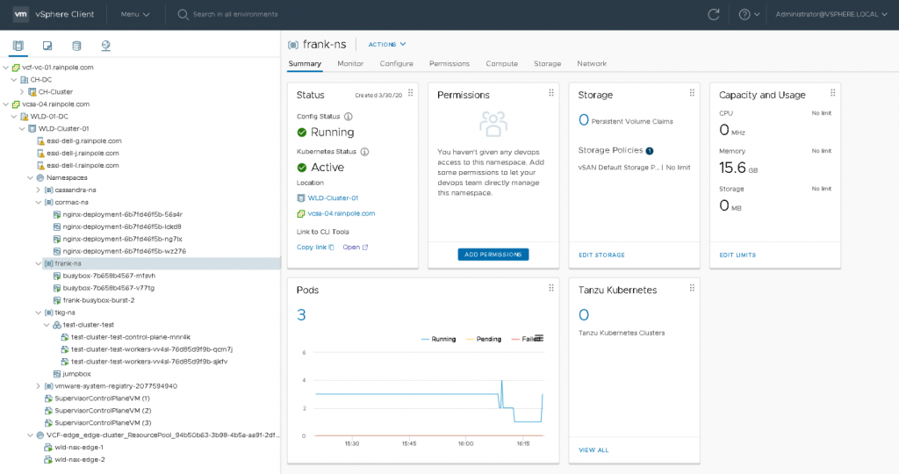
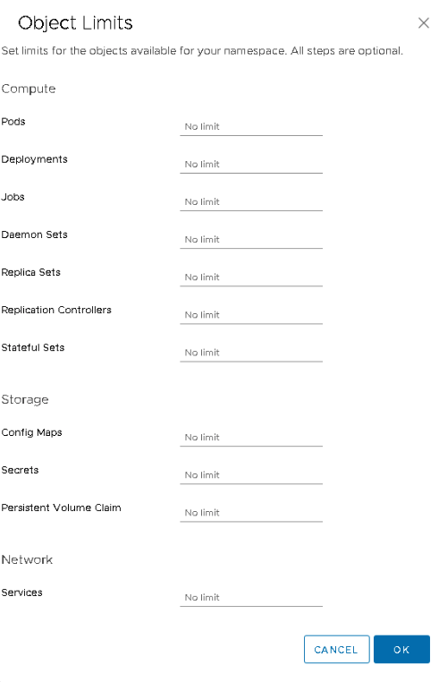
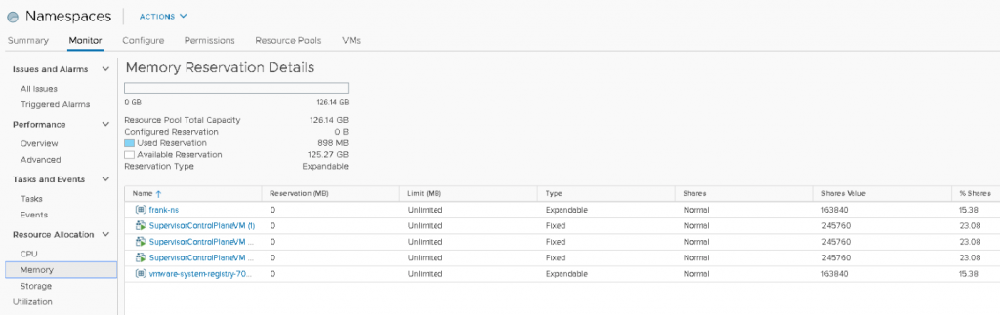
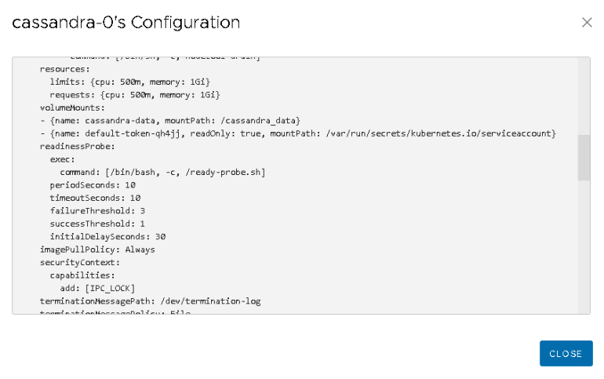

vSphere 7 with Kubernetes enables the vSphere cluster to run and manage containers as native constructs (vSphere Pods). The previous two articles in this series cover the [initial placement of a vSphere pod](https://frankdenneman.nl/2020/03/06/initial-placement-of-a-vsphere-native-pod/) and c[ompute resource management of individual vSphere pods](https://frankdenneman.nl/2020/03/20/scheduling-vsphere-pods/). This article covers the compute resource management aspect of the vSphere Supervisor namespace construct. Cormac Hogan will dive into the storage aspects of the Supervisor namespace in his (excellent) blog series.

## Supervisor Cluster

A vSphere cluster turns into a Supervisor cluster once Kubernetes is enabled. Three control plane nodes are spun up and placed in the vSphere cluster, and the ESXi nodes within the cluster act as worker node (resource providers) for the Kubernetes cluster. A vSpherelet runs on each ESXi node to control and communicate with the vSphere pod. More information about the container runtime for ESXi is available in the article "Initial Placement of a vSphere pod." 

## Supervisor Namespace

Once up and running, a Supervisor cluster is a contiguous range of compute resources. The chances are that you want to carve up the cluster into smaller pools of resources. Using namespaces turns the supervisor cluster into a multi-tenancy platform. Proper multi-tenancy requires a security model, and the namespace allows the vAdmin to control which users (developers) have access to that namespace. Storage policies that are connected to the namespace provide different types and classes for (persistent) storage for the workload.

Not only vSphere Pods can consume the resources exposed by a Supervisor namespace. Both vSphere pods and virtual machines can be placed inside the namespace. Typically the virtual machine placed inside the namespace could be running a Tanzu Kubernetes Grid Cluster (TKG). Still, you are entirely free to deploy any other virtual machine in a namespace as well. Namespaces allow you to manage application landscapes at a higher level. If you have an application that consists of virtual machines running a traditional setup and adding new services to this application that run in containers, you can group these constructs in a single namespace. Assign the appropriate storage and compute resources to the namespace and monitor the application as a whole. We want to move from managing hundreds or thousands of virtual machines individually to managing a small group of namespaces. (i.e., up-leveling workload management).

## Default Namespace

Compute resources are provided to the namespace by a vSphere DRS Resource Pool. This resource pool is not directly exposed, a vAdmin interfaces with the resource pool via the namespace UI. In the screenshot below, you can see a Workload Domain Cluster (WLD) with vSphere with Kubernetes enabled. Inside the Supervisor cluster, a top resource pool "Namespace" is created automatically, and the three Control Plane VMs of the Supervisor cluster are directly deployed in the Namespaces resource pool. (I will address this later). Cormac and I have created a couple of namespaces, and the namespace "frank-ns" is highlighted.

As you can see, this new construct is treated to a new icon. The summary page on the right side of the screen shows the status, the permission (not configured yet), the configured storage policy attached, and the capacity and usage of compute resources. The bottom part of the screen shows whether you have deployed pods or TKG clusters. In this example, three pods are currently running.

## Compute Resource Management

With a traditional Resource Pool, the vAdmin can set CPU and memory reservations, shares, and limits to guarantee and restrict the consumption of compute resources. A supervisor namespace does not expose the same settings. A namespace allows the vAdmin to set limits or requests (reservations) and limits on a per-container basis.

### Limits

A vAdmin can set a limit on CPU or memory resources for the entire namespace. This way, the developer can deploy the workload in the namespace, and not risk consuming the full compute capacity of the supervisor cluster. Beyond the resource pool limits, a vAdmin can also set a per container default limit. The namespace will automatically apply a limit to each incoming workload, regardless of the resource configuration specified in the YAML file of the containerized workload. On top of this, the vAdmin can also specify object limits. A maximum number of pods can be specified for the namespace, ultimately limiting the total consumed resources by the workload constructs deployed in the namespace.

### Reservations

A Supervisor namespace does not provide the option to set a reservation at the namespace level. However, the resource pool is configured with an _expandable reservation_ and that allows the resource pool to request for unreserved resources from its parent. These unreserved resources are necessary to satisfy the request for reservable resources for a workload. The resource pool "Namespaces" is the parent resource pool where all namespaces are deployed in. The resource pool "Namespaces" is not configured with reserved resources and as a result, it will request unreserved resources from its parent, which is the root resource pool, better known as the cluster object.

A reservation of resources is needed to protect a workload from contention. This can be done via two methods. A vAdmin can set a default reservation per container, or the resource requests must be specified in the resource configuration of the YAML file. If the vAdmin sets a default reservation per container, every container that is deployed in that namespace will be configured with that setting. The developer can specify a request or a limit for each container individually in the workload YAML file. Based on the combination of requests and limits used, Kubernetes automatically assigns a QoS class to the containers inside the pod. And based on Qos classes, reclamation occurs.  There are three Quality of Service (QoS) classes in Kubernetes, BestEffort, Burstable, and Guaranteed.

Both the Burstable and Guaranteed classes consist of a request configuration. With Burstable QoS class, the limit exceeds the number specified by the request. The Guaranteed QoS class requires that the limit and request are set to an identical value. That means that the relative priority of the namespace determines whether BestEffort or the part of the resources of the Burstable workload that is not protected by a request setting will get the resources they require during resource contention. The relative priority is specified by the level of shares assigned to the namespace.

### Shares

DRS assigns shares to objects within the cluster to determine the relative priority when there is resource contention. The more shares you own, the higher priority you have on obtaining the resources you desire. It's an incredibly dynamic (and elegant) method of catering to the needs of the active objects. A VM or resource pool can have all the shares in the world, but if that object is not pushing an active workload, these shares are not directly in play. Typically, to determine the value of shares awarded to an object, we use the worst-case scenario calculation. In such an exercise, we calculate the value of the shares, if each object is 100% active. I.e., the perfect storm. 

DRS assigns each object shares. DRS awards shares based on the configured resources of the object. The number of vCPUs and the amount of memory and then multiplying it with a number of shares. The priority level (low, normal, high) of the object determines the factor of shares. The priority levels have a 1:2:4 ratio. The normal priority is the default priority, and each vCPU gets 1000 CPU shares awarded. For every MB of memory, 10 shares are allocated. For instance, a VM with a 2 vCPU configuration, assigned the normal priority level, receives 2000 shares (2 vCPU x 1000). If the VM is configured with a high priority level, it will receive 4000 shares (2 vCPU x 2000). Although a resource pool cannot run workload by itself, DRS needs to assign shares to this construct to determine relative priority. As such, the internal definition of a resource pool for DRS equals that of a 4 vCPU, 16GB VM. As a result, a normal priority resource pool, regardless of the number of objects it contains, is awarded 4000 CPU shares and 163840 shares of memory.

A namespace is equipped with a resource pool configured with a normal priority level. Any object that is deployed inside the namespace receives a normal priority as well, and this cannot be changed. As described in the "Scheduling vSphere Pods" article, a container is a set of processes and does not contain any hardware-specific sizing configuration. It just lists the number of CPU cycles and the amount of memory it wants to have and that the upper limit of resource consumption should be. vSphere interprets the requests and limits as CPU and memory sizing for the vSphere pod (CRX), and DRS can assign shares based on that configuration. As more containers can be deployed inside a pod, a combination of limits and requests of the containers is used to assign virtual hardware to the vSphere Pod. 

BestEffort workloads do not have any requests and limit set, and as such, a default sizing is used of 1 vCPU and 512MB. From a shares perspective, this means that a vSphere pod running a single container receives 1000 CPU shares and 5120 shares of memory. A Burstable QoS class has a request set or both a request and a limit. If either setting is larger than the default size, that metric is used to determine the size of the container (see image below). If the pod manifest contains multiple containers, the largest parameter of each container is added, and the result is used as a vSphere pod size. For example, a pod includes two containers, each with a request and limit that are greater than the default size of the container. The CPU limit exceeds the quantity of the CPU request. As a result, vSphere uses the sum of both CPU limits and adds a little padding for the components that are responsible for the pod lifecycle, pod configuration, and vSpherelet interaction. A similar calculation is done for memory.

#### Relative Priority During Sibling Rivalry

Why are these vSphere pod sizes so interesting? DRS in vSphere 7 is equipped with a new feature called Scalable shares and it uses the CPU and memory configurations of the child objects to correctly translate the relative priority of the resource pools with regards of its siblings. The resource pool is the parent of the objects deployed inside. That means that during resource contention, the resource pool will request resources from its parent, the "Namespaces" resource pool, and it will, in turn, request resources from its parent the root resource pool (Supervisor Cluster). At each level, other objects exist doing the same thing during a perfect storm. That means we have to deal with sibling rivalry. 

Within the "Namespaces" RP, a few objects are present. Two namespaces and three control plane VMs. A reservation protects none of the objects, and thus each object has to battle it out with their share value if they want some of the 126.14 GB. Each control plane VM is configured with 24 GBs, owning 245,760 shares. Both RPs own 163,840 of CPU shares. A total of 1,064,960 shares are issued within the "Namespaces" RP, as shown in the UI, each control plane owns 23.08% of the total shares, whereas both resource pools own 15.38%. In a worst-case scenario, that means that the "Namespaces" RP will divide the 126.14 GB between the five objects (siblings). Each control plane node is entitled to consume 23.08% of 126.14 GB = 29.11 GB. Since it cannot allocate more than its configured hardware, it will be able to consume up to 24GB (and its VM overhead) in this situation. The remaining 5 GB will flow back to the resource pool and will be distributed amongst the objects that require it. In this case, all three control planes consume 72 GB (3 x 24 GB), and the 54.14 GB will be distributed amongst the "frank-ns" namespace and "vmware-system-reg..." (which is the harbor) namespace.

The resource requirements of the objects within each namespace can quickly exceed the relative priority of the namespace amongst its siblings. And it is expected that more namespaces will be deployed, further diluting the relative priority amongst its siblings. This behavior is highlighted in the next screenshot. In the meantime, Cormac has been deploying new workloads. He created a namespace for his own vSphere pods. He deployed a TKG cluster and a Cassandra cluster. All deployed in their own namespace.

As you can see, my namespace "frank-ns" is experiencing relative priority dilution. The percentage of shares has been diluted from 15.38% to 10.53%. I can expect that my BestEffort and Burstable deployments will not get the same amount of resources they got before if resource contention occurs. The same applies to the control plane nodes. They are now entitled to 15.79% of the total amount of memory resources. That means that each control plane node can access 19.92 GB (15.79% of 126.14GB).

### Design Decision

_I would consider applying either a reservation on the control plane nodes or create a resource pool and set a reservation at the RP level. If a reservation is set at the VM object-level it has an impact on admission control and HA restart operations (Are there enough unreserved host resources left after one or multiple host failures in the cluster?_ 

### Reserved Resources

The available amount of unreserved resources in the "Namespaces" RP are diluted when a Guaranteed or Burstable workload is deployed in one of the namespaces. The RPs backing the namespaces are configured as "Expandable" and therefore request these resources from their parent. If the parent has these resources available, it will provide them to the child resource and immediately mark it as reserved. The namespace will own these resources as long as the namespace exists. Once the Guaranteed or Burstable workload is destroyed, the reserved resources flow back to the parent. Reserved resources, when in use, cannot be allocated by other workloads based on their share value.

The interesting to note here is that in this situation, multiple Burstable workloads are deployed inside the namespaces. The Used Reservation of the "Namespaces" RP shows that 36.75GB of resources are reserved. Yet when looking at the table, none of the namespaces or VMs are confirming any reservation. That is because that column shows the reservation that is directly configured on the object itself. And no resource pool that backs a namespace will be configured directly with a reservation. Please note that it will not sum the vSphere pod or VM reservations that are running inside the RP!

The summary view of the namespace shows the capacity and usage of the namespace. In this example, the summary page is shown of the "Cormac-ns". It shows that the namespace is "consuming" 3.3 GHz and 4.46 GB. 

These numbers are a combination of reservation (request) and actually usage. This can be been seen when each individual pod is inspected. The summary page of the "cassandra-0" pod shows that 1 CPU is allocated and 1 GB is allocated, the pod consumes some memory and some CPU cycles. 

The metadata of the pod shows that this pod has a QoS class of Guaranteed. When viewing the YAML file, we can see that the request and limit of both CPU and Memory resources are identical. Interestingly enough, the CPU resource settings show 500m. The m stands for millicpu. A 1000 millicpu is equal to 1 vCPU, so this YAML file states that this container is fine with consuming half a core. However, vSphere does not have a configuration spec for a virtual CPU of half a core. vSphere can schedule per MHz, but this setting is used to define the CRX (vSphere pod) configuration. And therefore the vSphere pod is configured with the minimum of 1 vCPU and this is listed in the Capacity and Usage view.

## Scalable Shares

The reason why this is interesting is that Scalable shares can calculate a new share value based on the number of vCPU of total memory configuration of all the objects inside the resource pool. How this new functionality behaves in an extensive resource pool structure is the topic of the next article.

## Previous Articles in this Series

[Initial Placement of a vSphere Pod](https://frankdenneman.nl/2020/03/06/initial-placement-of-a-vsphere-native-pod/)

[Scheduling vSphere Pods](https://frankdenneman.nl/2020/03/20/scheduling-vsphere-pods/)
