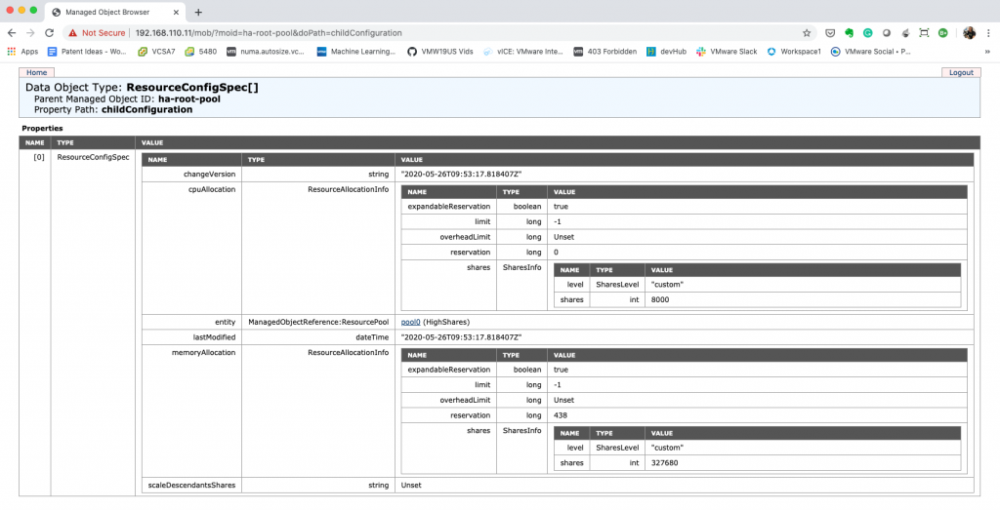
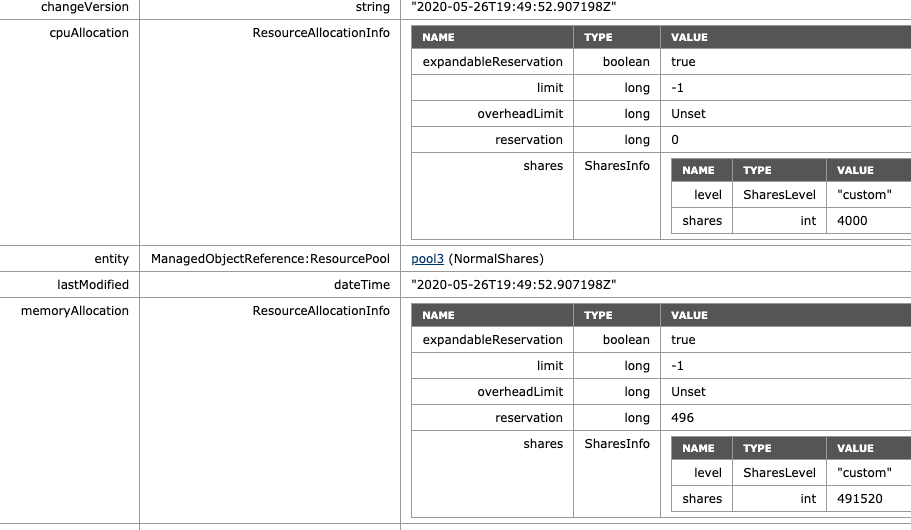
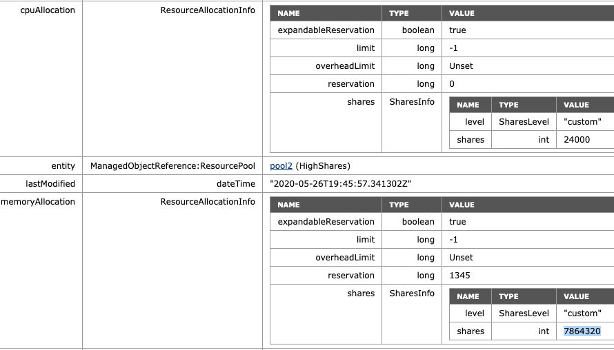
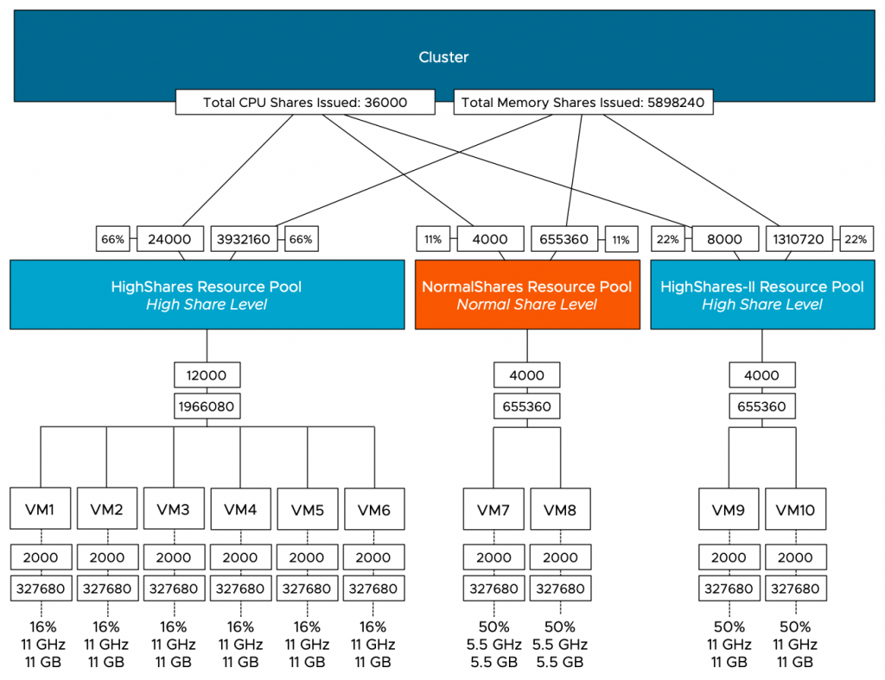
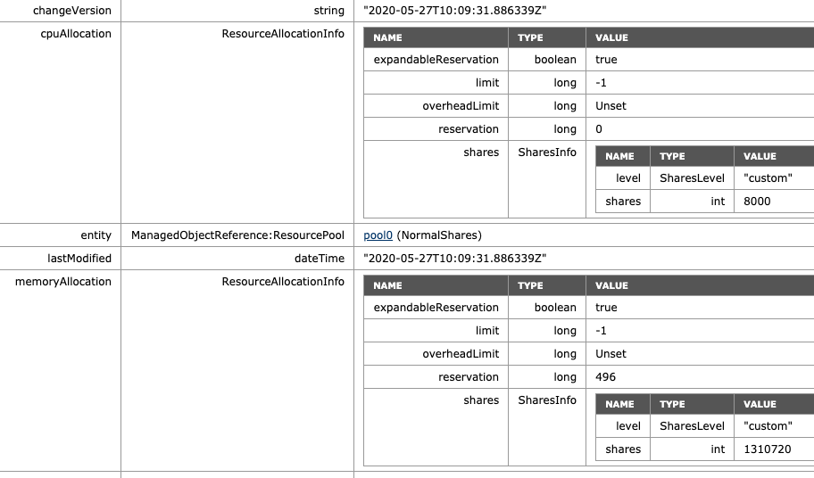

You are one tickbox away from completely overhauling the way you look at resource pools. Yes you can still use them as [folders](https://frankdenneman.nl/2018/04/25/public-shaming-resource-pool-folder-user/) (sigh), but with the newly introduced Scalable Shares option in vSphere 7 you can turn resource pools into more or less Quality of Service classes. Sounds interesting right? Let's first take a look at the traditional working of a resource pool, the challenges they introduced, and how this new delivery of resource distribution works. To understand that we have to take a look at the basics of how DRS distributes unreserved resources first.

**Compute Resource Distribution**

A cluster is the root of the resource pool. The cluster embodies the collection of the consumable resources of all the ESXi hosts in the cluster. Let's use an example of a small cluster of two hosts. After overhead reduction, each host provides 50GHz and 50GB of memory. As a result, the cluster offers 100 GHz and 100 GB of memory for consumption.

A resource pool provides an additional level of abstraction, allowing the admin to manage pools of resources instead of micro-managing each VM or vSphere pod individually. A resource pool is a child object of a cluster. In this scenario, two resource pools exist; a resource pool with the HighShares, and a resource pool (RP) with the name NormalShares.

The HighShares RP is configured with a high CPU shares level and a high memory shares level, the NormalShares RP is configured with normal CPU shares level, and normal memory shares level. As a result, HighShares RP receives 8000 CPU shares and 327680 shares of memory, while the NormalShares RP receives 4000 CPU shares and 163840 shares of memory. A ratio is created between the two RPs of 2:1.

[](https://frankdenneman.nl/wp-content/uploads/2020/05/01-ShareRatio.svg)

In this example, eight VM with each two vCPUs and 32 GBs are placed in the cluster. Six in the HighShares RP and two VMs in the NormalShares RP. If contention occurs, the cluster awards 2/3 of the cluster resources to HighShares RP and 1/3 of cluster resources to the NormalShares RP. The next step for the RP is to divide the awarded resources to its child-objects, those can be another level of resource pools or workload objects such as VMs and vSphere Pods. If all VMs are 100% active, HighShares RP is entitled to 66 GHz and 66 GBs of memory, the NormalShares RP gets 33 GHz and 33 GBs of memory.

And this is perfect because the distribution of resources follows the desired ratio "described" by the number of shares. However, it doesn't capture the actual intent of the user. Many customers use resource pools to declare the relative priority of workload compared to the workload in the other RPs, which means that every VM in the resource pool HighShares is twice as important as the VMs in the NormalShare RP. The normal behavior does not work that way, as it just simply passes along the awarded resources.

In our example, each of the six VMs in HighShares RP gets 1/6 of 2/3s of the cluster resources. In other words, 16% of 66Ghz & 66GB = ~11 GHz & ~ 11 GBs, while the two VMs in the NormalShares RP get 1/2 of 1/3 of the cluster resources. 50% of 33 GHz & 33 GB = ~16 GHz and ~16 GBs. In essence, the lower priority group VMs can provide more resources per individual workload. This phenomenon is called the [priority pie paradox](http://www.yellow-bricks.com/2010/02/22/the-resource-pool-priority-pie-paradox/).

[](https://frankdenneman.nl/wp-content/uploads/2020/05/02-VM-entitlement-pre-Scalable-Shares.svg)

**Scalable Shares**  
To solve this problem and align resource pool sizing more with the intent of many of our customers, we need to create a new method. A technique that auto-scales the shares of RP to reflect the workloads deployed inside it. Nice for VMs, necessary for high-churn containerized workloads. (See [vSphere Supervisor Namespace](https://frankdenneman.nl/2020/04/01/vsphere-supervisor-namespace/) for more information about vSphere Pods and vSphere namespaces. And this new functionality is included in vSphere 7 and is called Scalable Shares. (Nice backstory, the initial idea was developed by Duncan Epping and me, not on the back of a napkin, but on some in-flight magazine found on the plane on our way to Palo Alto back in 2012. It felt like a tremendous honor to receive a patent award on it. It's even more rewarding to see people rave about the new functionality).

**Enable Scalable Shares**  
Scalable shares functionality can be enabled at the cluster level and the individual resource pool level.

[](https://frankdenneman.nl/wp-content/uploads/2020/05/03-Enable-Scalable-Shares-at-Cluster-Level.png)

It's easier to enable it at the cluster level as each child-RP automatically inherits the scalable shares functionality. You can also leave it "unticked" at the cluster level, and enable the scalable shares on each individual resource pool. The share value of each RP in that specific resource pool is automatically adjusted. Setting it at this level is pretty much intended for service providers as they want to carve up the cluster at top-level and assign static portions to customers while providing a self-service IAAS layer beneath it.

[](https://frankdenneman.nl/wp-content/uploads/2020/05/04-Enable-Scalable-Shares-at-Resource-Pool-Level.png)

When enabling shares at the cluster-level, nothing really visible happens. The UI shows that the functionality is enabled, but it does not automatically change the depicted share values. They are now turned into static values, depended on the share value setting (High/Normal/Low).

[](https://frankdenneman.nl/wp-content/uploads/2020/05/05-HighShares-RP-Settings-with-Scalable-Shares-Enabled.png)

We have to trust the system to do its thing. And typically, that's what you want anyway. We don't expect you to keep on staring at dynamically changing share values. But to prove it works, it would be nice if we can see what happens under the cover. And you can, but of course, this is not something that we expect you to do during normal operations. To get the share values, you can use the [vSphere Managed Object Browser.](https://www.virtuallyghetto.com/2010/07/whats-new-in-vsphere-41-mob.html) William (of course, who else) has written extensively about the MOB. Please remember that it's disabled by default, so follow William's [guidance](https://www.virtuallyghetto.com/2015/02/quick-tip-vsphere-mob-is-disabled-by-default-in-esxi-6-0.html) on how to enable it. 

To make the scenario easy to follow, I grouped the VMs of each RP on a separate host. The six VMs deployed in the HighShares RP run on host ESXi01. The two VMs deployed in the NormalShares RP run on host ESXi02. I did this because when you create a resource pool tree on a cluster, the RP-tree is copied to the individual hosts inside the cluster. But only the RPs that are associated with the VMs that run on that particular host. Therefore when reviewing the resource pool tree on ESXi01, we will only see the HighShares RP, and when we look at the resource pool tree of ESXi02, it will only show the NormalShares RP. To view the RP tree of a host, open up a browser, ensure the MOB is enabled and go to

```
https://<ESXi-name-or-ipaddress>/mob/?moid=ha%2droot%2dpool&doPath=childConfiguration
```

Thanks to [William](https://twitter.com/lamw) for tracking this path for me. When reviewing ESXi01 before enabling scalable shares, we see the following:

- ManagedObjectReference:ResourcePool: pool0 (HighShares)
- CpuAllocation: Share value 8000
- MemoryAllocation: Share value: 327680

[](https://frankdenneman.nl/wp-content/uploads/2020/05/06-ESXi01-Local-Tree-HighShares.png)

I cropped the image for ESXi02, but here we can see that the NormalShare RP defaults are:  

- ManagedObjectReference:ResourcePool: pool1 (NormalShares)
- CpuAllocation: Share value 4000
- MemoryAllocation: Share value: 163840

[](https://frankdenneman.nl/wp-content/uploads/2020/05/07-ESXi02-Local-Tree-NormalShares.png)

**Resource Pool Default Shares Value**

If you wonder about how these numbers are chosen, an RP is internally sized as a 4vCPU 16GB virtual machine. With a normal setting (default), you get 1000 shares of CPU for each vCPU and ten shares of memory for each MB (16384x10). High Share setting award 2000 shares for each vCPU and twenty shares of memory for each MB. Using a low share setting leaves you with 500 shares per CPU and five shares of memory for each MB.

[](https://frankdenneman.nl/wp-content/uploads/2020/05/08-HighShares-Scalable_Shares-enabled.png)

When enabled, we can see that scalable shares have done its magic. The shares value of HighShares is now 24000 for CPU and 392160 shares of memory. How is this calculation made:  

1. Each VM is set to normal share value.
2. Each VM has 2 vCPUs ( 2 x 1000 shares = 2000 CPU shares)
3. Each VM has 32 GB of memory = 327680 shares.
4. There are six VMs inside the RP, and they all run on ESXi01:
5. Sum of CPU shares active in RP: 2000 + 2000 + 2000 + 2000 + 2000 + 2000 = 12000
6. Sum of Memory shares active in RP: 327680 + 327680 + 327680 + 327680 + 327680 + 327680 = 1966080
7. The result is multiplied by the ratio defined by the share level of the resource pools.

The ratio between the three values (High:Normal:Low) is 4:2:1. That means that the ratio between high and normal is 2:1, and thus, HighShares RP is awarded 12000 x 2 = 24000 shares of CPU and 1966080 x 2 = 3932160 shares of memory.

[](https://frankdenneman.nl/wp-content/uploads/2020/05/09-VM-entitlement-Scalable-Shares-.svg)

To verify, the MOB shows the adjusted values of NormalShares RP, which is 2 x 2000 CPU shares = 4000 CPU shares and 2 x 163840 = 655360 shares of memory.

[](https://frankdenneman.nl/wp-content/uploads/2020/05/10-NormalShares-Scalable-Shares-enabled.png)

If we are going to look at the worst-case-scenario allocation of each VM (if every VM in the cluster is 100% active), then we notice that the VMs allocation is increased in the HighShares RP, and decreased in the NormalShares RP. VM7 and VM8 now get a max of 7 GB instead of 16 GB, VMs 1 to 6 allocation increases 3 GHz and 3 GB each. Easily spotted, but the worst-case-scenario allocation is modeled after the RP share level ratio.

[](https://frankdenneman.nl/wp-content/uploads/2020/05/11-Ratio-established-Scalable-Shares.svg)

What if I adjust the share level at the RP-level? The NormalShares RP is downgraded to a low memory share level. The CPU shares remain the same. The RP receives 81920 of shares and now establishes a ratio of 4:1 compared to the HighShares RP (327680 vs. 81920). The interesting thing is that the MOB shows the same values as before, 655360 shares of memory. Why? Because it just sums the shares of the entities in the RP.

[](https://frankdenneman.nl/wp-content/uploads/2020/05/12-Sum-of-Shares-Low-Memory-Shares-RP.png)

As a test, I've reduced the memory shares of VM7 from 327680 to 163840. The MOB indicates a drop of shares from 655360 to 491520 (327680+163840), proofing that the share value is a total of shares of child-objects.

[](https://frankdenneman.nl/wp-content/uploads/2020/05/13-Adjusted-VM-share-value.png)

Please note that this is a fundamental change in behavior. With non-scalable shares RP, share values are only relative at the sibling level. That means that a VM inside a resource pool competes for resources with other VMs on the same level inside that resource pool. Now a VM with an absurd high number (custom-set or monster-VM) impacts the whole resource distribution in the cluster. The resource pool share value is a summation of its child-object. Inserting a monster-VM in a resource pool automatically increases the share value of the resource pool; therefore, the entire group of workloads benefits from this.

I corrected the share value of VM7 to the default of 327680 to verify the ratio of the increase occurring on HighShares RP. The ratio between low and high is 4:1, and therefore the adjusted memory shares at HighShares should be 1966080 x 4 = 7864320.

[](https://frankdenneman.nl/wp-content/uploads/2020/05/14-Adjusted-Shares-HighShare-RP.png)

What if we return NormalShares to the normal share value similar to the beginning of this test, but add another High Share value RP to the environment? For this test, we add VM9 and VM10, both equipped with two vCPUs and 32GBs of memory. For test purposes, they are affined with ESXi01, similar to the HighShare RP VMs. The MOB on ESXi01 shows the following values for the new RP HighShares-II: 8000 shares of CPU, 1310720 shares of memory, following the ratio of 2:1.

[](https://frankdenneman.nl/wp-content/uploads/2020/05/15-HighShares-II-Shares-Value.png)

If we are going to look at the worst-case-scenario allocation of each VM, then we notice that the VMs allocation is decreased for all the VMs in the HighShares and NormalShares RP. VMs 1 to 6 get 16% (11 GHz & 11 GBs), while VM 7 and 8 get 50% of 11% of the cluster resources, i.e. 5.5 GHz and 5.5 GBs each. The new VMs 9 and 10 each can allocate up to 11 GHz and 11 GB, same as the VMs in Highshares RP, following the RP share level ratio.

[](https://frankdenneman.nl/wp-content/uploads/2020/05/16-Cluster-Resource-Distribution.png)

What happens if we remove the HighShares-II RP and move VM9 and VM10 into a new LowShares RP? This creates a situation where there are three RPs with a different share level assigned to it, providing us with a ratio of 4:2:1. The MOB view of ESXi01 shows that the LowShares RP shares value is not modified, and the HighShares RP shares quadrupled.

[](https://frankdenneman.nl/wp-content/uploads/2020/05/17-HighShares-LowShares-MOB-view.png)

The MOB view of ESXi01 shows that the share value of the NormalShares RP shares is now doubled, following the 4:2:1 ratio exactly.

[](https://frankdenneman.nl/wp-content/uploads/2020/05/18-NormalShares-MOB-view.png)

This RP design results in the following worst-case-scenario allocation distribution:

[](https://frankdenneman.nl/wp-content/uploads/2020/05/19-High-Normal-Low-RPs-1.svg)

**VMs as Siblings**

The last scenario I want to highlight is a VM deployed at the same level at the RP level. A common occurrence. Without scalable shares, this could be catastrophic as a Monster-VM could cast a shadow over a resource pool. A (normal share value) VM with 16 vCPUs and 128 GB would receive 16000 shares of CPU and 1310720 shares of memory. In the pre-scalable shares, it would dwarf a normal share value RP with 4000 shares and 163840 shares of memory. Now with scalable shares bubbling up the number of shares of its child-objects, it evens out the playing field. It doesn't completely solve it, but it reduces the damage. As always, the recommendation is to commit to a single object per level. Once you use resource pools, provision only resource pools at that level. Do not mix VMs and RPs on the same level, especially when you are in the habit of deploying monster VMs. As an example, I've deployed the VM "High-VM11" at the same level as the resource pool, and DRS placed it on ESXi02, where the NormalShares RP lives in this scenario. The share value level is set to high, thus receiving 4000 shares for its two vCPUs and 655360 shares for its memory configuration, matching the RP config, which needs to feed the need of two VMs inside.

[](https://frankdenneman.nl/wp-content/uploads/2020/05/17-VM-and-RP-as-Sibling.png)

I hope this write-up helps to understand how outstanding Scalable Shares is, turning Share levels more or less into QoS levels. Is it perfect? Not yet, as it is not bulletproof against VMs being provisioned out of place. My recommendation is to explore VEBA (4) for this and generate a function to automatically move root-deployed VMs into a General RP, avoiding mismatch.

**Closing Notes**

Please note that I constrained the placement of VMs of an entire RP to a single host in the scenarios I used. In everyday environments, this situation will not exist, and RPs will not be tied to a single host. The settings I used are to demonstrate the inner workings of scalable shares and must not be seen as endorsements or any kind of description of normal vSphere behavior. The platform was heavily tuned to provide an uncluttered view to make it more comprehensible.

Worst-case-scenario numbers are something that shows a situation that is highly unlikely to occur. This is the situation where each VM is simultaneously 100% active. It helps to highlight resource distribution while explaining a mechanism, typically resource demand ebbs and flows between different workloads, thus the examples used in these scenarios are not indicative of expected resource allocation when using resource pools and shares only.
