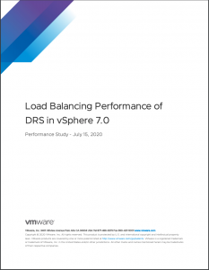

vSphere 7 contains the new DRS algorithm that [differs tremendously](https://frankdenneman.nl/2020/05/08/drs-migration-threshold-in-vsphere-7/) from the old one. The performance team has put the new algorithm through the test and have published a whitepaper presenting their findings.

Read the white paper: [Load Balancing Performance of DRS in vSphere 7.0.](https://www.vmware.com/content/dam/digitalmarketing/vmware/en/pdf/techpaper/performance/drs-vsphere7-perf.pdf)
