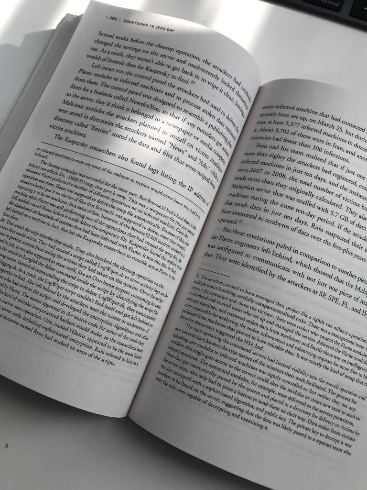
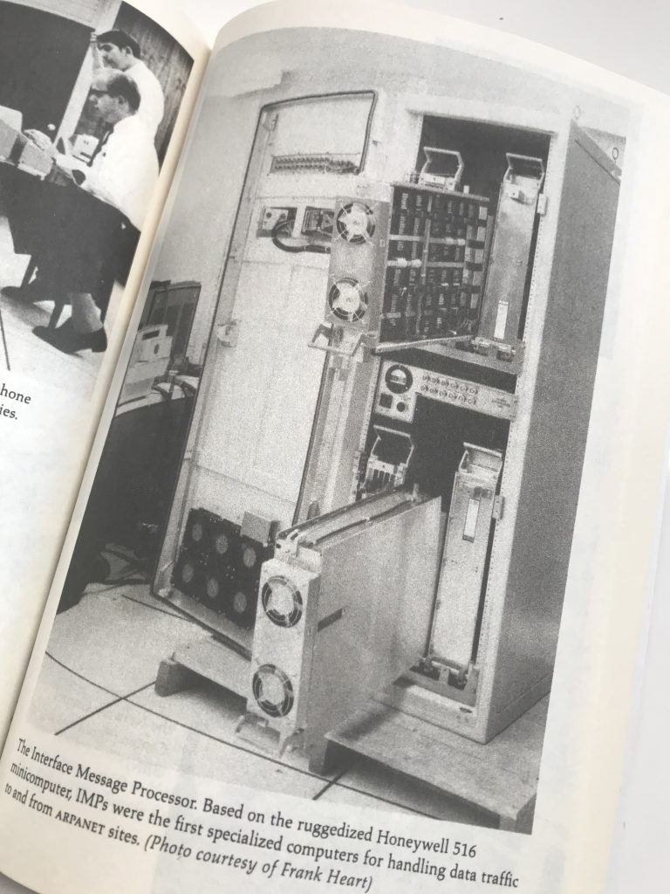
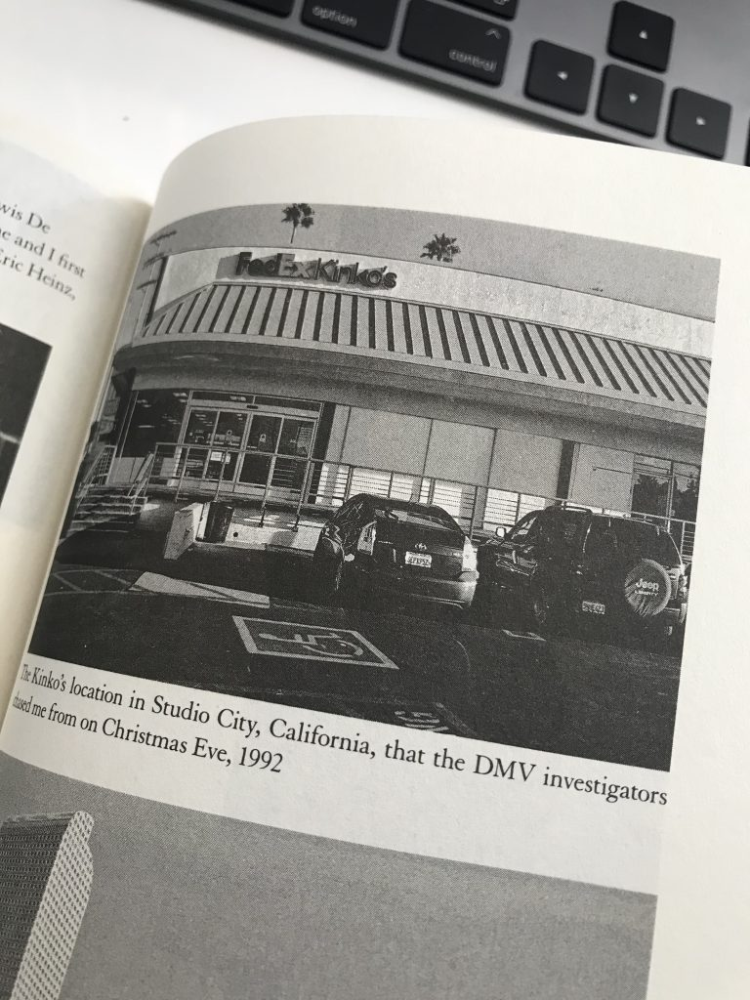

Today I was discussing with Duncan some great books to read. Disconnecting fully from work is difficult for me, so typically, the books I read are tech-related. I have read some brilliant books that I want to share with you, but mostly I want to hear your recommendations for other excellent tech novels.

### Cyberwarfare

Cyberwarfare intrigues me, so any book covering Operation Olympic Games -or- Stuxnet interests me. One of the best books on this topic "[Countdown to Zero day](https://amzn.to/2XbZaVw)" by Kim Zetter. The book is filled with footnotes and references to corresponding research.

David Sanger, the NYT reporter who broke the Olympic Games story, wrote another brilliant piece on the future of Cyberwarfare, "[The Perfect Weapon: War, Sabotage, and Fear in the Cyber Age](https://amzn.to/2BK2HCT)". This book is the basis of an [upcoming HBO documentary](https://deadline.com/2019/11/hbo-documentary-david-e-sanger-the-perfect-weapon-war-sabotage-and-fear-in-the-cyber-age-john-maggio-1202795513/).

 "[No Place to Hide](https://amzn.to/3jPfF3r)," tells the story of Glenn Greenwald (The Guardian Journalist) of the encounters with Snowden right after he walked away with highly classified material. Greenwald explores some of the technology used by the NSA uncovered by the Snowden leak.

### Tech History

If you are interested in the inception of the internet, then "[Where Wizards stay up late](https://amzn.to/2D4ylvh)" should be on your bookshelf or a part of your digital library. Moving the computer from being a giant calculator to a communication device.

"[Command and Control](https://amzn.to/2XbHU2F)" explores the systems used to manage the American nuclear arsenal. It tells stories about near misses. If you think you're behind on patching and updating your systems, do yourself a favor and read this book ;)

### Technothriller

Old-timers know Mark Russinovich from the advanced system utility toolset called Sysinternals, the new generation knows him as CTO of Azure Webservices. It turns out, that Mark is a gifted author as well. He published three tech novels that are highly entertaining to read: "[Zero day](https://amzn.to/2CVhVWl)", "[Rogue Code](https://amzn.to/2CVhY4t)" and "[Trojan Horse](https://amzn.to/3hVIJUT)". 

Little Brother by [Cory Doctorow](https://amzn.to/2DibJHx) (Thanks to [Mark Brookfield](https://twitter.com/virtualhobbit) for recommending this) tells an entertaining story of how a young hacker takes on the department of homeland security.

### Hacking

"[Ghost in the Wires](https://amzn.to/2Dgke5Y)" reads like a technothriller, but tells the story of the hunt on Kevin Mitnick. A must-have.

"[Kingpin: How One Hacker Took Over the Billion-Dollar Cybercrime Underground](https://amzn.to/39HjmmZ)" tells the story of Kevin Poulsen, ofter referred to in Ghost in the Wires, as one of the most notorious hackers focusing on credit card fraud. An exciting and quick read.

What's in your top 5?
