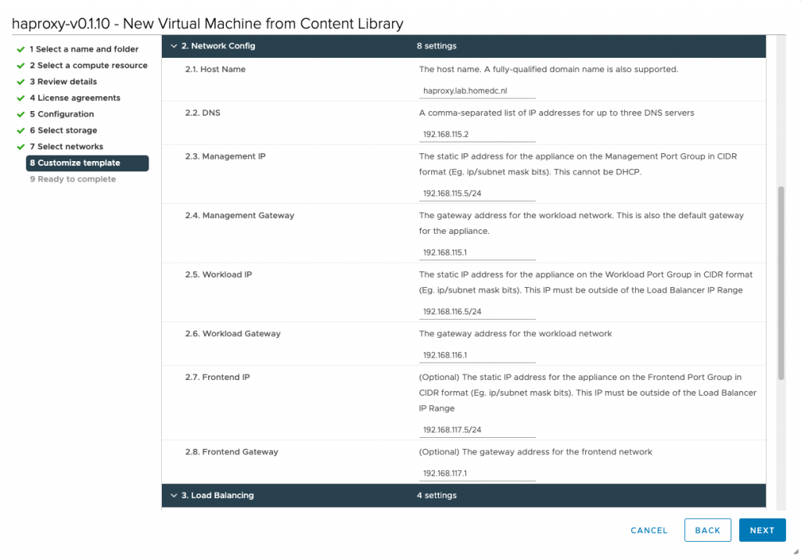
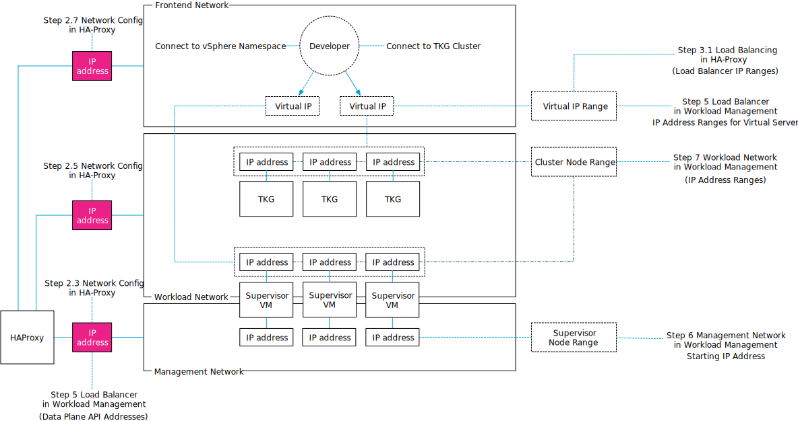
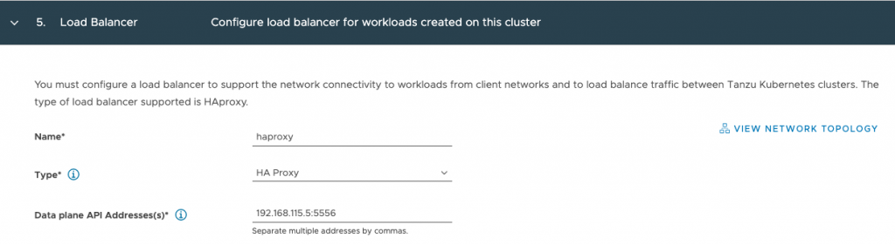
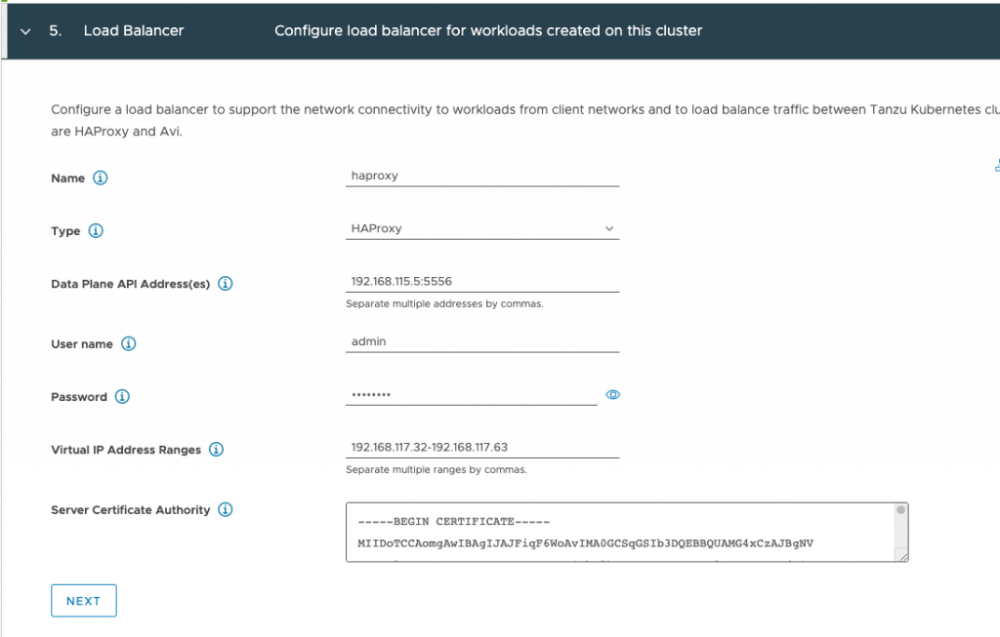
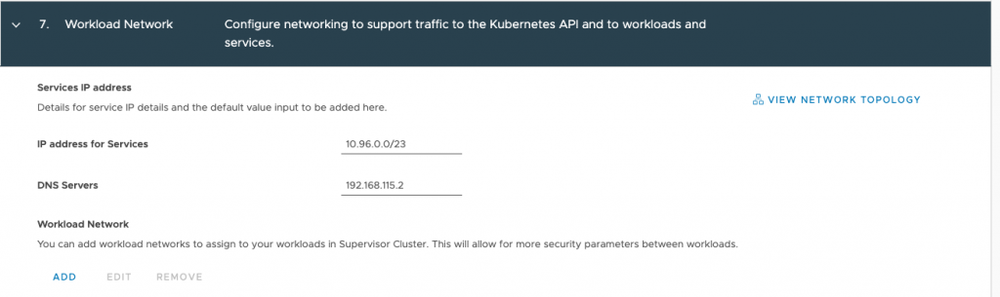

I noticed quite a few network-related queries about the install of vSphere with Tanzu together with vCenter Server Networks (Distributed Switch and HA-Proxy).

The whole install process can be a little overwhelming when it's your first time dealing with Kubernetes and load-balancing services. Before installing Workload Management (the user interface designation for running Kubernetes inside vSphere), you have to setup HA-Proxy, a virtual appliance for provisioning load-balancers.

[Cormac did a tremendous job](https://cormachogan.com/2020/09/28/enabling-vsphere-with-tanzu-using-ha-proxy/) describing the configuration steps of all components. Still, when installing vSphere with Tanzu, I found myself mapping out the network topology to make sense of it all since there seems to be a mismatch of terminology between HA-proxy and Workload Management configuration workflow.

To help you navigate this diagram, I've provided annotations of the actual UI install steps. In total, three networks can be used for this platform;

| **Network** | **Main Purpose** |
| --- | --- |
| Management | Communicating with vCenter, HA Proxy |
| Workload | IP addresses for Kubernetes Nodes |
| Frontend | Virtual IP range for Kubernetes clusters |

You can use the same network for the workload and frontend but be sure you are using IP-ranges that do not overlap. Also, do not use a DHCP range on that network. I wasted two days figuring out that this was not a smart thing to do. The supervisor VMs are dual-homed and connect to the management network and the workload network. The frontend network contains the virtual IP range assigned to the kubernetes clusters, which can be the supervisor cluster and the TKG clusters.

To make it simple, I created three distinct VLANs with each their own IP-range:

| Network | IP Range | VLAN |
| --- | --- | --- |
| Management network | 192.168.115/24 | 115 |
| Workload network | 192.168.116/24 | 116 |
| Frontend network | 192.168.117/24 | 117 |

This overview can help you with mapping the ip-addresses used in the screenshot to the network designations in the diagram. For example, during the HA-Proxy install, you have to configure the network. This is step 2 of this process and step 2.3 requests the management IP of the HA Proxy virtual appliance.

HA-Proxy requires you to provide a load balancer IP range, that is used to provide a Kubernetes cluster a virtual IP.

The next stop is workload management. In step 5, the first IP-address that you need to supply is the management IP address which you provided in step 2.3 of the HA-Proxy config process.

Staying on same config page, you need to provide the IP ranges for virtual servers, those are the ip-address defined in the frontend network. It's the exact same range you used when configuring step 3.1 of the HA-proxy configuration process, but this time you have to write it out instead of using a CIDR format (Let's keep you sharp! ;) )

Step 6 of the workload management config process requires you to specify the IP addresses of the supervisor control plane VMs on the management network.

And the last network related configuration option, is step 7 in which you define the Kubernetes node IP range, this applies to both the supervisor cluster as well as the guest TKG clusters. This range is defined in the workload network portion in the top part the screen:

Click on add to open workload network config screen.

Tip, the network name you provide is presented to you when configuring a namespace for a workload within the vSphere\\supervisor cluster. Please provide a meaningful name other than network-1

I hope this article helps you to wrap your head around these network requirements a little bit better. Please follow the instructions laid out in Cormacs Blog series and refer to these sets of diagram to get some visual aid in the process.
