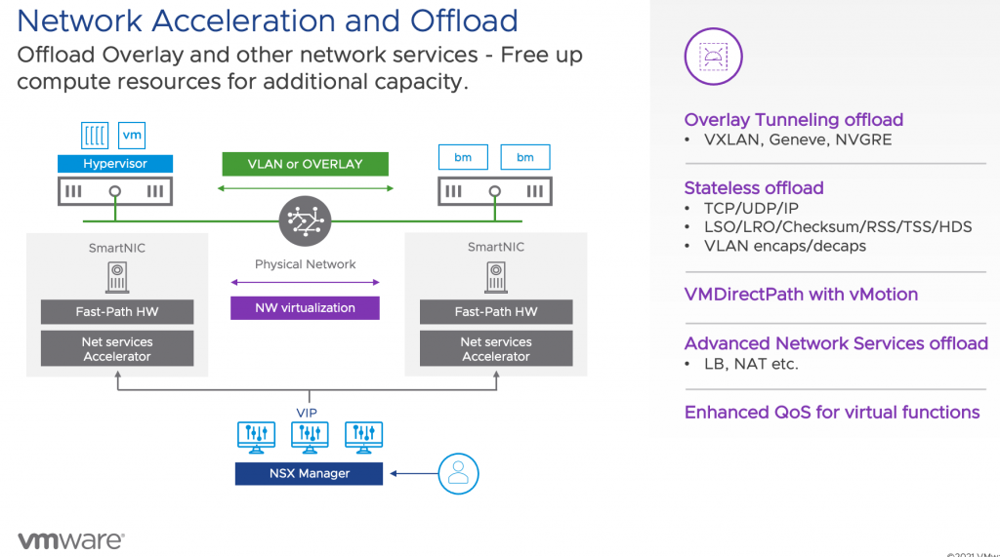

VMworld has started, and that means a lot of new announcements. One of the most significant projects VMware is working on is project Monterey. Project Monterey allows the use of SmartNICS, also known as Data Processing Units, of various VMware partners within the vSphere platform. Today we use the CPU inside the ESXi host to run workloads and to process network operations. With the shift towards distributed applications, the CPUs inside the ESXi hosts need to spend more time processing network IO instead of application operations. This extra utilization impacts data center economics like consolidation ratios and availability calculations. On top of this shift from monolith application to distributed application is the advent of machine learning supported services in the enterprise data center.

As we all know, the enterprise data center is the goldmine of data. Business units within organizations are looking at the data. If combined with machine learning, it can solve their business challenges. And so, they use the data to train machine learning models. However, data stored in databases or coming from modern systems such as sensors or video systems cannot be directly fed into the vertical application stack used for machine learning model training. This data needs to be "wrangled" into shape. The higher quality of the data, the better the model can generate a prediction or recommendation. As a result, the data flows from its source through multiple systems. Now you might say machine learning datasets are only a few 100 gigabytes in size. I've got databases that are a few terabytes. The problem is that a database sits nice and quietly on a datastore on an array somewhere and doesn't go anywhere. This dataset moves from one system to another in an ML infrastructure depicted below and gets transformed, copied, and versioned many times over. You need a lot of CPU horsepower to transform the data and continuously move the data around!

One of the most frequent questions I get is why vSphere is such an excellent platform for machine learning, simply data adjacency. We run an incredible amount of database systems in the world. That holds the data of the organizations, which in turn holds the key to solve those challenges. Our platform provides the tools and capabilities to use modern technologies such as GPU accelerators and data processing units to help process the data. And data is the fuel of machine learning.

The problem is that we (the industry) haven't gotten around to make a Tesla version of machine learning model training yet. We are in the age of gas-guzzling giants. People in the machine learning space are looking into improving techniques for datasets for model training. Instead of using copious amounts of data, use more focused data points. But that's work in progress. In the meantime, we need to deal with this massive data stream flowing through many different systems and platforms that typically run within virtual machines and containers on top of the core platform vSphere. Instead of overwhelming the X86 CPUs in the ESXi host to deal with all the network traffic generated by sending those datasets between the individual components of the ML infrastructure, we need to offload it to another device in an intelligent way. And that's where project Monterey can come into play.

There are many presentations about project Monterey and all it's capabilities. I would suggest you start with ["10 Things You Need to Know About Project Monterey"](https://myevents.vmware.com/widget/vmware/vmworld2021/catalog/session/1620986712627001YqIj) by Niels Hagoort #MCL1833
