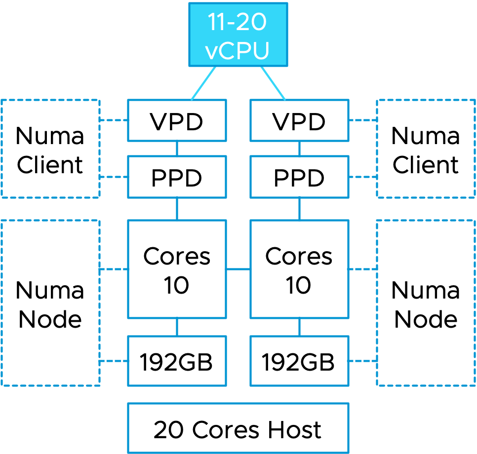
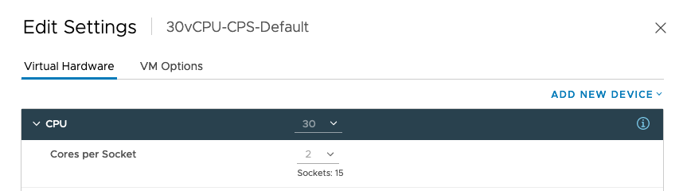
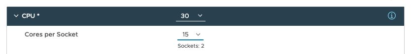

Regularly I meet with customers to discuss NUMA technology, and one of the topics that are always on the list is the Cores per Socket setting and its potential impact.

In vSphere 6.5, we made some significant adjustments to the scheduler that allowed us to decouple the NUMA client creation from the Cores per Socket setting. Before 6.5, if the vAdmin configured the VM with a non-default Cores per Socket setting, the NUMA scheduler automatically aligned the NUMA client configured to that Cores per Socket settings. Regardless of whether this configuration was optimal for performing in its physical surroundings.

To help understand the impact of this behavior, we need to look at the components of the NUMA client and how this impacts the NUMA scheduler options for initial placement and load-balancing options.

A NUMA client consists of two elements, a virtual component and a physical component. The virtual component is called the virtual proximity domain (VPD) and is used to expose the virtual NUMA topology to the guest OS in the virtual machine, so the Operating System and its applications can apply optimizations for the NUMA topology they detect. The physical component is called the physical proximity domain (PPD). It is used by the NUMA scheduler in the VMkernel as a grouping construct for vCPUs to place a group of vCPUs on a NUMA node (physical CPU+memory) and to move that group of vCPUs between NUMA nodes for load-balancing purposes. You can see this PPD as some form of an affinity group. These vCPUs always stick together.

Please note that the CPU scheduler determines which vCPU will be scheduled on a CPU core. The NUMA scheduler only selects the NUMA node.

As depicted in the diagram, this VM runs on a dual-socket ESXi host. Each CPU socket contains a CPU package with 10 CPU cores. If this VM gets configured with a vCPU range between 11 and 20 vCPUs, the NUMA scheduler creates two NUMA clients and distributes these vCPUs evenly across the two NUMA nodes. The guest OS is presented with a virtual NUMA topology by the VPDs that aligns with the physical layout. In other words, there will be two NUMA nodes, with an x number of CPUs inside that NUMA node.

Previous to ESXi 6.5, if a virtual machine is created with 16 CPUs and 2 Cores per Socket, the NUMA scheduler will create 8 NUMA Clients, and thus the VM exposes eight NUMA nodes to the guest OS.

As a result, the guest OS and application could make the wrong process placement decisions or miss out on ideal optimizations as you are reducing resource domains as memory ranges and cache domains. Luckily we solved this behavior, and now the Cores Per Socket setting does not influence NUMA client configuration anymore. But!

But, a Cores per Socket setting other than Cores per Socket =1 will impact the distribution of vCPUs of that virtual machine across the physical NUMA nodes. As the Cores per Socket act as a mini affinity rule-set. That means that the NUMA schedule has to distribute the vCPUs of the virtual machine across the NUMA nodes with Cores per Settings still in mind, not as drastically as before, where it also exposed it to the guest OS. Still, it will impact overall balance if you start to do weird things. Let me show you some examples. Let's start by using a typical example of Windows 2019. In my lab, I have a dual-socket Xeon system with each 20 cores, so I'm forced to equip the example VMs with more than 20 vCPUs to show you the effect of Cores per Socket on vNUMA.

In the first example, I deploy a Windows 2019 VM with the default settings and 30 vCPUs. That means that it is configured with 2 Cores per Socket. Resulting in a virtual machine configuration with 15 sockets.

The effect is seen by using the command "sched-stats -t numa-clients" if I log into the ESXi host via an SSH session. The groupID of the VM is 1405619, which I got from ESXTOP, and this command shows that 16 vCPUs are running on homeNode 0 and 14 vCPUs on homeNode 1. Maybe, this should not be a problem, but I've seen things! Horrible things!

This time I've selected 6 Cores per socket. And now the NUMA scheduler distributes the vCPUs as follows:

At this point, the NUMA nodes are imbalanced more severely. This will impact the guest OS and the application. And If you do this at scale, for every VM in your DC, you will create a scenario where you impact the guest OS and the underlying fabric of connected devices. More NUMA rebalancing is expected, which occurs across the processor interconnects (QPI-Infinity Fabric). More remote memory is fetched, all the operations impact PCIe traffic, networking traffic, HCI storage traffic, GPU VDI or Machine Learning application performance.

The Cores per Socket setting is invented to solve a licensing problem. There are small performance gains to be made if the application is sensitive to cache performance and can keep the data in the physical cache. If you have that application, please align your Cores per Socket setting to the actual physical layout. Using the last example, for the 30 vCPU VM on a dual-socket 40 cores host, the Cores per Socket should be 15, resulting in 2 virtual sockets.

But my recommendation is to avoid the management overhead for 99% of all your workload and keep the default Cores per Socket Settings. Overall you have a higher chance not to impact any underlying fabric or influence scheduler decisions.

**Update**

Looking at the comments, I notice that there is some confusion. Keeping the default means that you will use 2 Cores per Socket for the new Windows systems. The minor imbalance of vCPU distribution within the VM should not be noticeable. The Windows OS is smart enough to distribute processes efficiently between these NUMA nodes setup like this. The compounded effect of many VMs within the hypervisor and the load-balancing mechanism of the NUMA scheduler and the overall load frequencies (not every vCPU is active all of the time) will not make this a problem.

For AMD EPYC users, please keep in mind, that you are not working with a single chip surface anymore. EPYC is a [multi-chip module architecture](https://frankdenneman.nl/2019/10/14/amd-epyc-naples-vs-rome-and-vsphere-cpu-scheduler-updates/) and hence, you should take notice of the cache boundaries of the CCX's within the EPYCs. The new Milan (v3) has 8 cores per CCX, the Rome (v2) and Naples (v1) have 4 cores. Please test the cache boundary sensitivity of your workload if you are running your workload on AMD EPYC systems. Please note that not every workload is cache sensitive and not every combination of workloads responds the same way. This is due to the effect that load correlation and load synchronicity patterns can have on scheduling behavior and cache evictions patterns.
