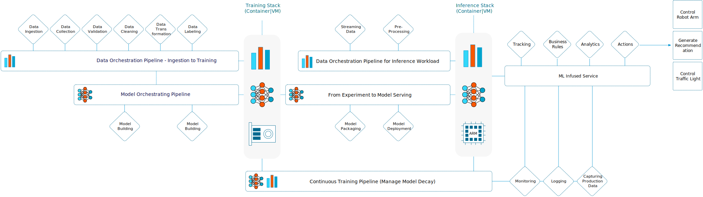

Machine Learning is reshaping modern business. Most VMware customers look at machine learning to increase revenue or decrease cost. When talking to customers, we mainly discuss the (vertical) training and inference stack details. The stack runs a machine learning model inside a container or a VM, preferably onto an accelerator device like a general-purpose GPU. And I think that is mostly due to our company DNA letting us relate machine learning workload directly to a hardware resource. 

But Machine Learning (ML) allows us to think much broader than that. One of the most cited machine learning papers, ["Machine Learning: The High-Interest Credit Card of Technical Debt,"](https://research.google/pubs/pub43146/) shows us that running ML code is just a tiny part of the extensive and complex hardware and software engineering system. 

## Machine Learning Infrastructure Platform

As of today, VMware's platform can offer much functionality to ML practitioners already. We can break down a machine learning platform into horizontal fabrics connecting the vertical training and inference stack. An example of a horizontal fabric can be a data pipeline that runs from ingesting data all the way to feeding the training stack a training data set. Or it can be a pipeline that streams data from a sensor to an ISV pre-trained model and goes all the way to control the actions of a robot arm. All the functions, applications, and services are backed by containers and VMs that could run on a VMware platform.

Looking beyond the vertical training stack, we immediately see familiar constructs we have spent years caring for as platform architects. The majority of databases run on vSphere platforms. Many of these contain the data; data scientists want to use to train their models. Your vSphere platform can efficiently and economically run all the services needed to extract and transform the data. The storage services safely and securely store the data close to the computational power. The networking and security services, combined with the core services, can offer intrinsic security to the data stream from the point of data ingestion all the way to the edge location where the model is served.

This service allows each data science team to pull software to their development environment whenever they need it. Using self-service marketplace services, such as "VMware Application Catalog" (formerly known as Bitnami ), allows IT organizations to work together with the head of data science to curate their ML infrastructure toolchains. 

## Improving ROI of low utilized resources

If we focus on the vertical training and inference stack first, we can apply the same story (I at least) discussed for a long time. Instead of talking about X86 cycles and memory utilization, we now focus on accelerator resources. Twenty years ago, we revolutionized the world by detaching the workload from the metal by introducing the virtual machine. The compelling story was that the server hardware was vastly underutilized, typically around 4%. This convinced customers to start virtualizing. By consolidating workload and using different peak times of these workloads, the customer could enjoy a better return on investment of the metal. This story applies to today's accelerators. During GTC fall, it was quoted that today's utilization of accelerators is below 15%. 

Accelerators are expensive, and with the current supply chain problems, very challenging to obtain these resources. Let alone scale-out. 

The availability and distribution of accelerator resources within the organizations might become a focal point once the organization realizes that there are multiple active projects and the current approach of dedicated resources is not economically sustainable. Or the IT organization is looking to provide a machine learning platform service. The pooling of accelerator resources is beneficial to the IT organization from an economic perspective, plus it has a positive effect on the data science teams. The key to convincing the data science teams is understanding the functional requirements of the phases of the model development lifecycle and deploying an infrastructure that can facilitate those needs.

A machine learning model follows a particular development lifecycle, **Concept - Training - Deployment** (inference).

**Concept phase:** The data science team determines what framework and algorithm to use during the concept phase. During this stage, the DS team explores what data is available, where the data lives and how they can access it. They study the idea's feasibility by running some tests using small data sets. As a result, the team will run and test some code, with lots of idle time in between. The run time will be seconds to minutes when the code is tested. As you can imagine, a collection of bare metal machines assigned to individual data scientists or teams with dedicated expensive GPUs might be overkill for this scenario.

In many cases, the CPU provides enough power to run these tests. Still, if the data science team wants to research the effect and behavior of the combination of the model and the GPU architecture, virtualization can be beneficial. This moment is where pooling and abstraction, two core tenets of VMware's DNA, come into play. We can consolidate the efforts of different data science teams in a centralized environment and offer fractional GPUs (NVIDIA vGPU) or remoting with VMware Bitfusion (intercept and remoting of CUDA API). Or use multi-instance GPU (MIG) functionality that allows for stricter resource isolation and thus predictable performance. These functionalities allow the organization to efficiently and economically provide an infrastructure for the data science teams to run their workload when they are in the testing phase of developing a particular model. 

**Training phase:** A virtualized platform is also advantageous for the training phase of the model. During the training phase of the model development lifecycle, the data science team pushes workload for longer times, which is throughput-oriented. Typically they opt for larger pools of parallel processing power. In this phase, CPU resources aren't cutting anymore, and most of the time, a part of a single physical GPU isn't enough either. Depending on their performance needs, the customer can use remoting technology (Bitfusion) to pools of GPU cards or use PCI passthrough device technology for running the workload directly on one or more physical devices. 

But the hungry nature of the workload still should not warrant a dedicated infrastructure as training jobs are transient in nature. Sometimes a training job is 20 hours, and sometimes 200 hours. The key point is that idle time of GPU resources occurs after the training job is finished. The data science team reviews the results of the training job and discusses which hyperparameter to tune. This situation is very inefficient. The costly accelerators are idling while other data science teams struggle for resources. Virtualization platforms can democratize the resources and help scale-out resources for the data science teams. Convince data science teams to "give up" their dedicated infrastructure is based on helping them understand the nature of virtualization and how pooling and abstracting can benefit their needs. 

Instead of having isolated pools of GPUs scattered throughout the organizations, virtualization allows data science teams to have a centralized pool of resources at their disposal. When they need to run a training job, they can allocate far more (spare and unused) resources from that pool than the number of resources they could have allocated in their dedicated workstation. In return for giving up their dedicated resources, they have a larger pool of resources at their disposal, reducing the duration of training time.

**Deployment phase:** The deployment phase is typically performance-focused in nature. This is where we meet the age-old discussion of hypervisor overhead. The hypervisor introduces some overhead, but the performance teams are working on this to get this gap reduced. We are now at the single-digit mark [(+-6%)](https://blogs.vmware.com/performance/2021/10/vmware-and-nvidia-solutions-deliver-high-performance-in-machine-learning-workloads.html), and in some cases [near bare-metal performance](https://blogs.vmware.com/performance/2022/05/ml-training-performance-vmware-vsphere-with-nvidia-nvlink.html), and thus other benefits should be highlighted. Such as the ability to deal with heterogeneous architecture due to using virtual machines for workloads or running Kubernetes in VMs. The VMware ecosystem allows for deploying and managing at scale and focuses on delivering lifecycle management at scale. Portability and mobility of VMware's workload constructs, all these unique capabilities matter to mature organizations and offset a single-digit performance loss. 

## The Data Science Team

In general data scientist team ultimately focuses on delivering machine learning models, their MBOs state to deliver these models as fast as possible, with the highest level of accuracy. Although light coding (Python, R, Scala) is a part of their daily activities, most data scientists do not have a software engineering background and thus can be seen as a step above developers. As a result, our services should not treat them as developers but align more with the low-code, no-code trend seen in the AI world today. Data Scientists do not and should not have a deep understanding of infrastructure architectures. Their lowest level of abstraction is predominantly a Docker container. Kubernetes is, in most cases, a "vendor" requirement. Any infrastructure layer underneath the container should be of no concern to the data scientist, and our platform should align with that thought.

The data scientist should not learn how to optimally configure their data and machine learning platform to operate on the VMware platform. The VMware Cloud platform should abstract these decisions away from the data scientist and provide (automatic) constructs for ML Ops teams, IT architects, and central operation teams to run these applications and services optimally. 

Data scientists are primarily unaware of IT policies. They have machines and software often not included in the corporate IT service catalog. This situation can be a massive security liability as they consistently work with the crown jewels of the company, highly sensitive company data. Data is now exposed, usually not well secured, a prime target for ransomware or other malicious practices. One of the examples that our field teams repeatedly see is that this data is often stored on very expensive shiny Alienware laptops. This data needs to be protected and should not be stored on high-risk target devices. 

These devices are bought as the current IT platforms lack the hardware accelerators or any collaborative containerized service platform. Embezzlement of these devices leaks out company data and halts the model development progress. Besides both of these problems, an organization does not want to have its highly paid data science team twiddling its thumbs. Having a platform ready to cater to the needs of the data science teams, both in software and hardware requirements, eliminates these threads and helps the organizations benefit from the many benefits of a centralized platform.

The current method of providing a data scientist team with highly specialized, portable equipment is an extreme liability from a security perspective. Many data science teams don't see the centralized IT team as an enabler due to the lack of service alignment. Providing a centralized platform with the right services and equipment can help the organization severely reduce the security risk while improving the data science teams' capability to deliver a model by leveraging all the advantages of a centralized platform.

## Centralizing ML Infrastructure Platforms

If we take it one step further, you can obtain a higher level of economics by running the ML infrastructure platforms on the shared infrastructure instead of dedicated physical machines. As described in the previous paragraph, data science teams operate with full autonomy in many organizations and have dedicated resources at their disposal. Individual business groups within the organizations are forming their data science teams, and due to this decentralized effort, a lot of scattered high-powered machines around the organization create pools of fragmented compute and storage resources. By centralizing the different ML infrastructure services workload of different teams on one platform, you benefit from the many advantages the VMware ecosystem provides:

- Resource Utilization Efficiency
- Risk Mitigation
- Workload Construct Standardization and Life Cycle Management
- Data adjacency
- Intrinsic security for data streams
- Open platform

But I'll leave these topics for part 2 of this series
