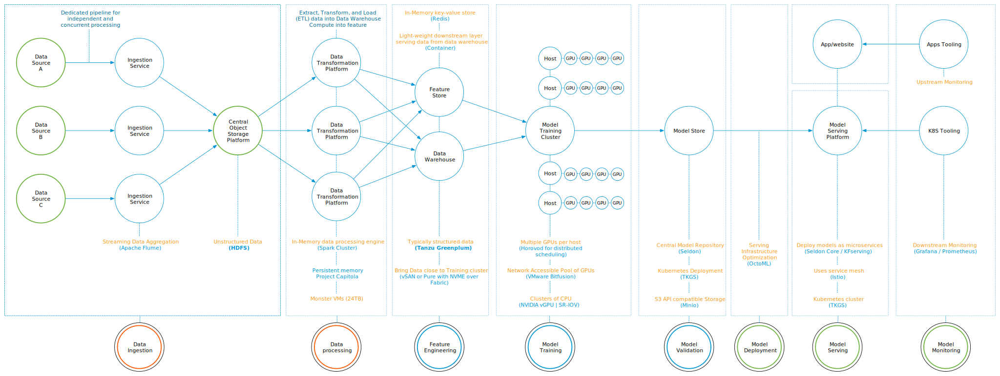
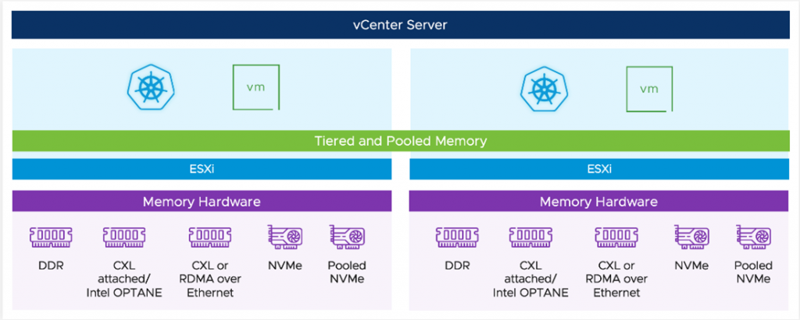

## Resource Utilization Efficiency

Machine learning, especially deep learning, is notorious for consuming large amounts of GPU resources during training. However, as the last part already highlighted, machine learning is more than just training a model. And these components within the machine learning workflow require large amounts of CPU, memory, storage, and network resources.

[Machine Learning on VMware Cloud Platform – Part 1](https://frankdenneman.nl/2022/05/25/machine-learning-on-vmware-cloud-platform-part-1/) covered the three distinct phases: concept, training, and deployment. Existing "known data" is required to explore and train the model in both the concept and training phases. During the development of the model, it is common to use three different data sets: the training set, the validation set, and the testing set. Creating data sets is not only about getting as much data as possible. It is even more critical getting meaningful data and high levels of quality because the accuracy of the recommendation produced by the model is highly dependent on the quality of the dataset used for training and validation. The data science team needs to "wrangle" existing raw data into shape to get such a high-quality dataset. Data wrangling transforms the raw data into more valuable data that can be used as a dataset "downstream" to train a model. And all this wrangling requires a lot of collateral infrastructure and services besides just a bunch of GPUs.

Massive amounts of datasets are not new to any enterprise IT organization. "System of records" has always been the backbone of business processes. Think back about mainframes in the '70s and the rise of on-premises ERP systems like SAP and Oracle in the '80s and '90s. And today, databases, data warehouses, and data lakes contain petabytes of data. A 100-gigabyte dataset used for training purposes might sound unimpressive. But there is a difference. This dataset is constantly on the move. Bits and bytes do not slowly accrue in a database and sit there waiting to be cherry-picked by a SQL statement. No, these datasets are pulled and pushed through the infrastructure. It will be extracted from multiple sources, transformed by different platforms, and stored and versioned many times over. For example, many ML projects capture and store massive amounts of unstructured data (video, audio, log files) in its native format in systems that need to be structured, transformed, and analyzed. These processes generate a lot of data movement, which, in virtualized platforms, burns (a lot of) x86 cycles and exposes data on the network.

Below is a diagram highlighting some of the structural components of such an environment, omitting a lot of essential data science teams tools such as the various collaborative Juypter notebook solutions, artifacts stores, or complete data science or MLops platforms such as [Databricks](https://databricks.com/), [Domino](https://www.dominodatalab.com/), [H20.ai](https://h2o.ai/), [DataRobot](https://www.datarobot.com/), or [Dataiku](https://www.dataiku.com/).

If we look at the processes after training, they belong to the deployment phase. In this phase, the data science team, or the MLops team, takes a converged model and integrates it into a system or platform that engages with the customer or an end system, like a robot arm or factory installation. A converged model is a model that is trained up to a state where additional training will not improve the model. Why not say, finished model? As the world changes, the model might not be trained to reflect the current state of the world. Think about what happened during Covid and the ML models deployed in the hotel, airliner, and entertainment industry. They needed some readjustments to reflect the current situation in the world. And because of this, some models need retraining. This retraining does not happen in real-time. It depends on the use case and the data flow. Think about self-scanning registers, holiday season packing changes for supermarkets, or additional items in a warehouse. In general, most teams start with manual retraining. Still, they want to move to automation and look at CI/CD pipelines, create a cyclical deployment process, retrain new models, and capture un-seen data as new training sets.

As you can imagine, running such a platform and its (pipeline) components requires a lot of processing power. On top of that, in many organizations, AI\\ML projects are initiated by individual business units attempting to solve their pressing business challenge. Each team runs its solution tech stack and develops its models along its development lifecycle with its resource utilization. What we see today is the start of ML-projects sprawl. Many ML projects start small, with small data sets, starting on laptops, some small datasets, and slowly grow and become essential to the business. And we attach the same organization and process models to this phenomenon. Someone will detect this, start to ask for more consolidation, start a Machine Learning Center of Excellence and start to think of centralizing resource utilization.

And this is the right way of thinking. You do not want each team to erect its own isolated platform. We've seen this happen in the '90s when organizations moved away from mainframes to decentralized X86 servers. A lot of these machines were underutilized. We see now that a lot of data scientists are simply not aware of the power of virtualization. It's cloud or bare-metal. Cloud platforms are great to start but are too opinionated, and thus they turn to bare-metal. They leave out the greatest thing since sliced bread (now, I might be a bit biased here).

Let's use two examples from the concept and training phase. When the data scientist team performs a "Hyperparameter search," they use multiple smaller GPU-equipped machines and smaller data sets to find the correct ML model architecture and model. Or, when they are using their Spark cluster for intensive data processing tasks, they typically only concentrate on the pre-processing task. The key here is that an ML platform mainly consists of many parts, but only one part is heavily utilized. From a resource utilization perspective, we have to deal with load-correlated utilization spikes per model development since many platform parts are originally designed as a distributed architecture.

I can imagine that all of the above can sound extremely complex, but in many cases, it isn't. If organizations centralize their efforts onto a single platform, we have to deal with this workload's noisy-neighbor aspect. But, we all have dealt with noisy neighbors before, and the best part is that a lot of the core parts of vSphere are updated to handle new distributed workloads. For example, DRS 2.0. Runs every 60 seconds instead of every 5 minutes to handle containerized workloads and focuses on workload happiness instead of dealing at a high level of balancing host utilization across a vSphere cluster. The partnership with NVIDIA that brought us NVIDIA AI Enterprise allows us to spatially partition the GPU to isolate compute resources and allow full multi-tenancy.

See the [recent blogpost of Lan Vu](https://blogs.vmware.com/performance/2022/06/vsphere7-vgpu-vs-mig-perf.html) about how the different vGPU technology can best suit the ML use case )

But we are also working on newer technologies with our partners to think about the heavy IO streams that ML model development will introduce to the vSphere platform. [Project Monterey](https://blogs.vmware.com/vsphere/2020/09/announcing-project-monterey-redefining-hybrid-cloud-architecture.html) introduces the Data Processing Unit (DPU) into our cluster architecture.

There are many use-cases, but the one that excites me is the sheer amount of innovative network IO offload you can generate with DPUs and potentially more intelligent things with [NVIDIAs Bluefield architecture](https://www.nvidia.com/content/dam/en-zz/Solutions/Data-Center/documents/datasheet-nvidia-bluefield-3-dpu.pdf). Nowadays, every network IO within a virtualization platform consumes an X86 of the ESXi host—more than one X86 cycle. And so, pulling and pushing datasets and datasets for many different models through the platform will impact the X86 cycles left over to run the rest of the virtual machines and containers used for the toolchain for the data scientists and other employees and services consuming the virtualization platform. By introducing DPUs, you isolate these network IO streams from the compute layer.

Another project with immense potential for the ML platform is [project Capitola](https://blogs.vmware.com/vsphere/2021/10/introducing-project-capitola.html), or as the vSphere team calls it, the Software-Defined Memory structure. It would be best to have copious amounts of storage space during the pre-processing data phase, but you also want it fast. But you might not want to break the bank and spend your entire annual IT budget on RAM modules. Project Capitola allows you to use different memory technologies and offer them different tiers of memory capacity to your workload without rewriting your applications.

The critical challenge is to have a platform that can provide the right resources and attach and detach the resources efficiently and economically so that the data science team and the organization benefit from this. The platform needs to provide the workload environment as quickly as possible (self-service) and be resilient. I'll dive into risk mitigation in the next part.

If you want to learn more about project Monterey, Capitola, or the self-service part, please join Cormac Hogan, Duncan Epping, and me at our (Virtual) Roadshow "The ever-evolving VMware Infrastructure" . Ask your VMUG leader about the possibilities.
