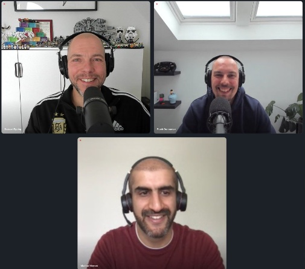

In this week’s Unexplored Territory Podcast, we have Mazhar Memon as our guest. Mazhar is one of the founders of VMware Bitfusion and the principal inventor of Project Radium. In this episode, we talk to him about the start of Bitfusion, what challenges Project Radium solves, and what role the CPU has in an ML world. If you like deep-dive podcast episodes, grab a nice cup of coffee or any other beverage of your liking, open your favorite podcast app, strap in and press play.  

Listen to the full [Unexplored Territory Podcast episode](https://unexploredterritory.tech/episodes/) via Spotify - [https://spoti.fi/3QdnXlX](https://t.co/T6bminampm) Apple - [https://apple.co/3O7TsMj](https://t.co/49kG7mRPWl), or with your favorite podcast app.

Links and topics discussed during the episode:

- Techcrunch demo – [https://www.youtube.com/watch?v=p3cAzt1PLBA](https://www.youtube.com/watch?v=p3cAzt1PLBA)
- Intro to Radium – [https://octo.vmware.com/introducing-project-radium/](https://octo.vmware.com/introducing-project-radium/)
- IPUs and Radium – [https://octo.vmware.com/vmware-and-graphcore-collaborate-to-bring-virtualized-ipus-to-enterprise-environments/](https://octo.vmware.com/vmware-and-graphcore-collaborate-to-bring-virtualized-ipus-to-enterprise-environments/)

You can follow us on Twitter for updates and news about upcoming episodes: [https://twitter.com/UnexploredPod](https://twitter.com/UnexploredPod).  
  
Also, make sure to hit that subscribe button, rate where ever possible, and share the episode with your friends and colleagues! And for those who hadn't seen it, we made the Top 15 Podcast list on [feedspot](https://blog.feedspot.com/vmware_podcasts/), the first non-corp branded podcast on the list!
