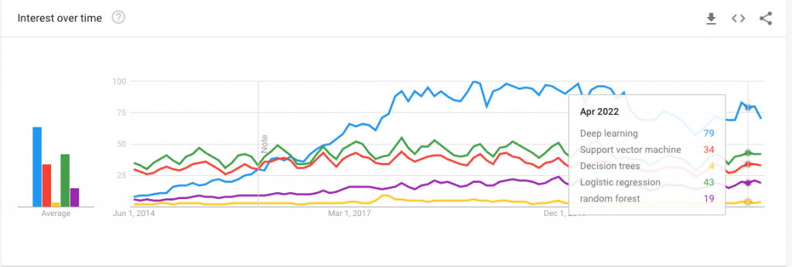

[Machine Learning on VMware Cloud Platform – Part 1](https://frankdenneman.nl/2022/05/25/machine-learning-on-vmware-cloud-platform-part-1/) covered the three distinct phases: concept, training, and deployment, [part 2](https://frankdenneman.nl/2022/06/08/machine-learning-on-vmware-cloud-platform-part-2/) explored the data streams, the infrastructure components needed and vSphere can help with increasing resource utilization efficiency of ML platforms. In this part, I want to go a little bit deeper into the territory of training and inference workloads.

It would be best to consider the platform's purpose when building an ML infrastructure. Are you building it for serving inference workloads, or are you building a training platform? Are there data science teams inside the organization that create and train the models themselves? Or will pre-trained models be acquired? Where will the trained (converged) model be deployed? Will it be in the data center, industrial sites, or retail locations?

From an IT architecture resource requirement perspective, these training and inference workloads differ in computational power and data stream requirements. One of the platform architect's tasks is to create a platform that reduces the time to train. It's the data scientist's skill and knowledge to use the platform's technology to reduce the time even more without sacrificing accuracy.

This part will dive into the key differences between training and inference workloads and their requirements. It helps you get acquainted with terminology and concepts used by data scientists and apply that knowledge to your domain of expertise. Ultimately, this overview helps set the stage for presenting an overview of the technical solutions of the vSphere platform that accelerate machine learning workloads.

## Types of machine learning algorithms

When reviewing popular machine learning outlets and podcasts, you typically only hear about training large models. For many, machine learning equals deep learning with giant models and massive networks that require endless training days. But in reality, that is not the case. We do not all work at the most prominent US bank. We do not all need to do real-time fleet management and route management of worldwide shipping companies or calculate all possible trajectories of five simultaneously incoming tornadoes. The reality is that most companies work on simple models with simple algorithms. Simple models are easier to train. Simple models are easier to test. Simple models are not resource-hogs, and above all, simple models are simpler to update and keep aligned with the rapidly changing world. As a result, not every company is deploying a deep-learning GPT-3 model or massive ResNet to solve their business needs. They are looking at "simpler" machine learning algorithms or neural networks that can help increase the revenue or decrease the business cost without running it on 400 GPUs.

In the following articles, I will cover neural networks, but if you are interested in understanding the basics of machine learning algorithms I recommend looking at the following popular ones:



[Support Vector Machines (SVM)](https://medium.com/towards-data-science/https-medium-com-pupalerushikesh-svm-f4b42800e989)

[Decision trees](https://medium.com/towards-data-science/decision-trees-in-machine-learning-641b9c4e8052)

[Logistic Regression](https://medium.com/towards-data-science/understanding-logistic-regression-9b02c2aec102)

[Random forest](https://medium.com/towards-data-science/understanding-random-forest-58381e0602d2)

[k-means](https://medium.com/towards-data-science/understanding-k-means-clustering-in-machine-learning-6a6e67336aa1) (not listed in the google search result)

### Data Flow

Training produces a neural network model that generates a classification, detection, recommendation, or any other service with the highest level of accuracy. The golden rule for training is that the more data you can use, the higher accuracy you achieve. That means the data scientist will unleash copious amounts of data on the system. Understanding the data flow and the components involved helps you design a platform that can significantly reduce training time.

Most neural networks are trained via the (offline) batch learning method, but the online training method is also used. In this method, the model is trained by feeding it smaller batches of data. The model is active and learns on the fly. Whether it is less resource-intensive than batch learning, or often referred to as offline training, is debatable as the model trains itself continuously. It needs to be monitored very carefully as it can be sensitive to new data that can quickly influence the model. Specific stock price systems deploy ML models that use online training to respond to market trends quickly.

The inference service is about latency, for example, pedestrian identification in autonomous vehicles, packages flying across high-speed conveyor belts, product recommendations, or speech-to-text translations. You simply cannot afford to wait on a response from the system in some cases. Most of these workloads are a single data sample or, at best, a small number of instructions batched up. The data flow of inference is considered to be streaming of nature. As a result, the overall compute load of inference is much lower than that of the training workload. 

|  | Training | Inference |
| --- | --- | --- |
| Data Flow | Batch Data | Streaming Data |

### Data sets and Batches

During model training, models train with various data sets: training sets, validation sets, and testing sets. The training set helps the model recognize what it should be supposed to learn. The validation dataset is helpful for the data scientist to understand the effect of tuning particular hyperparameters, such as the number of hidden layers or the network layer size. The third dataset is the testing set and proves how well the trained neural network performs on unseen data before being put into production.

A dataset provides the samples used for training. These data sets can be created from company data or acquired from third parties. Or a combination of both, sometimes businesses acquire extra data on top of their own to get better insights into their customers. These datasets can be quite large. An example is a Resnet50 model with [Imagenet-1K dataset](https://huggingface.co/datasets/imagenet-1k). Resnet50 is an image classification training network, and the Imagenet-1K dataset contains 1.28 million images (155.84 GiB).

Even the latest NVIDIA GPU generations (Ampere and Hopper) offer GPU devices with up to 80GB of memory and cannot fit that dataset entirely in memory. As a result, the dataset is split into smaller batches. Batch size plays a significant role in the training of neural network models. This training technique is called mini-batch gradient descent. Besides circumventing the practical memory limitation, It impacts the accuracy of models, as well as the performance of the training process.  If you're curious about batch sizing, read the research paper "[Revisiting small batch training for deep neural networks](https://arxiv.org/pdf/1804.07612.pdf)". Let's cover some more nomenclature while we are at it.

During the training cycle, the neural network processes the dataset's examples. This cycle is called an **epoch**. A data scientist splits up the entire dataset into smaller batch sets. The number of training examples used is called a **batch size**. An **iteration** is a complete pass of a batch. The number of iterations is how many batches are needed to complete a single epoch. For example, the Imagenet-1K dataset contains 1.28 million images. Well-recommended batch size is 32 images. It will take 1.280.000 / 32 = 40.000 iterations to complete a single epoch of the dataset. Now how fast an epoch completes depends on multiple factors. A training run typically invokes multiple epochs. 


Both training and inference use batch sizes. In most use cases, inference focuses on responding as quickly as possible. Many inference use-cases ingest and transform data in real-time and generate a prediction, classification, or recommendation. Translating this into real-life use cases, we are talking about predicting stock prices to counting cars in a drive-through. The request needs to be processed the moment it comes in. As a result, no batching to limited batching occurs. It depends on how much workload the system receives when it is operational. By batching 1-4 examples, Inference classes as streaming workload.

Determining the correct batch size for training is a science by itself. Many research papers and Medium articles exist about the sweet spot for batch sizes. There are benefits and disadvantages to be found at any point in the spectrum of batch sizes. Smaller batch sizes can lead to lower memory footprint and improvement of throughput, while larger batch sizes can increase parallelism and decrease the computational cost.

This last factor might not be relevant for a data scientist when training in an on-premises environment, but it's good to understand. When batches are moved from storage or host memory to GPU device memory, CPU cycles are needed. If you are using larger batches, you reduce the number of computing calls to move data, ultimately reducing your CPU footprint. Off course, there is a downside to this as well, primarily on the performance side of the algorithm, something the data scientist needs to figure out how to solve. Therefore you notice that depending on the use case, you see different batch sizes per model. Two excellent papers that highlight both ends of the spectrum: "[Friends don't let friends use mini-batches](https://arxiv.org/abs/1804.07612) [larger](https://arxiv.org/abs/1804.07612) [than 32](https://arxiv.org/abs/1804.07612)" and "[Scaling](https://arxiv.org/abs/2109.09541) [TensorFlow](https://arxiv.org/abs/2109.09541) [to 300 million predictions per second](https://arxiv.org/abs/2109.09541)"

The takeaway for the platform architect is that inference is primarily latency-focused. If the inference workload is a video-streaming-based workload for image classification or object detection, the system should be able to provide a particular level of throughput. Training is predominantly throughput based. Batch sizing is a domain-specific (hyper)parameter for the data scientist. Still, it can ultimately affect the overall CPU footprint and whether efficient distributed training is used. Depending on the dataset size, the data scientist can opt for distributed training, dispatching the batches across multiple GPUs.

|  | Training | Inference |
| --- | --- | --- |
| Storage Characteristics | Throughput based | Latency-based, occasionally throughput |
| Batch Size | Many recommendations between 1-32   Smaller batch size reduces the memory footprint   Smaller batch size increases algorithm performance (generalization)    Larger batch size increases compute efficiency   Larger batch size increases parallelization (Multi-gpu) | 1-4 |

**Data Pipeline and Access Patterns**

Data loading is essential to building a deep Learning pipeline and training a model. Remember that everything you do with data takes up memory. Let's go over the architecture and look at all the "moving parts" before diving into each one.


The dataset is stored on a storage device. It can be a vSAN datastore or any supported network-attached storage platform (NFS, VMFS, vVOLs). The batch is retrieved from the datastore and stored in host memory before it loads into GPU device memory (Host to Device (HtoD)). Once the model algorithm completes the batch, the algorithm copies the output back to host memory (Device to Host - DtoH). Please note that I made a simple diagram and showed the most simple data flow. Typically, we have a dual-socket system, meaning there are interconnects involved, multiple PCI controllers involved, and we have to deal with VM placement regarding the NUMA locality of the GPU. But these complex topics are discussed later in another article. one step at a time.

We immediately notice the length of the path without going into the details of NUMA madness. Data scientists prefer that the dataset is stored as close to the accelerator as possible on a fast storage device. Why? Data loading can reduce the training time tremendously. Quoting Gorkem Polat, who did some research on his test environment:

> One iteration of the ResNet18 Model on ImageNet data with 32 batch size takes 0.44 seconds. **For 100 epochs, it takes 20 days!** When we measure the timing of the functions, data loading+preprocessing takes **0.38 seconds** (where 90% of this time belongs to the data loading part) while the optimization (forward+backward pass) time takes only **0.055 seconds**. If the data loading time is reduced to a reasonable time, full training can be easily reduced to **2.5 days!** [Source](https://towardsdatascience.com/how-to-solve-data-loading-bottlenecks-in-your-deep-learning-training-1ddfcc24449b)

Most datasets are too large to fit into the GPU memory. Most of the time, it does not make sense to preload the entire dataset into host memory. The best practice is to prefetch multiple batches and thereby mask the latency of the network. Most ML frameworks provide built-in solutions for data loading. The data pipeline can run asynchronously with training as long as the pipeline prefetches several batches to keep it full. The trick is to keep multiple pipelines full, where fast storage and low-latency and high throughput networks come into play. According to the paper "[ImageNet training](https://www2.eecs.berkeley.edu/Pubs/TechRpts/2020/EECS-2020-18.pdf) [](https://www2.eecs.berkeley.edu/Pubs/TechRpts/2020/EECS-2020-18.pdf)[in Minutes](https://www2.eecs.berkeley.edu/Pubs/TechRpts/2020/EECS-2020-18.pdf)," it takes an Nvidia M40 GPU 14 days to finish just one 90-epoch Resnet-50 training execution on the ImageNet-1k dataset. The M40 was released in 2015 and had 24GB of memory space. As a result, data scientists are looking at parallelization, distributing the workload across multiple GPUs. These multiple GPUs need to access that dataset as fast as possible, and they need to communicate with each other as well. There are multiple methods to achieve multi-GPU accelerator setups. This is a topic I happily reserve for the next part. 

### Dataset Random Read Access

To add injury after insult, training batch reads are entirely random. The API lets the data scientist specify the number of samples, and that's it. Using a Pytorch example:

```
train_loader = torch.utils.data.DataLoader(train_set, batch_size=32, shuffle=True, num_workers=4)
```

The process extracts 32 random examples from the dataset and sends them over as a batch. The command Shuffle=true is for what happens after the Epoch completes. This way, the next Epoch won't see the same images in the same order. Extracting 32 random examples from a large dataset on a slow medium won't help reduce the training time. Placing the dataset on a bunch of spindles would drive (pun intended) your data science team crazy. Keeping the dataset on a fast medium and possibly as close to the GPU device as possible is recommended.

|  | Training | Inference |
| --- | --- | --- |
| Data Access | Random Access on large data set   Multiple batches are prefetches to keep the pipeline full   Fast storage medium recommended   Fast storage and network recommended for distributed training | Streaming Data |

The next part will cover the memory footprint of the model and numerical precision.
