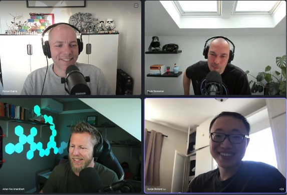

Richard Lu joined us to talk basics of NUMA, Cores per Socket, why modern windows and mac systems have a default 2 cores per socket setting, how cores per socket help the guest OS interpret the cache topology better, the impact of incorrectly configured NUMA and Cores per Socket systems and many other interesting CPU related topics. Enjoy another deep dive episode, you can listen to and download the episode on the following platforms:

[Unexplored Territory website](https://unexploredterritory.tech/episodes/)

[Apple Podcasts](https://podcasts.apple.com/nl/podcast/019-numa-numa-numa-with-richard-lu/id1587672642?i=1000567774959)

[Spotify](https://open.spotify.com/episode/0OZeulMmDxvwocJkMYydjj?si=6d01aaf429994aa9&nd=1)

Topics discussed in the episode

[L1TF Speculative-Execution vulnerability](https://kb.vmware.com/s/article/55806)

[60 minutes of NUMA - VMworld session 2022](https://my.vmworld.com/widget/vmware/vmworld2020/catalog/session/1589576602075001C50h)

[Extreme Performance Series: vSphere Compute and Memory Schedulers \[HCP2583\]](https://my.vmworld.com/widget/vmware/vmworld2020/catalog/session/1589649142910001HMCU)

[NUMA counters and command line tools - part 1](https://frankdenneman.nl/2016/08/22/numa-deep-dive-part-5-esxi-vmkernel-numa-constructs/)

[NUMA command lines tools - part 2](https://frankdenneman.nl/2019/08/27/60-minutes-of-numa-vmworld-session-commands/)

