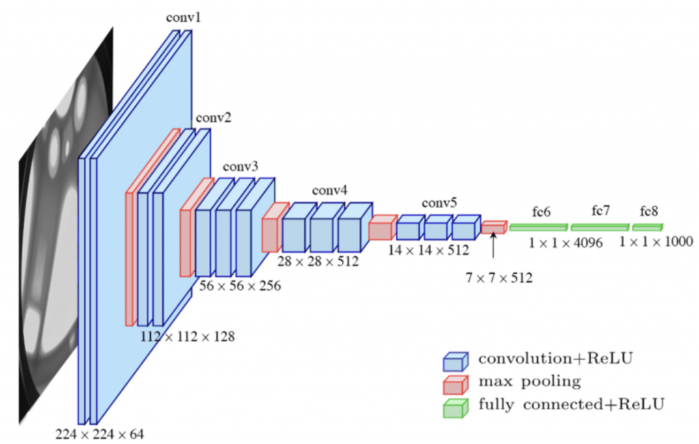
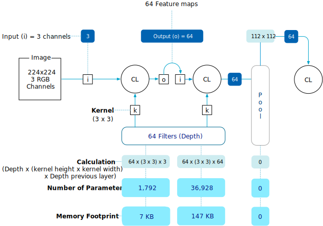
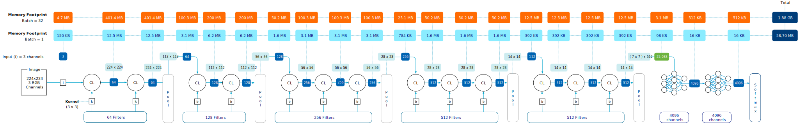

This article dives deeper into the memory consumption of deep learning neural network architectures. What exactly happens when an input is presented to a neural network, and why do data scientists mainly struggle with out-of-memory errors? Besides [Natural Language Processing](https://medium.com/@hrisavb/roadmap-of-nlp-for-machine-learning-c197d7d33cb1) (NLP), computer vision is one of the most popular applications of deep learning networks. Most of us use a form of computer vision daily. For example, we use it to unlock our phones using facial recognition or exit parking structures smoothly using license plate recognition. It's used to assist with your medical diagnosis. Or, to end this paragraph with a happy note, find all the pictures of your dog on your phone. 

Plenty of content discusses using image classification to distinguish cats from dogs in a picture, but let's look beyond the scope of pet projects. Many organizations are looking for ways to increase revenue or decrease costs by applying image classification, object identification, edge perception, or pattern discovery to their business processes. You can expect an application on your platform that incorporates such functionality.

[Part 3](https://frankdenneman.nl/2022/06/30/machine-learning-on-vmware-platform-part-3-training-versus-inference/) of this series covered batch sizes and mentioned a batch size of 32, which seems a small number nowadays. An uncompressed 8K image (7680 x 4320) consumes 265 MB. The memory capacity of a modern data center GPU ranges from 16 GB to 80 GB. You would argue that it could easily fit more than 32 uncompressed (8 GB) 8K images, let alone 32 8K jpegs (896 MB). Why do we see so many questions about memory consumption on data science forums? Why are the most commonly used datasets and neural networks focused on images with dimensions hovering around the 224 x 224 image size?

Memory consumption of neural networks depends on many factors. Such as which network architecture is used and its depth. The image size and the batch size. And whether it's performing a training operation or an inference operation. This article is by no means an in-depth course on neural networks. I recommend you follow Stanfords' [CS231n](http://cs231n.stanford.edu/) or sign up for the free online courses at [fast.ai](http://fast.ai/). Let's dig into neural networks a little bit, explore the constructs of a neural network and its components and figure out why an image eats up a hefty chunk of memory. 

Understanding the workload characteristics helps with resource management, troubleshooting, and capacity planning. When I cover fractional vGPU and multi-GPU in a later part of this series, you can map these functional requirements easier to the technical capabilities of your platform. So let's start slowly by peeling off the first layer of the onion and look at a commonly used neural network architecture for image classification, the convolutional neural network.

## Convolutional Neural Networks

[Convolutional neural networks](https://en.wikipedia.org/wiki/Convolutional_neural_network) (CNN) efficiently recognize and capture patterns and objects in images and are the key components in computer vision tasks. A CNN is a multilayer neural network and consists of three different types of layers. The convolution layer, the pooling layer, and the fully connected layer. The first part of the neural network is responsible for feature extraction and consists of convolution and pooling layers. I'll cover what that exactly is in the convolution layer paragraph. The second part of the network consists of the fully connected layers and a softmax layer. This part is responsible for the classification of the image.

## Convolution layer

Convolution layers are the backbone of the CNN as they perform the feature extraction. A feature can be an edge of a (license plate) number or an outline of a supermarket item. Feature extraction is deconstructing the image into details, and the deeper you go into the network, the more detailed the feature becomes. 

CNNs process an image, but how does a computer see an image? To a computer, images are just numbers. A color image, i.e., an RGB image, has a value for each red, green, and blue channel, and this pixel representation becomes the foundation for the classification pipeline.

For (us) non-native English speakers, convolution (layer) is not to be confused with convolute (make an argument complex). In the convolution layer, there is a convolve action, which means "to combine" or how something is modified by another element. In this case, the convolution layer performs a [dot product](https://en.wikipedia.org/wiki/Dot_product) between two [matrices](https://en.wikipedia.org/wiki/Matrix_\(mathematics\)) to generate a feature map containing activations. Don't be afraid. It's not going to be a linear algebra lesson. (I wouldn't be able to, even if I tried). But we need to look at the convolution process and its components at a high level to better understand the memory consumption throughout the pipeline within the neural network.

A neural network is a pipeline, meaning that the process's output is the input of the following process. There are three components in a convolution layer, an array of input, a filter, and an array of output. The initial input of a CNN is an image and is the input array(a matrix of values). The convolution layer applies a feature detector known as a kernel or filter, and the most straightforward way of describing this is a sliding window. This sliding window, also in a matrix shape, includes the neural network's weights. Weights are learnable parameters in the neural network that are adjusted during training. The weight starts with a random value, and as training continues, it, alongside the bias (another parameter), is adjusted towards a value that provides the accurate output. The weights and biases need to be stored in memory during training and are the core IP of a trained network. Typically a CNN uses a standard kernel (filter) height and width size that determines the number of weights applied per filter. The typical kernel size is 3 x 3. This filter is applied to the input array in the case of the first convolutional layer, the image. As mentioned, the convolution layer performs a [dot product](https://en.wikipedia.org/wiki/Dot_product) between two [matrices](https://en.wikipedia.org/wiki/Matrix_\(mathematics\)) to generate a feature map containing activations. Let's look at the image to get a better understanding.

For this example, a 3x3 filter is applied to a 6 x 6 image (normally, the image dimensions would be 224 x 224). This kernel or filter size is sometimes called the receptive field. During this process, the filter calculates a single value, called activation, by multiplying the value in the kernel with every value in the highlight input array field and then adding up the "products" to get the final output value, the activation. Output = (1\*1)+(2\*4)+(1\*1)+(4\*1)+(2\*3)+(1\*5)+(0\*9)+(1\*1)+(1\*3)=1+8+1+4+6+5+0+1+3=29.

Once the activation is calculated, the filter moves over a number of pixels, determined by the stride setting. Typically this is 1 or 2 pixels. And repeats the process. Once the entire input array is processed, the output array is completed. And a new filter is applied to the input array. This output array is known as a feature map or sometimes an activation map. 

Each convolution layer has a predefined number of filters, each with a different configuration of weights. Each filter creates its own feature map, which turns into the input for the following convolutional or pooling layer. One bias parameter is applied per filter. The parameter paragraph clarifies the impact of these relationships on memory consumption. 

### Pooling Layer

A pooling layer follows multiple convolution layers. It summarizes essential parts of the previous layers without losing critical information. An example is using a filter to detect the outlines of a ketchup bottle and then using the pooling layer to obscure the exact location of the ketchup bottle. Knowing the location of the bottle in a particular stage of the network is unnecessary. Therefore, a pooling layer filters out unnecessary details and keeps the network focused on the most prominent features. One of the reasons to introduce the pooling layer is to reduce as many parameters throughout the network to reduce the complexity and the computational load. To consolidate the previous feature map, it either uses an average of the numbers in a specific region (average pooling) or the maximum value detected in a specific region (max pooling). Similar to the filter applied to the input, the size is much smaller (2 x 2), and the movement (stride) is much larger (2 pixels). As a result, the size of each feature map is reduced by a factor of two., i.e., each dimension halves. 

The number of feature maps remains the same as in the previous layer.

An important detail is that there are no weights or biases present in this layer, and as a result, it's a non-trainable layer. It's an operation rather than a learning function of the network. It impacts the layer's overall memory consumption, which we shall discover in a later paragraph. 

### Fully Connected Layer

The fully connected layer is the poster child of neural networks. Look up any image or icon of a neural network, and you will get an artist's impression of a fully connected layer. The fully connected layer contains a set of neurons (placeholder for a mathematical function) connected to each neuron in the following layer. 

It's the task of the fully connected layer to perform image classification. Throughout the pipeline of convolutional layers, the filters detect specific features of the image and do not "see" the total picture. They detect certain features, and it's the task of the fully connected layers to tie it all together. The first fully connected layer takes the feature maps of the last pooling layer and flattens the matrix into a single vector. It feeds the inputs into the neurons in its layer and applies weights to predict the correct label.

## Parameters Memory Consumption

What is fascinating for us is the number of parameters involved as they consume memory. Each network architecture differs in layout and its number of parameters. There are several different CNN architectures, AlexNet (2012), GoogLeNet (2014), VGG (2014), and ResNet (2017). Today ResNet and VGG-16 are the most popular CNN architectures, often pitted against each other to find the most accurate architecture comparing training from scratch versus transfer learning. [ResNet-50 vs VGG-19 vs training from scratch: A comparative analysis of the segmentation and classification of Pneumonia from chest X-ray images](https://www.sciencedirect.com/science/article/pii/S2666285X21000558) is a fascinating read.

Let's use the VGG-16 neural network architecture as our example CNN to understand memory consumption better. VGG-16 is a well-documented network, so if you doubt my calculations, you can easily verify them elsewhere. VGG-16 has thirteen convolutional layers, five Max Pooling layers, and three fully-connected layers. If you count all the layers, you will see it sums up to 21, but the 16 in VGG-16 refers to the 16 layers with learnable parameters. The picture below shows the commonly used diagram illustrating the neural network configuration.

It's important to note that memory consumption predominantly spits into two significant categories memory used to store parameters (weights & biases) and memory stored for the activations in the feature maps. The feature map memory consumption depends on the image's height, the image's width, and the batch's size. The parameters' memory remains constant regardless of the image or batch size. Let's look at the parameters of memory consumption of the neural network first.

The VGG-16 network accepts images with a dimension of 224 x 224 in RGB. That means that there are three channels for input. The dimension of the image is not relevant in this stage for memory calculation. The first convolutional layer applies 64 filters (stated on the architectural diagram as 224 x 224 x **64**). It applies a filter with a kernel size of 3 x 3, and thus we calculate 64 distinct filters applying a kernel of 3 x 3 (9) weights on three input arrays (Red channel, Blue channel, Green channel). The number of weights applied in this layer is 1,728. One bias is applied per filter, increasing the total to 1,792 parameters for this convolutional layer. Each weight is stored in memory as a float (floating point numbers), and each s[ingle-precision floating-point (FP32)](https://en.wikipedia.org/wiki/Single-precision_floating-point_format) occupies 4 bytes, resulting in a memory footprint of 7KB. The following article of this series covers the impact of floating point types on memory consumption.

The second layer uses the 64 feature maps produced by the first convolutional layer (CL) as input. It maintains using a 3 x 3 kernel and using 64 filters. The calculation turns into 64 inputs x 64 distinct filters using nine weights; each equals 36.864 weights + 64 biases = 36928 parameters x 4 bytes = 147 kb. 

The pooling layer applies a max pooling operation with a kernel size of 2 x 2 and a stride of 2. In essence, it is reducing the matrix size of the last feature map in half. The exact number of feature maps remain, and they act as input for the next convolutional layer as no weight is involved. No, there is no memory footprint consumed from a parameter perspective.

7kb and 147kb are certainly not earth-shattering numbers, but now let's see the rest of the network. As you can see, the memory parameters slowly grow throughout the convolutional layers of the network and then dramatically explode at the fully connected layers. What's interesting to note is that there is a flattening operation after the last pool layer of the feature extraction part of the network. This operation will flatten the pooled feature map into a single column that produces a long vector of input data that can pass through the fully connected layers. The 512 matrices of 7 x 7 turn into a single vector containing 25,088 activations. (Click on the image to enlarge).

In total, the network requires 540 MB to store the weights and the biases. That's quite a footprint if you consider deploying this to edge devices. But there are always bigger fish. The state-of-the-art (SOTA) neural network for generating text [GPT-3](https://en.wikipedia.org/wiki/GPT-3), or the third generation Generative Pre-trained Transformer, has 175 billion parameters. If we use a single-precision floating-point (FP32), it needs 700 GB of memory. Most companies don't use a GPT-3 model to enhance their business processes, but it illustrates the range of memory footprint some neural networks can have.

| **Network Architecture** | **\# of Convolutional Layers** | **\# of Fully Connected Layers** | **\# of Parameters** |
| --- | --- | --- | --- |
| AlexNet | 5 | 3 | 61 Million |
| GoogLeNet | 21 | 1 | 40 Million |
| ResNet | 49 | 1 | 50 Million |
| VGG-16 | 13 | 3 | 138 Million |

## Feature Map Memory Consumption

The memory consumption of the feature maps is a relatively straightforward calculation, i.e., the dimensions of the image x number of the feature maps. The feature map contains the activations from the filter moving across the input array. Each convolution layer receives the feature maps of the previous layer, and each pooling reduces the dimensions of the feature maps in half. 

Feature map memory consumption depends on the image's size as the kernel with weights moves across the image. The larger the image, the more activations there are. The batch size impacts the memory consumption as well. More images mean more activations to store in the memory. The network executes a batch of images in parallel. With a batch size of 32 and a default image size of 224 x 224, the calculation of memory consumption becomes as follows: 224 x 224 x 64 channels x 32 images = 102.760.448 x 4 bytes (as it is stored as a float) = 401.40 MB.

Let's take a step back. On average, a 224 x 224 image takes up 19kb of space on your hard drive. Some quick math tells us that 32 images consume 602 KB. That can easily fit on a double-density 3.5" floppy disk drive, not even a fancy high-density one. And now, after the first convolution, it occupies a little over 401 MB. Oh yeah, and 7 kb for the parameters! 

Interestingly, we noticed the parameters' memory footprint go up while moving towards the network's end. We see the memory footprint per feature map go simply as the pooling layers reduce the dimensions of each feature map. This is important to note for inference requirements for your GPU device! But I'll cover that in detail later. During the batch iteration, 32 images with a 244 x 244 dimension consume roughly 1.88 GBs of memory. (Click on the image to enlarge).

If you applied the same math to a 4K image (ignoring whether it's possible with a VGG-16 network), the memory consumption of a 3840 x 2160 image would be roughly 9.6 GB for one image and 307,2 GB for 32 images. This means that the data scientist needs to choose between reducing the batch size and thus agree with the increase in training time. Or spend more time pre-processing and reducing the image size or [distributing the model](https://frankdenneman.nl/2020/02/19/multi-gpu-and-distributed-deep-learning/) across multiple GPUs to increase the available GPU memory. 

## Training versus Inference

When the batch of images reaches the softmax layer, the output is generated. And from this point on, we must distinguish whether it's a training or inference operation to understand the subsequent memory consumption.

The process I described in the paragraphs above is a forward propagation or typically referred to as the forward pass. This forward pass exists both in the training and inference operations. For training, an extra process is required, the backward pass or backpropagation. 

And to fully understand this, we have to dig deep into linear algebra and calculus, and you are already 2600 words deep into this article. It all comes down to that you train image classification via the supervised learning method, which means the set of images is trained along with their corresponding labels. When the image or batch training completes, the network determines the total error by calculating the difference between the expected value (image label) and the observed value (the value generated by the forward pass). 

The network needs to figure out which weight contributed the most to the error and which weight to change to get the "loss" to a minimum. If the loss is zero, the label is correct. It does this by calculating a partial derivative of the error concerning each weight. What does that mean? Essentially, each weight contributes to the loss as they are one way to the other connected to the other. A derivative in mathematics is the rate of change of a function with respect to a variable, and in the case of a neural network, how fast can we move the error rate up or down. With this generic description, I'm losing the finer details of this art form, but it helps to get an idea of what's going on. The differentials are multiplied by the learning rate, and the calculation result is subtracted from the respective weights.

As a result, backpropagation requires space to store each weight's gradients and learning rates. Roughly the memory consumption of the parameters is doubled during training. If the data scientist uses an optimizer, such as [ADAM](https://arxiv.org/pdf/1412.6980.pdf), it's normal to expect the memory consumption to triple. What's important to note is that the duration of the memory consumption of the activations (the feature maps) remains as long as the neural network needs to calculate the derivates. 

With Inference, the memory consumption is quite different. The neural network has optimized weights; thus, only a forward pass is necessary, and only the parameters need to be active in the memory. There is no backpropagation pass. Better yet, the activations are short-lived. The activations are discarded once the forward pass moves to a new layer. As a result, you only need to consider the model parameters and the two most "expensive" consecutive layers for memory consumption calculation. Typically those will be the first two layers. The layer that is active in memory and the layer that gets calculated. And this means that the GPU for Inference does not have to be a massive device. It only needs to continuously hold the network parameters and temporarily hold two feature maps. Knowing this, it makes sense to look for different solutions for your edge/inference deployments.

|  | Training | Inference |
| --- | --- | --- |
| Memory Footprint | Large memory footprint   Forward propagation pass - backpropagation pass - model parameters   Long time duration of the memory footprint of activations (large bulk of memory footprint) | Smaller memory footprint   Forward propagation pass - model parameters   Activations are short-lived (Total memory footprint = est. 2 largest consecutive layers) |

Previous parts in the Machine Learning on the VMware Platform series

- [Part 1 - covering ML development lifecycle and the data science team](https://frankdenneman.nl/2022/05/25/machine-learning-on-vmware-cloud-platform-part-1/)
- [Part 2 - covering Resource Utilization Efficiency](https://frankdenneman.nl/2022/06/08/machine-learning-on-vmware-cloud-platform-part-2/)
- [Part 3 - Training vs Inference - Data flow, Data sets & Batches, Dataset Random Read Access](https://frankdenneman.nl/2022/06/30/machine-learning-on-vmware-platform-part-3-training-versus-inference/)
