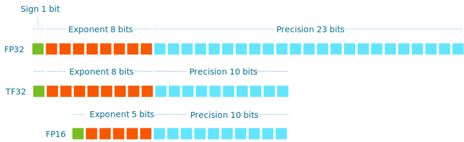

[Part 4](https://frankdenneman.nl/2022/07/15/training-vs-inference-memory-consumption-by-neural-networks/) focused on the memory consumption of a CNN and revealed that neural networks require parameter data (weights) and input data (activations) to generate the computations. Most machine learning is linear algebra at its core; therefore, training and inference rely heavily on the arithmetic capabilities of the platform. By default, neural network architectures use the single-precision floating-point data type for numerical representation. However, modern CPUs and GPUs support various floating-point data types, which can significantly impact memory consumption or arithmetic bandwidth requirements, leading to a smaller footprint for inference (production placement) and reduced training time.

Let's look at a spec sheet of a modern data center GPU. Let's use the NVIDIA A100 as an example. I'm aware that NVIDIA announced the [Hopper architecture](https://www.nvidia.com/en-us/technologies/hopper-architecture/#:~:text=The%20NVIDIA%20Hopper%20architecture%20advances,accelerate%20AI%20calculations%20for%20transformers.), but as they are not out in the wild, let's stick with what we can use in our systems today.

This overview shows six floating-point data types and one integer data type (INT8). Integer data types are another helpful data type to optimize inference workloads, and this topic is covered later. Some floating-point data types have values listed with an asterisk. Sparsity functionality support allows the A100 to obtain these performance numbers, and sparsity is a topic saved for a future article. 

What do these numbers mean? We have to look at the anatomy of the different floating-point data types to understand the performance benefit of each one better. 

## Anatomy of a Floating-Point Data Type

A fantastic 11-minute video on YouTube describes [how floating-point works](https://www.youtube.com/watch?v=L8OYx1I8qNg) very well. I'll stick to the basics that help frame the difference between the floating-point data types. The floating-point format is the standard way to represent real numbers on a computer. However, the binary system cannot represent some values accurately. Due to the limited number of bits used, it cannot store numbers with infinite precision; thus, there will always be a trade-off between range and precision. A wide range of numbers is necessary for neural network training for the weights, activations (forward pass), and gradients (backpropagation). Weights typically have values hovering around one, activations are magnitudes larger than one, and gradients are again smaller than one. Precision provides the same level of accuracy across the different magnitudes of values. 

Different floating standards exist, each with different configurations to provide range and precision. The floating-point format uses several bits to specify the decimal point placement. The floating-point bit range consists of three parts, the sign, the exponent, and the significand precision (sometimes called the mantissa). The sign bit tells us whether the value is positive or negative. The exponent part in the floating-point number tells the system where to place the decimal point. The significand precision part represents the actual digits of the number. Modern GPU specs list the following three [IEEE 754-2008](https://en.wikipedia.org/wiki/IEEE_754-2008_revision) standards; 

**Double precision** (FP64) consumes 64 bits. 1 bit for the sign value, 11 bits for the exponent, and 52 for the significand precision. 

**Single precision** (FP32) consumes 32 bits. 1 bit for the sign value, 8 bits for the exponent, and 23 bits for the significand precision.

**Half precision** (FP16) consumes 16 bits. 1 bit for the sign value, 5 bits for the exponent, and 10 for the significand precision. 

<figure>

<figcaption>

Click on the image to enlarge

</figcaption>

</figure>

Let's place these floating points data types in the context of deep learning. FP64 is typically not used in neural network computations as these do not require that high precision. High-Performance Computing (HPC) simulations use FP64. When reviewing GPU specs, FP64 performance shouldn't be your first concern if you build an ML-only platform.

Single precision is the gold standard for training. Weights, activations, and gradients in neural networks are represented in FP32 by default. But much research showed that for deep learning use cases, you don't need all that precision FP32 offers, and you rarely need all that much magnitude either. When using FP16 for training, memory requirements are reduced by fifty percent. Fewer bits to process means fewer computations are required, so the training time should be significantly faster. 

But unfortunately, there are some drawbacks. First of all, you cannot easily use FP16. It's not a drop-in replacement code. The data scientist has to make many changes to the model to use FP16. The range offered by FP16 is significantly smaller than FP32 and can introduce two conditions during training. An underflow condition where the number moves toward zero, and as a result, the neural network does not learn anything or the overflow condition where the number becomes so large that it learns nothing meaningful. As you can imagine, underflow and overflow conditions are something data scientists always want to avoid.

But the concept of reducing memory consumption is alluring. The industry started to work on alternatives. One alternative that is now widely supported by CPU and GPU vendors is BFLOAT16.

**BFLOAT16:** Google Brain developed Brain Floating Point (BF16) specifically to reduce the memory consumption requirements of neural networks and increase the computation speeds of the ML algorithms. It consumes 16 bits of memory, 8 bits for the exponent, and 7 for the precision. For more information about BFLOAT16, see [A Study of BFLOAT16 for Deep Learning Training](https://arxiv.org/abs/1905.12322). BF16 provides the same range of values as FP32, so the conversion to and from FP32 is simple. FP32 is the default data type for deep learning frameworks such as Pytorch and TensorFlow. 

<figure>

<figcaption>

Click on the image to enlarge

</figcaption>

</figure>

Google explains the advantages of BFLOAT16 in one of their blogs:

> _The physical size of a hardware multiplier scales with the square of the mantissa width. With fewer mantissa bits than FP16, the bfloat16 multipliers are about half the size in silicon of a typical FP16 multiplier, and they are eight times smaller than an FP32 multiplier!_

The quote tells us that the BF16 workload with seven precision bits takes half the silicon area compared to the FP16 workload that uses ten precision bits. If you compare BF16 to FP32, you can do with a system that has an eight times smaller silicon area. For Google, which designs its own ML accelerator hardware (TPU) and runs its own ML services on top of it, reducing its workload footprint is a tremendous cost saver and a service enabler. 

BF16 is more or less a truncated version of FP32, and with minimal code conversion, it can replace FP32 code. It does not require techniques such as loss scaling, which attempts to solve the underflow problem occurring with FP16, reducing boat-loads of the data scientists' headaches. On top of that, BF16 allows the data scientist to train deeper and wider neural network models. Fewer bits to move means fewer throughput requirements, and fewer bits to compute means less arithmetic complexity, meaning less silicon area required per experiment. As a result, BF16 allows data scientist to increase their batch size or create more extensive neural networks. BF16 is becoming a prevalent floating point data type within the data science community. Look for hardware that supports the BF16 data type, such as the NVIDIA Ampere generation ([A100](https://www.nvidia.com/en-us/data-center/a100/#specifications)/[A30](https://www.nvidia.com/en-us/data-center/products/a30-gpu/#specs)/[A40](https://www.nvidia.com/en-us/data-center/a40/#specs)/[A2](https://www.nvidia.com/en-us/data-center/products/a2/#specification)), [AMD Instinct MI200 Accelerator](https://www.amd.com/en/graphics/instinct-server-accelerators) GPU series, Intel Xeon Scalable Processor Third Gen supports it ([Intel Deep Learning Boost AVX-512\_BF16 Extension](https://www.intel.com/content/www/us/en/developer/articles/technical/intel-deep-learning-boost-new-instruction-bfloat16.html)), and [ARMv8-A](https://community.arm.com/arm-community-blogs/b/ai-and-ml-blog/posts/bfloat16-processing-for-neural-networks-on-armv8_2d00_a).

From a platform operator perspective, BF16 allows more teams to use the same hardware when developing models and running experiments. As 8 GB of memory suddenly feels more like 16 GB by using lower precision, data science teams can use fractional GPUs without experiencing performance impact. That additional headroom works in favor of workload consolidation for ML workloads. [Part 1](https://frankdenneman.nl/2022/05/25/machine-learning-on-vmware-cloud-platform-part-1/) described the ML model development lifecycle, and if data science teams are currently developing models (concept phase), they can share a single GPU without drastically impacting their performance. Combine fractional GPU functionality such as NVIDIA vGPU ([MIG](https://blogs.vmware.com/performance/2022/06/vsphere7-vgpu-vs-mig-perf.html)) with a platform such as Kubernetes. You can easily create a platform that quickly attaches and detaches accelerator resources to data science teams developing new neural network models or ML-infused services. Justin Murray and Catherine Xu wrote an extensive article [on deploying an AI-ready platform with vSphere and Kubernetes](https://core.vmware.com/resource/deploy-ai-ready-enterprise-platform-vmware-vsphere-7-vmware-tanzu-kubernetes-grid-service#overview). Another article in this series will dive into the spectrum of ML accelerators and when to deploy fractional GPUs regarding the ML model development lifecycle. 

**TensorFloat32:** NVIDIA developed TensorFloat32 (TF32). TF32 is internal to CUDA, meaning only NVIDIA devices support it. This one is interesting as it's not explicitly called in frameworks like TensorFlow or PyTorch like all the other floating point data types. Well, it's a Tensor core mode, not a data type.

For example, if you want to use the data type BF16, you use  tf.bfloat16 in [Tensorflow](https://www.tensorflow.org/api_docs/python/tf/dtypes) or torch.bfloat16 in [Pytorch](https://pytorch.org/docs/stable/tensors.html). With TF32, you keep using the default (FP32), tf.float32, and torch.cuda.FloatTensor (default PyTorch GPU float) and the CUDA compiler handles the conversion. 

<figure>

<figcaption>

Click on the image to enlarge

</figcaption>

</figure>

You quickly spot the similarities when comparing TF32 to the other data types. TF32 uses the same 8-bit exponent as FP32, thus supporting the same extensive numeric range. It uses the same number of bits as FP16 for precision. As research has proved, not all 23-bits are required for ML workloads. I've seen some worrisome threads on hacker news and StackOverflow where people are destroying each other why it's not called TF19, as it's using 19-bits, so I'm not going near this topic. Let's understand the marketing aspects of things here and that it can be a drop-in replacement of FP32. Please do not start a war in the comments section on this.

Let's compare the performance between FP32, BF16, and TF32 of the A100 GPU listed above, and of course, these are peak performances. If the model uses FP32, the device can provide a theoretical performance of 19.5 teraFLOPS. 19.5 trillion floating-point operations per second! If the data scientists call some additional CUDA libraries, it can exploit Tensor Cores to drive up the theoretical speed to 156 teraFLOPS. To put this into perspective, this device could have run Skynet as it processed information at ninety teraflops. They just needed to use TF32. ;) If the data scientist adjusts the framework code and uses BF16, the GPU produces 312 teraFLOPS, more speeds, but more work for the data scientist. 

TF32 is the default math mode for single precision for A100 accelerators using the NVIDIA optimized deep learning framework containers for TensorFlow, Pytorch, and MXNet. TF32 is enabled by default for A100 in framework repositories starting with [PyTorch 1.7](https://pytorch.org/docs/stable/notes/cuda.html), [TensorFlow 2.4](https://github.com/tensorflow/tensorflow/releases/tag/v2.4.0), and [MXNet 1.8](https://github.com/apache/incubator-mxnet/tree/1.8.0.rc2). As a result, the data scientist must make an extra effort to avoid using TF32 when running up-to-date frameworks on an A100. That means FP32 performance specs are not necessarily the primary performance spec to look at when reviewing the accelerator's performance. 

What sets TF32 math mode apart from the FP data types is that it converts computation operations, but all the storage of the bits remains in FP32. As a result, TF32 is only increasing math throughput but not decreasing memory bandwidth pressure like FP16 and BF16 do. And this can be hard to wrap your head around. In another article in this series, I will cover this and the concept of arithmetic intensity. I will look at a CNN's specific operations to understand whether memory bandwidth or computational capabilities limit their performance. 

**Mixed Precision:** Not a floating point data type but a method. Why not combine the best of both worlds? Mixed precision training uses a combination of FP16 and FP32 to reduce the memory and math bandwidth. Mixed precision starts by keeping a copy of all the network weights in FP32. Forward pass and backpropagation pass parameters are stored in the FP16 data type. Therefore, most operations require less memory bandwidth, speeding up data transfers and increasing the math operation speeds due to lower precision. As mixed precision leans heavily on FP16, underflow and overflow can occur. Frameworks such as Tensorflow dynamically determine the loss scale if the mixed precision policy is active. If your data science teams are talking about (automatic) Mixed Precision training, pay attention to the FP16 performance claims of a GPU spec sheet, as most of the training is done with that data type.

## Quantization

So far, I have mainly focused on floating-point data types in the training context. For inference, optimizing the neural network footprint may be even more critical. If the model runs in the cloud, you want to minimize infrastructure costs. If you run the model near or at the edge, hardware limitations are your primary constraint. 

Data scientists, or in some organizations, MLOps teams spend much time reducing memory footprint and the computational complexity of models before they deploy them in production. They do this by quantizing the model. 

Model quantization replaces the floating points inside the neural network with integers. This process approximates the values within the network, and due to this, accuracy loss occurs (performance). The most popular integer used is the 8-bit signed integer (INT8). You can imagine that going from capturing values in 32-bit data types to now using 8-bit values might require work to keep the network performing accurately. [Song Han, Huizi Mao, and William J Dally](https://arxiv.org/pdf/1510.00149.pdf) used quantization and other optimization techniques to reduce the storage requirement of their neural networks by 35× to 49× without affecting their accuracy.

The AVX-512 instruction set includes the [INT8 data type](https://www.intel.com/content/www/us/en/developer/articles/technical/lower-numerical-precision-deep-learning-inference-and-training.html). And with each new CPU generation, they introduce improvements to the Intel Deep Learning Boost kit. In the 2nd generation scalable Xeon family, they reduced INT8 operations to a [single instruction](https://www.intel.com/content/www/us/en/developer/articles/technical/introduction-to-intel-deep-learning-boost-on-second-generation-intel-xeon-scalable.html). There are rumors that Intel is removing it from the [desktop CPU](https://wccftech.com/intel-ends-avx-512-instruction-support-across-all-alder-lake-cpus/). I guess they want to drive the ML-related workload towards the data center CPU, forgetting that most data scientist do their concept work on laptops and workstations that don't have Xeons. The [Intel Sapphire Rapids generation](https://www.nextplatform.com/2021/08/19/with-amx-intel-adds-ai-ml-sparkle-to-sapphire-rapids/) will introduce a new ML suite called the Advanced Matrix Extension (AMX). If you want to dive in deep, Intel published its [Intel Architecture](https://www.intel.com/content/dam/develop/external/us/en/documents/architecture-instruction-set-extensions-programming-reference.pdf).

[Instruction Set Extensions and Future Features Programming Reference](https://www.intel.com/content/dam/develop/external/us/en/documents/architecture-instruction-set-extensions-programming-reference.pdf) online. Chapter 3 contains all the details. Have fun! To some, it may surprise that Intel focuses on ML extensions in their CPUs, but much inference at the edge runs on them. 

As [Part 4](https://frankdenneman.nl/2022/07/15/training-vs-inference-memory-consumption-by-neural-networks/) shows, the Inference workload is, on average, a streaming workload. We now have to deal with a tiny workload that we must quickly process. GPUs are throughput and parallel beasts, and CPUs are latency-focused sprinters. We now have a choice, should we allow the CPU to process this data directly, or should we get the data through the system, from the CPU and memory, across the PCIe bus, to a GPU core that runs on a lower clock cycle than a CPU. Because there isn't much data, we are losing the advantage of parallelism. Letting the CPU take care of that workload with the proper optimization sometimes makes more sense. A great example of the power of quantization is the [story of Roblox](https://blog.roblox.com/2020/05/scaled-bert-serve-1-billion-daily-requests-cpus/), which uses CPUs to run its inference workload. They serve over 1 billion requests a day using a fine-tuned Bert model. 

But not every inference workload can just run on a CPU. Plenty of inference workloads generate a data stream that overwhelms a CPU. The data scientist can use a roofline analysis to determine the CPU and GPU performance headroom. Another article in this series will cover the roofline analysis. The [Tesla P4](https://images.nvidia.com/content/pdf/tesla/184457-Tesla-P4-Datasheet-NV-Final-Letter-Web.pdf) started the support for the INT8 data type, and you can imagine that the ML community hasn't stopped looking for finding ways to optimize. Turing Architecture introduced support for [INT4 precision](https://developer.nvidia.com/blog/int4-for-ai-inference/). CPUs do not have native INT4 support. 

Hopefully, the spec sheets of GPUs will make more sense now. During conversations with the data science teams within your organization, you can translate their functional requirements to technical impact. As always, leave feedback and comments below on which topics you want to see covered in future articles.

|  | **Training** | **Inference** |
| --- | --- | --- |
| **Numerical Precision** | Higher Precision Required | Lower Precision Required |
| **Data Type** | FP32 | BF16 |
|  | BF16 | INT8 |
|  | Mixed Precision (FP16+FP32) | INT4 (Not seen Often) |

Previous parts in the Machine Learning on the VMware Platform series

- [Part 1 - covering ML development lifecycle and the data science team](https://frankdenneman.nl/2022/05/25/machine-learning-on-vmware-cloud-platform-part-1/)
- [Part 2 - covering Resource Utilization Efficiency](https://frankdenneman.nl/2022/06/08/machine-learning-on-vmware-cloud-platform-part-2/)
- [Part 3 - Training vs Inference - Data flow, Data sets & Batches, Dataset Random Read Access](https://frankdenneman.nl/2022/06/30/machine-learning-on-vmware-platform-part-3-training-versus-inference/)
- [Part 4 - Training vs Inference - Memory Consumption by Neural Networks](https://frankdenneman.nl/2022/07/15/training-vs-inference-memory-consumption-by-neural-networks/)
