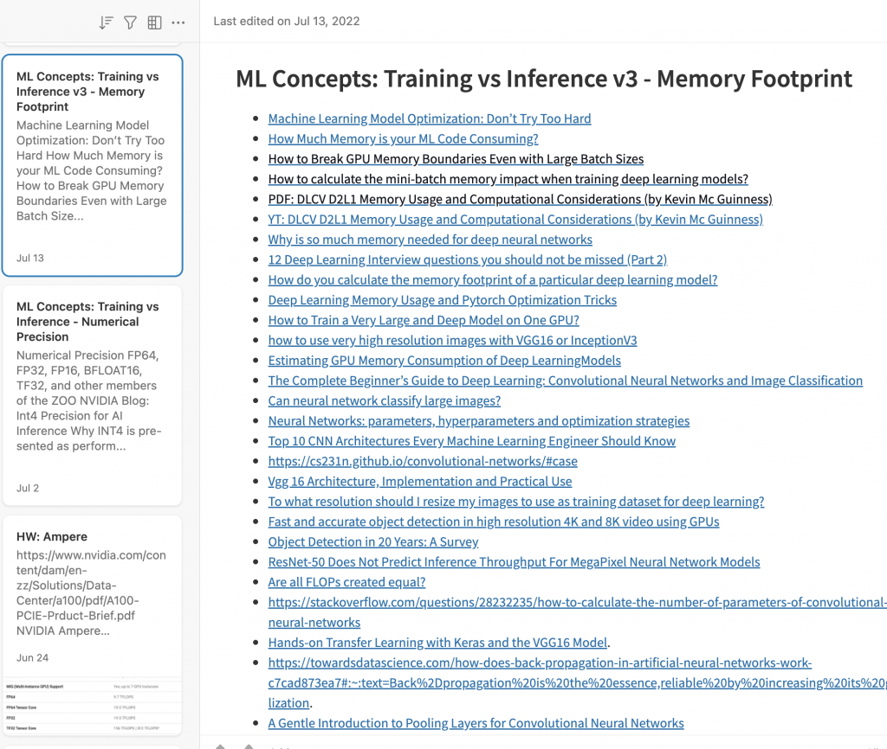

During the Belgium VMUG, I talked with [Jeffrey Kusters](https://twitter.com/jeffreykusters) and the VMUG leadership team about the challenges of writing a book. Interestingly enough, since that VMUG, the question of how to start writing a book kept appearing in my inbox, dm, and Linkedin Messaging regularly. This morning Michael Rebmann's question convinced me that it's book writing season again, so maybe it's better to put my response in a central place. 

https://twitter.com/\_michaelrebmann/status/1553498293736538116

There are millions of books and millions of authors, and that makes me believe a million ways to write a book. Here is what works best for me. Hopefully, there is something in it that will work for you too. 

# Show up daily

The biggest thing you can do to help you succeed is to show up daily. I suppose this can be applied to anything in life, but it applies to writing books especially. The key to understanding is the level of showing up, i.e., your output. You simply cannot write thousands and thousands of words every day. You will have high energy days and low energy days. Days spent on research. Days spent questioning simple things that lead to rabbit holes such as this: "How much MB is there in a GB? What about Gibibyte? And which one will I be using in the book? How many tables do I need to convert now?" You will lose much time and energy on things that will not show up in the book. And that can have a demoralizing effect and give you a feeling that you are not making any progress. Especially when you are still operating under the impression that you must write a couple of thousands of words daily. And this is not true, at least not in my experience.

Showing up means doing something. This cartoon, full credits to [@saraharnoldhall](https://www.instagram.com/saraharnoldhall/?hl=en) says it all. 

Add some words to your draft each day. It doesn't have to be a lot. Sometimes you have good days. Sometimes you have bad days. People who have known me a bit longer and listened to my podcasts might know I suffer from migraines. Writing books while being a migraine patient is not an ideal combination. You cannot "send it" every day. So you have to work around the bad days. On my bad days, I try to do light work. I reorganize my system. Clean out the whiteboard, or if possible, I will remove the interrupts. Because when I have a good day, I don't want to get interrupted.

## Getting rid of interrupts

In 2019, I wrote an article about the three books that helped me focus, [Getting things done, Essentialism, and KonMari](https://frankdenneman.nl/2019/04/24/allen-mckeown-and-kondo/). Getting rid of stuff, ensuring everything is in the right place and only getting the stuff you need helps you eliminate interruptions. Maybe you can't do that for your entire household, but try to do it in your office. When you want to write, you do not get interrupted by things that need your attention. You can focus on the things you want to focus on. What also helps me to retain focus is music. Preferably music without any lyrics as that seems to distract me from writing, I've created a 33-hour [Spotify list](https://open.spotify.com/playlist/32ez2cOowocPAed86Hy0bB?si=0c860eabdc404a03) that helps me to zone in, but I know it's not everyone's taste. 

## Tools

I use [Evernote](http://evernote.com) to store links to interesting articles and research papers to organize my thoughts. [Grammarly](http://grammarly.com) heavily corrects my English, and I use [Omnigraffle](https://www.omnigroup.com/omnigraffle/) for my diagrams. Keeping organized properly is a timesaver long term. You will go back to your notes often, and I lost countless hours finding that one paragraph with that one datapoint that verified my thought. Safe everything, and label everything correctly. 

The last thing I want to say is just do it. Write that book that you wanted to write. Cover that topic from your perspective. Make sure it is factually correct, but add some personal flavor to it. To quote Rick Rubin, "Make what you love, whatever it is, be your own audience. So make the thing you love for you, the audience."
