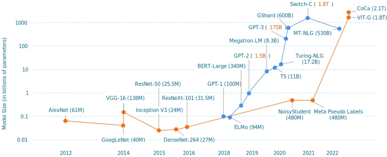
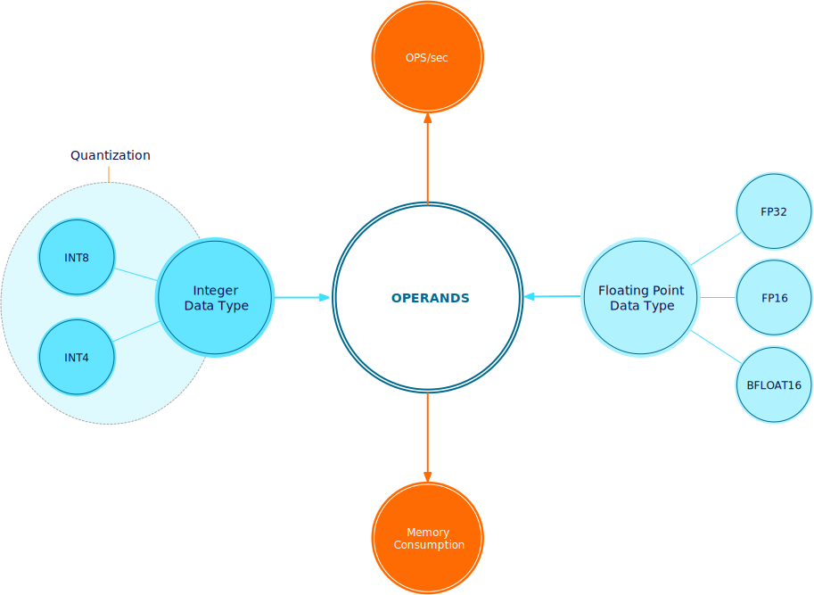
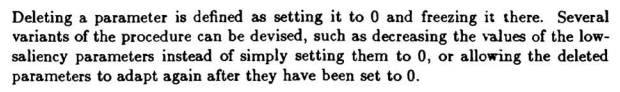
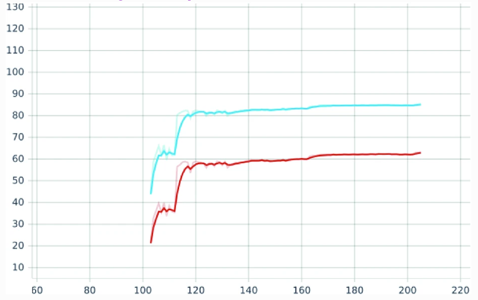
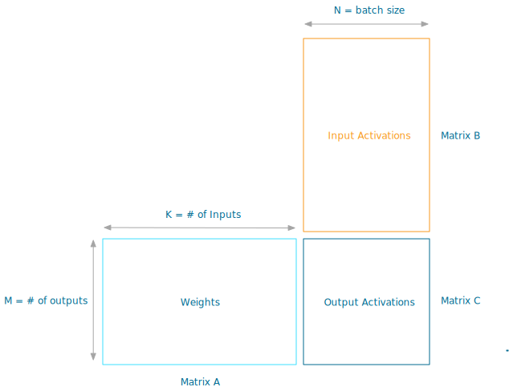

This training versus inference workload series provides platform architects and owners insights about ML workload characteristics. Instead of treating deep neural networks as black box workloads, ML architectures and techniques are covered with infrastructure experts in mind. A better comprehension of the workload opens up the dialog between infrastructure and data science teams, hopefully resulting in better matching workload requirements and platform capabilities.

[Part 3](https://frankdenneman.nl/2022/06/30/machine-learning-on-vmware-platform-part-3-training-versus-inference/) of the series focussed on the memory consumption of deep learning neural network architectures. It introduced the different types of operands (weights, activations, gradients) and how each consumes memory and requires computational power throughout the different stages and layers of the neural network. [Part 4](https://frankdenneman.nl/2022/07/26/training-vs-inference-numerical-precision/) showed that a floating point data type impacts a neural network's memory consumption and computational power requirement. I want to cover neural network compression in this part of the training versus inference workload deep dive. The goal of neural network compression is inference optimization to either help fit and run a model at a constrained endpoint or to reduce inference infrastructure running costs.

A data science team's goal is to create a neural network model that provides the highest level of accuracy (Performance in data science terminology). To achieve high levels of accuracy, data science teams feed high-quality data sets to the ML platform and execute multiple training runs (epochs). The ML community builds newer, more complex, and more extensive neural networks to improve precision. The chart below shows the growth of parameters of image classification (orange line) and Natural Language Processing (blue line) in state-of-the-art (SOTA) neural network architectures.

If we deconstruct any neural network architecture, we can see that each neural network has different layers and operands, i.e., weights, activations, and gradients. These layers and operands impact a model's performance and inference time. Data scientists select an appropriate floating-point data type to reduce the neural network model's memory utilization and increase the processing speed.

Sometimes, the neural network size (the memory footprint) prohibits successful deployment to the target production infrastructure. For example, it can be an edge deployment onto a particular device, a physical space with a restricted-energy envelope. As a result, the data science team can optimize the network even further by performing quantization. Post-training quantization converts floating point data points into integers. If done smartly, it can reduce the neural network memory footprint tremendously while retaining accuracy. An additional technique to improve the efficiency of the algorithm is pruning. Pruning and quantization go hand in hand. The CERN Large Hadron Collider team is exploring a [Quantization-Aware Pruning](https://www.frontiersin.org/articles/10.3389/frai.2021.676564/full) technique.

## Pruning

Pruning helps to identify the important connections within the neural network and uses methods to remove either the connection to individual weights (unstructured pruning) or remove the connection of groups of weights by disconnecting an entire channel or filter (structured pruning). The most popular frameworks, like [TensorFlow (Keras)](https://www.tensorflow.org/model_optimization/guide/pruning/comprehensive_guide) and [Pytorch](https://pytorch.org/tutorials/intermediate/pruning_tutorial.html), contain standard modules to perform unstructured pruning on neural networks. 

An interesting thing about pruning is that many online literature and research papers use the terms _remove_ or _delete_ weights. It does not change the neural network layout. See the screenshot of the Optimal Brain Damage research paper, or check out [the PyTorch Pruning tutorial](https://pytorch.org/tutorials/intermediate/pruning_tutorial.html).

When replacing the trained parameter with a zero, **sparsity** is introduced into the tensor or dense matrix data structure. Sparsity is the proportion of zero to non-zero weights. Algorithms can use sparsity to speed up or compress the footprint of the neural network.  

Pruning is possible as many weights in a trained neural network end up close to the value of zero. Many researchers believe that most neural networks are over-parameterized. As a result, pruning has been a hot topic since the 90s. There have been some influential papers that are still referenced today and used as the starting point for research on new pruning techniques:

In the paper "[Optimal Brain Damage](https://proceedings.neurips.cc/paper/1989/file/6c9882bbac1c7093bd25041881277658-Paper.pdf)," LeCun et al. discover that "reducing the size of a learning network**_"_** improved generalization (the neural network's ability to adapt correctly to new, previously unseen data) and inference speed.  

Fast forward to 2015, Han et al. published "[deep compression](https://arxiv.org/abs/1510.00149)," combining pruning, trained quantization, and Huffman coding to reduce the neural network footprint for mobile and other low-power applications. The pruning mechanism is (unstructured) **magnitude-based**, the most common today. Magnitude-based pruning assumes that the weight with the smallest value has the most negligible contribution to the neural network's performance and removes those weights. 

Interestingly, if you train a network and prune the network connections, you end up with a neural network that retains its accuracy but has more than 50% of fewer parameters. However, if you start training with that neural network architecture, it will not achieve that high accuracy level. 

In the paper "[The Lottery Ticket Hypothesis: Finding Sparse, Trainable Neural Networks](https://arxiv.org/abs/1803.03635)" (2019), Jonathan Frankle and Michael Carbin asked why training a network with the topology of the pruned network yields worse performance. They conclude that within an extensive neural network, a smaller neural network exists that would match the performance of the larger one. This "winning lottery ticket" subnetwork exists, but you can only discover it if the same weight initializations are used as the original networks. And therefore, it's almost impossible to discover that smaller network before you train the larger one to completion. 

The paper hypothesis automatically makes you wonder as a platform operator/architect about the approach data scientists use to optimize their models. Why not start training with a small neural network and slowly build more extensive networks? (constructive approach). Getting a neural network to react to new data correctly (generalize) with a few parameters is complicated. There seems to be no traction in the research space to investigate "Constructive neural network learning" thoroughly.

## Pruning Scheduling

Generally, the data science team takes a _destructive approach_ to model development. Multiple epochs are used to train the complete neural network with all its parameters to achieve the highest accuracy possible. The next step is to apply a pruning method in which learned parameters are set to zero, and the connections are stripped away. 

The most popular pruning method is "train, prune and fine-tune." Pruning takes place after training. The data science team determines a pruning percentage. The pruning percentage indicates the number of learned parameters that will be set to zero across the neural network. Once the pruning is complete, the neural network retrains to "recover from the loss of parameters " these two steps are one iteration. Please keep in mind that one iteration can contain multiple epochs of training.

The data science team can choose to execute the pruning method in different ways that affect the time the accelerators are in use and when they are idling. There are two mainstream methods that I want to highlight:

- **One-shot Pruning**
- **Iterative Pruning**

One-shot pruning prunes the neural network to a target sparsity level in one iteration. The deep compression paper showed that pruning and retraining are repeated iteratively until the target sparsity threshold is met, typically resulting in higher accuracy than one-shot pruning. It's common to prune 20% of the weights with the lowest magnitudes during one iteration. 

Generally, iterative pruning is computationally intensive and time-consuming, especially if the global target sparsity is high and the number of parameters removed at each iteration is low. The pruning extends the use of accelerator time, but downtime occurs between iteration sessions. It can be a very "jerky" process from an accelerator utilization perspective. The iterative process introduces additional criteria besides the pruning strength:

- **Pruning Strength:** How many weights should be removed?
- **Saliency:** Which weights should be pruned?
- **Pruning Stop Condition:** When should the pruning process end?

Commonly, the data science team evaluates the progress between iterations. During this time, the accelerator is typically assigned to a workload construct (VM, container), yet it is not productive. When reviewing accelerator use for pruning purposes, it's not uncommon to see the same number of epochs used for training. The paper "[Retrain or Not Retrain? - Efficient Pruning Methods of Deep CNN Networks](https://link.springer.com/chapter/10.1007/978-3-030-50420-5_34)" shows a great example: 

_Retraining of the pre-trained Resnet50 with global sparsity of 20%. Retraining starts at epoch 104. Top5 is marked in blue, and Top1 in red._ 

## Sparsity

Introducing sparsity allows for efficient compression. There is the machine learning definition of compression (i.e., sparsity) and the definition we have used since Robert Jung blessed us with ARJ in MS-DOS and when Winzip burst onto the scene in 1991. Let's use the old-school definition for now. A pruned neural network is highly susceptible to efficient compression, as you have millions of zeroes floating around. Compression is perfect if you want to reduce the model file size for the model's distribution to mobile devices. Mobile devices have limited memory, and as the data compression paper points out, there is a power consumption difference between data retrieval from cache or SRAM. But for large retail organizations or Telco companies dealing with countless edge locations, reducing the model size can significantly speed up the distribution of the model.

But pruning is not easy, and pruning will not automatically guarantee success. Results vary widely, depending on the neural network type and task. Some architecture responds better to pruning than others. And then, of course, there is the hardware. Replacing a trained weight for a zero doesn't make it easier for the hardware. We, as humans, know that when we _multiply by zero_, the answer is ... zero, and any number added to 0 is equal to itself. So we take shortcuts, but this calculation needs to be executed for a computer. It cannot be ignored unless we include this logic in an algorithm.

The focus for pruning is to retain similar accuracy while increasing sparsity. However, feeding a dense matrix data structure riddled with zeroes can cause irregular memory access patterns for accelerators. And so, a sparse, dense matrix data structure isn't always faster. The data science team has to apply more optimizations or choose structured pruning to speed up successfully on particular accelerator devices. But removing entire filters or layers dramatically changes the neural network structure's layout and reduces the neural network accuracy. 

Hardware vendors have also been researching this field for years, especially NVIDIA. The papers "[Learning both weights and connections for efficient neural networks](https://scholar.google.com/citations?view_op=view_citation&hl=en&user=DagH37xI9soC&citation_for_view=DagH37xI9soC:9yKSN-GCB0IC)" and "[Exploring the granularity of sparsity in convolutional neural networks](https://scholar.google.com/citations?view_op=view_citation&hl=en&user=DagH37xI9soC&citation_for_view=DagH37xI9soC:LkGwnXOMwfcC)" by Jeff Pool et al. (Senior Architect NVIDIA) are interesting reads. With the Ampere Architecture, NVIDIA introduced sparse tensor cores and Automatic Sparsity (ASP), a concept to generate the correct sparsity level for the hardware to accelerate. 

# NVIDIA Sparsity Support

[Part 5 - Numerical Precision](https://frankdenneman.nl/2022/07/26/training-vs-inference-numerical-precision/) showed the spec sheet of an NVIDIA A100 (Ampere architecture), listed 624 TOPS for INT8 operations, and listed 1248 TOPS with an asterisk. Those 1248 TOPS are sparse tensor core operations following the 2:4 structured-sparse matrix pattern prescribed by NVIDIA.

This predefined pattern means any pruned neural network can get the best performance from an Ampere accelerator (A2, A30, A40, A100). It has to follow the 2:4 structured-sparse matrix pattern. And that means that two values out of each contiguous block of four must be zeroed out. In the end, 50% of the trained values across the network are replaced by a zero. This method's beauty is that it uses metadata to track where those zeroes are stored. To some, this sounds like a sparse matrix data structure format. But the problem is that many machine learning libraries do not offer support for sparse matrices. 

So NVIDIA uses a compressed format of a dense matrix data structure which contains the trained weights and a metadata structure that is necessary for sparse tensor cores to exploit the sparsity. This format is fed into the sparse tensor cores to get that speed up. Thus from an infrastructure perspective, you need to have your development/inference infrastructure in lockstep. They have to run both the Ampere architecture. Possibly A100 for training and pruning with ASP operations, A2 accelerator cards for inference operations.

_A 2:4 structured sparse matrix W and its compressed representation (source NVIDIA)_

The smart part is in the metadata. The metadata stores the positions of the non-zero weights in the compressed matrix. We must look at a standard General Matrix Multiplication operation (GEMM). In a forward propagation operation, you have a matrix (A) with weights, A matrix with activations (B), and you capture the output in Matrix C. Matrix A and B are identical in dimensions for mapping the weights and activations.

What happens with the sparse operation of the Ampere architecture? The non-zero weights are in matrix A. This one is now in a compressed state, so the dimensions do not match matrix B anymore. It only needs to pull the values from the other matrix to perform the sparse operation. It needs to perform the multiplication with the trained weight. The metadata allows the algorithm to do that. As matrix A only contains non-zero values, the metadata helps the algorithm to know precisely which activation to pull from B to match up with the train values within the compressed matrix A. 

## What's next for Pruning?

NVIDIA is looking into incorporating ASP into training operations, and I can imagine this will be a significant unique selling point. As of this point, data scientists use a huge budget to train the model before starting the activities to optimize the neural network for edge deployment. These activities are not always successful. Pruning requires long fine-tuning times that could exceed the original training time by a factor of 3 or sometimes even more. Pruning consumes tremendous amounts of resources, whether on-prem or OPEX, without proper guarantees. NVIDIA has proven that sparsity can be leveraged, it is just a matter of time before other solutions pop up.
