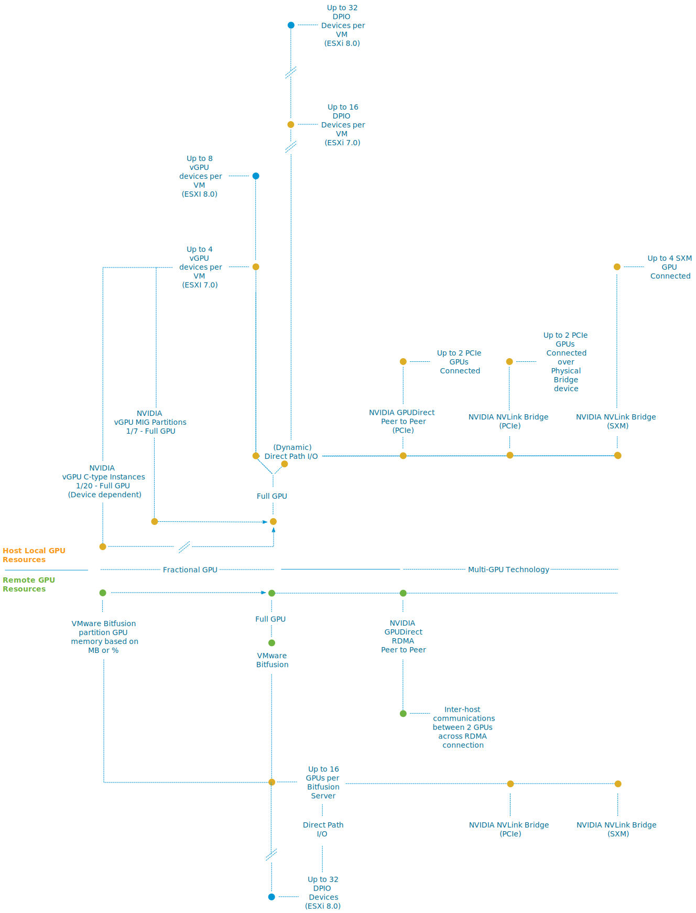
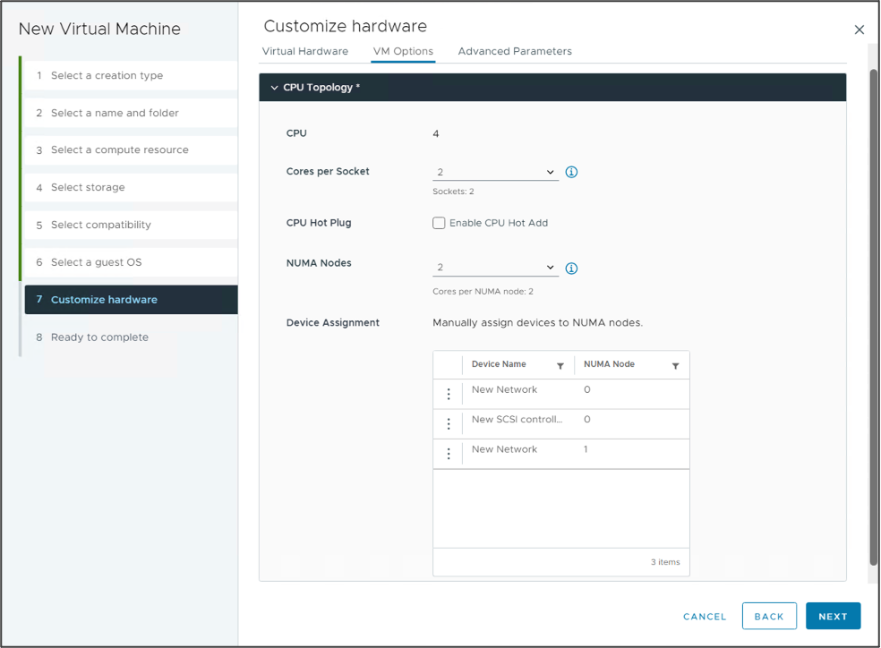
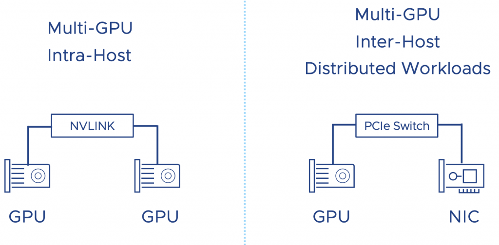

vSphere 8 is full of enhancements. Go to [blogs.vmware.com](https://blogs.vmware.com) or [yellow-bricks.com](https://www.yellow-bricks.com) for more extensive overviews of the vSphere 8 release. In this article, I want to highlight two features of the new vSphere 8 version that will help machine learning (ML) workloads perform consistently and possibly faster than manually configured workload constructs. The two features which make this possible are _UI enhancements for the vNUMA Topology_ and the _Device Groups_.

## Hardware 20 Scalability Enhancements

Before we dive into the features, vSphere 8 introduces a new virtual hardware feature that allows us to introduce new wonderful things and push the boundaries again of the platform. With vSphere 8, the virtual hardware level advances to version 20, and it offers new capabilities for ML accelerators. The support for DirectPath I/O devices went up from 16 to 32. We also worked with NVIDIA to increase the support of the vGPU devices, and now, with vSphere 8, each ESXi host can support up to 8 vGPU devices. 

These enhancements improve the spectrum of the ML accelerator range tremendously. With vGPU, the platform team, or in some cases, the MLOPs team, can create workload constructs (VMs, containers) and utilize fractional GPU resources that allow the data scientists to run some light testing or compartmentalize GPUs for inference workloads. At the other end of the spectrum, we have the work beast for training workloads, the multi-GPU configurations. We offer these technologies host-local and remote with VMware Bitfusion technology for allowing fast attach and detach of workloads and hardware resources. In the diagram, the orange dots indicate vSphere 7 maximum supported devices. The blue dots indicate vSphere 8.

## Simplified Virtual NUMA Configuration 

The device assignment functionality in the new vSphere 8 UI of the vNUMA Topology helps VI-admins and MLOPs teams assign the vCPU and GPU of a VM to the same NUMA node. This feature improves the possibility that the memory of the VM remains the same NUMA node as the GPU. I wrote an extensive article about this in January 2020, "[Machine Learning Workload and GPGPU NUMA Node Locality](https://frankdenneman.nl/2020/01/30/machine-learning-workload-and-gpgpu-numa-node-locality/)." The idea of the script is now codified correctly in the official product, a personal highlight to see for me. 

## Device Groups

Device Groups is a brilliant new feature. And before we dive into device groups, we have to look at Dynamic DirectPath I/O. Before Dynamic Direct Path, a VI-admin specified a GPU device by PCI location. That meant that the VI-admin must track what ESXi hosts have which devices and what VMs are using those devices. The VI-admin selects that particular PCI address and constraints that VM to run only on that particular device.

With the introduction of hardware labels, Dynamic DirectPath I/O (DDIO) allows a VM-admin to specify the **kind** of device to add to a VM. Niels Hagoort wrote a very informative article about Dynamic DirectPath I/O with its initial product name title: "[vSphere 7 – Assignable Hardware](https://blogs.vmware.com/vsphere/2020/03/vsphere-7-assignable-hardware.html)." 

The problem is that DDPIO is only for one device, but as I have shown at the beginning of the article, we support the full spectrum of ML accelerator configurations. What if a data science team requires a multi-GPU configuration? Multi-GPU configuration is an infrastructure way of looking at this. The data science teams call it distributed training or [distributed deep learning](https://frankdenneman.nl/2020/02/19/multi-gpu-and-distributed-deep-learning/). The workload distribution happens between GPUs within an ESXi host or across multiple ESXi hosts. That's where device groups come into play. 

With Device Groups, vSphere 8 allows the VI-admin or MLOps team to create a configuration for workloads requiring multiple GPUs connected by a high-speed link or devices that must be on the same PCI switch. 

Distributed workloads running across GPUs located on multiple ESXi hosts want the lowest possible latency. The interconnect between the ESXi hosts receives the most attention, but the path from the GPU to the external interconnect is also essential. To minimize latency, we have to take the NUMA locality of both the GPU and the NIC into account. Modern CPUs have PCI controllers baked into the CPU package; thus, [NUMA PCI-Locality](https://frankdenneman.nl/2020/01/10/pcie-device-numa-node-locality/) exists. To provide consistent performance, you must select devices connected to the same PCI controller or PCI switch (available in large systems). 

A high-speed interconnect between GPU accelerators allows for a stable, consistent high bandwidth to ensure the most performance from the available local hardware. NVIDIA offers NVLINK, a direct GPU to GPU interconnect. An A30 card offers one link per card. An a100 is equipped with three links, offering 150 GB/s GPU to GPU bandwidth. Each link provides 50 GB/s of theoretical bandwidth per link. Device Groups allow VI-admins of MLOPs team to add these multiple devices as a single unit to a virtual machine. 

More in-depth articles about these features will follow in the upcoming weeks.
