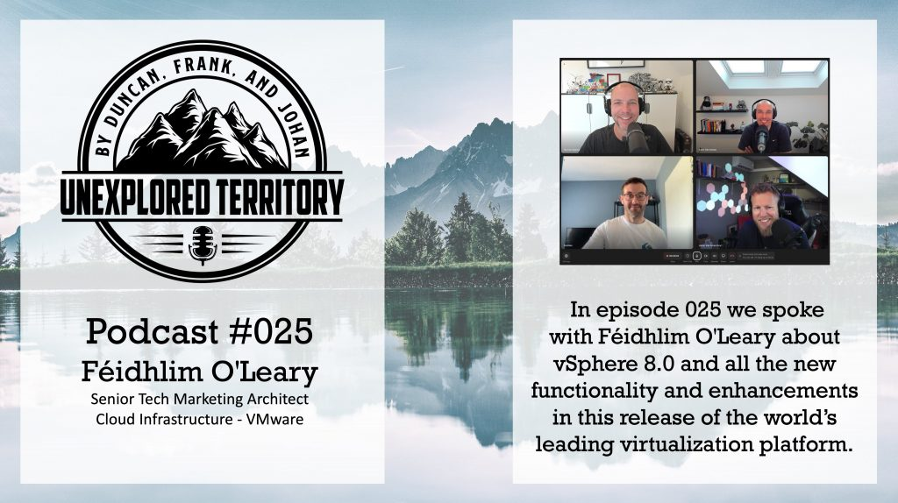

This week we released two episodes covering the vSphere 8 and vSan 8 releases. Together with Feidhlim O'Leary, we discover all the new functions and features of the vSphere 8 platform. You can listen to this episode on [Spotify](https://open.spotify.com/episode/2ru792SACpSD1lrlLnT7cV?si=d4631238be7a44c9), [Apple](https://podcasts.apple.com/nl/podcast/025-introducing-vsphere-8-0-with-feidhlim-oleary/id1587672642?i=1000578353391), or on our website: [unexploredterritory.tech](https://unexploredterritory.tech/episodes/)

Pete Koehler repeats his stellar performance of last time and helps us understand the completely new architecture of vSAN 8. You can listen to this episode on [Spotify](https://open.spotify.com/episode/18EACPifkoSQFVmdMCCpp7?si=ea531821b56b4737), [Apple](https://podcasts.apple.com/nl/podcast/026-diving-deep-into-vsan-esa-8-0-with-pete-koehler/id1587672642?i=1000578353299), or on our website: [unexploredterritory.tech](https://unexploredterritory.tech/episodes/) or anywhere else you get your podcasts!
