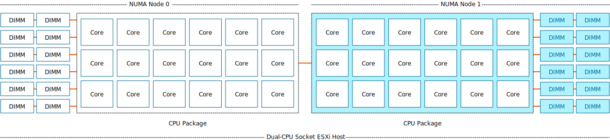
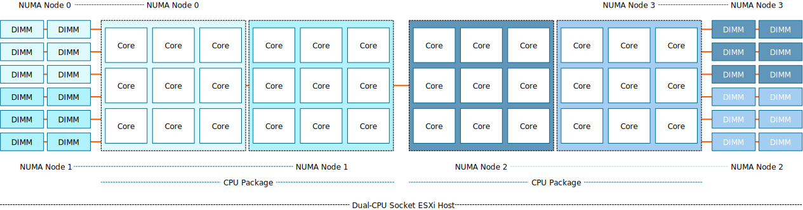
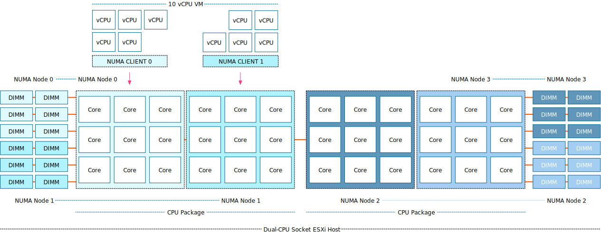

I'm noticing a trend that more ESXi hosts have Sub-NUMA Clustering enabled. Typically this setting is used in the High-Performance Computing space or Telco world, where they need to reduce every last millisecond of latency and squeeze out every bit of bandwidth the system can offer. Such workloads are mostly highly tuned and operate in a controlled environment, whereas an ESXi server generally runs a collection of every type of workload in the organization imaginable. Let's explore what Sub-NUMA clustering does and see whether it makes sense if you should enable it in your environment.

### NUMA

Most data center server systems are NUMA systems. In a NUMA system, each CPU contains its own memory controllers that provide access to locally connected memory. The overwhelming majority of systems in data centers worldwide are dual-socket systems. Each CPU has access to local memory capacity via its own memory controller, but it can also access the memory connected and controlled by the remote CPU. There is a difference in latency and bandwidth between reading and writing local and remote memory, hence the term Non-Uniform Memory Access (NUMA). 



_[AMD EPYC architecture](https://frankdenneman.nl/2019/02/19/amd-epyc-and-vsphere-vnuma/) is a Multi-Chip-Module (MCM) architecture and wildly differs from the monolithic architecture and its I/O path behavior. Sub-NUMA clustering is the functionality of partitioning Intel CPU packages. AMD provides similar functionality called NUMA per Socket (NPS). This article only focuses on Intel Sub-NUMA clustering technology as I have not seen server vendors' default enablement of the NPS setting at this moment._ 

### **Logical Partitions**

The Intel E5-2600 processor family had a ring architecture, allowing Intel to optimize CPU core-to-memory access further. With the Haswell release (v3), Intel introduced Cluster-On-Die (COD) functionality. COD logically splits the CPU into two NUMA nodes. 


The COD feature reduces the search domain of the memory hierarchy. NUMA systems are cache-coherent. When a core generates a memory request, it checks its local L1 and L2 cache, the shared L3 cache (LLC), and the remote CPU cache. By splitting the CPU along its "natural" ring structure barrier, you end up with a smaller memory domain to search if there is a cache miss. And on top of that, you should have less local memory traffic if the applications and operating systems are NUMA optimized. Please look at the [NUMA deep dive](https://frankdenneman.nl/2016/07/07/numa-deep-dive-part-1-uma-numa/) or read this [research paper](https://www.researchgate.net/publication/279660275_Cache_Coherence_Protocol_and_Memory_Performance_of_the_Intel_Haswell-EP_Architecture) about COD caching structures for more info. The Skylake architecture (Intel Xeon Scalable Processors) moved away from the ring architecture and introduced a mesh architecture. The logical partition functionality remained and was introduced under a new name, Sub-NUMA Clustering (SNC). 


With SNC enabled, that previously shown dual CPU socket ESXi host system is now a four NUMA node system.



### Comparing SNC to NUMA Performance 

Is SNC that Turbo feature that is hidden in your BIOS? If you look at the description some vendors use, you want to enable it immediately. [Dell](https://downloads.dell.com/solutions/general-solution-resources/White%20Papers/Setting_BIOSin14G-Serv%2816Apr2018%29.pdf) and [Lenovo](https://thinksystem.lenovofiles.com/help/topic/uefi_xeon_1st_2nd/processors.html?cp=10_3_0_2_1_8) describe SNC: "...It improves average latency to the LLC". I'm using the performance numbers that Hadar Greinsmark published in his research "[Effective Task Scheduling of In-Memory Databases on a Sub-NUMA Processor Topology](https://www.diva-portal.org/smash/get/diva2:1424397/FULLTEXT01.pdf)." In a default NUMA configuration (SNC disabled), let's look at the latency difference between Socket 0 (S0) and Socket 1 (S1).

| Latency (ns) | NUMA Node 0 (S0) | NUMA Node 1 (S1) |
| --- | --- | --- |
| NUMA Node 0 | 80.8 | 138.9 |
| NUMA Node 1 | 139.7 | 79.9 |

With SNC enabled, Socket 0 contains two NUMA nodes, 0 and 1. Socket 1 contains NUMA Nodes 2 and 3. These logical partitions are genuine NUMA nodes. Although the different memory controllers and cache domains are on the same die, the caching mechanisms and non-interleaving of memory controllers create a non-uniform memory access pattern between the domains. Consequently, there is an increase in latency when fetching memory from the other "remote" NUMA node located within the same socket.

| Latency (ns) | NUMA Node 0 (S0) | NUMA Node 1 (S0) | NUMA Node 2 (S1) | NUMA Node 3 (S1) |
| --- | --- | --- | --- | --- |
| NUMA Node 0 (S0) | 74.2 (-7.5%) | 81.5 (+0.8%) | 132.0 (-5%) | 142.1 (+2.3%) |
| NUMA Node 1 (S0) | 82.0 (+1.4%) | 76.4 (-5.4%) | 135.6 (-2.4%) | 144.5 (+4%) |
| NUMA Node 2 (S1) | 132.4 (-5.2%) | 142.0 (+1.7%) | 73.6 (-7.9%) | 81.5 (+2%) |
| NUMA Node 3 (S1) | 136.0 (-2.6%) | 144.4 (+3.4%) | 81.5 (+2%) | 76.6 (-4.1%) |

The SNC mapping method of memory addresses from the local memory controller to the closest LLC certainly works as the local NUMA latency with SNC drops on average between 6 to 7% compared to the default NUMA configuration. Take NUMA node 0 as an example. With SNC enabled, it experiences a memory latency of 74.2 ns; compared to SNC disabled, the access latency is 80.8 ns. As a result, SNC specifically reduces memory latency by 7.5% for NUMA node 0. 

The performance numbers show that remote connections handled by node 0 and node 2 are performing better than in the SNC disabled state, whereas NUMA node 1 and node 3 are performing less than in the SNC disabled state. The latency numbers reported to the remote node on the same socket are very interesting. It possibly shows the fascinating behavior of the interconnect architecture. However, Intel does not share detailed information about the Ultra Path Interconnect (UPI) framework. 

If we look at the architecture diagram, we notice that above NUMA node 0, a controller exists with two UPI connections. Above NUMA node 1, a controller is located with a single UPI connection. Possibly the single-UPI experiences more blocking I/O traffic on the mesh, whereas the UPI controller with two connections has more methods to manage the flow better.

But this is just pure speculation on my end. The latency shoots up if we look at the absolute remote I/O numbers. What matters is that workloads execute remote I/O operations if they cannot read or write memory locally. If it can find the memory in the NUMA node located on the same socket, it sees a latency increase of 8.6%. When it travels across the interconnect to a NUMA node in the other socket, the latency increases to 78.2%. When it needs to travel to the farthest NUMA node, latency almost doubles (90%). A default NUMA system has an average remote latency hit of 73%. But SNC has a more extensive performance spread as it improves up to 7% on average locally but also degrades remote memory access up to 5%. Let's compare. In the default situation, local access is 80 ns, and remote access is 138.9 ns. With SNC, it has to deal with a worst-case scenario of 73.6 ns vs. 142.0. Which is the reason why the performance gap extends to 92.9%. And what decides what workload becomes local and remote? That is the key of this article. But before we dive into that, let's look at bandwidth performance first. 

### Bandwidth

Your [Skylake CPU model](https://ark.intel.com/content/www/us/en/ark.html#@PanelLabel595) has either two or three UPI links. Each UPI link is a point-to-point full duplex connection with separate lanes for each direction. A UPI link has a theoretical transfer speed of 10.4 Gigatransfers per second (GT/s), which translates to 20.8 gigabytes per second (GB/s). The [Intel Xeon Platinum 8180 processor](https://www.intel.com/content/www/us/en/products/sku/120496/intel-xeon-platinum-8180-processor-38-5m-cache-2-50-ghz/specifications.html?wapkw=intel%20xeon%20platinum%208180) used in the report contains three UPI links, possibly providing an aggregated theoretical bandwidth of 62.4 GB/s. One controller has two UPI links, and the other controller has one UPI link. The research paper shows that when communicating with a remote node, the average bandwidth is roughly 34.4 GB/s. 

**Speculation** 

As limited information about UPI communication patterns is available, I assume the system uses only two UPI links in the default NUMA node. With default NUMA, memory interleaves across memory controllers; thus, memory has to be retrieved from both memory controllers, and therefore, the systems use both UPI controllers. Why it doesn't use all three links, I think the overhead of syncing the I/O operation across three links and allowing other operations to use the interconnect outweighs the potential benefit of additional uplink. 

**/speculation**

But let's stick to the facts. Here you see the impact of remote memory access. Bandwidth performance drops 69% when doing remote I/O on the default NUMA system. And for this exact reason, you want to have NUMA optimized workloads or right-sized virtual machines. Why doesn't the progress bar move linearly on your screen? Possibly some non-NUMA optimized code fetching memory from the remote NUMA node. 

| Bandwidth (MB/s) | NUMA Node 0 (S0) | NUMA Node 1 (S1) |
| --- | --- | --- |
| NUMA Node 0 | 111 083 | 34 451 |
| NUMA Node 1 | 34 455 | 111 619 |

With SNC enabled, the system stops interleaving the whole memory range across both memory controllers within the CPU package and assigns each memory controller a subset of the memory range. Each memory controller has three channels, splitting the NUMA node's bandwidth in half. The test system uses DDR4 2666 MHz (21.3 GB/s) memory modules, theoretically providing up to 63.9 GB/s per SNC NUMA node. When reviewing the research findings, the default NUMA node provided 111 GB/s (6 channels) by enabling SNC, which should result in approximately 55.5 GB/s per NUMA node. Yet the test results report 58 GB/s. SNC improves local bandwidth by an average of 4.5% due to the isolation of workload and, therefore, fewer blocking moments of other I/O operations on the mesh. Similar improvements occur for the NUMA node on the same socket.

| Bandwidth (MB/s) | NUMA Node 0 (S0) | NUMA Node 1 (S0) | NUMA Node 2 (S1) | NUMA Node 3 (S1) |
| --- | --- | --- | --- | --- |
| NUMA Node 0 (S0) | 58 087 | 58 123 | 34 254 | 34 239 |
| NUMA Node 1 (S0) | 58 145 | 58 013 | 34 266 | 34 235 |
| NUMA Node 2 (S1) | 34 288 | 34 248 | 58 064 | 58 147 |
| NUMA Node 3 (S1) | 34 288 | 34 254 | 58 145 | 58 007 |

Therefore, SNC is a great way to squeeze out that last bit of performance for a highly tuned workload. If the workload fits inside the smaller NUMA node from a core count and memory capacity, it can expect a 7% improvement in latency and a 4% memory bandwidth. But, and there is a big but, but not the way Sir Mix-a-Lot likes it. But only if you deploy a scale-out workload. If you can deploy two workers in each worker node that run separate workloads, they both can benefit from extra obtainable bandwidth. If you only deploy a single workload, you've just robbed that workload of half its obtainable bandwidth. The workload can access remote memory capacity and possibly obtain more bandwidth. Still, it's up to the NUMA scheduler or application's discretion to make the smart move and choose the right NUMA node. And this is the point where we arrive at the fork in the road, the difference between a dedicated workload on bare metal and dealing with a NUMA scheduler that must take entitlement and workload patterns into account of multiple workloads.

SNC effectively reduces the per-NUMA node capacity and, thus, decreases the boundary of the single NUMA node virtual machine size. I have a question: Do 4% bandwidth improvement for scale-out the workload and 7% latency improvement sound like something you want to enable on a virtualization platform? How is a 10-vCPU VM placed on a dual socket with 18 cores per CPU package system?

### Single NUMA node VM sizing

Not every application is NUMA aware. Most platform operators and admin teams attempt to "right-size" the virtual machine to circumvent this problem. Right-sizing means the VM contains fewer vCPUs and memory capacity than the CPU socket contains CPU cores and memory capacity, yet still can function correctly. With SNC, the NUMA node is split in half, resulting in smaller VMs if they need to fit inside a single NUMA node. 


### vNUMA Topology

If a VM contains more vCPUs than a NUMA node contains CPU cores, the NUMA scheduler in ESXi creates a vNUMA topology for this VM and exposes this to the guest OS for NUMA optimizations. The NUMA scheduler creates multiple NUMA clients for this VM and places these accordingly, which is the key to understanding why SNC should or shouldn't be enabled in your environment.

#### Initial placement

The NUMA scheduler gets an initial placement request if a VM is powered on or a virtual machine is migrated into the host via DRS. During the initial placement operation, the NUMA scheduler is aware of the distance between the NUMA nodes. And it will attempt to optimize the placement of the NUMA clients of the VMs. In other words, it attempts to place the NUMA clients as close to each other as possible. As a result, most of the time, if a VM consists of two NUMA clients, both NUMA clients are placed on NUMA nodes sharing the same socket with SNC enabled. 

_Typically this happens during every synthetic test where this VM is the only VM running on the host; thus, the NUMA scheduler does not have to deal with contention or a complex puzzle or to fit these new clients amongst the other busy 44 other NUMA clients._ 



#### NUMA load-balancing

The hypervisor is a very dynamic environment. The CPU scheduler has to deal with a variety of workload patterns, and there are workload patterns such as load correlation and load synchronicity. With load correlation, the schedulers must deal with the load spikes generated by the relationship between workloads running on different machines. The NUMA scheduler reviews the CPU load every 2 seconds to catch these patterns. For example, an application with a front-end VM communicates with a database. With load synchronicity workloads trend together, a VDI environment that spins up several desktops each morning will cause a persistent load spike. And so, the NUMA load-balancer might decide that it's better to move some NUMA clients around the system. Getting into the NUMA load balancing algorithm's details is too deep for this article. I've covered most in the [NUMA deep dive](https://frankdenneman.nl/2016/07/07/numa-deep-dive-part-1-uma-numa/). But the crucial thing to understand is that if it's necessary to move the NUMA client, it will move the NUMA client, but **it won't take distance into account.** The attempt will be the smartest thing to do for the system, but it might not always be the best for the VM. 


In many cases, If you would not enable SNC, that VM would have fit inside a single NUMA node, and no remote access occurred as it would fit a single NUMA node. With SNC, a large VM might be larger than the SNC-NUMA node size and thus is split up. It's even worse if this VM connects to a PCIe device such as a GPU. Batch data transfers can occur across the interconnect, creating inconsistent data loading behavior during the host-to-device memory transfer operations. Learn more about [NUMA PCI-e locality here](https://frankdenneman.nl/2020/01/30/machine-learning-workload-and-gpgpu-numa-node-locality/).


### SNC Enabled by Default

Why am I making this statement? I discovered that HP enabled SNC with the workload profiles "[Virtualization - Max Performance" and "General Throughput Compute](https://techlibrary.hpe.com/docs/iss/proliant-gen10-uefi/GUID-E67BD113-8D65-4C61-B5AC-4A26F58FCCF3.html)."


ESXi does not have a setting in the UI that shows whether SNC is enabled or not, but we can apply the beautiful art form of deduction. By running the following (unsupported) command via SSH on the ESXi host:

```
echo "CPU Packages";vsish -e dir /hardware/cpu/packageList;echo "NUMA nodes";vsish -e dir /hardware/cpuTopology/numa/nodes
```


You get a list of the number of CPU packages (a fancy name for the device you can hold in your hand that contains the CPU cores, memory controllers, and PCI controllers) and the number of NUMA nodes in the system. If SNC is disabled, the number of NUMA nodes should equal the number of CPU packages. In this scenario, SNC is enabled. In most systems, you can enable and disable the setting individually, but if it's part of a profile such as on the HP systems, you need to customize this. Dan tweeted the method to do this. 

https://twitter.com/Casper042/status/1567680625423024129

### Disclaimer!

Please note that this tweet and this article are not official VMware recommendations to turn off SNC. This article will help you understand the implication of SNC on the overall behavior of SNC on the hardware layer and the way ESXi NUMA scheduler works. Always test a setting in your environment and your workload in a normal operating condition before changing a production environment.

### My Personal Thoughts on SNC

I believe that SNC has very little to offer to a virtualization platform that runs all types of workloads. Workloads that range from tiny to monster VMs. If you have a dedicated vSphere platform running a specific low-latency workload that needs to run, for example, VOIP workload or High-Frequency Trading workload, then SNC makes sense. 

For the average vSphere environment that runs Oracle, SQL, or any high-performing database that needs lots of vCPUs, along with some front-end applications and a whole bunch of other frameworks, SNC will impact your performance. Most admins want the VM to fit inside a single NUMA node. SNC reduces the VM footprint. SNC taxes memory access more severely. Due to the increased gap between local and remote I/O, the user will detect an even more inconsistent feel of workload performance. The NUMA scheduler now needs to balance four smaller NUMA domains instead of two larger ones; thus, more decisions will be made that might not be optimal. Take Short-Term Migration, for example. The NUMA scheduler moves a VM to solve an imbalance between NUMA nodes. In that scenario, the scheduler migrates the vCPU immediately, but the memory follows more slowly. Since memory relocation is not immediate, remote memory access will temporarily increase while the pages migrate to the new NUMA node. With four smaller NUMA nodes to deal with, this can impact the overall user experience, especially if the gap between local and remote memory is enlarged from 69% to 90%.

VMs that could be Uniform Memory Access VM (fit inside a single NUMA node) now span multiple NUMA nodes. And as a result, we hope the guest OS and the application are NUMA optimized. Recent Linux optimization to their NUMA scheduler makes me hopeful, but keeping the host to default NUMA would avoid so many performance inconsistencies. 

In essence, It is **my opinion** that SNC is for the highly optimized, well-curated environment that has exploited every single trick in the book. It should not be the starting point for every virtualization platform. 

Want to learn more about NUMA? We spoke with the driving force behind NUMA optimizations at VMware in **episode 19** of the [Unexplored Territory Podcast](https://unexploredterritory.tech). You can listen to the conversation with Richard Lu via the [Unexplored Territory website](https://unexploredterritory.tech/episodes/), [Apple Podcasts](https://podcasts.apple.com/nl/podcast/019-numa-numa-numa-with-richard-lu/id1587672642?i=1000567774959) or [Spotify](https://open.spotify.com/episode/0OZeulMmDxvwocJkMYydjj?si=6d01aaf429994aa9&nd=1)
