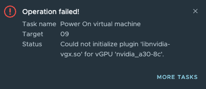
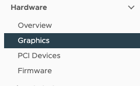
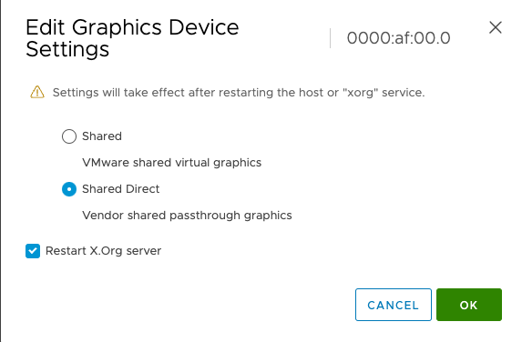
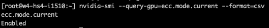
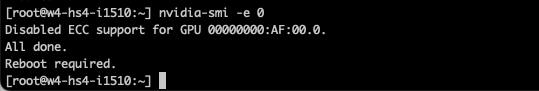
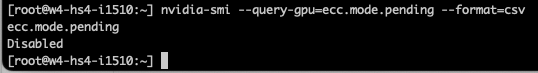

I was building a new lab with some NVIDIA A30 GPUs in a few hosts, and after installing the NVIDIA driver onto the ESXi host, I got the following error when powering up a VM with a vGPU profile:



Typically that means three things:

1. Shared Direct passthrough is not enabled on the GPU
2. ECC memory is enabled
3. VM Memory reservation was not set to protect its full memory range/

But shared direct passthrough was enabled, and because I was using a C-type profile and an NVIDIA A30 GPU, I did not have to disable ECC memory. According to the NVIDIA Virtual GPU software documentation: [3.4 Disabling and Enabling ECC Memory](https://docs.nvidia.com/grid/13.0/grid-software-quick-start-guide/index.html)

<figure>


<figcaption>

Reserve all guest memory (all locked) was enabled, and this setting is recommended. If someone changes the memory setting of the VM at a later stage, the memory reservation is automatically updated, and no errors will emerge.

</figcaption>

</figure>


I discovered that my systems did not have SR-IOV enabled in the BIOS. By enabling "SR-IOV Global Enable" I could finally boot a VM


SR-IOV is also required if you want to use vGPU Multi-Instance GPU, so please check for this setting when setting up your ESXi hosts.

But for completeness' sake, let's go over shared direct passthrough and GPU ECC memory configurations and see how to check both settings:

**Shared Direct Passthrough**

Step 1: Select the ESXi host with the GPU in the inventory view in vCenter

Step 2: Select Configure in the menu shown on the right side of the screen

Step 3: Select Graphics in the Hardware section

<figure>



<figcaption>

Select the GPU and click on Edit - the Edit Graphics Device Settings window opens

</figcaption>

</figure>

<figure>



<figcaption>

If you are going to change a setting, ensure that the ESXi host is in maintenance mode.  
Select Shared Direct and click on OK.

</figcaption>

</figure>

**Disabling ECC Memory on the GPU Device**

To disable ECC memory on the GPU Device, you must use the NVIDIA-SMI command, which you need to operate from the ESXi host shell. Ensure you have SSH enabled on the host. (Select ESXi host, go to configure, System, Services, select SSH and click on Start)

<figure>


<figcaption>

Open an ssh session to the host and enter the following command:

</figcaption>

</figure>

```
nvidia-smi --query-gpu=ecc.mode.current --format=csv
```

<figure>



<figcaption>

If you want to disable ECC on your GPU (you do not need to if you use C-type vGPU Profiles for ML workloads), run the following command. Please ensure your ESXi host is in maintenance mode if you change a setting on the ESXi host.

</figcaption>

</figure>

```
nvidia-smi -e 0
```

<figure>



<figcaption>

you can now reboot your host, or if you want to verify whether the setting has been changed, enter the following command:

</figcaption>

</figure>

```
nvidia-smi --query-gpu=ecc.mode.pending --format=csv
```

<figure>



<figcaption>

Now reboot your host, and ECC will be disabled once its powered-on

</figcaption>

</figure>
