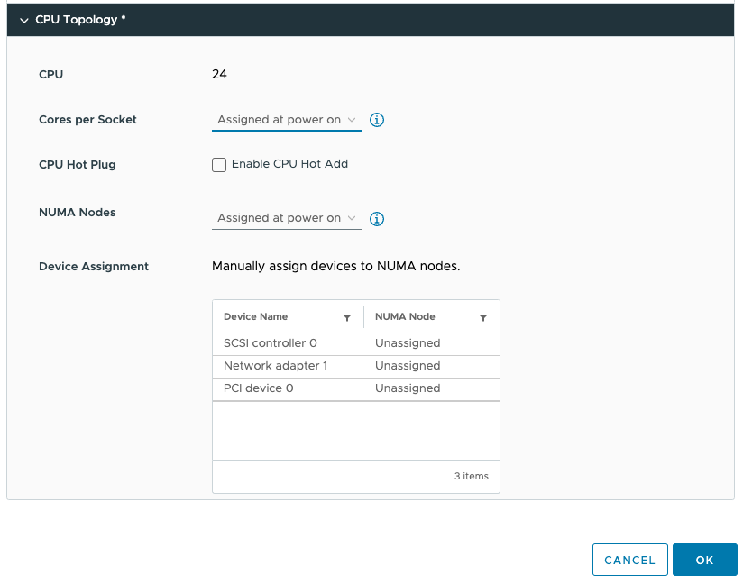
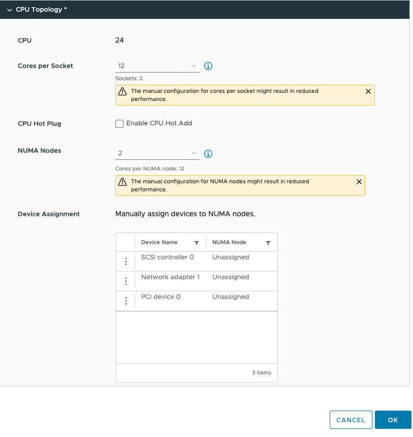
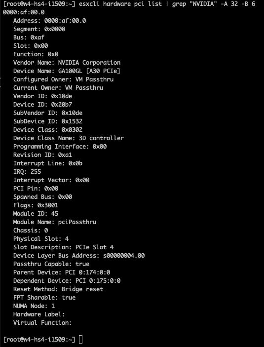
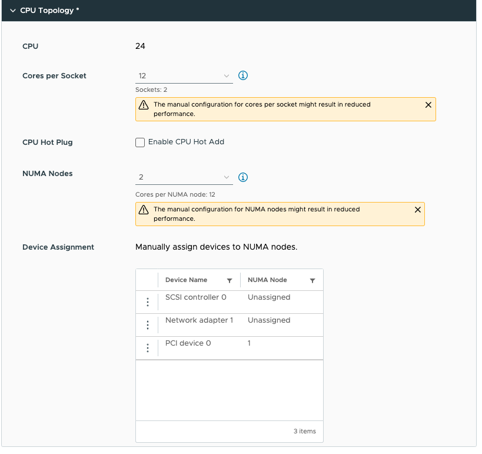

There seems to be some misunderstanding about the new vSphere 8 CPU Topology Device Assignment feature, and I hope this article will help you understand (when to use) this feature. This feature defines the mapping of the virtual PCIe device to the vNUMA topology. The main purpose is to optimize guest OS and application optimization. This setting does not impact NUMA affinity and scheduling of vCPU and memory locality at the physical resource layer. This is based on the VM placement policy (best effort). Let's explore the settings and their effect on the virtual machine. Let's go over the basics first. The feature is located in the VM Options menu of the virtual machine. 

Click on CPU Topology 

By default, the Cores per Socket and NUMA Nodes settings are "assigned at power on" and this prevents you from assigning any PCI device to any NUMA node. To be able to assign PCI devices to NUMA nodes, you need to change the Cores per Socket setting. Immediately, a warning indicates that you need to know what you are doing, as incorrectly configuring the Cores per Socket can lead to performance degradation. Typically we recommend aligning the cores per socket to the physical layout of the server. In my case, my ESXi host system is a dual-socket server, and each CPU package contains 20 cores. By default, the NUMA scheduler maps vCPU to cores for NUMA client sizing; thus, this VM configuration cannot fit inside a single physical NUMA node. The NUMA scheduler will distribute the vCPUs across two NUMA clients equally; thus, 12 vCPUs will be placed per NUMA node (socket). As a result, the Cores per Socket configuration should be 12 Cores per Socket, which will inform ESXi to create two virtual sockets for that particular VM. For completeness' sake, I specified two NUMA nodes as well. This setting is a PER-VM setting, it is not NUMA Nodes per Socket. You can easily leave this to the default setting, as ESXi will create a vNUMA topology based on the Cores per Socket settings. Unless you want to create some funky topology that your application absolutely requires. My recommendation, keep this one set to default as much as possible unless your application developer begs you otherwise.

This allows us to configure the PCIe devices. As you might have noticed, I've added a PCIe device. This device is an NVIDIA A30 GPU in Dynamic Direct Path I/O (Passthrough) mode.  But before we dive into the details of this device, let's look at the virtual machine's configuration from within the guest OS. I've installed Ubuntu 22.04 LTS and used the command lstopo. (install using: sudo apt install hwloc)

You see the two NUMA nodes, with each twelve vCPUs (Cores) and a separate PCI structure. This is the way a virtual motherboard is structured. Compare this to a physical machine, and you notice that each PCI device is attached to the PCI controller that is located within the NUMA node.

<figure>

<figcaption>

And that is exactly what we can do with the device assignment feature in vSphere 8. We can provide more insights to the guest OS and the applications if they need this information. Typically, this optimization is not necessary, but for some specific network load-balancing algorithms or machine learning use cases, you want the application to understand the NUMA PCI locality of the PCIe devices.   
In the case of the A30, we need to understand its [PCIe-NUMA locality](https://frankdenneman.nl/2020/01/10/pcie-device-numa-node-locality/). The easiest way to do this is to log on to the ESXi server through an SSH session and search for the device via the esxcli hardware pci list command. As I'm searching for an NVIDIA device, I can restrict the output of this command by using the following command "esxcli hardware pci list | grep "NVIDIA -A 32 -B 6". This instructs the grep command to output 32 lines (A)after and 6 lines (B)before the NVIDIA line. The output shows us that the A30 card is managed by the PCI controller located in NUMA node 1 (Third line from the bottom).

</figcaption>

</figure>

We can now adjust the device assignment accordingly and assign it to NUMA node 1. Please note the feature allows you to also assign it to NUMA node 0. You are on your own here. You can do silly things. But just because you can, doesn't mean you should. Please understand that most PCIe slots on a server motherboard are directly connected to the CPU socket, and thus a direct physical connection exists between the NIC or the GPU and the CPU. You cannot logically change this within the ESXi schedulers. The only thing you can do is to map the virtual world as close to the physical world as possible to keep everything as clear and transparent as possible. I mapped PCI device 0 (the A30) to NUMA node 1.

Running lstopo in the virtual machine provided me this result:

<figure>

<figcaption>

Now the GPU is a part of NUMA node 1. How we can confirm that is true is by taking the PCI device at address 04:00:00 given in the small green box that is inside Package 1 and seeing that is the same address as that given in the "esxcli hardware pci list" for the GPU - that is seen at the line titled "Device Layer Bus Address"  in that esxcli output. Because the virtual GPU device is now a part of NUMA node 1 the guest OS memory optimization can allocate memory within NUMA node 1 to store the dataset there so that it is as close to the device as possible. The NUMA scheduler and the CPU and memory scheduler within the ESXi layer attempt to follow these instructions to the best of their ability. If you want to be absolutely sure, you can assign NUMA affinity and CPU affinity at the lowest layers, but we recommend starting at this layer and testing this first before impacting the lowest scheduling algorithms.

</figcaption>

</figure>
