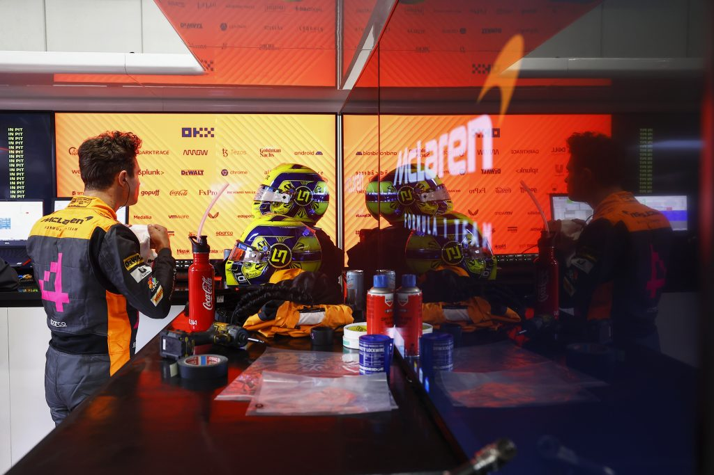

Edward Green, Head of Commercial Technology at McLaren Racing, keynoted at the VMware Explore tech conference in Barcelona. I had the honor of sitting down with him for a few minutes to talk about the role of IT in F1. Most of us watch the races with multiple screens, the main TV for the race and additional screens to look at the various telemetry feeds. And so you know how much data flows between cars and the teams. But sitting down with Edward and hearing him explain how data transfer feeds and disk sizes impact real training time for the driver is just candy to the ears of every tech-savvy Formula 1 fan. The episode starts with a short interview with Joe Baguley, the racing CTO of VMware, discussing his involvement with the McLaren Racing partnership and his passion for racing!

Listen to Edward and Joe at

[Spotify](https://spoti.fi/3Xx0orT)  
[Apple](https://apple.co/3UdrJfC)  
[Website](https://unexploredterritory.tech/)

<figure>

<figcaption>

Lando Norris, McLaren MCL36, prepares to head to the grid

</figcaption>

</figure>
