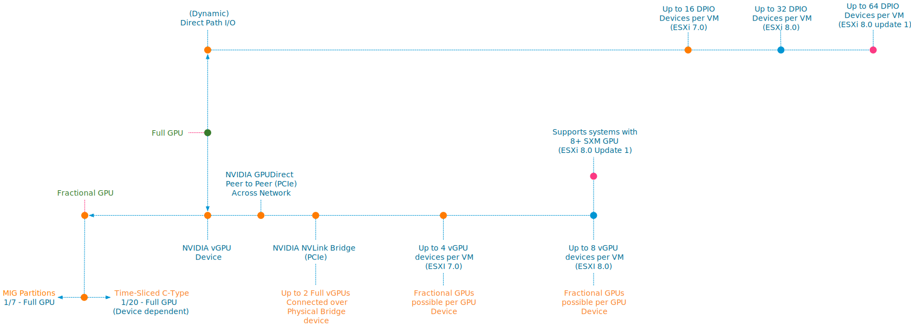
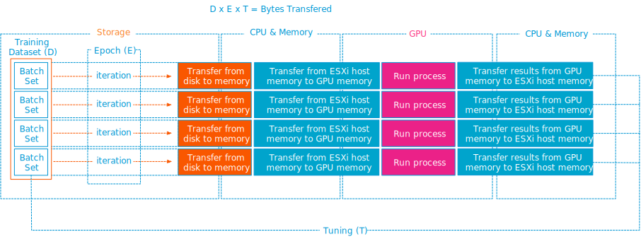

Recently [vSphere 8 Update 1](https://core.vmware.com/resource/whats-new-vsphere-8-update-1) was released, introducing excellent enhancements, ranging from VM-level power consumption metrics to Okta Identity Federation for vCenter. In this article, I want to investigate the enhancements to accelerate Machine Learning workloads. If you want to listen to all the goodness provided by update 1, I recommend listening to episode 40 of the [Unexplored Territory Podcast](https://unexploredterritory.tech/) with Féidhlim O'Leary ([Spotify](https://spoti.fi/3n52PV7) | [Apple](https://apple.co/3V4PpoF)).

Machine learning is rapidly becoming an essential tool for organizations and businesses worldwide. The desire for accurate models is overwhelming; in many cases, the value of a model comes from accuracy. The machine learning community strives to build more intelligent algorithms, but we still live in a world where processing more training data generates a more accurate model. A prime example is the [large language models](https://news.vmware.com/emea/future-tech-innovation/building-intelligent-societies-with-chatgpt) (LLM) such as [ChatGPT](https://chat.openai.com/). The more data you add, the more accurate they get.

<figure>

<figcaption>

Source: [ChatGPT Statistics (2023) — The Key Facts and Figures](https://www.stylefactoryproductions.com/blog/chatgpt-statistics#:~:text=%3A%20Lambda%20Labs.\)-,What%20was%20the%20size%20of%20the%20dataset%20used%20for%20training,Source%3A%20Wired%20and%20OpenAI.\))

</figcaption>

</figure>

To train ChatGPT, they used textual data from 5 sources. 60% of the dataset was based on a filtered version of data from 8 years of web crawling. I was surprised that 22% of that dataset came from Reddit posts with three or more upvotes (WebText2). But I digress. Large datasets need computation power, and our customers are increasing their machine learning accelerator footprint in their data centers. vSphere 8 update 1 caters to that need. vSphere 8 Update 1 provides the following enhancements focusing on Machine Learning workloads.

1. Increase of PCI Passthrough devices per VM

3. Support for NVIDIA NVSwitch

5. vGPU VMotion Improvements

7. Heterogeneous GPU Profile Support

## The spectrum of ML Accelerators in vSphere 8 Update 1

Update 1 again increases the maximum number of PCI passthrough devices for a VM. In 7.0 with hardware version 19, 16 passthrough devices are supported. In 8.0, with hardware version 20, a VM can contain up to 32 passthrough devices. With 8.0 update 1, hardware version 20, vSphere supports up to 64 PCIe passthrough devices per VM.

vSphere 8 Update 1 extends the spectrum of ML accelerator by supporting NVIDIA NVSwitch Architecture. NVIDIA NVSwitch is a technology that bolts onto the system's motherboard and connects four to sixteen SXM form factor GPUs. Such systems are known as NVIDIA HGX systems. The [Dell PowerEdge XE8545](https://www.dell.com/en-us/shop/povw/poweredge-xe8545) (AMD) (4 x A100), [XE9680](https://www.dell.com/en-us/shop/enterprise-products/new-xe9680-rack-server-intel/spd/poweredge-xe9680) (8 x A100\\H100) (Intel), and [HPE Apollo 6500 Gen10 Plus](https://buy.hpe.com/us/en/compute/apollo-systems/apollo-6500-system/apollo-6500-system/hpe-apollo-6500-gen10-plus-system/p/1013092236) (AMD) are such systems. The HGX lineup consists of two platforms, the "Redstone" platform, which contains 4 x SXM4 A100 GPUs, and the "Delta" platform, which contains 8 x SXM4 A100 SXMe GPUs. With the introduction of the NVIDIA Hopper architecture, the HGX platforms are now called Redstone-Next and Delta-Next, containing SXM5 H100 GPUs. There is the possibility of connecting two baseboards of a Delta (-Next) platform via the NVSwitch together in a single server, providing the ability to connect sixteen A100/H100 GPUs directly, but I haven't seen a server SKU of the major server vendors offering that configuration. If we open up an HGX machine, the first thing that sticks out is SXM from factor GPU. It moves away from the PCIe physical interface. The SXM socket handles power delivery, eliminating the need for external power cables, but more importantly, it results in a better (horizontal) mounting position, allowing for better cooling options. As the GPUs are better cooled, the H100 SXM5 can run more cores (1[32 streaming multi-processors (SMs)](https://developer.nvidia.com/blog/nvidia-hopper-architecture-in-depth/)) vs. H100 PCIe (113 SMs).

## What is the benefit of SXM, NVLINK, and NVSwitch?

Training machine Learning models require a lot of data, which the system has to move between components such as CPUs and GPUs and between GPUs and GPUs. [Distributed training](https://frankdenneman.nl/2020/02/19/multi-gpu-and-distributed-deep-learning/) uses multiple GPUs to provide enough onboard GPU memory capacity to either process and execute the model parameters or to process the data set. If we dissect the data flow, this process has three major steps.

1. Load the data from system memory on the GPUs

3. Run the process (distributed training), which can initiate communication between GPUs

5. Retrieve results from GPU to system memory.

7. Rinse and repeat

Internal data buses move data between components, significantly affecting the system's overall throughput. The most common expansion bus standard is PCI Express (PCIe). Its latest iteration (PCIe5) offers a theoretical bandwidth of 64 GB/s. That is fast, but nothing compared to the onboard GPU RAM speed of an A100 (600 GB/s) or an H100 (900 GB/s). To benefit the most from that memory speed is to build a non-blocking interconnect between the GPUs. If you go one level deeper, by creating a proprietary interconnect system, NVIDIA does not have to wait for the industry to develop and accept standards such as PCIe 6 or 7. It can develop and iterate much faster, attempting to match the interconnect speed to the high bandwidth memory speed of the onboard GPU RAM.

However, NVIDIA has to play well with others in the industry to connect the SXM socket to the CPU, and therefore the SXM4 (A100) connects to the CPU via a PCIe 4.0 x16 bus interface ([source](https://www.techpowerup.com/gpu-specs/a100-sxm4-40-gb.c3506)), and SXM5 (H100) connects to the CPU via a PCIe 5.0 x16 interface ([source](https://www.techpowerup.com/gpu-specs/h100-sxm5.c3900)). That means that during a host-to-device memory copy, the data flows from the system memory across the PCIe controller to the SXM Socket with the matching PCIe bandwidth.

Suppose you are a regular ready of my content. In that case, you might expect me to start deep diving into [PCIe NUMA locality](https://frankdenneman.nl/2020/01/10/pcie-device-numa-node-locality/) and the challenges of having multiple GPUs connected in a dual-socket system. However, our engineers and NVIDIA engineers helped the NVIDIA library be aware of the home NUMA configuration. It uses CPU and PCIe information to guide the data traffic between the CPU and PCIe interface. When the data arrives at the onboard GPU memory, communication remains between GPUs. All communication flows across the NVLinks and NVswitch fabrics, essentially keeping GPU-related traffic of the CPU interconnect (AMD Infinity fabric, Intel UPI ~40 GB/s theoretical bandwidth). 

Please note, on the left side of the diagram, the NVLinks are greyed out of three GPUs to provide a better view of the NVLink connection of an individual GPU in an A100 HGX system.

GPU device-to-device communications occur across NVLinks and NVSwitches. An A100 GPU includes 12 3rd-generation NVLinks to provide up to 600 GB/sec bandwidth. The H100 increases the NVlinks to 18, providing 900 GB/sec, seven times the bandwidth of PCIe 5. With the help of vSphere device groups, the vi-admin can configure the virtual machines with various vGPU configurations. They can be assigned in groups of 2, 4, and 8. Suppose a device group selects a subset of GPU devices of the HGX system. In that case, vSphere isolates these GPUs and disables the NVlink connections to the other GPUs, offering complete isolation between the device groups.

At this moment, the UI displays quite a cryptic name. If we look at the image, we see Nvidia:2@grid\_a100x-40c%NVLink. This name means that this is a group of two A100S with a 40C type profile (the entire card) connected via NVLink. Although the system contains eight GPUs, that doesn't mean that vSphere only allows assigning multiple GPUs to virtual machines and TKGS worker nodes. Fractional GPU technologies, such as time-sliced or Multi-Instance GPU (MIG), are available. A later article provides a deep dive into NVIDIA Switch functionality. The beauty of this solution is that it uses vGPU technology, and thus we can live-migrate workload between different ESXi hosts if necessary. With each vSphere update, we introduce new enhancements to vGPU vMotion. vSphere 8 Update 1 offers two improvements to improve the utilization of high bandwidth vMotion networks.

## vGPU vMotion Improvements

This new update introduces improvements to the internals of the vMotion process. Update 1 does not present any new buttons or functionalities to the user, but the vMotion internals are more aligned now with the high data load and high-speed transports.

A vGPU vMotion is a lot more complex than a regular vMotion, which by itself is still a magical thing in itself. With vGPU workloads, we have to deal with memory-mapped I/O and the situation that 100s of GPU stream processors access vGPU memory regions and can completely change multiple times within a second. An article about MMIO and GPUs will be published soon.

To cope with this behavior, we stun the VM so we can drain the memory as quickly as possible. The vMotion team significantly improved by moving checkpoint data to a more efficient vMotion data channel that can leverage multiple threads and sockets. In the previous configuration, the channel for transferring checkpoint data was fixed at two connections, while the new setup can consume as many TCP connections as the network infrastructure permits.

Additional optimizations are made to the communication process between the source and destination host to reduce "CPU Driven copies ."A more innovative method of sharing memory is applied, reducing the processes involved in getting the data over from the source host to the destination. With the help of vMotions stream multi-threaded architecture, vGPU vMotion can now saturate high-speed networks up to 80 Gbps.

## Heterogeneous GPU Profile Support

Not necessarily a Machine Learning Workload enhancement, but it allows for a different method of GPU resource consumption, so there is some relationship worth mentioning. Before vSphere 8 Update 1, the first active vGPU workload determines the vGPU profile compatibility of the GPU device. For example, if a VM starts with a C-type vGPU profile with 12G on an NVIDIA A40, the GPU will not accept any other virtual machine with a 12A or 12Q profile. Although each of these profiles consumes the same amount of onboard GPU memory (frame buffer), the GPU rejects these virtual machines. With update 1, this is no longer the case. The GPU accepts different GPU types as long as they have identical frame buffer size configurations. And this makes one of the compelling use cases, "VDI by day, Compute by Night," even more attainable. This flexibility does offer the ability to mix and match Q, C, and A workloads. The frame buffer size gap between B and the other profile types is too large to expect these profiles to run together on the same physical GPU. The largest B profile contains a 2 GB frame buffer.

| vGPU Profile Type | Optimal Workload |
| --- | --- |
| Q-Type | Virtual workstations for creative and technical professionals who require the performance and features of Quadro technology |
| C-Type | Compute-intensive server workloads, such as artificial intelligence (AI), deep learning, or high-performance computing (HPC) |
| B-Type | Virtual desktops for business professionals and knowledge workers |
| A-Type | App streaming or session-based solutions for virtual applications users |

Source: [Virtual GPU Software Documentation](https://docs.nvidia.com/grid/15.0/grid-vgpu-user-guide/index.html#supported-gpus-grid-vgpu)

vSphere 8 introduces a tremendous step forwards in accelerator resource scalability, from the ideation phase to big dataset training to securely isolating production streams of unseen data to tailored-sized GPUs. The spectrum of machine learning accelerators available in vSphere 8 update 1 allows organizations to cater to the needs of any data science team regardless of where they are within the life-cycle of their machine learning model development.
