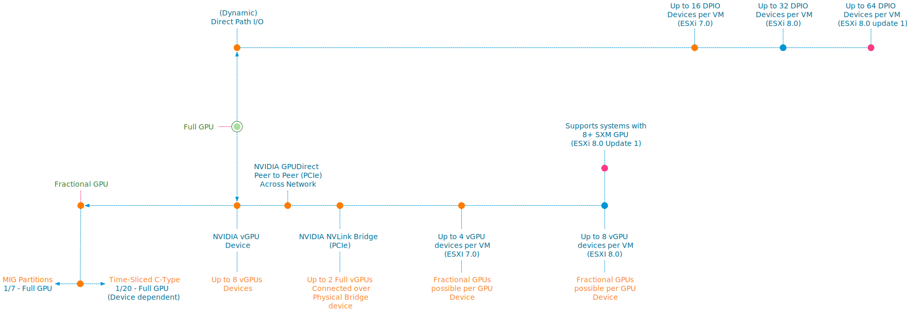

The number of machine learning workloads is increasing in on-prem data centers rapidly. It arrives in different ways, either within the application itself or data science teams build solutions that incorporate machine learning models to generate predictions or influence actions when needed. Another significant influx of ML workloads is the previously prototyped ML solutions in the cloud that are now moved into the on-prem environment, either for data gravity, governance, economics, or infrastructure (maintenance) control reasons. Techcrunch recently published an [interesting article](https://techcrunch.com/2023/03/20/the-cloud-backlash-has-begun-why-big-data-is-pulling-compute-back-on-premises/?guccounter=1&guce_referrer=aHR0cHM6Ly93d3cubGlua2VkaW4uY29tLw&guce_referrer_sig=AQAAAARYIdl7c9aeNK1m6YeiW8J7cv7HkI2_MFbY0vLNhQjiu0zG78yiOgCOBWhsr78lcg5ORKAg6jJZzytlTIW4Gg3EGMfQzUCwtabdoFNLd6RFmQ3xf8WbisqX-Lqs-z6kqhTjeKL6MuBf3D85Auy8IZec3sxddt2GUeMXMghr61zP) on this phenomenon.

But as an operator stuck between the data scientist, developer, and infra, you can be overwhelmed with the requirements that need to be met, the new software stack, and new terminology. You'll soon realize that a machine-learning model does not run in a vacuum. It's either integrated into an application or runs as a service. Training and running a model are just steps in applying machine learning to an organizational process. A software stack is required to develop the model, a software stack is required to train it, and a software stack is to integrate it into a service or application, and monitor its accuracy. Models aimed at human behavior tend to deteriorate over time. Our world changes, and the model need to adjust to that behavior. As a result, a continuous development cycle is introduced to retrain the model regularly.

It's essential to understand the data science teams' world to be successful as an operator. Building the hardware and software technology stack, together with a data science team, helps you to get early traction with other data science teams in the organization. As machine learning can be a shadow IT monster, it is vital to discover the needs of the data science teams. Build the infrastructure from the ground up, starting with the proper hardware ready to satisfy the requirements for training and inference jobs, and provide the right self-serving platform that allows data science teams to curate their own toolset that helps them achieve their goals.

To create the proper fundament, you need to understand the workload. However, most machine-learning content is geared toward data scientists. These articles primarily focus on solving an algorithmic challenge while using domain-specific terminology. I've written several articles about the training and inference workloads to overcome this gap.

[Part 1: focuses on the ML Model development lifecycle](https://frankdenneman.nl/2022/05/25/machine-learning-on-vmware-cloud-platform-part-1/)

[Part 2: Gives a brief overview of the pipeline structure](https://frankdenneman.nl/2022/06/08/machine-learning-on-vmware-cloud-platform-part-2/)

[Part 3: Zooms into Training versus Inference Data Flow and Access Patterns](https://frankdenneman.nl/2022/06/30/machine-learning-on-vmware-platform-part-3-training-versus-inference/)

[Part 4: Provides a deep dive into memory consumption by Neural Networks](https://frankdenneman.nl/2022/07/15/training-vs-inference-memory-consumption-by-neural-networks/)

[Part 5: Provides a deep dive into Numerical Precision](https://frankdenneman.nl/2022/07/26/training-vs-inference-numerical-precision/) 

[Part 6: Explores network compression technology in detail, such as pruning and sparsity.](https://frankdenneman.nl/2022/08/26/training-vs-inference-network-compression/)

[Parts 3 to 6](https://frankdenneman.nl/?s=training+versus+inference) offer detailed insights into the technical requirements of the neural networks during training jobs and the inference process. It helps to interpret GPU functionality and gauge the expected load of the platform.

To successfully accelerate the workload, I want to dive deeper into the available vSphere and Tanzu options in the upcoming series. It focuses on the available spectrum of machine learning accelerators the NVIDIA AI Enterprise suite offers. What hardware capabilities are available, and how do you configure the platform? Although this series focuses on GPUs, I want to note that CPUs are an excellent resource for light training and inference. And with the latest release of the Intel Sapphire Rapids CPU with its Advanced Matrix Extensions (AMX), the future of CPUs in the ML ecosystem looks bright. But I'll save that topic for another blog post (series).

Articles in this series:

- [vSphere ML Accelerator Spectrum Deep Dive Series](https://frankdenneman.nl/2023/05/03/vsphere-ml-accelerator-spectrum-deep-dive-series/)

- [vSphere ML Accelerator Spectrum Deep Dive – Fractional and Full GPUs](https://frankdenneman.nl/2023/05/10/vsphere-ml-accelerator-deep-dive-fractional-and-full-gpus/)

- [vSphere ML Accelerator Spectrum Deep Dive – Multi-GPU for Distributed Training](https://frankdenneman.nl/2023/05/12/vsphere-ml-accelerator-spectrum-deep-dive-for-distributed-training-multi-gpu/)

- [vSphere ML Accelerator Spectrum Deep Dive – GPU Device Differentiators](https://frankdenneman.nl/2023/05/16/vsphere-ml-accelerator-spectrum-deep-dive-gpu-device-differentiators/)

- [vSphere ML Accelerator Spectrum Deep Dive – NVIDIA AI Enterprise Suite](https://frankdenneman.nl/2023/05/23/vsphere-ml-accelerator-spectrum-deep-dive-nvidia-ai-enterprise-suite/)

- [vSphere ML Accelerator Spectrum Deep Dive – ESXi Host BIOS, VM, and vCenter Settings](https://frankdenneman.nl/2023/05/30/vsphere-ml-accelerator-spectrum-deep-dive-esxi-host-bios-vm-and-vcenter-settings/)

- [vSphere ML Accelerator Spectrum Deep Dive – Using Dynamic DirectPath IO (Passthrough) with VMs](https://frankdenneman.nl/2023/06/06/vsphere-ml-accelerator-spectrum-deep-dive-using-dynamic-directpath-io-passthrough-with-vms/)

- [vSphere ML Accelerator Spectrum Deep Dive – NVAIE Cloud License Service Setup](https://frankdenneman.nl/2023/07/05/vsphere-ml-accelerator-spectrum-deep-dive-nvaie-cloud-license-service-setup/)
