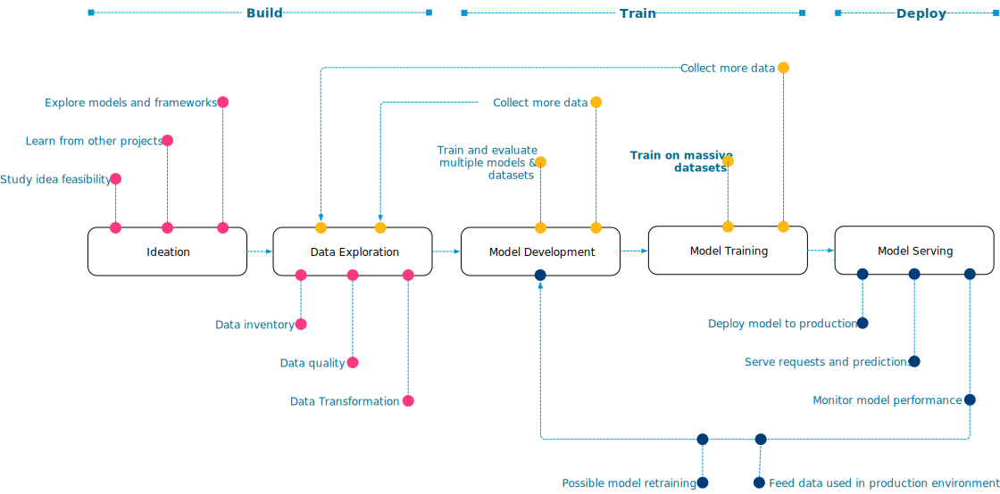
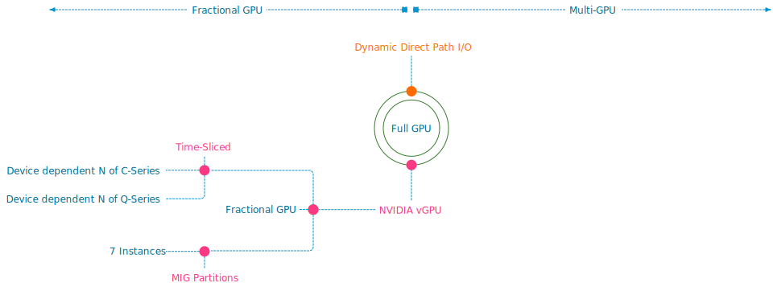
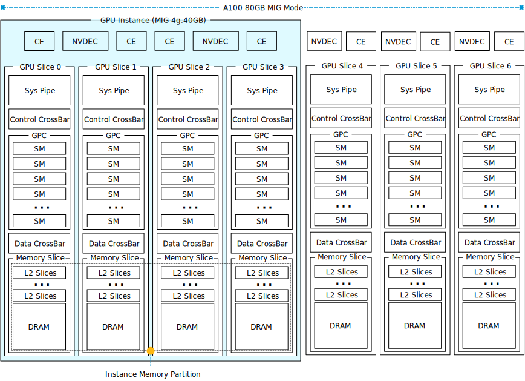

Many organizations are building a sovereign ML platform that aids their data scientist, software developers, and operator teams. Although plenty of great ML platform services are available, many practitioners have discovered that a one-size-fits-all platform doesn't suit their needs. There are plenty of reasons why an organization chooses to build its own ML platform; it can be as simple as control over maintenance windows, being able to curate their own toolchain, relying on a non-opinionated tech stack, or governance/regulations reasons. 

The first step is to determine the primary workload. Will this be only inference, training, or a mix of both? Getting some servers and a few GPU resources might sound like a good start, but understanding the workload in more detail allows you to get the right resources and create a relevant and valuable platform. 

If your organization plans to purchase ML-assisted products and services, the focus shifts towards deploying an "inference" workload. Inference workloads are production-ready machine models infused in services or applications that process unseen data and generate an action for the subsequent business process or a recommendation. These workloads require the appropriate hardware and orchestration services. Only a monitoring suite focusing on service availability could suffice if the models are vendor-proprietary. 

If your organization builds models, the ML platform should focus on two distinct disciplines: Model development and model deployment. A term often heard in this scenario is MLOPs, DevOPs for the Machine Learning ecosystem. The ML platform should provide an infrastructure and software platform that helps data scientists develop their models. Data Scientists are highly skilled in calculus, linear algebra, and statistics. They are typically not hardcore developers, nor are they infrastructure-tech savvy. The unicorns are the ones that know enough to help themselves with creating their own world and developing their model. This blog series and the [training vs. inference series](https://frankdenneman.nl/?s=training+versus+inference) intend to bring you closer to the data science team and help you understand some of the nuances of machine learning without going through a full-fledged linear algebra course. 

# ML Development Lifecycle

A machine learning model that is fully trained and deemed production ready must be deployed. It cannot run in thin air. It needs to be incorporated into a service or an application. A model is never a standalone feature; thus, developers are needed after the data scientist is done with this model version. And therefore, you need developers ready to incorporate the model into a software system, deploy it, and scale it to serve the inference requests. Software tools are needed to build, test, release, deploy, and monitor these ML-assisted services. The model development lifecycle or ML project work-flow is typically categorized into three broad areas:

1. Build process

3. Training process

5. Deployment process

In the build process, the data science team determines what framework and algorithm to use during the concept phase. They explore what data is available, where the data lives, and how they can access it. They study the idea's feasibility by running some tests using small data sets.

In the training process, the data science team limited the possible algorithms and trained the models to learn from the data. Based on the training process results, the model is tuned and retrained. The training process can be cyclical and include various steps from the built process, such as finding more data, as the current dataset might not be satisfactory. 

The deployment process is where the model is moved into production. It's now available to the user and processes unseen data. Models facing human behavior tend to deteriorate over time at a much faster rate than models built to augment or support closed-mechanical looped systems. Simply as human nature changes over time and thus the model will slowly detect fewer patterns, it's trained to recognize. For these models, a recurring training loop must be created where production data is captured, prepared as new datasets to train the model and replace the old model with a freshly trained one. 

To successfully integrate, deploy, operate, monitor and retrain and re-release, you must create a platform that allows DevOps and Machine Learning teams to develop together. This is where MLOPs platforms add tremendous value to the parties involved. Mix this with an ML-savvy VI-admin and operator team, and this group can help the organization achieve its goals. This series covers the features and functionalities of the ML accelerators available in vSphere and how to set them up in vSphere and Tanzu Kubernetes Grid Services. Articles about MLOps platforms are planned for later this year. 

Understanding the three ML processes better is essential for the infrastructure focussed operator, as this translates to hardware requirements. Let's look at what's supported by vSphere first and then map these features and functionalities to the ML development lifecycle processes. vSphere and Tanzu Kubernetes Grid Services can assign ML accelerators (GPUs) to workloads. Three configurations are possible: a full GPU, a fractional GPU, and multiple GPUs assigned to a single VM. Fractional GPU functionality allows vSphere to split up a full GPU and assign smaller GPUs to multiple VMs. With Multi-GPU, the ESXi hosts can assign multiple GPUs to VMs. NVIDIA GPUDirect RDMA technology significantly improves communication between GPU-enabled VMs on different ESXi hosts. Throughout this series, we will continuously dive deeper into each technology.

## Full GPUs

vSphere allows assigning a full GPU to a VM. Either by using VMware's (Dynamic) Direct Path I/O technology (Passthru) or NVIDIA's vGPU technology. This full GPU is exclusively available for this workload. No sharing between VMs is possible. (Dynamic) Direct Path I/O provides VMs access to the physical functions of the GPU device with the help of Memory Mapped I/O. One of the articles in this series covers this topic in detail. The difference between Dynamic Direct Path I/O and Direct Path I/O is the method of assigning the device to the VM. Direct Path I/O assigns the GPU Device to the VM based on the PCIe address of the device. In contrast, Dynamic Direct Path I/O uses a key-value method using either custom or vendor-device generated labels. This allows vSphere to decouple the static relationship between VM and device and provides more flexibility for initial placement processes used by DRS and HA. By default, vSphere 8 uses Dynamic Direct Path I/O with vendor-generated labels.

NVIDIA vGPU builds on Dynamic Direct Path I/O and installs the NVIDIA vGPU Manager in the kernel. It allows for creating fractional GPUs and makes vMotion possible. And this is where the choice between both technologies becomes interesting when assigning a full GPU.

|  | **Direct Path I/O** | **Dynamic Direct Path I/O** | **NVIDIA vGPU** |
| --- | --- | --- | --- |
| Failover HA | No | Yes | Yes |
| Initial Placement DRS | No | Yes | Yes |
| Load Balance DRS | No | No | No |
| vMotion | No | No | Yes |
| Host Maintenance Mode | Shutdown VM | Cold Migration | Manual vMotion |
| Snapshot | No | No | Yes |
| Suspend and Resume | No | No | Yes |
| Fractional GPUs | No | No | Yes |
| TKGS VMClass Support | No | Yes | Yes |

In both scenarios, dynamic direct path I/O and vGPU allow assigning a dedicated GPU to a VM, which can help the data science team achieve their goals in the build, train or deploy process. But often, more elegant, more efficient technologies are available that create a suitable environment for the workloads but increase overall resource availability within the platform, ready for the data science teams to utilize.

## Fractional GPUs

Fractional GPUs enable multiple VMs to have simultaneous, direct access to a single physical GPU by partitioning a physical GPU device into multiple smaller GPU instances. This functionality is provided by NVIDIA Virtual GPU technology and is available on data center class GPUs and a subset of NVIDIA RTX GPU devices. A vGPU device supports multiple vGPU types that are optimized for specific workloads. The vGPU types applicable for machine learning workloads are C-series and Q-series. 

The C-series is optimized for compute-intensive workloads. These are pretty much the classical ML workloads. The Q-series type can do the same, but the key difference is that the C-type can only decode video streams, and the Q-type can also (hardware) encode video streams. This difference is essential to know if the data science team plans to deploy a vision AI model. If the model only generates an action or a warning after object\\anomaly detection in a video stream, the video is not encoded, and thus only decoders are necessary. A C-series vGPU type is sufficient. However, if the video stream is encoded after being processed by the model because human intervention or a second opinion is required, then a Q-type series is required.

NVIDIA vGPU offers two modes, the default Time-sliced mode or the vGPU Multi-Instance GPU (MIG) mode, available from the Ampere architecture onwards. A vGPU is assigned to a VM by selecting a vGPU type (C or Q-series) and a frame buffer size (GPU memory). When using MIG mode, the vGPU type also provides the ability to specify compute elements. The GPU device runs either in time-sliced mode or in MIG mode. There is no possibility of creating a heterogenous vGPU environment where MIG and time-sliced profiles share the same physical GPU device. You can deploy multiple GPU devices in one ESXi host and configure one GPU in time-sliced mode and one in MIG mode. 

The number of C and Q-series vGPU types are GPU type dependent. For example, an A100 40GB allows ten time-sliced C-Series with a 4GB frame buffer per instance type. In comparison, the A100 80GB allows twenty instances of the same configuration. The A30 and A100 only have video encoders onboard, not video decoders. There is no Q-series vGPU Type available for the A100. A time-sliced vGPU type provides exclusive use of the configured frame buffer until the VM is destroyed. Interesting to note is that the frame buffer cannot be over-allocated. Thus a 40 GB GPU will only accept five VMs with an 8GB frame buffer. Attempting to power on the sixth VM with an 8GB frame buffer fails. Even if all the VMs are idle.

The GPU best effort scheduler coordinates access to the GPU device, allowing active workloads to utilize all the compute architecture, such as decoders (NVDEC), encoders (NVENC), and copy engines (CE) on the GPU device. If multiple VM access the GPU, the scheduler schedules these workloads serially. A time slice determines the time window a vGPU can generate workload on the GPU before it is preempted and access is granted to another VM. It is based on the maximum number of vGPUs allowed for the vGPU type on that physical GPU. This is based on the total GPU memory and the assigned frame buffer per vGPU type. If the maximum number of vGPUs on that device is less than or equal to eight, then the time slice is 2 ms. The time-slice window is reduced to 1 ms if it's more than eight. The scheduler round-robins the active workload. Thus if only one workload is active, the scheduler constantly assigns a time slice. The moment another workload activates, the scheduler adjusts. Most ML applications appreciate a more prolonged time slice as they require maximum throughput. NVIDIA allows for [policy and time-slice adjustments](https://docs.nvidia.com/grid/15.0/grid-vgpu-user-guide/index.html#changing-vgpu-scheduling-policy). The following articles in this blog series cover the elements in the diagram (GPU Processing Clusters, Streaming Multiprocessors, MMIO space, BAR, etc.).

## Time-shared Fractional GPU use case - The Build Process

If we return to the ML model development cycle, a time-sliced vGPU during the build process might be an excellent fit for most teams. They study the idea's feasibility by running some tests using small data sets. As a result, the team will run and test some code, with lots of idle time in between. The typical run time is seconds to minutes for these code tests.

In many cases, the CPU provides enough power to run these tests. Still, if the data science team wants to research the effect and behavior of the combination of the ML model and the GPU architecture, a vGPU be beneficial. 

When looking at the situation from a platform operator perspective, this moment is where pooling and abstraction, two core tenets of VMware's DNA, come into play. We can consolidate the efforts of different data science teams in a centralized environment and offer fractional GPUs. Sometimes a full GPU makes sense in these situations. But that is up to the discretion of the teams and organization. Fractional GPU provides tremendous benefits when used in the proper context.

# Multi-Instance GPU vGPU 

Multi-instance GPU functionality is also great for the build process. It can create up to seven separate GPU partitions called instances by isolating the frame buffer, GPU cores, compute engines, and decoders. Predictable and consistent performance is the outcome of this strict isolation, and therefore MIG vGPUs are typically deployed to accelerate inference production workloads. 

| **Profile Name** | **Memory** | **SMs** | **Decoders** | **Copy Engines** | **Instances** |
| --- | --- | --- | --- | --- | --- |
| MIG 1g.10gb | 1/8 | 1/7 |    0 NVDECs/0 JPEG/0 OFA | 1 | 7 |
| MIG 1g.10gb+m | 1/8 | 1/7 | 1 NVDEC/1 JPEG/1 OFA | 1 | 1 |
| MIG 1g.20gb | 1/8 | 1/7 | 1 NVDECs/0 JPEG/0 OFA | 1 | 4 |
| MIG 2g.20gb | 2/8 | 2/7 | 1 NVDECs/0 JPEG/0 OFA | 2 | 3 |
| MIG 3g.40gb | 4/8 | 3/7 | 2 NVDECs/0 JPEG/0 OFA | 3 | 2 |
| MIG 4g.40gb | 4/8 | 4/7 | 2 NVDECs/0 JPEG/0 OFA | 4 | 1 |
| MIG 7g.80gb | Full | Full | 5 NVDECs/1 JPEG/1 OFA | 7 | 1 |

MIG provides a composable configuration of GPU resources. Although the profiles are pre-configured and cannot be changed, users can isolate the correct elements for the job. An A100 80GB GPU device contains seven GPU processing clusters (GPCs). Each GPC contains 16 streaming Multiprocessors (SMs). An SM contains L0 and L1 cache and four tensor cores that perform the needed FP16/FP32 mixed-precision fused multiply-add (FMA) operations and acceleration for all the data types (FP16, BF16, TF32, FP64, INT8, INT4). An A100 GPU contains ten memory controllers that offer access to five HBM2 stacks, which will be logically grouped into eight GPU memory slices. There are seven NVDECs (Video decoders), 7 NVJPGs (Image decoders), and one [Optical Flow Accelerator](https://developer.nvidia.com/docs/drive/drive-os/archives/6.0.4/linux/sdk/common/topics/nvmedia_understand/OpticalFlowAccelerator.html) (OFA). In total, there are seven copy engines. They are responsible for transferring data in and out of the GPU. 

For example, the MIG vGPU profile MIG4g.40gb constructs a GPU instance from four "GPU slices." A GPU slice includes a "Sys Pipe," a GPC, an L2 cache slice, and a GPU memory slice. A GPU memory slice includes the L2 cache slices and the associated frame buffer. These are dedicated memory resources. An application consuming a GPU instance does not consume an L2 slice from another GPU instance. This partitioning ensures fault isolation, error containment, recovery, and QoS.

The sys pipe communicates with the CPU and is responsible for GPC task scheduling. MIG creates a separate and isolated data path through the entire system, from the crossbar parts all the way to the memory controllers and its DRAM address buses. It's expected that if more GPU memory is assigned to a GPU instance, more data is copied between the ESXi host system and GPU memory. Thus, dedicated copy engines are assigned to the GPU instance. Additionally, a dedicated number of decoders are assigned per GPU instance. Returning to the MIG Instance example, the MIG vGPU profile MIG4g.40gb isolates four of the eight available memory slices, four GPCs, four copy engines, and two decoders.

MIG provides a defined Quality of Service (QoS) and enhanced security due to isolation. Consistent performance throughout the vSphere cluster as consistent performance is maintained even if the VM is migrated to another ESXi host in the cluster. The vGPU is never impacted if another workload is saturating their GPU instance. In contrast, time-sliced provides a more dynamic environment, sometimes leading to better performance if the other GPU tenants are idling. However, there is no prioritization mechanism to indicate if a particular workload requires priority over others. Performance can be inconsistent. It depends on the activity of other tenants. Although MIG instances are hard-coded swimming lanes, and no other workload will dip in this pool of resources and internal pathways, the workload cannot go beyond its own swimming lane if the other MIG slices are idle. So there is no clear winner. Peak performance depends on the other GPU tenants, but if consistent performance is required, look no further than MIG technology. The Ampere and Hopper architecture provides MIG technology in specific data center GPUs. One of the following articles in the series depicts the availability of all the features in the supported vSphere and NVIDIA AI Enterprise (NVAIE) range.

## MIG vGPU Fractional GPU use case - The Deployment Process

If we return to the ML model development cycle, the deployment phase requires consistent performance. Of course, there is no problem in assigning Full GPUs to the workload, but not every inference workload needs that many resources. MIG can offer the right amount of high-performing yet efficient technology. The [training vs. inference series](https://frankdenneman.nl/?s=training+versus+inference) dove deep into both workload characteristics. For the typical inference workload, we notice a pattern of lightweight, latency-sensitive streaming data with lower computational needs than the training workload. 

|  | **Training** | **Inference** |
| --- | --- | --- |
| Data Flow | Batch data | Streaming data |
| Storage Characteristics | Throughput based | Latency-based, occasionally throughput |
| Batch Size | Many recommendations between 1-32   Smaller batch size reduces the memory footprint   Smaller batch size increases algorithm performance (generalization)    Larger batch size increases compute efficiency   Larger batch size increases parallelization (Multi-gpu) | 1-4 |
| Data Access | Random Access on a large data set   Multiple batches are prefetches to keep the pipeline full   Fast storage medium recommended   Fast storage and network recommended for distributed training | Streaming data |
| Memory Footprint | Large memory footprint   Forward propagation pass – backpropagation pass – model parameters   Long time duration of the memory footprint of activations (large bulk of memory footprint) | Smaller memory footprint   Forward propagation pass – model parameters   Activations are short-lived (Total memory footprint = est. 2 largest consecutive layers) |
| Numerical Precision | Higher Precision Required | Lower Precision Required |
| Data Type | FP32   BF16   Mixed Precision (FP16+FP32) | BF16   INT8   INT4 (Not seen Often) |

## Training Process

For training workloads, it's typically relatively straightforward present as many GPU resources to the training job as possible. The table shows that training is throughput based, requiring a large memory footprint, which often exceeds the memory capacity of a single GPU. 

Many data science teams explore distributed training methods to speed up training jobs to reduce training time duration. With today's large models and large datasets, it's common to see training jobs of 150+ hours (a whole week of continuous training). For these workloads, vSphere supports the latest and greatest technology available. VSphere 7 and 8 support assigning multiple physical GPUs to a single VM. NVIDIA technology provides high-speed interconnect technology to speed up inter-GPU communication during training jobs. [Part 2](https://frankdenneman.nl/2023/05/12/vsphere-ml-accelerator-spectrum-deep-dive-for-distributed-training-multi-gpu/) dives into the ML accelerator spectrum for distributed training - Multi-GPU technology. 

Other articles in this series:

- [vSphere ML Accelerator Spectrum Deep Dive Series](https://frankdenneman.nl/2023/05/03/vsphere-ml-accelerator-spectrum-deep-dive-series/)

- [vSphere ML Accelerator Spectrum Deep Dive – Fractional and Full GPUs](https://frankdenneman.nl/2023/05/10/vsphere-ml-accelerator-deep-dive-fractional-and-full-gpus/)

- [vSphere ML Accelerator Spectrum Deep Dive – Multi-GPU for Distributed Training](https://frankdenneman.nl/2023/05/12/vsphere-ml-accelerator-spectrum-deep-dive-for-distributed-training-multi-gpu/)

- [vSphere ML Accelerator Spectrum Deep Dive – GPU Device Differentiators](https://frankdenneman.nl/2023/05/16/vsphere-ml-accelerator-spectrum-deep-dive-gpu-device-differentiators/)

- [vSphere ML Accelerator Spectrum Deep Dive – NVIDIA AI Enterprise Suite](https://frankdenneman.nl/2023/05/23/vsphere-ml-accelerator-spectrum-deep-dive-nvidia-ai-enterprise-suite/)

- [vSphere ML Accelerator Spectrum Deep Dive – ESXi Host BIOS, VM, and vCenter Settings](https://frankdenneman.nl/2023/05/30/vsphere-ml-accelerator-spectrum-deep-dive-esxi-host-bios-vm-and-vcenter-settings/)

- [vSphere ML Accelerator Spectrum Deep Dive – Using Dynamic DirectPath IO (Passthrough) with VMs](https://frankdenneman.nl/2023/06/06/vsphere-ml-accelerator-spectrum-deep-dive-using-dynamic-directpath-io-passthrough-with-vms/)

- [vSphere ML Accelerator Spectrum Deep Dive – NVAIE Cloud License Service Setup](https://frankdenneman.nl/2023/07/05/vsphere-ml-accelerator-spectrum-deep-dive-nvaie-cloud-license-service-setup/)
