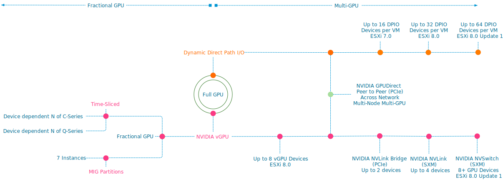
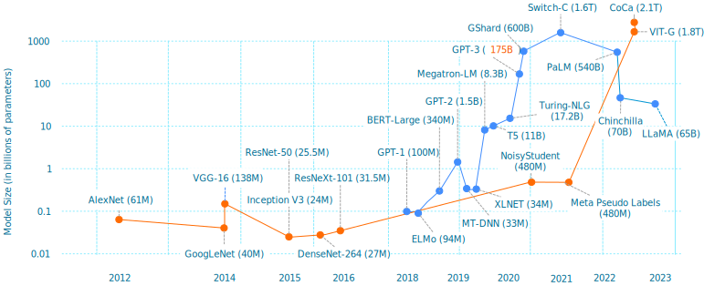
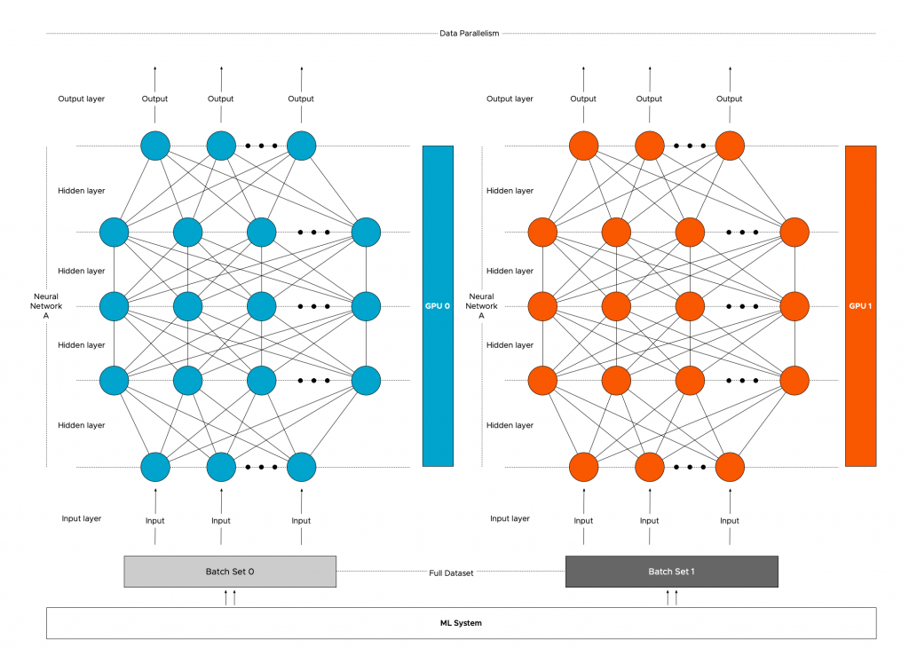
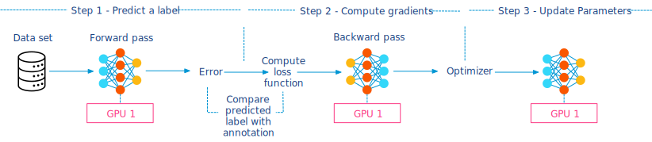
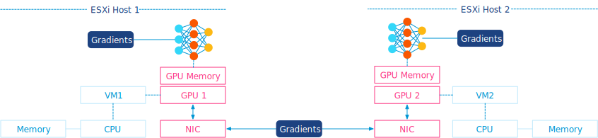
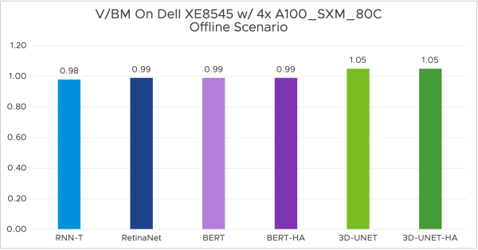

The first part of the series reviewed the capabilities of the vSphere platform to assign fractional and full GPU to workloads. This part zooms in on the multi-GPU capabilities of the platform. Let's review the full spectrum of ML accelerators that vSphere offers today. 

In vSphere 8.0 Update 1, an ESXi host can assign up to 64 (dynamic) direct path I/O (passthru) full GPU devices to a single VM. In the case of NVIDIA vGPU technology, vSphere supports up to 8 full vGPU devices per ESXi host. All of these GPU devices can be assigned to a single VM. 

Multi-GPU technology allows the data science team to present as many GPU resources to the training job as possible. When do you need multi-GPU? Let's look at the user requirements. A data science team's goal is to create a neural network model that provides the highest level of accuracy (Performance in data science terminology). There are multiple ways to achieve accuracy. One is by processing vast amounts of data. You can push monstrous amounts of data through a (smaller) model, and at one point, the model reaches a certain level of acceptable accuracy (convergence). Another method is to increase the sample (data) efficiency. Do more with less, but if you want to use data more efficiently, you must increase the model size. A larger model can use more complex functions to "describe" the data. In either scenario, you need to increase the compute resources if you push extreme amounts of data or push your datasets through larger models. In essence, Machine Learning scale is a triangle of three factors: data size, model size, and the available compute size. 

The most popular method of training a neural network is stochastic gradient descent (SGD). Oversimplified, it feeds examples into the network and starts with an initial guess. It trains the network by adjusting its "guesses" gradually. The neural network measures how "wrong" or "right" the guess is and, based on this, calculates a loss. Based on this loss, it adjusts the network's parameters (weights and biases) and feeds a new set of examples. It repeats this cycle and refines the network until it's accurate enough.

During the training cycle, the neural network processes all the examples in a dataset. This cycle is called an **epoch**. Typically a complete dataset cannot fit onto the GPU memory. Therefore data scientist splits up the entire dataset into smaller batch sets. The number of training examples in a single batch defines a batch size.

An **iteration** is a complete pass of a batch, sometimes called a step. The number of iterations is how many batches are needed to complete a single epoch. For example, the Imagenet-1K dataset contains 1.28 million images. Well-recommended batch size is 32 images. It will take 1.280.000 / 32 = 40.000 iterations to complete a single epoch of the dataset. Now how fast an epoch completes depends on multiple factors. One crucial factor is data loading, transferring the data from storage into the ESXi host and GPU memory. The other significant latency factor is the communication of gradients to update the parameters after each iteration in distributed training. A training run typically invokes multiple epochs. 

The model size, typically expressed in the parameter count, is interesting, especially today, where everyone is captivated by Large Language Models (LLMs). Where the AI/ML story mainly revolved around vision AI until a year ago, many organizations are keen to start with LLMs. The chart below shows the growth of parameters of image classification (orange line) and Natural Language Processing (blue line) in state-of-the-art (SOTA) neural network architectures. Although GPT-4 has been released, Microsoft hasn't announced its parameter count yet, although many indicate that it's six times larger than GPT-3. (1 Trillion parameters).

Why is parameter count so important? We have to look more closely at the training sequence. The article "[Training vs. Inference - memory consumption by neural network](https://frankdenneman.nl/2022/07/15/training-vs-inference-memory-consumption-by-neural-networks/)" explores the memory consumption of parameters, network architecture, and data sets in detail. In short, a GPU has a finite amount of memory capacity. If I loaded a GPT-3 model with 175 Billion parameters using single-precision [floating-point](https://frankdenneman.nl/2022/07/26/training-vs-inference-numerical-precision/) (FP32), it would need 700 GB of memory. And that's just a static model consumption before pushing a single dataset example through. Quoting the paper "[Efficient Large-Scale Language Model Training on GPU Clusters Using Megatron-LM](https://arxiv.org/pdf/2104.04473.pdf)," "Training GPT-3 with 175 billion parameters would require approximately 288 years with a single V100 NVIDIA GPU." With huge models, data scientists need to distribute the model across multiple GPUs. 

Data scientists sometimes prefer pushing more data through a smaller model than using a large model and dealing with model distribution. Regardless of model size, data distribution is the most common method of distributed learning. With this method, the entire model is replicated across multiple GPUs, and the dataset is split up and distributed across the pool of GPUs. Native data distribution modules are available in [PyTorch](https://pytorch.org/tutorials/intermediate/ddp_tutorial.html) and [TensorFlow](https://www.tensorflow.org/guide/distributed_training). 

With data distribution, the model is intact, but the dataset is split up. But to train the model coherently, the models must receive the result of each GPU's training iteration. The models need to be trained in a certain lockstep; thus, the communication rate between the GPUs impacts the overall progression of the training job. The faster the GPUs communicate their learnings, the faster the model converges. It is why NVIDIA invests heavily in NVLINK and NVSwitch technology, and vSphere supports these technologies. Let's look at the training process to understand the benefit of fast interconnects. 

To make sense of the behavior of distributed training, we need to look at how deep learning training on a single GPU works first. The data set is processed in batches to train a neural network, and we pass the data across the neural network. This process is called the forward pass, and it computes the error. The error indicates how wrong the neural network is as it compares the predicted label to the annotation (the gold-truth label). The next step for the ML framework is to run the backpropagation (backward pass), which runs the error back through the network, producing gradients for each parameter in the neural network. These gradients tell us how to learn from our errors, and the [optimizer](https://www.analyticsvidhya.com/blog/2021/10/a-comprehensive-guide-on-deep-learning-optimizers/) updates the parameters. And the neural network is ready for the next batch. It's up to the data scientist to find the correct batch size to utilize as much GPU memory as possible while leaving enough room for the activations of the backward pass. For more detail: [Training vs. Inference - memory consumption by a neural network](https://frankdenneman.nl/2022/07/15/training-vs-inference-memory-consumption-by-neural-networks/)."

Now let's look at the most popular form of distributed training, distributed data parallelism with Multi-GPU architecture utilizing a ring-AllReduce to share gradients optimally. In this scenario, the framework copies a replica of the neural network model to each GPU and splits the dataset across the multiple GPUs. Each GPU runs the forward and backward pass to compute the gradient for the processed batch subset. Now comes the interesting part, the gradients have to be shared across the GPUs as if all the GPUs have processed the complete batch. The most commonly used operation that shares the gradients between GPUs is called Gradient Ring-AllReduce. PyTorch [DistributedDataParallel](https://pytorch.org/docs/stable/generated/torch.nn.parallel.DistributedDataParallel.html), [Horovod](https://horovod.readthedocs.io/en/stable/summary_include.html?highlight=gradient%20allreduce#concepts), and [TensorFlow Mirrored Strategy](https://www.tensorflow.org/api_docs/python/tf/distribute/MirroredStrategy) use this operation to compute the mean of the local gradients on all the GPUs and then update the model with the averaged global gradient. The optimizer updates the models' parameters and processes the next batch of the data set.

The memory consumption of a model gradient mostly depends on the model architecture. It's challenging to provide an average size of a typical model gradient. Still, a reasonable indication of a gradient size can be inferred from the number of parameters. The more parameters per model to update, the more data must be sent. Bandwidth between GPUs impacts how long it will take to send all this data. As models get larger and larger, so does the gradient size required to update the parameters during training. Larger batches generate larger gradients to update the model parameters in each training step. Let's use the Bert-Large model as an example. It has 340 million parameters. Gradients use FP32 regardless of the forward pass numerical precision (BFLOAT16, FP16, FP32). As a result, each parameter requires 4 bytes (32 bits) of memory. The total memory required to store the gradient for all the parameters would be 320 million x 4 bytes = 1.36GB of data per iteration per GPU. The Ring-All Reduce method manages that each GPU receives an identical copy of the averaged gradients at the end of the backward pass to ensure that the updates to model parameters are identical. 

With Ring AllReduce, the GPUs are arranged in a logical ring, and each GPU receives data from its left neighbor and sends data to its right neighbor. The beauty of this ring structure is that each (N) GPU will send and receive values N-1. There are two steps involved, the scatter-reduce and the all-gather step. It would lengthen this article significantly if I covered the finer details of these steps, but what matters is that data is roughly transferred twice. So using the Ring AllReduce, each GPU training the Bert-Large must send and receive about 2.72GB of data per iteration. Using 25Gb Ethernet (providing 3.125 GB/s) 2.72GB \*8 = 21.72Gb /25 Gbps = 870 milliseconds per iteration. This delay ramps up quite quickly if you run 30.000 iterations per epoch, and it takes 100 epochs to get the model accurate (convergence). That's 725 hours or 30 days of latency. [Bringing HPC Techniques to Deep Learning](https://andrew.gibiansky.com/blog/machine-learning/baidu-allreduce/) and [Distributed data-parallel training using Pytorch on AWS](https://www.telesens.co/2019/04/04/distributed-data-parallel-training-using-pytorch-on-aws/) are fantastic resources if you want to understand Ring AllReduce better.

Different configurations allow ML frameworks to consume multiple GPU devices. Multiple GPUs from a single ESXi host can be assigned to a VM for a single node-multi GPU setup. In a multi-node setup, multiple VMs are active and can consume GPUs from their local ESXi host. With different setups, there are different bandwidth bottlenecks. 

Coming back to the data-load process, it makes sense to review the bandwidth within the ESXi host to recognize the added benefit of specialized GPU interconnects. Internal host bandwidth ranges from high bandwidth areas to low bandwidth areas. High bandwidth areas are located on the GPU itself, where GPU cores can access High Bandwidth Memory (HBM) between 2 TB/s or 3.35 TB/s, depending on the [form factor of the H100](https://www.nvidia.com/en-us/data-center/h100/). The GPU device connects to the system with a PCIe Gen 5 interconnect, offering 126 GB/s of bandwidth, allowing the GPU to access ESXi host memory to read the data set or write the results of the training job. And suppose the distributed training method uses a multi-node configuration. In that case, the PCIe bus connects to the NIC, and data, such as gradients, are sent across (hopefully) a 25 Gbps connection equal to 3 GB/sec.

More complex models require more floating point operations per second (FLOPS) per byte of data. Thus, the combination of GPU processor speed and data loading times introduces an upper bound of the algorithm's performance. Infra-tech savvy data scientists compute the limitations of the GPU hardware in terms of algorithm performance and visually plot this in a [Roofline Model](https://dando18.github.io/posts/2020/04/02/roofline-model). 

Helping the data scientist understand which GPU models vSphere supports and how they can be connected to enable distributed training helps you build a successful ML platform. Selecting the correct setup and utilizing dedicated interconnects isolates this noisy neighbor, allowing the ESXi host to run complementary workloads. Let's look at the different optimized interconnect technologies supported by vSphere for Multi-GPU distributed training. 

## NVIDIA GPUDirect RDMA

NVIDIA GPUDirect RDMA (Remote Direct Memory Access) improves the performance of Multi-Node distributed training and is a technology that optimizes the complete path between GPUs in separate ESXi hosts. It provides a direct peer-to-peer data path between the GPU memory directly to and from the Mellanox NIC. It decreases GPU-to-GPU communication latency speeding up the workload. It alleviates the overall overhead of this workload on the ESXi Host as it avoids unnecessary system memory copies (and CPU overhead) by copying data to and from GPU memory. With GPUDirect RDMA, distributed training can now write gradients directly to each GPU input buffer without having the systems copy the gradients to the system memory first before moving it onto the sending NIC or into the receiving GPU. The HPC OCTO team ran [performance tests](https://blogs.vmware.com/apps/2018/06/scaling-hpc-and-ml-with-gpudirect-rdma-on-vsphere-6-7-part-2-of-2.html) comparing the data path between no-GPUDirect RDMA vs. GPUDirect RDMA setups. This test used a GPU as a passthrough device. GPUDirect RDMA supports both passthrough GPU and vGPU in 7.0U2.

One essential requirement is that the Mellanox NIC and the NVIDIA GPU must share the same PCIe switch or PCIe root complex. A modern CPU, like the Intel Scalable Xeon, has multiple PCIe controllers. Each PCIe controller is considered to be a PCIe root complex. Each PCIe root complex provides a dedicated connection to the connected PCIe devices, allowing for simultaneous data transfers between multiple devices. However, finding documentation about the PCIe slot to specific PCIe root complex mapping is challenging with most systems. Most server documentation only exposes [PCIe slots to CPU mapping](https://www.dell.com/support/manuals/en-us/poweredge-r740/per740_ism_pub/expansion-card-installation-guidelines?guid=guid-2356b79e-a3e7-4d3f-b97f-9d85dfaea34d&lang=en-us). Forget about discovering which PCIe slot is connected to which of one of the four PCIe root complexes a dual-socket Intel Scalable Xeon 4th generation server has. An easy way out is to place both PCIe cards on a PCIe riser card. When a PCIe device is installed on a PCIe riser card, it generally connects to the PCIe root complex associated with the slot where the riser card is installed. Please note CPUs are not optimized to work as PCIe switches, and if you are designing your server platform to incorporate RDMA fabrics, I recommend looking for server hardware that includes PCIe switches. Most servers dedicated to machine learning or HPC workload have PCIe switchboards, such as the Dell [DS8440](https://www.dell.com/support/manuals/en-us/dell-dss-8440/dss8440_ism_pub/installing-the-pcie-switch-board?guid=guid-cbc67c29-9df1-48cc-aa92-1abe6038ddcf&lang=en-us).

vSphere 7.0 u2 supports [Address Translation Service](https://www.intel.com/content/www/us/en/docs/programmable/683686/20-4/address-translation-services-ats.html) (ATS) with Intel CPUs. ATS, part of the PCIe standard, allows efficient addressing by bypassing the IO Memory Management Unit of the CPU. If a PCIe device needs to access ESXi host memory, it must request the CPU translate the device memory address into a physical one. With ATS, the PCIe device, with the help of a translation agent, can directly perform the translation itself, bypassing the CPU and improving performance.

Device groups allow the VI-admin or operator to easily assign a combination of NVIDIA GPU and Mellanox NICs to a VM. vSphere performs a topology detection and exposes which devices share the same PCIe root complex or PCIe Switch in the UI. The device group in the screenshots shows two groups. The group listed at the top is a collection of two A100s connected via NVLink. The device group listed at the bottom combines an A100 GPU, using a 40c vGPU profile (a complete assignment of the card) and a Mellanox ConnectX-6 NIC connected to the same Switch. I must admit that the automatically generated device group names can be a bit more polished.

Communication backends such as [NCCL](https://docs.nvidia.com/deeplearning/nccl/user-guide/docs/env.html?highlight=gpudirect%20rdma), [MPI](https://www.open-mpi.org/faq/?category=runcuda) (v1.7.4), and [Horovod](https://horovod.readthedocs.io/en/stable/gpus_include.html) support GPUDirect RDMA.

## NVIDIA NVLink Bridge

NVLink is designed to offer a low-latency, high-speed interconnect between two adjacent GPU devices to improve GPU-to-GPU communications. NVLINK Bridge is a hardware interconnection plug that connects two PCIe GPUs. The photo shows two PCIe A100 GPUs connected by three NVlink bridges. Using an NVLink setup requires some planning ahead, as the server hardware should be able to allocate two double PCI slot cards directly above each other. It rules out almost every 2U server configuration.

For all peer-to-peer access, data flows across the NVLink connections. The beauty is that the [CUDA API enables peer access](https://docs.nvidia.com/cuda/cuda-runtime-api/group__CUDART__PEER.html#group__CUDART__PEER_1g2b0adabf90db37e5cfddc92cbb2589f3) if both GPUs can access each other over NVLINK, even if they don't belong to the same PCIe domain managed by a single PCI root complex. The P100 introduces the first generation of NVlink, and the H100 has the latest generation incorporated in its design. Each generation increases its links per GPU and, subsequently, the total bandwidth between the GPUs.

| **NVLink Specifications** | **2nd Gen** | **3rd Gen** | **4th Gen** |
| --- | --- | --- | --- |
| Maximum Number of Links per GPU | 6 | 12 | 18 |
| NVLink bandwidth per GPU | 300 GB/s | 600 GB/s | 900 GB/s |
| Supported GPU Architectures | Volta GPUs | Ampere GPUs | Hopper GPUs |

The fourth generation offers up to 900 GB/s of bandwidth between GPUs, creating an interesting bandwidth landscape within the system. The PCIe connection is used when the dataset is loaded into GPU memory. In CUDA terminology, this is referred to as a host-to-device copy. Each GPU has its memory address space, so the data set flows to each GPU separately across its PCIe connection. The GPU initiates direct memory access for this process. When models need to synchronize, such as sharing or updating gradients, they use the NVLink connection. In addition to the bandwidth increase, latency is about 1/10th of the PCie connection ([1.3 ms vs. 13 ms](https://medium.com/gpgpu/multi-gpu-programming-6768eeb42e2c)). An upcoming article covers DMA and memory-mapped I/O extensively. 

But what about if you want to integrate four PCIe GPUs in a single ESXi host system? vSphere 7 and 8 support the number of GPUs but do not expect scalable linear performance when assigning all four GPUs to a single VM, as NVLink works per bridged card pair. Synchronization data of machine learning models between the pairs traverse across the PCIe bus, creating a congestion point. Going back to Ring-AllReduce, all the transfers happen synchronously. Thus the speed of the allreduce operation is limited by the connection with the lowest bandwidth between adjacent GPUs in the ring. For these configurations, it makes sense to look at [HGX systems](https://www.nvidia.com/content/dam/en-zz/Solutions/Data-Center/HGX/a100-80gb-hgx-a100-datasheet-us-nvidia-1485640-r6-web.pdf) with 4 GPUs connected to NVLink integrated into the motherboard and using SXM-type GPUs or 8-GPU systems with an integrated NVSwitch. 

## NVSwitch

vSphere 8.0 Update 1 supports up to 8 vGPU devices connected via an NVSwitch fabric. An NVSwitch connects multiple NVLinks providing an all-to-all communication and single memory fabric. NVSwitch fabrics are available in NVIDIA HGX-type systems and use GPUs with the SXM interface. The [Dell PowerEdge XE8545](https://www.dell.com/en-us/shop/povw/poweredge-xe8545) (AMD) (4 x A100), [XE9680](https://www.dell.com/en-us/shop/enterprise-products/new-xe9680-rack-server-intel/spd/poweredge-xe9680) (8 x A100\\H100) (Intel), and [HPE Apollo 6500 Gen10 Plus](https://buy.hpe.com/us/en/compute/apollo-systems/apollo-6500-system/apollo-6500-system/hpe-apollo-6500-gen10-plus-system/p/1013092236) (AMD) are such systems. If we open up an HGX machine, the first thing that sticks out is SXM from factor GPU. It moves away from the PCIe physical interface. The SXM socket handles power delivery, eliminating the need for external power cables, but more importantly, it results in a better (horizontal) mounting position, allowing for better cooling options. A H100 SXM5 also runs more cores ([132 streaming multi-processors (SMs)](https://developer.nvidia.com/blog/nvidia-hopper-architecture-in-depth/)) vs. H100 PCIe (113 SMs).

When the data arrives at the onboard GPU memory, after a host-to-device copy, communication remains between GPUs. All communication flows across the NVLinks and NVswitch fabrics, essentially keeping GPU-related traffic of the CPU interconnect (AMD Infinity fabric, Intel UPI ~40 GB/s theoretical bandwidth). 

With the help of vSphere device groups, the vi-admin or operator can configure the virtual machines with various vGPU configurations. They can be assigned in groups of 2, 4, and 8. Suppose a device group selects a subset of GPU devices of the HGX system. In that case, vSphere isolates these GPUs and disables the NVlink connections to the other GPUs, offering complete isolation between the device groups.

## No virtualization tax

One of the counterarguments I face when discussing these technologies with tech-savvy data scientists is the perception of overhead. Virtualization impacts performance. Why inject a virtualization layer if I can run it on bare metal? Purely focusing on performance, I can safely say this is a thing of the past. MLCommons (an open engineering consortium that aims to accelerate machine learning innovation and its impact on society) has published the MLPerf v3.0 results. The performance team ran MLPerf Inference v3.0 benchmarks on Dell XE8545 with 4x virtualized NVIDIA SXM A100-80GB and Dell R750xa with 2x virtualized NVIDIA H100-PCIE-80GB, both with only 16 vCPUs out of 128. The ESXi host runs the ML workload while providing ample room for other workloads.

For the full write-up and more results, please visit the [VROOM! Performance Blog](https://blogs.vmware.com/performance/2023/04/no-virtualization-tax-for-mlperf-inference-v3-0-using-nvidia-hopper-and-ampere-vgpus-and-nvidia-ai-software-with-vsphere-8-0-1.html).

What is interesting is that NVIDIA released a GPU designed to accelerate inference workloads for generative AI applications. The [H100 NVL for Large Language Model Deployment](https://www.servethehome.com/nvidia-h100-nvl-for-high-end-ai-inference-launched/) contains 188GB of memory and features a "transformer engine" that can deliver up to 12x faster inference performance for GPT-3 compared to the prior generation A100 at data center scale. It is interesting that NVIDIA now sells H100 directly connected with NVLinks as a single device. It promotes the NVLink as a first-class building block instead of an article that should be ordered alongside the devices. 

With that in mind, the number of available devices is incredibly high. Each with its unique selling points. The following article overviews all the available and supported GPU devices.

Other articles in this series:

- [vSphere ML Accelerator Spectrum Deep Dive Series](https://frankdenneman.nl/2023/05/03/vsphere-ml-accelerator-spectrum-deep-dive-series/)

- [vSphere ML Accelerator Spectrum Deep Dive – Fractional and Full GPUs](https://frankdenneman.nl/2023/05/10/vsphere-ml-accelerator-deep-dive-fractional-and-full-gpus/)

- [vSphere ML Accelerator Spectrum Deep Dive – Multi-GPU for Distributed Training](https://frankdenneman.nl/2023/05/12/vsphere-ml-accelerator-spectrum-deep-dive-for-distributed-training-multi-gpu/)

- [vSphere ML Accelerator Spectrum Deep Dive – GPU Device Differentiators](https://frankdenneman.nl/2023/05/16/vsphere-ml-accelerator-spectrum-deep-dive-gpu-device-differentiators/)

- [vSphere ML Accelerator Spectrum Deep Dive – NVIDIA AI Enterprise Suite](https://frankdenneman.nl/2023/05/23/vsphere-ml-accelerator-spectrum-deep-dive-nvidia-ai-enterprise-suite/)

- [vSphere ML Accelerator Spectrum Deep Dive – ESXi Host BIOS, VM, and vCenter Settings](https://frankdenneman.nl/2023/05/30/vsphere-ml-accelerator-spectrum-deep-dive-esxi-host-bios-vm-and-vcenter-settings/)

- [vSphere ML Accelerator Spectrum Deep Dive – Using Dynamic DirectPath IO (Passthrough) with VMs](https://frankdenneman.nl/2023/06/06/vsphere-ml-accelerator-spectrum-deep-dive-using-dynamic-directpath-io-passthrough-with-vms/)

- [vSphere ML Accelerator Spectrum Deep Dive – NVAIE Cloud License Service Setup](https://frankdenneman.nl/2023/07/05/vsphere-ml-accelerator-spectrum-deep-dive-nvaie-cloud-license-service-setup/)
