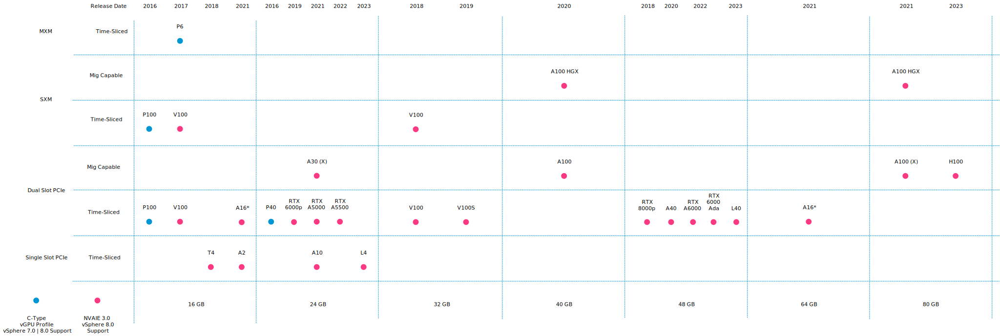
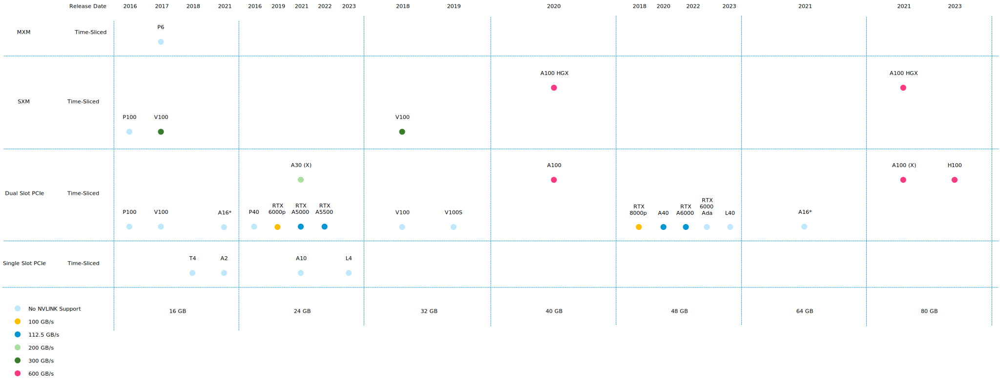
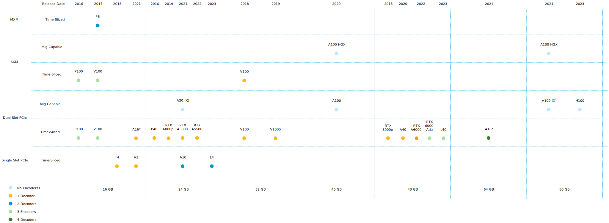
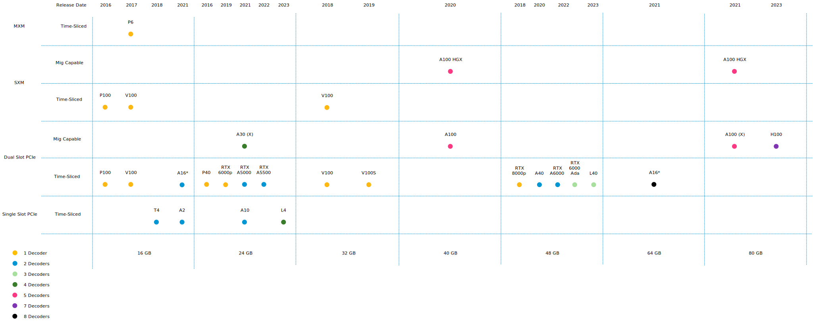
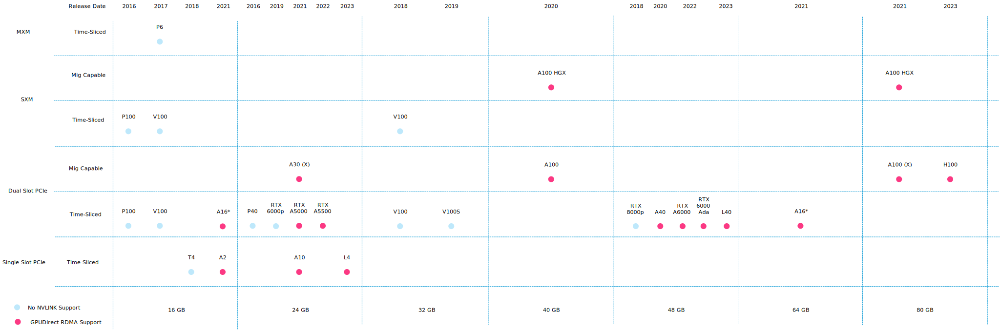

The two last parts reviewed the capabilities of the platform. vSphere can offer [fractional GPUs](https://frankdenneman.nl/2023/05/10/vsphere-ml-accelerator-deep-dive-fractional-and-full-gpus/) to [Multi-GPU](https://frankdenneman.nl/2023/05/12/vsphere-ml-accelerator-spectrum-deep-dive-for-distributed-training-multi-gpu/) setups, catering to the workload's needs in every stage of its development life cycle. Let's look at the features and functionality of each supported GPU device. Currently, the range of supported GPU devices is quite broad. In total, 29 GPU devices are supported, dating back from 2016 to the last release in 2023. A table at the end of the article includes links to each GPUs product brief and their datasheet. Although NVIDIA and VMware form a close partnership, the listed support of devices is not a complete match. This can lead to some interesting questions typically answered with; it should work. But as always, if you want bulletproof support, follow the guides to ensure more leisure time on weekends and nights.

## VMware HCL and NVAIE Support

The first overview shows the GPU device spectrum and if [NVAIE support](https://docs.nvidia.com/ai-enterprise/2.0/product-support-matrix/index.html)s them. The [VMware HCL](https://www.vmware.com/resources/compatibility/search.php) supports every device listed in this overview, but NVIDIA decided not to put some of the older devices through their NVAIE certification program. As this is a series about Machine Learning, the diagram shows the support of the device and a C-series vGPU type. The VMware compatibility guide has an AI/ML column, listed as Compute, for a specific certification program that tests these capabilities. If the driver offers a C-series type, the device can run GPU-assisted applications; therefore, I'm listing some older GPU devices that customers still use. With some other devices, VMware hasn't tested the compute capabilities, but NVIDIA has, and therefore there might be some discrepancies between the VMware HCL and NVAIE supportability matrix. For the newer models, the supportability matrix is aligned. Review the table and follow the GPU device HCL page link to view the supported NVIDIA driver version for your vSphere release.

The Y axis shows the device Interface type and possible slot consumption. This allows for easy analysis of whether a device is the "right fit" for edge locations. Due to space constraints, single-slot PCIe cards allow for denser or smaller configurations. Although every NVIDIA device supported by NVAIE can provide time-shared fractional GPUs, not all provide spatial MIG functionality. A subdivision is made on the Y-axis to show that distinction. The X-axis represents the GPU memory available per device. It allows for easier selection if you know the workload's technical requirements.

The Ampere A16 is the only device that is listed twice in these overviews. The A16 device uses a dual-slot PCIe interface to offer four distinct GPUs on a single PCB card. The card contains 64GB GPU memory, but vSphere shall report four devices offering 16G of GPU memory. I thought this was the best solution to avoid confusion or remarks that the A16 was omitted, as some architects like to calculate the overall available GPU memory capacity per PCIe slot.

## NVLink Support

If you plan to create a platform that supports [distributed training using multi-GPU technology](https://frankdenneman.nl/2023/05/12/vsphere-ml-accelerator-spectrum-deep-dive-for-distributed-training-multi-gpu/), this overview shows the available and supported NVLinks bandwidth capabilities. Not all GPU devices include NVLink support, and the ones with support can wildly differ. The MIG capability is omitted as MIG technology does not support NVLink.

## NVIDIA Encoder Support

The GPU decodes the video file before running it through an ML model. But it depends on the process following the outcome of the model prediction, whether to encode the video again and replay it to a display. With some models, the action required after, for example, an anomaly detection, is to generate a warning event. But if a human needs to look at the video for verification, a hardware encoder must be available on the GPU. The Q-series vGPU type is required to utilize the encoders. What may surprise most readers is that most high-end datacenter does not have encoders. This can affect the GPU selection process if you want to create isolated media streams at the edge using MIG technology. Other GPU devices might be a better choice or investigate the performance impact of CPU encoding.

## NVIDIA Decoder Support

Every GPU has at least one decoder, but many have more. With MIG, you can assign and isolate decoders to a specific workload. When a GPU is time-sliced, the active workload utilizes all GPU decoders available. Please note that the A16 list has eight decoders, but each distinct GPU on the A16 exposes two decoders to the workload.

## GPUDirect RDMA Support

GPUDirect RDMA is supported on all time-sliced and MIG-backed C-series vGPUs on GPU devices that support single root I/O virtualization (SR-IOV). Please note that Linux is the only supported Guest OS for GPUDirect technology. Unfortunately, MS Windows isn't supported.

## Power Consumption

When deploying at an edge location, power consumption can be a constraint. This table list the specified power consumption of each GPU device.

## Supported GPUs Overview

The table contains all the GPUs depicted in the diagrams above. Instead of repeating non-descriptive labels like webpage or PDFs, the table shows the GPU release date while linking to its product brief. The label for the datasheet indicates the amount of GPU memory, allowing for easy GPU selection if you want to compare specific GPU devices. Please note that VMware has not conducted C-series vGPU type tests on the device if the HCL Column indicates No. However, the NVIDIA driver does support the C-series vGPU type.

| Architecture | GPU Device | HCL/ML Support | NVAIE 3.0 Support | Product Brief | Datasheet |
| --- | --- | --- | --- | --- | --- |
| Pascal | Tesla P100 | [No](https://www.vmware.com/resources/compatibility/detail.php?deviceCategory=vsga&productid=44315&vcl=true) | No | [October 2016](https://resources.nvidia.com/en-us-virtualization-and-gpus/p100-product-brief#page=1) | [16GB](https://images.nvidia.com/content/tesla/pdf/nvidia-tesla-p100-PCIe-datasheet.pdf) |
| Pascal | Tesla P6 | [No](https://www.vmware.com/resources/compatibility/detail.php?deviceCategory=vsga&productid=44364&vcl=true) | No | [March 2017](https://images.nvidia.com/content/pdf/tesla/Tesla-P6-Product-Brief.pdf) | [16GB](https://images.nvidia.com/content/pdf/grid/data-sheet/nvidia-p6-datasheet.pdf) |
| Volta | Tesla V100 | [No](https://www.vmware.com/resources/compatibility/detail.php?deviceCategory=sptg&productid=45376&vcl=true) | Yes | [September 2017](https://images.nvidia.com/content/tesla/pdf/Tesla-V100-PCIe-Product-Brief.pdf) | [16GB](https://www.nvidia.com/content/dam/en-zz/Solutions/Data-Center/tesla-t4/t4-tensor-core-datasheet-951643.pdf) |
| Turing | T4 | [No](https://www.vmware.com/resources/compatibility/detail.php?deviceCategory=sptg&productid=47245&vcl=true) | Yes | [October 2018](https://www.nvidia.com/content/dam/en-zz/Solutions/Data-Center/tesla-t4/t4-tensor-core-product-brief.pdf) | [16GB](https://www.nvidia.com/content/dam/en-zz/Solutions/Data-Center/tesla-t4/t4-tensor-core-datasheet-951643.pdf) |
| Ampere | A2 | [Yes](https://www.vmware.com/resources/compatibility/detail.php?deviceCategory=sptg&productid=55418&vcl=true) | No | [November 2021](https://www.nvidia.com/content/dam/en-zz/solutions/data-center/a2/pdf/a2-product-brief.pdf) | [16GB](https://www.nvidia.com/content/dam/en-zz/solutions/data-center/a2/pdf/a2-datasheet.pdf) |
| Pascal | P40 | [No](https://www.vmware.com/resources/compatibility/detail.php?deviceCategory=sptg&productid=43792&vcl=true) | Yes | [November 2016](https://images.nvidia.com/content/pdf/tesla/Tesla-P40-Product-Brief.pdf) | [24GB](https://www.nvidia.com/content/dam/en-zz/Solutions/design-visualization/documents/nvidia-p40-datasheet.pdf) |
| Turing | RTX 6000 passive | [No](https://www.vmware.com/resources/compatibility/detail.php?deviceCategory=sptg&productid=48073&vcl=true) | Yes | [December 2019](https://www.nvidia.com/content/dam/en-zz/Solutions/design-visualization/quadro-product-literature/NVIDIA-Quadro-RTX-6000-PCIe-Server-Card-PB-FINAL-1219.pdf) | [24GB](https://www.pny.com/file%20library/company/support/product%20brochures/nvidia%20quadro/english/quadro-rtx-6000-passive-datasheet.pdf) |
| Ampere | RTX A5000 | [No](https://www.vmware.com/resources/compatibility/detail.php?deviceCategory=sptg&productid=53832&vcl=true) | Yes | April 2021 | [24GB](https://nvdam.widen.net/s/wrqrqt75vh/nvidia-rtx-a5000-datasheet) |
| Ampere | RTX A5500 | N/A | Yes | March 2022 | [24GB](https://www.nvidia.com/content/dam/en-zz/Solutions/gtcs22/design-visualization/quadro-product-literature/proviz-nvidia-rtx-a5500-datasheet-2130578-r3-us-web.pdf) |
| Ampere | A30 | [Yes](https://www.vmware.com/resources/compatibility/detail.php?deviceCategory=sptg&productid=53903&vcl=true) | Yes | [March 2021](https://www.nvidia.com/content/dam/en-zz/Solutions/data-center/products/a30-gpu/pdf/a30-product-brief.pdf) | [24GB](https://www.nvidia.com/content/dam/en-zz/Solutions/data-center/products/a30-gpu/pdf/a30-datasheet.pdf) |
| Ampere | A30X | [Yes](https://www.vmware.com/resources/compatibility/detail.php?deviceCategory=sptg&productid=55296&vcl=true) | Yes | [March 2021](https://www.nvidia.com/content/dam/en-zz/Solutions/data-center/products/a30-gpu/pdf/a30-product-brief.pdf) | [24GB](https://www.nvidia.com/content/dam/en-zz/Solutions/gtcf21/converged-accelerator/pdf/datasheet.pdf) |
| Ampere | A 10 | [Yes](https://www.vmware.com/resources/compatibility/detail.php?deviceCategory=sptg&productid=52881&vcl=true) | Yes | [March 2021](https://www.nvidia.com/content/dam/en-zz/Solutions/Data-Center/a10/pdf/A10-Product-Brief.pdf) | [24GB](https://www.nvidia.com/content/dam/en-zz/Solutions/Data-Center/a10/pdf/a10-datasheet.pdf) |
| Ada Lovelace | L4 | [Yes](https://www.vmware.com/resources/compatibility/detail.php?deviceCategory=sptg&productid=57465&vcl=true) | Yes | [March 2023](https://www.nvidia.com/content/dam/en-zz/Solutions/Data-Center/l4/PB-11316-001_v01.pdf) | [24GB](https://www.nvidia.com/en-us/data-center/l4/) |
| Volta | Tesla V100(S) | [No](https://www.vmware.com/resources/compatibility/detail.php?deviceCategory=sptg&productid=50553&vcl=true) | Yes | [March 2018](https://images.nvidia.com/content/tesla/pdf/Tesla-V100-PCIe-Product-Brief.pdf) | [32GB](https://images.nvidia.com/content/technologies/volta/pdf/volta-v100-datasheet-update-us-1165301-r5.pdf) |
| Ampere | A100 (HGX) | N/A | Yes | [September 2020](https://www.nvidia.com/content/dam/en-zz/Solutions/Data-Center/a100/pdf/A100-PCIE-Prduct-Brief.pdf) | [40GB](https://www.nvidia.com/content/dam/en-zz/Solutions/Data-Center/a100/pdf/nvidia-a100-datasheet-us-nvidia-1758950-r4-web.pdf) |
| Turing | RTX 8000 passive | [No](https://www.vmware.com/resources/compatibility/detail.php?deviceCategory=sptg&productid=48082&vcl=true) | Yes | [December 2019](https://www.nvidia.com/content/dam/en-zz/Solutions/design-visualization/quadro-product-literature/NVIDIA-Quadro-RTX-8000-PCIe-Server-Card-PB-FINAL-1219.pdf) | [48GB](https://www.pny.com/file%20library/company/support/product%20brochures/nvidia%20quadro/english/nvidia-quadro-rtx-8000-passive.pdf) |
| Ampere | A40 | [Yes](https://www.vmware.com/resources/compatibility/detail.php?deviceCategory=sptg&productid=52565&vcl=true) | Yes | [May 2020](https://www.nvidia.com/content/dam/en-zz/Solutions/Data-Center/a40/NVIDIA%20A40%20Product%20Brief.pdf) | [48GB](https://images.nvidia.com/content/Solutions/data-center/a40/nvidia-a40-datasheet.pdf) |
| Ampere | RTX A6000 | [No](https://www.vmware.com/resources/compatibility/detail.php?deviceCategory=sptg&productid=53833&vcl=true) | Yes | December 2022 | [48GB](https://www.nvidia.com/content/dam/en-zz/Solutions/design-visualization/quadro-product-literature/proviz-print-nvidia-rtx-a6000-datasheet-us-nvidia-1454980-r9-web%20\(1\).pdf) |
| Ada Lovelace | RTX 6000 Ada | N/A | Yes | December 2022 | [48GB](https://www.nvidia.com/content/dam/en-zz/Solutions/design-visualization/quadro-product-literature/proviz-print-nvidia-rtx-a6000-datasheet-us-nvidia-1454980-r9-web%20\(1\).pdf) |
| Ada Lovelace | L40 | [Yes](https://www.vmware.com/resources/compatibility/detail.php?deviceCategory=sptg&productid=57224&vcl=true) | Yes | [October 2020](https://www.nvidia.com/content/dam/en-zz/Solutions/Data-Center/datasheets/L-40/product-brief-L40.pdf) | [48GB](https://www.nvidia.com/content/dam/en-zz/Solutions/design-visualization/support-guide/NVIDIA-L40-Datasheet-January-2023.pdf) |
| Ampere | A 16 | [Yes](https://www.vmware.com/resources/compatibility/detail.php?deviceCategory=sptg&productid=54554&vcl=true) | Yes | [June 2021](https://images.nvidia.com/content/Solutions/data-center/vgpu-a16-product-brief.pdf) | [64GB](https://images.nvidia.com/content/Solutions/data-center/vgpu-a16-datasheet.pdf) |
| Ampere | A100 | [Yes](https://www.vmware.com/resources/compatibility/detail.php?deviceCategory=sptg&productid=57224&vcl=true) | Yes | [June 2021](https://www.nvidia.com/content/dam/en-zz/Solutions/Data-Center/a100/pdf/PB-10577-001_v02.pdf) | [80GB](https://www.nvidia.com/content/dam/en-zz/Solutions/Data-Center/a100/pdf/nvidia-a100-datasheet-us-nvidia-1758950-r4-web.pdf) |
| Ampere | A100X | [Ye](https://www.vmware.com/resources/compatibility/detail.php?deviceCategory=sptg&productid=55295&vcl=true)[s](https://www.vmware.com/resources/compatibility/detail.php?deviceCategory=sptg&productid=55295&vcl=true) | Yes | June 2021 | [80GB](https://www.nvidia.com/content/dam/en-zz/Solutions/gtcf21/converged-accelerator/pdf/datasheet.pdf) |
| Ampere | A100 HGX | N/A | Yes | November 2020 | [80GB](https://www.nvidia.com/content/dam/en-zz/Solutions/Data-Center/HGX/a100-80gb-hgx-a100-datasheet-us-nvidia-1485640-r6-web.pdf) |
| Ada Lovelace | H100 | [Yes](https://www.vmware.com/resources/compatibility/detail.php?deviceCategory=sptg&productid=56923&vcl=true) | Yes | [September 2022](https://www.nvidia.com/content/dam/en-zz/Solutions/gtcs22/data-center/h100/PB-11133-001_v01.pdf) | [80GB](https://resources.nvidia.com/en-us-tensor-core/nvidia-tensor-core-gpu-datasheet) |

Other articles in the vSphere ML Accelerator Spectrum Deep Dive

- [vSphere ML Accelerator Spectrum Deep Dive Series](https://frankdenneman.nl/2023/05/03/vsphere-ml-accelerator-spectrum-deep-dive-series/)

- [vSphere ML Accelerator Spectrum Deep Dive – Fractional and Full GPUs](https://frankdenneman.nl/2023/05/10/vsphere-ml-accelerator-deep-dive-fractional-and-full-gpus/)

- [vSphere ML Accelerator Spectrum Deep Dive – Multi-GPU for Distributed Training](https://frankdenneman.nl/2023/05/12/vsphere-ml-accelerator-spectrum-deep-dive-for-distributed-training-multi-gpu/)

- [vSphere ML Accelerator Spectrum Deep Dive – GPU Device Differentiators](https://frankdenneman.nl/2023/05/16/vsphere-ml-accelerator-spectrum-deep-dive-gpu-device-differentiators/)

- [vSphere ML Accelerator Spectrum Deep Dive – NVIDIA AI Enterprise Suite](https://frankdenneman.nl/2023/05/23/vsphere-ml-accelerator-spectrum-deep-dive-nvidia-ai-enterprise-suite/)

- [vSphere ML Accelerator Spectrum Deep Dive – ESXi Host BIOS, VM, and vCenter Settings](https://frankdenneman.nl/2023/05/30/vsphere-ml-accelerator-spectrum-deep-dive-esxi-host-bios-vm-and-vcenter-settings/)

- [vSphere ML Accelerator Spectrum Deep Dive – Using Dynamic DirectPath IO (Passthrough) with VMs](https://frankdenneman.nl/2023/06/06/vsphere-ml-accelerator-spectrum-deep-dive-using-dynamic-directpath-io-passthrough-with-vms/)

- [vSphere ML Accelerator Spectrum Deep Dive – NVAIE Cloud License Service Setup](https://frankdenneman.nl/2023/07/05/vsphere-ml-accelerator-spectrum-deep-dive-nvaie-cloud-license-service-setup/)
