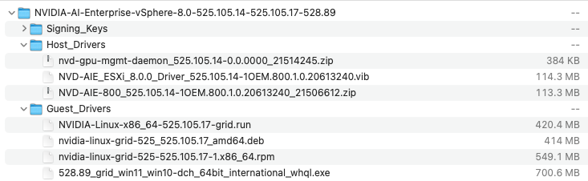
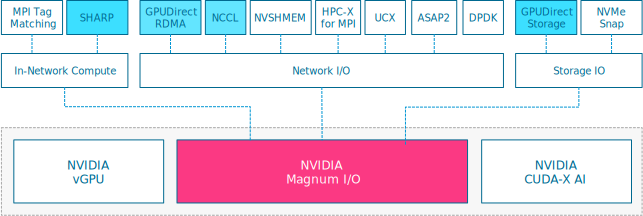
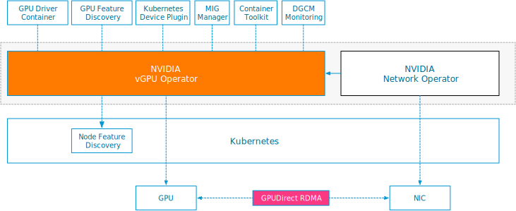

vSphere allows assigning GPU devices to a VM using VMware's (Dynamic) Direct Path I/O technology (Passthru) or NVIDIA's vGPU technology. The NVIDIA vGPU technology is a core part of the NVIDIA AI Enterprise suite ([NVAIE](https://www.nvidia.com/en-us/data-center/products/ai-enterprise/)). NVAIE is more than just the vGPU driver. It's a complete technology stack that allows data scientists to run an end-to-end workflow on certified accelerated infrastructure. Let's look at what NVAIE offers and how it works under the cover.

The operators, VI admins, and architects facilitate the technology stack while the data science team and developers consume it. Most elements can be consumed via self-service. However, there is one place in the technology stack, NVIDIA Magnum IO, where the expertise of both roles (facilitators and consumers) come together, and their joint effort produces an efficient and optimized distributed training solution.

# Accelerated Infrastructure

As mentioned before, NVAIE is more than just the vGPU driver. It offers an engineered solution that provides an end-to-end solution in a building block fashion. It allows for a repeatable certified infrastructure deployable at the edge or in your on-prem data center. Server vendors like HPE and Dell offer accelerated servers with various GPU devices. NVIDIA qualifies and certifies specific enterprise-class servers to ensure the server can accelerate the application properly. There are three types of validation:

| **Validation Type** | **Description** |
| --- | --- |
| Qualified Servers | A server that has been qualified for a particular NVIDIA GPU has undergone thermal, mechanical, power, and signal integrity qualification to ensure that the GPU is fully functional in that server design. Servers in qualified configurations are supported for production use. |
| NGC-Ready Servers | NGC-Ready servers consist of NVIDIA GPUs installed in qualified enterprise-class servers that have passed extensive tests that validate their ability to deliver high performance for NGC containers. |
| NVIDIA-Certified Systems | NVIDIA-Certified Systems consist of NVIDIA GPUs and networking installed in qualified enterprise-class servers that have passed a set of certification tests that validate the best system configurations for a wide range of workloads and for manageability, scalability, and security.  |

NVIDIA has expanded the NVIDIA-Certified Systems program beyond servers designed for the data center, including GPU-powered workstations, high-density VDI systems, and Edge devices. During the certification process, NVIDIA completes a series of functional and performance tests on systems for their intended use case. With edge systems, NVIDIA runs the following tests:

- Single and multi-GPU Deep Learning training performance using TensorFlow and PyTorch

- High volume, low latency inference using NVIDIA TensorRT and TRITON

- GPU-Accelerated Data Analytics & Machine Learning using RAPIDS

- Application development using the NVIDIA CUDA Toolkit and the NVIDIA HPC SDK

Certified systems for the data center are tested both as single nodes and in a 2-node configuration. NVIDIA executes the following tests:

- Multi-Node Deep Learning training performance

- High bandwidth, low latency networking, and accelerated packet processing

- System-level security and hardware-based key management

The [NVIDIA Qualified Server Catalog](https://www.nvidia.com/en-in/data-center/data-center-gpus/tesla-qualified-servers-catalog/) provides an easy overview of all the server models and their specific configuration and NVIDIA validation types. It offers the ability to export the table in a PDF and Excel format at the bottom of the page. Still, I like the available filter system to drill down to the exact specification that suits your workload needs. The [GPU device differentiators article](https://frankdenneman.nl/2023/05/16/vsphere-ml-accelerator-spectrum-deep-dive-gpu-device-differentiators/) can help you select the GPUs that fit your workloads and deploy location.

The only distinction the qualified server catalog doesn't appear to make is whether the system is classified as a data center or an edge system and thus receives a different functional and performance test pattern. The [NVIDIA-Certified Systems](https://docs.nvidia.com/ngc/ngc-deploy-on-premises/nvidia-certified-systems/index.html#nvidia-certified-systems-list) web page lists the recent data center server and edge servers. A [PDF](https://docs.nvidia.com/ngc/ngc-deploy-on-premises/pdf/nvidia-certified-systems.pdf) is also available for download.

Existing active servers in the data center can be expanded. Ensure your server vendor lists your selected server type as a GPU-ready node. And don't forget to order the power cables along with the GPU device. 

# Enterprise Platform

Multiple variations of vSphere implementations support NVAIE. The data science team often needs virtual machines to run particular platforms, like [Ray](https://www.ray.io/), or just native docker images without any need for orchestration. However, if container orchestration is needed, the operation team can opt for VMware Tanzu Kubernetes Grid Services (TKGS) or Red Hat Open Shift Container Platform (OCP). TKGs offer vSphere integrated namespaces and VMclasses, to further abstract, pool, and isolate accelerated infrastructure, while providing self-service provisioning functionality to the data science team. Additionally, the VM service allows data scientists to deploy VMs in their assigned namespace while using a Kubectl API framework. It allows the data science team to engage with the platform using its native user interface. VCF workload domains allow organizations to further pool and abstract accelerated infrastructure at the SDDC level. If your organization has standardized on Red Hat OpenShift, vSphere is more than happy to run that as well. NVIDIA supports NVAIE with Red Hat OCP on vSphere and provides all the vGPU functionality. Ensure you download the correct vGPU operator.

# Infrastructure Optimization

## vGPU Driver 

The GPU device requires a driver to interact with the rest of the system. If (Dynamic) Direct Path I/O (passthru) is used, the driver is installed inside the guest operating system. For this configuration, NVIDIA releases a guest OS driver. No NVIDIA driver is required at the vSphere VMkernel layer. 

When using NVAIE, you need a vGPU software license, and the drivers used by the NVAIE suite are available at the [NVIDIA enterprise software download portal](https://nvid.nvidia.com/dashboard/#/dashboard). This source is only available to registered enterprise customers. The NVIDIA Application Hub portal offers all the software packages available. What is important to note, and the cause of many troubleshooting hours, is that NVIDIA provides two different kinds of vSphere Installation Bundles (VIBs). 

The "Complete vGPU Package for vSphere 8.0 including supported guest drivers" contains the regular graphics host VIB. You should **NOT** download this package if you want to run GPU-accelerated applications.

We are interested in the "NVIDIA AI Enterprise 3.1 Software Package for VMware vSphere 8.0" package. This package contains both the NVD-AIE Host VIB and the compatible guest os driver.

The easiest and failsafe method of downloading the correct package is to select the NVAIE option in the Product Family. You can finetune the results by only selecting the vSphere platform version you are running in your environment.

What's in the package? The extracted AIE zip file screenshot shows that a vGPU Software release contains the Host VIB, the NVIDIA Windows driver, and the NVIDIA Linux driver. NVIDIA uses the term NVIDIA Virtual GPU Manager, what we like to call the ESXi host VIB. There are some compatibility requirements between the host and guest driver, hence the reason to package them together. The best experience is to keep both drivers in lockstep when updating the ESXi host with a new vGPU driver release. But I can imagine that it's simply not doable for some workloads, and the operating team would prefer to delay the outage required for the guest OS upgrade until later. Luckily, NVIDIA has relaxed this requirement and now supports host and guest drivers from major release branches (15. x) and previous branches. Suppose the combination is used where the guest VM drivers are from the previous branches. In that case, the combination supports **only** the features, hardware, and software (including guest OSes) supported on both releases. According to the [vGPU software documentation](https://docs.nvidia.com/grid/latest/grid-vgpu-release-notes-vmware-vsphere/index.html#vgpu-manager-guest-vm-compatibilty-requirements), the host driver 15.0 through 15.2 is compatible with the guest drivers of the 14.x release. A future article in this series shows how to correctly configure a VM in passthrough mode or with a vGPU profile. 

## NVIDIA Magnum IO

The name Magnum IO is derived from multi-GPU, multi-node input/output. NVIDIA likes to explain Magnum IO as a collection of technologies related to data at rest, data on the move, and data at work for the IO subsystem of the data center. It divides into four categories: Network IO, In-network compute, Storage IO, and IO management. I won't cover IO management as they focus on bare-metal implementations. All these acceleration technologies focus on optimizing distributed training. The data science team deploys most of these components in their preferred runtime (VM, container). However, it's necessary to understand the infrastructure topology the data science team wants to leverage technologies like GPUDirect RDMA, NCCL, SHARP, and GPUDirect Storage. Typically this requires the involvement of the virtual infrastructure team. The [previous parts](https://frankdenneman.nl/2023/05/03/vsphere-ml-accelerator-spectrum-deep-dive-series/) in this series help the infrastructure team to have a basic understanding of distributed training. 

### In-Network Compute

| **Technology** | **Description** |
| --- | --- |
| **MPI Tag Matching** | [MPI Tag Matching](https://enterprise-support.nvidia.com/s/article/understanding-mpi-tag-matching-and-rendezvous-offloads--connectx-5-x) reduces MPI communication time on NVIDIA Mellanox Infiniband adapters. |
| **SHARP** | Scalable Hierarchical Aggregation and Reduction Protocol ([SHARP](https://docs.nvidia.com/networking/display/sharpv270)) offloads collective communication operations from the CPU to the network and eliminates the need to send data multiple times between nodes.  |

SHARP support was added to NCCL to offload all-reduce collective operations into the network fabric. Additionally, SHARP accelerators are present in NVSwitch v3. Instead of distributing the data to each GPU and having the GPUs perform the calculations, they send their data to SHARP accelerators inside the [NVSwitch](https://frankdenneman.nl/2023/05/12/vsphere-ml-accelerator-spectrum-deep-dive-for-distributed-training-multi-gpu/). The accelerators then perform the calculations and then send the results back. This results in 2_N_+2 operations, or approximately halving the number of read/write operations needed to perform the all-reduce calculation.

### Network IO

The Network IO stack contains IO acceleration technologies that bypass the kernel and CPU to reduce overhead and enable and optimizes direct data transfers between GPUs and the NVLink, Infiniband, RDMA-based, or Ethernet-connected network device. The components included in the Network IO stack are:

| **Technology** | **Description** |
| --- | --- |
| **GPUDirect RDMA** | [GPUDirect RDMA](https://docs.nvidia.com/cuda/gpudirect-rdma/index.html) enables a direct path for data exchange between the GPU and a NIC. It allows for direct communication between NVIDIA GPUs in different ESXi hosts.  |
| **NCCL** | NVIDIA Collective Communications Library ([NCCL](https://docs.nvidia.com/deeplearning/nccl/user-guide/docs/index.html)) is a library that contains inter-GPU communication primitives optimizing distributed training on [multi-GPU multi-node systems](https://frankdenneman.nl/2023/05/12/vsphere-ml-accelerator-spectrum-deep-dive-for-distributed-training-multi-gpu/). |
| **NVSHMEM** | NVIDIA Symmetrical Hierarchical Memory ([NVSHMEM](https://developer.nvidia.com/nvshmem)) creates a global address space for data that spans the memory of multiple GPUs. NVSHMEM-enabled CUDA uses asynchronous, GPU-initiated data transfers, thereby reducing critical-path latencies and eliminating synchronization overheads between the CPU and the GPU while scaling. |
| **HPC-X for MPI** | NVIDIA [HPC-X for MPI](https://enterprise-support.nvidia.com/s/article/what-is-hpc-x-x) offloads collective communication from Message Passing Interface (MPI) onto NVIDIA Quantum InfiniBand networking hardware. |
| **UCX** | Unified Communication X ([UCX](https://openucx.org/)) is an open-source communication framework that provides GPU-accelerated point-to-point communications, supporting NVLink, PCIe, Ethernet, or Infiniband connections between GPUs. |
| **ASAP2** | NVIDIA Accelerated Switch and Packet Processing ([ASAP2](https://www.nvidia.com/en-us/search/?page=1&q=asap2&sort=relevance)) technology allows SmartNICs and data processing units (DPUs) to offload and accelerate software-defined network operations. |
| **DPDK** | The Data Plane Deployment Kit ([DPDK](https://core.dpdk.org/doc/)) contains the poll mode driver (PMD) for ConnectX Ethernet adapters, NVIDIA Bluefield-2 SmartNICs (DPUs). Kernel bypass optimizations allow the system to reach 200 GbE throughput on a single NIC port. |

The article "[vSphere ML Accelerator Spectrum Deep Dive for Distributed Training – Multi-GPU](https://frankdenneman.nl/2023/05/12/vsphere-ml-accelerator-spectrum-deep-dive-for-distributed-training-multi-gpu/)" has more info about GPUDirect RDMA, NCCL, and distributed training.

### Storage IO

The Storage IO technologies aim to improve performance in the critical path of data access from local or remote storage devices. Like network IO technologies, improvements are obtained by bypassing the host's computing resources. In the case of Storage IO, this means CPU and system memory. 

| **Technology** | **Description** |
| --- | --- |
| **GPUDirect Storage** | [GPUDirect Storage](https://docs.nvidia.com/gpudirect-storage/o-direct-guide/index.html) enables a direct data path for direct memory access (DMA) transfers between GPU memory and storage, avoiding ESXi host system CPU and memory involvement. (Local NVMe storage or Remote RDMA storage). |
| **NVMe SNAP** | [NVMe SNAP](https://nvidianews.nvidia.com/news/mellanox-introduces-breakthrough-nvme-snapTM-technology-to-simplify-composable-storage#:~:text=NVMe%20SNAP%20enables%20faster%20adoption,oF%20technology%20for%20any%20application.) (Software-defined, Network Accelerated Processing) allows Bluefield-2 SmartNICs (DPUs) to present networked flash storage as local NVMe storage. (Not currently supported by vSphere). |

## NVIDIA CUDA-X AI

NVIDIA [CUDA-X](https://developer.nvidia.com/gpu-accelerated-libraries) is a CUDA (Compute Unified Device Architecture) platform extension. It includes specialized libraries for domains such as image and video, deep learning, math, and computational lithography. It also contains a collection of partner libraries for various application areas. CUDA-X "feeds" other technology stacks, such as Magnum IO. For example, NCCL and NVSHMEM are developed and maintained by NVIDIA as part of the CUDA-X library. Besides the math libraries, CUDA-X allows for deep learning training and inference. These are: 

| **Technology** | **Description** |
| --- | --- |
| **cuDNN** | CUDA Deep Neural Network library ([cuDNN](https://developer.nvidia.com/cudnn)) is a GPU-accelerated library of neural network primitives, such as convolutional layers, pool operations, and forward and backward propagation. |
| **TensorRT** | Tensor RunTime ([TensorRT](https://developer.nvidia.com/tensorrt)) is an inference optimization library and SDK for deep learning inference. It provides optimization techniques that minimize model memory footprint and improve inference speeds. |
| **Riva** | [Riva](https://developer.nvidia.com/blog/introducing-riva-a-gpu-accelerated-sdk-for-developing-speech-ai-applications/) is a GPU-accelerated SDK for developing real-time speech-ai applications, such as automatic speech recognition (ASR) and text-to-speech (TTS). The ASR pipeline converts raw audio to text, and the TTS pipeline converts text to audio.  |
| **Deepstream SDK** | [DeepStream SDK](https://developer.nvidia.com/deepstream-sdk) provides plugins, APIs, and tools to develop and deploy real-time vision AI applications and services incorporating object detection, image processing, and instance segmentation AI models. |
| **DALI** | The Data Loading Library ([DALI](https://developer.nvidia.com/dali)) accelerates input data preprocessing for deep learning applications. It allows the GPU to accelerate images, videos, and speech decoding and augmenting.  |

# NVIDIA Operators

NVIDIA uses the GPU and Network operator to automate the drivers, container runtimes, and relevant libraries configuration for GPU and network devices on Kubernetes nodes. The Network Operator automates the management of all the NVIDIA software components needed to provision fast networking, such as RDMA and GPUDirect. The Network operator works together with the GPU operator to enable GPU-Direct RDMA.

The GPU operator is open-source and packaged as a helm chart. The GPU operator automates the management of all software components needed to provision GPU. The components are:

| **Technology** | **Description** |
| --- | --- |
| **GPU Driver Container** | The GPU driver container provisions the driver using a container, allowing portability and reproducibility within any environment. A container runtime favors the driver containers over the host drivers. |
| **GPU Feature Discovery** | The [GPU Feature Discovery](https://gitlab.com/nvidia/kubernetes/gpu-feature-discovery) component automatically generates labels for the GPUs available on a worker node. It leverages the [Node Feature Discover](https://github.com/kubernetes-sigs/node-feature-discovery) inside the Kubernetes layer to perform this labeling. It's automatically enabled in TKGS. During OCP installations, you need to install the NFD Operator. |
| **Kubernetes Device Plugin** | The [Kubernetes Device plugin Daemonset](https://github.com/NVIDIA/k8s-device-plugin) automatically exposes the number of GPUs on each node of the Kubernetes cluster, keeps track of the GPU health, and allows running GPU-enabled containers in the Kubernetes cluster.  |
| **MIG Manager** | The [MIG Manager](https://docs.nvidia.com/datacenter/cloud-native/gpu-operator/gpu-operator-mig.html) controller is available on worker nodes that contain MIG-capable GPUs (Ampere, Hopper) |
| **NVIDIA Container ToolKit** | The [NVIDIA Container ToolKit](https://gitlab.com/nvidia/container-toolkit/container-toolkit) allows users to build and run GPU-accelerated containers. The toolkit includes a container runtime library and utilities to automatically configure containers to leverage NVIDIA GPUs. |
| **DCGM Monitoring** | The [Data Center GPU Manager](https://developer.nvidia.com/dcgm) toolset manages and monitors GPUs within the Kubernetes cluster. |

The GPU Operator components deploy within a Kubernetes Guest Cluster via a helm chart. On vSphere, this can be a [Red Hat OpenShift Container Platform](https://docs.nvidia.com/datacenter/cloud-native/gpu-operator/openshift/introduction.html) Cluster or a [Tanzu Kubernetes Grid Service Kubernetes](https://docs.nvidia.com/datacenter/cloud-native/gpu-operator/install-gpu-operator-nvaie.html#install-gpu-operator-nvaie) guest cluster. A specific vGPU operator is available for each platform. The correct helm repo for TKGS is [https://helm.ngc.nvidia.com/nvaie](https://helm.ngc.nvidia.com/nvaie), and the helm repo for OCP is [https://helm.ngc.nvidia.com/nvidia](https://helm.ngc.nvidia.com/nvidia).

# Data Science Development and Deployment Tools

The NVIDIA GPU Cloud ([NGC](https://www.nvidia.com/en-us/gpu-cloud/)) provides AI and data science tools and framework container images to the NVAIE suite. TensorRT is always depicted in this suite by NVIDIA. Since it's already mentioned and included in the CUDA-X-AI section, I left it out to avoid redundancies within the stack overview.

| **Technology** | **Description** |
| --- | --- |
| **RAPIDS** | The Rapid Acceleration of Data Science ([RAPIDS](https://developer.nvidia.com/rapids)) framework provides and accelerates end-to-end data science and analytics pipelines. The core component of Rapids is the [cuDF](https://developer.nvidia.com/blog/accelerated-data-analytics-speed-up-data-exploration-with-rapids-cudf/) library, which provides a GPU-accelerated DataFrame data structure similar to [Pandas](https://pandas.pydata.org/), a popular data manipulation library in Python. |
| **TAO Toolkit** | The Train Adapt Optimize ([TAO](https://developer.nvidia.com/tao-toolkit)) Toolkit is a python based AI toolkit for taking purpose-built pre-trained AI models and customizing them with your data. |
| **Pytorch\\Tensorflow Container Image** | NGC has done the heavy lifting and provides a prebuilt container with all the necessary libraries validated for compatibility, a heavily underestimated task. It contains CUDA, [cuBLAS](https://developer.nvidia.com/cublas#:~:text=cuBLAS%20accelerates%20AI%20and%20HPC,mixed%20and%20low%20precision%20execution.), cuDNN, NCCL, RAPIDS, DALI, TensorRT, TensorFlow-TensorRT ([TF-TRT](https://docs.nvidia.com/deeplearning/frameworks/tf-trt-user-guide/index.html)), or [Torch-TensorRT](https://pytorch.org/TensorRT/). |
| **Triton Inference Server** | The [Triton platform](https://developer.nvidia.com/nvidia-triton-inference-server) enables deploying and scaling ML models for inference. The Triton Inference Server serves models from one or more model repositories. Compatible file paths are Google Cloud Storage, S3 compatible (local and Amazon), and Azure Storage. |

# NeMo Framework

The [NeMo](https://www.nvidia.com/en-us/ai-data-science/generative-ai/nemo-framework/) (Neural Modules) framework is an end-to-end GPU-accelerated framework for training and deploying transformer-based Large Language Models (LLMs) up to a trillion parameters. In the NeMo framework, you can train different variants of GPT, Bert, and T5 style models. A future article explores the NVIDIA NeMo offering.

Other articles in the vSphere ML Accelerator Spectrum Deep Dive

- [vSphere ML Accelerator Spectrum Deep Dive Series](https://frankdenneman.nl/2023/05/03/vsphere-ml-accelerator-spectrum-deep-dive-series/)

- [vSphere ML Accelerator Spectrum Deep Dive – Fractional and Full GPUs](https://frankdenneman.nl/2023/05/10/vsphere-ml-accelerator-deep-dive-fractional-and-full-gpus/)

- [vSphere ML Accelerator Spectrum Deep Dive – Multi-GPU for Distributed Training](https://frankdenneman.nl/2023/05/12/vsphere-ml-accelerator-spectrum-deep-dive-for-distributed-training-multi-gpu/)

- [vSphere ML Accelerator Spectrum Deep Dive – GPU Device Differentiators](https://frankdenneman.nl/2023/05/16/vsphere-ml-accelerator-spectrum-deep-dive-gpu-device-differentiators/)

- [vSphere ML Accelerator Spectrum Deep Dive – NVIDIA AI Enterprise Suite](https://frankdenneman.nl/2023/05/23/vsphere-ml-accelerator-spectrum-deep-dive-nvidia-ai-enterprise-suite/)

- [vSphere ML Accelerator Spectrum Deep Dive – ESXi Host BIOS, VM, and vCenter Settings](https://frankdenneman.nl/2023/05/30/vsphere-ml-accelerator-spectrum-deep-dive-esxi-host-bios-vm-and-vcenter-settings/)

- [vSphere ML Accelerator Spectrum Deep Dive – Using Dynamic DirectPath IO (Passthrough) with VMs](https://frankdenneman.nl/2023/06/06/vsphere-ml-accelerator-spectrum-deep-dive-using-dynamic-directpath-io-passthrough-with-vms/)

- [vSphere ML Accelerator Spectrum Deep Dive – NVAIE Cloud License Service Setup](https://frankdenneman.nl/2023/07/05/vsphere-ml-accelerator-spectrum-deep-dive-nvaie-cloud-license-service-setup/)
