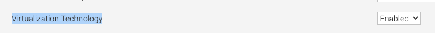
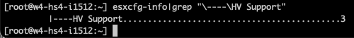
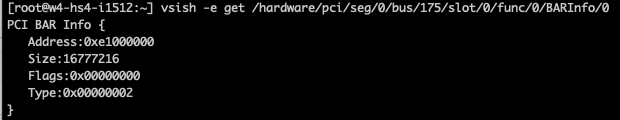
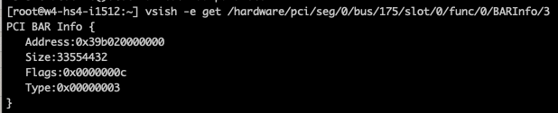
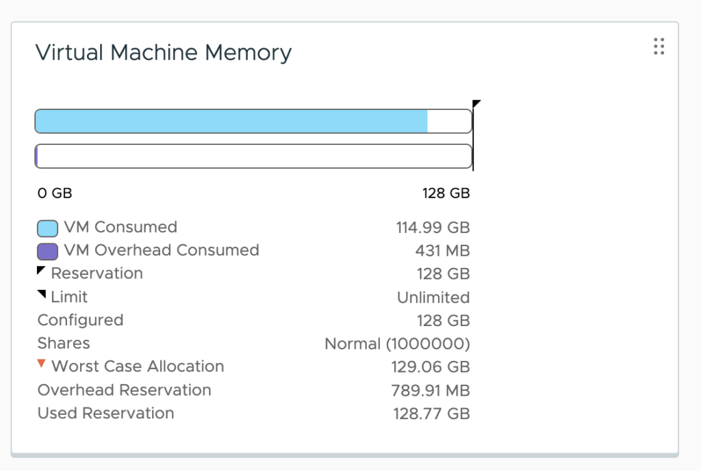

To deploy a virtual machine with a vGPU, whether a TKG worker node or a regular VM, you must enable some ESXi host-level and VM-level settings. All these settings are related to the isolation of GPU resources and memory-mapped I/O (MMIO) and the ability of the (v)CPU to engage with the GPU using native CPU instructions. MMIO provides the most consistent high performance possible. By default, vSphere assigns a MMIO region (an address range, not actual memory pages) of 32GB to each VM. However, modern GPUs are ever more demanding and introduce new technologies requiring the ESXi Host, VM, and GPU settings to be in sync. This article shows why you need to configure these settings, but let's start with an overview of the required settings.

| **Component** | **Requirements** | **vSphere Functionality** | **Notes** |
| --- | --- | --- | --- |
| Physical ESXi host | Must have Intel VT-d or AMD I/O VT enabled in the BIOS | Passthrough & vGPU |  |
|  | Must have SR-IOV enabled in the BIOS | vGPU MIG | Enable on Ampere & Hopper GPUs |
|  | Must have Memory Mapping Above 4G enabled in the BIOS | Passthrough & vGPU | Not applicable for NVIDIA T4 |
|  | Must use a supported 64-bits OS    | Passthrough & vGPU |  |
|  | Must be configured with EFI firmware Boot option | Passthrough & vGPU |  |
|  | Must reserve all guest memory | Passthrough & vGPU |  |
|  | pciPassthru.set.usebitMMIO = true   pciPassthru.64bitMMIOSizeGB = xxx \* | Passthrough & vGPU | Not applicable for  NVIDIA T4   Set automatically for TKG worker nodes |
|  | Must be configured with Advanced Setting _vgpu.hotmigrate.enabled_ | vGPU |  |

_\* Calculation follows in the article_

## Memory Management Basics

Before diving into each requirement's details, we should revisit some of the memory management basics. In an ESXi host, there are three layers of memory.

- The guest virtual memory (the memory available at the application level of a VM)

- The guest physical memory (the memory available to operating systems running on VMs)

- The host physical memory (the memory available to the ESXi hypervisor from the physical hosts)

The CPU uses the memory management unit (MMU) to translate virtual addresses to physical addresses. A GPU exposes device addresses to control and use the resources on the device. The IOMMU is used to translate IO virtual addresses to physical addresses. From the view of the application running inside the virtual machine, the ESXi hypervisor adds an extra level of address translation that maps the guest physical address to the host physical address. With direct assigning a device to a VM, the native driver running in the guest OS controls the GPU and only "sees" the guest's physical memory. If an application would directly perform a direct memory access (DMA) to the memory address of a GPU device, it would fail as the VMkernel remaps the virtual machine memory addresses. The Input-Output Memory Management Unit (IOMMU) handles this remapping, allowing native GPU device drivers to be used in a virtual machine by the guest operating system. Let's review the requirements in more detail.

# Physical Host Settings

## Intel VT-D and AMD I/O

It is required to enable VT-D in the ESXi host BIOS for both passthrough-enabled GPUs as well as NVIDIA GPUs. In 2006 Intel introduced Intel Virtualization Technology for Directed I/O (Intel VT-d) architecture, an I/O memory management unit (IOMMU). One of the key features of the IOMMU is providing DMA isolation, allowing the VMkernel to assign devices to specific virtual machines directly. Complete isolation of hardware resources while providing a direct path and reducing overhead typically associated with software emulation. 

[](https://frankdenneman.nl/wp-content/uploads/2023/05/01-Vt-D-passthrough.svg)

The left part of the diagram is outdated technology, which succeeded in vSphere by VT-D. In AMD systems, this feature is called AMD-IO Virtualization Technology (previously called AMD IOMMU).  Please note that VT-D is a sub-feature of the [Intel Virtualization Technology](https://www.intel.com/content/www/us/en/virtualization/virtualization-technology/intel-virtualization-technology.html) (Intel VT) and AMD Virtualization (AMD-V). Enabling Virtualization Technology in the BIOS should enable all Intel VT sub-features, such as VT-D.

[](https://frankdenneman.nl/wp-content/uploads/2023/05/02-BIOS-VT-enabled.png)

You can verify if Intel VT-d or AMD-V is enabled in the BIOS by running the following command in the shell of ESXi (requires root access to an SSH session)

```
esxcfg-info|grep "\----\HV Support"
```

[](https://frankdenneman.nl/wp-content/uploads/2023/05/03-esxcfg-info.png)

If the command returns the value 3, it indicates that VT or AMD-V is enabled in the BIOS and can be used. If it returns the value of 2, it indicates that the CPU is VT/D or AMD-V is supported by the CPU but is currently not enabled in the BIOS. If it returns 0 or 1, it's time to ask someone to acquire some budget for new server hardware. :) For more info about status 0 or 1, visit VMware KB article [1011712](https://kb.vmware.com/s/article/1011712).

## Single Root I/O Virtualization

It is required to enable Single Root I/O Virtualization (SR-IOV) in the ESXi host BIOS for only NVIDIA [Multi-Instance GPUs (vGPU MIG)](https://frankdenneman.nl/2023/05/10/vsphere-ml-accelerator-deep-dive-fractional-and-full-gpus/). Single Root I/O Virtualization (SR-IOV) is sometimes called Global SR-IOV in the BIOS. SR-IOV permits a physical GPU to partition and isolates its resources, allowing it to appear as multiple separate physical devices to the ESXi host. 

SR-IOV uses physical functions (PFs) and virtual functions (VFs) to manage global functions for the SR-IOV devices. The PF handles the functions that control the physical card. The PF is not tied to any virtual machine. Global functions are responsible for initializing and configuring the physical GPU, moving data in and out of the device, and managing resources such as memory allocation and Quality of Service (QoS) policies. VFs are associated with the virtual machine. They have their own PCI configuration space and complete IOMMU protection for the VM, I/O queues, interrupts, and memory resources. 

The number of virtual functions provided to the VMkernel depends on the device. The VMkernel manages the allocation and configuration of the vGPU device, while the PF handles the initialization and management of the underlying hardware resources.

Unlike NICs, GPUs cannot directly be exposed to VMs using SR-IOV alone. NVIDIA vGPU MIG technology uses SR-IOV as an underlying technology to partition its physical GPU devices and present them as individual smaller vGPU devices. Additionally, ESXi requires VT-d to be enabled to properly configure and manage virtual functions associated with a physical NIC. Without VT-d enabled, SR-IOV could not provide the necessary isolation and security between virtual functions and could potentially cause conflicts or other issues with the physical GPU.

NVIDIA requires enablement of SR-IOV in the BIOS to have the NVIDIA T4 to work properly. T4 GPUs offer only [time-sliced GPU functionality](https://confluence.eng.vmware.com/display/~dennemanf/vSphere+ML+Accelerator+Spectrum+Deep+Dive+Series).

## Memory Mapped I/O in Detail

CPU cores execute instructions. Two main instruction categories are reading and writing to system memory (RAM) and reading and writing to I/O devices such as network cards or GPUs. Modern systems apply a memory-mapped I/O (MMIO) method; in this system, the processor does not know the difference between its system memory and memory from I/O devices. If the processor needs to read into a particular location in RAM, it can just figure out its address from the memory map and read and write from it. But what about the memory from an I/O device? 

If the CPU core executes an instruction that requires reading memory from the GPU, then the CPU will send a transaction to its system agent. The system agent identifies the I/O transaction and routes it to an address range designated for I/O instructions in the memory system range called the MMIO space. The MMIO contains memory mappings of the GPU registers. The CPU uses these mappings to access the memory of the GPU directly. The processor does not know whether it reads its internal memory or generates an I/O instruction to a PCIe device. The processor only accesses a single memory map. So this is why it's called memory-mapped I/O.

Let's dig deeper into this statement to understand the fundamental role of the MMIO space. It's important to know that the MMIO region is not used to store data but for accessing, configuring, and controlling GPU operations.

To interact with the GPU, the CPU can read from and write to the GPU's registers, mapped into the system's memory address space through MMIO. The MMIO space points towards the MMIO hardware registers on the GPU device. These memory-mapped I/O hardware registers on the GPU are also known as BARs, Base Address Registers. Mapping the GPU BARs into the system's physical address space provides two significant benefits. One, the CPU can access them through the same kind of instructions used for memory, not having to deal with a different method of interaction; two, the CPU can directly interact with the GPU without going through any virtual memory management layers. Both provide tremendous performance benefits. The CPU can control the GPU via the BARs, such as setting up input and output buffers, launching computation kernels on the GPU, initiating data transfers, monitoring the device status, regulating power management, and performing error handling. The GPU maintains page tables to translate a GPU virtual address to a GPU physical address and a host physical memory address.

Let's use a Host-to-Device memory transfer operation as an example, the NVIDIA technical term for loading a data set into the GPU. The system relies on direct memory access (DMA) to move large amounts of data between the system and GPU memory. The native driver in the guest OS controls the GPU and issues a DMA request. 

DMA is very useful, as the CPU cannot keep up with the data transfer rate of modern GPUs. Without DMA, a CPU uses programmed I/O, occupying the CPU core for the entire duration of the read or write operation, and is thus unavailable to perform other work. With DMA, the CPU first initiates the transfer. It does other operations while the transfer is in progress, and it finally receives an interrupt from the DMA controller when the operation is done.

The MMIO space for a VM is outside its VM memory configuration (guest physical memory mapped into host physical memory) as it is "device memory". It is exclusively used for communication between the CPU and GPU and only for that configuration - VM and passthrough device. 

When the application in the user space is issuing a data transfer, the communication library, or the native GPU driver, determines the virtual memory address and size of the data set and issues a data request to the GPU. The GPU initiates a DMA request, and the CPU uses the MMIO space to set up the transfer by writing the necessary configuration data to the GPU MMIO registers to specify the source and destination addresses of the data transfer. The GPU has page tables which contain page tables of the host system memory and the frame buffer capacity. "Frame buffer" is a GPU terminology for onboard GPU DRAM, a remnant of the times when GPUs were actually used to generate graphical images on a screen ;) As we use reserved memory on the host side, these page addresses do not change, allowing the GPU to cache the host's physical memory addresses. When the GPU is all set up and configured to receive the data, the GPU kicks off a DMA transfer and copies the data between the host's physical memory and GPU memory without involving the CPU in the transfer.

[](https://frankdenneman.nl/wp-content/uploads/2023/05/04-IOMMU-v2.svg)

Please note that MMIO space is a separate entity in the host physical memory. Assigning an MMIO space does not consume any memory resources from the VM memory pool. Let's look at how the MMIO space is configured in an X86 system.

## Memory Mapping Above 4G

It is required to enable the setting "Memory mapping above 4G", often called "above 4G decoding", "PCI Express 64-Bit BAR Support," or "64-Bit IOMMU Mapping." This requirement is because storing the MMIO space above 4 GB can be accessed by 64-bit operating systems without conflicts. And to understand the 4GB threshold, we have to look at the default behavior of x86 systems. 

At boot time, the BIOS assigns an MMIO space for PCIe devices. It discovers the GPU memory size and its matching MMIO space request and assigns a memory address range from the MMIO space. By default, the system carves out a part for the I/O address space in the first 32 bits of the address space. Because it's in the first 4 gigabytes of the system memory address range, it is why this region is called MMIO-low or "MMIO below 4G". 

[](https://frankdenneman.nl/wp-content/uploads/2023/05/05-MMIO-Space-mapping.svg)

The BAR size of the GPU impacts the MMIO space at the CPU side, and the size of a BAR determines the amount of allocated memory available for communication purposes. Suppose the GPU requires more than 256 MB to function. In that case, it has to incorporate multiple bars during its operations, which typically increases complexity, resulting in additional overhead and impacting performance negatively. Sometimes a GPU requires contiguous memory space, and a BAR size limit of 256 MB can prevent the device from being used. X86 64-bit architectures can address much larger address spaces. However, by default, most server hardware is still configured to work correctly with X86 32-bit systems. By enabling the system BIOS setting "Memory mapping above 4G", the system can create an MMIO space beyond the 4G threshold and has the following benefits:

- It allows the system to generate a larger MMIO space to map, for example, the entire BAR1 in the MMIO space. BAR1 maps the GPU device memory so the CPU can access it directly.

- Enabling "Above 4G Mapping" can help reduce memory fragmentation by providing a larger contiguous address space, which can help improve system stability and performance.

# Virtual Machine Settings

## 64-Bit Guest Operating System

To enjoy your GPU's memory capacity, you require a guest operating system with a physical address limit that can contain that memory capacity. A 32-bit OS can maximally address 4 GB of memory, and 64-bit has a theoretical limit of 16 million terabytes (16,777,216TB). In summary, a 64-bit operating system is necessary for modern GPUs because it allows for more significant amounts of memory to be addressed, which is critical for their performance. This is why the [NVIDIA Driver](https://docs.nvidia.com/datacenter/tesla/tesla-release-notes-525-105-17/index.html) installed in the guest OS only supports Windows X86\_64 operating systems and Linux 64-bit distributions.

## Unified Extensible Firmware Interface 

Unified Extensible Firmware Interface (UEFI), or as it's called in the vSphere UI, the "EFI Firmware Boot option," is the replacement for the older BIOS firmware used to boot a computer operating system. Besides many advantages, like faster boot times, improved security (secure boot), and better compatibility with modern hardware, it supports MMIO. The VMware recommendation is to enable EFI for GPUs with 16GB and more. The reason is because of their BAR size. NVIDIA GPUs present three BARs to the system. BAR0, BAR1, and BAR3. Let's compare an [NVIDIA T4 with 16GB](https://www.nvidia.com/content/dam/en-zz/Solutions/Data-Center/tesla-t4/t4-tensor-core-product-brief.pdf) to an [NVIDIA A100 with 40GB](https://www.nvidia.com/content/dam/en-zz/Solutions/Data-Center/a100/pdf/A100-PCIE-Prduct-Brief.pdf).

| **BAR address (Physical Function)** | **T4** | **A100 (40GB)** |
| --- | --- | --- |
| BAR0 | 16 MB | 16 MB |
| BAR1 | 256 MB | 64 GB |
| BAR2 | 32 MB | 32 MB |

BAR0 is the card's main control space, allowing control of all the engines and spaces of the GPU. NVIDIA uses a standard size for BAR0 throughout its GPU lineup. The [T4](https://www.nvidia.com/content/dam/en-zz/Solutions/Data-Center/tesla-t4/t4-tensor-core-product-brief.pdf), [A2](https://www.nvidia.com/content/dam/en-zz/solutions/data-center/a2/pdf/a2-product-brief.pdf), [V100](https://images.nvidia.com/content/tesla/pdf/Tesla-V100-PCIe-Product-Brief.pdf), [A30](https://www.nvidia.com/content/dam/en-zz/Solutions/data-center/products/a30-gpu/pdf/a30-product-brief.pdf), [A100 40GB](https://www.nvidia.com/content/dam/en-zz/Solutions/Data-Center/a100/pdf/A100-PCIE-Prduct-Brief.pdf), [A100 80GB](https://www.nvidia.com/content/dam/en-zz/Solutions/Data-Center/a100/pdf/PB-10577-001_v02.pdf), and the new [H100](https://www.nvidia.com/content/dam/en-zz/Solutions/gtcs22/data-center/h100/PB-11133-001_v01.pdf) all have a BAR0 size of 16 MB. The BAR uses 32-bit addressing for compatibility reasons, as it contains the GPU id information and the master interrupt control.

Now this is where it becomes interesting. BAR1 maps the frame buffer. Whether to use a BIOS or an EFI firmware depends on the size of BAR1, not on the total amount of frame buffer the GPU has. In short, if the GPU has a BAR1 size exceeding 256 MB, you must configure the VM with an EFI firmware. That means that if you use an NVIDIA T4, you could use the classic BIOS, but if you just got that shiny new A2, you must use an EFI firmware for the VM, even though both GPU devices have a total memory capacity of 16 GB.

| **Device** | **T4** | A2 |
| --- | --- | --- |
| Memory capacity | 16 GB | 16 GB |
| BAR1 size | 256 MB | 16 GB |

As the memory-mapped I/O part mentions, every system has an MMIO below the 4 GB region. The system maps BARs with a size of 256 MB in this region, and the BIOS firmware supports this. Anything larger than 256 MB and you want to switch over to EFI. Please remember that EFI is the better choice of the two regardless of BAR sizes and that you cannot change the firmware once the guest OS is installed. Changing it from BIOS to EFI requires a reinstallation of the guest OS. I recommend saving yourself a lot of time by configuring your templates with the EFI firmware.

Please note that the BAR (1) sizes are independent of the actual frame buffer size of the GPU. The best method to determine this is by reading out the BAR size and comparing it to the device's memory capacity. By default, most modern GPUs use a 64-bit decoder for addressing. You can request the size of the BAR1 in vSphere via VSI Shell (not supported, so don't generate any support tickets based on your findings). In that case, you will notice that the A100 BAR1 has an address range of 64 GB, while the physically available memory capacity is 40 GB. 

[](https://frankdenneman.nl/wp-content/uploads/2023/05/06-vsish-bar-1.png)

However, ultimately it's a combination of the device and driver that determines what the guest OS detects. Many drivers use a 256 MB BAR1 aperture for backward compatibility reasons. This aperture acts as a window into the much larger device memory. This removes the requirement of contiguous access to the device memory. However, if SR-IOV is used, a VF has contiguous access to its own isolated VF memory space (typically smaller than device memory). If I load the datacenter driver in the VMkernel and run the nvidia-smi -q command, it shows a BAR1 aperture size of 4 GB.

[](https://frankdenneman.nl/wp-content/uploads/2023/05/07-Bar1-Memory-Usage.png)

BAR3 is another control space primarily used by kernel processes

## Reserve all guest memory (All locked)

To use a passthrough GPU or vGPU, vSphere requires a VM memory to be protected by a reservation. Memory reservations protect virtual machine memory pages from being swapped out or ballooned. The reservation is needed to fix all the virtual machine memory at power on, and the ESXi memory scheduler cannot move or reclaim it during memory pressure moments. As mentioned in the "Memory Mapped I/O in detail," data is copied using DMA and is performed by the GPU device. It uses the host's physical addresses to access these pages to get the data from the system memory into the GPU device. If, during the data transfer, the ESXi host is pushed into an overcommitted state, it might select those data set pages to swap out or balloon. That situation would cause a page fault at the ESXi host level, but due to IOMMU requirements, we cannot service those requests in flight. In other words, we cannot restart an IO operation from a passthrough device and must ensure the host's physical page is at the position the GPU expects. A memory reservation "pins" that page to that physical memory address to ensure no page faults happen during DMA operations. As the VM MMIO space is considered device memory, it falls in the virtual machine overhead memory category and is automatically protected by a memory reservation.

As mentioned, VT-D records that host physical memory regions are mapped to which GPUs, allowing it to control access to those memory locations based on which I/O device requests access. VT-d creates DMA isolation by restricting access to these MMIO regions or, as they are called in DMA terminology, protection domains. This mechanism works both ways, it isolates the device and restricts other VMs from accessing the assigned GPU, but due to its address-translation tables, it keeps it from accessing other VMs' memory as well.  In vSphere 8, a GPU VM is automatically configured with the option "Reserve all guest memory (All locked)".

## Advanced Configuration Parameters

If the default 32GB MMIO space is not sufficient, set the following two advanced configuration parameters: 

- pciPassthru.set.usebitMMIO = true

- pciPassthru.64bitMMIOSizeGB = xxx

The setting pciPassthru.set.usebitMMIO = true enables 64-bit MMIO. The setting "pciPassthru.64bitMMIOSizeGB =" specifies the size of the MMIO region for the entire VM. That means if you assign multiple GPUs to a single VM, you must calculate to total required MMIO space for that virtual machine to operate correctly.

A popular method is to use the frame buffer size (GPU memory capacity), round it up to a power of two, use the next power of two values, and use that value as the MMIO size. Let's use an A100 40 GB as an example. The frame buffer capacity is 40 GB. Rounding it up would result in 64 GB, then using the next power of two values would result in a 128 GB MMIO space. Until the 15.0 GRID documentation, NVIDIA used to list the recommended MMIO Size. It aligns with this calculation method. If you assign two A100 40 GBs to one VM, you should assign a value of 256 GB as the MMIO Size. But **why** is this necessary? If you have a 40 GB card, why do you need more than 40 GB of MMIO? If you need more, why isn't 64GB enough? Why is 128 GB required? Let's look deeper into the PCIe BAR structure in the configuration space of the GPU.

[](https://frankdenneman.nl/wp-content/uploads/2023/05/08-A100-40GB-BARs.svg)

A GPU config space contains six BARs with a 32-bit addressable space. Each base register is 32-bits wide and can be mapped anywhere in the 32-bit memory space. Two BARs are combined to provide a 64-bit memory space. Modern GPUs expose multiple 64-bit BARs. The BIOS determines the size. How this works exceeds the depth of this deep dive, Sarayhy Jayakumar explains it very well in the video "[System Architecture 10 - PCIe MMIO Resource Assignment](https://www.youtube.com/watch?v=Y1cZbdJ2DqY)." What is essential to know is that the MMIO space for a BAR has to be naturally aligned. The concept of a "naturally aligned MMIO space" refers to the idea that these memory addresses should be allocated in a way that is efficient for the device's data access patterns. That means for a 32-bit BAR, the data is stored in four consecutive bytes, and the first byte lies on a 4-byte boundary, while a 64-bit BAR uses an 8-byte boundary, and the first byte lies on an 8-byte boundary. If we take a closer look at an a100 40 GB, it exposes three memory-mapped BARs to the system. 

BAR0 acts as the config space for the GPU is a 32-bit addressable BAR, and is 16 MB.



BAR1 is mapped to the frame buffer. It is a 64-bit addressable BAR and consumes two base address registers in the PCIe configuration space of the GPU. That is why the next detectable BAR is listed as BAR3, as BAR1 consumes BAR1 and BAR2. The combined BAR1 typically requires the largest address space. In the case of the A100 40 GB, it is 64 GB.


The role of BAR3 is device-specific. It is a 64-bit addressable BAR and is 32 MB in the case of the A100 40 GB. Most of the time, it's debug or IO space.



As a result, we need to combine these 32-bit and 64-bit BARs into the MMIO space available for a virtual machine and naturally align them. If we add up the address space requirement, it's 16MB + 64 GB + 32 MB = 64 GB and a little more. To ensure the system can align them perfectly, you round it up to the next power of two, 128 GB. But I think most admins and architects will wonder, how much overhead does the MMIO space generate? Luckily, the MMIO space of an A100 40 GB is not consuming 128 GB after setting the "pciPassthru.64bitMMIOSizeGB =128" advanced parameter. As it lives outside the VM memory capacity, you can quickly check its overhead by monitoring the VM overhead reservation. Let's use an A100 40 GB in this MMIO size overhead experiment. If we check the NVIDIA recommendation chart, it shows an MMIO size of 128 GB. 

| **Model** | **Memory Size** | **BAR1 Size (PF)** | **MMIO Size - Single GPU** | **MMIO Size - Two GPUs** |
| --- | --- | --- | --- | --- |
| [V100](https://images.nvidia.com/content/tesla/pdf/Tesla-V100-PCIe-Product-Brief.pdf) | 16 GB / 32 GB | 16 GB / 32 GB | 64 GB, all variants | 128 GB |
| [A30](https://www.nvidia.com/content/dam/en-zz/Solutions/data-center/products/a30-gpu/pdf/a30-product-brief.pdf) | 24 GB | 32 GB | 64 GB | 128 GB |
| [A100](https://www.nvidia.com/content/dam/en-zz/Solutions/Data-Center/a100/pdf/A100-PCIE-Prduct-Brief.pdf) | 40 GB | 64 GB | 128 GB | 256 GB |
| [A100](https://www.nvidia.com/content/dam/en-zz/Solutions/Data-Center/a100/pdf/PB-10577-001_v02.pdf) | 80 GB | 128 GB | 256 GB | 512 GB |
| [H100](https://www.nvidia.com/content/dam/en-zz/Solutions/gtcs22/data-center/h100/PB-11133-001_v01.pdf) | 80 GB | 128 GB | 256 GB | 512 GB |

The VM is configured with 128 GB of memory. This memory configuration should be enough to keep a data set in system memory that can fill up the entire frame buffer of the GPU. Before setting the MMIO space and assigning the GPU as a passthrough device, the overhead memory consumption of the virtual machine is 773.91 MB. You can check that by selecting the VM in vCenter, going to the Monitor tab, and selecting utilization or monitoring the memory consumption using ESXTOP.

[](https://frankdenneman.nl/wp-content/uploads/2023/05/12-Without-MMIO.png)

The VM is configured with an MMIO space of 128 GB.


If you only assign the MMIO space but don't assign a GPU, the VM overhead does not change as there is no communication happening via the MMIO space. It will only become active once a GPU is assigned to the VM. The GPU device is assigned, and if you monitor the VM memory consumption, you notice that the memory overhead of the VM is increased to 856.82 MB. The 128GB MMIO space consumes 82.91 MB.

[](https://frankdenneman.nl/wp-content/uploads/2023/05/14-MMIO-128-GB-overhead.png)

Let's go crazy and increase the MMIO space to 512GB.

[](https://frankdenneman.nl/wp-content/uploads/2023/05/15-MMIO-512GB.png)

Going from an MMIO space of 128GB to 512GB increases the VM overhead to 870.94MB, which results in an increment of  ~14MB. 

[](https://frankdenneman.nl/wp-content/uploads/2023/05/16-MMIO-512GB-overhead.png)

An adequate-sized MMIO space is vital to performance. Looking at the minimal overhead an MMIO space introduces, I recommend not to size the MMIO space too conservatively.  

## TKGS Worker Nodes

We have to do two things because we cannot predict how many GPUs and which GPU types are attached to TKGS GPU-enabled worker nodes. Enable the MMIO space automatically to continue a seamless developer experience and set an adequate MMIO space for a worker node. By default, an 512 GB MMIO space is automatically configured, or to state it differently, it provides enough space for four A100 40 GB GPUs per TKGS worker node.

[](https://frankdenneman.nl/wp-content/uploads/2023/05/17-TKGs-GPU-enabled-worker-node-setting.png)

If this is not enough space for your configuration, we have a way to change that, but this is not a developer-facing option. Let me know in the comments below if you foresee any challenges by not exposing this option.

# Enable vGPU Hot Migration at vCenter Level

One of the primary benefits of vGPU over (Dynamic) Direct Path I/O is its capability of live migration of vGPU-enabled workload. Before you can vMotion a VM with a vGPU attached to it, you need to tick the checkbox of the `vgpu.hotmigrate.enabled` setting in the Advanced vCenter Server Settings section of your vCenter. In vSphere 7 and 8, the setting is already present and only needs to be ticked to get enabled.

[](https://frankdenneman.nl/wp-content/uploads/2023/05/18-vCenter-vgpu.hotmigrate-enabled-setting.png)

Other articles in this series:

- [vSphere ML Accelerator Spectrum Deep Dive Series](https://frankdenneman.nl/2023/05/03/vsphere-ml-accelerator-spectrum-deep-dive-series/)

- [vSphere ML Accelerator Spectrum Deep Dive – Fractional and Full GPUs](https://frankdenneman.nl/2023/05/10/vsphere-ml-accelerator-deep-dive-fractional-and-full-gpus/)

- [vSphere ML Accelerator Spectrum Deep Dive – Multi-GPU for Distributed Training](https://frankdenneman.nl/2023/05/12/vsphere-ml-accelerator-spectrum-deep-dive-for-distributed-training-multi-gpu/)

- [vSphere ML Accelerator Spectrum Deep Dive – GPU Device Differentiators](https://frankdenneman.nl/2023/05/16/vsphere-ml-accelerator-spectrum-deep-dive-gpu-device-differentiators/)

- [vSphere ML Accelerator Spectrum Deep Dive – NVIDIA AI Enterprise Suite](https://frankdenneman.nl/2023/05/23/vsphere-ml-accelerator-spectrum-deep-dive-nvidia-ai-enterprise-suite/)

- [vSphere ML Accelerator Spectrum Deep Dive – ESXi Host BIOS, VM, and vCenter Settings](https://frankdenneman.nl/2023/05/30/vsphere-ml-accelerator-spectrum-deep-dive-esxi-host-bios-vm-and-vcenter-settings/)

- [vSphere ML Accelerator Spectrum Deep Dive – Using Dynamic DirectPath IO (Passthrough) with VMs](https://frankdenneman.nl/2023/06/06/vsphere-ml-accelerator-spectrum-deep-dive-using-dynamic-directpath-io-passthrough-with-vms/)

- [vSphere ML Accelerator Spectrum Deep Dive – NVAIE Cloud License Service Setup](https://frankdenneman.nl/2023/07/05/vsphere-ml-accelerator-spectrum-deep-dive-nvaie-cloud-license-service-setup/)
