vSphere 7 and 8 offer two passthrough options, DirectPath IO and Dynamic DirectPath IO. Dynamic DirectPath IO is the vSphere brand name of the passthrough functionality of PCI devices to virtual machines. It allows assigning a dedicated GPU to a VM with the lowest overhead possible. DirectPath I/O assigns a PCI Passthrough device by identifying a specific physical device located on a specific ESXi host at a specific bus location on that ESXi host using the Segment/Bus/Device/Function format. This configuration path restricts that VM to that specific ESXi host.

[](https://frankdenneman.nl/wp-content/uploads/2023/06/01-DirectPathIO.svg)

In contrast, Dynamic DirectPath I/O utilizes the assignable hardware framework with vSphere that provides a key-value method using custom or vendor-device-generated labels. It allows vSphere to decouple the static relationship between VM and device and provides a flexible mechanism for assigning PCI devices exclusively to VMs. In other words, it makes passthrough devices work with DRS initial placement and, subsequently vSphere HA. 

[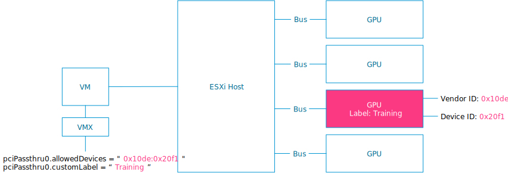](https://frankdenneman.nl/wp-content/uploads/2023/06/02-Dynamic-DirectPathIO-.svg)

The assignable hardware framework allows a device to describe itself with key-value attributes. The framework allows the VM to specify the attributes of the device. It relies on the framework to match these two for design assignment before DRS handles the virtual machine placement decision. It allows operation teams to specify custom labels that help to indicate hardware or site-specific functionality. For example, Labels in a heterogeneous ML cluster can designate which GPUs serve for training and inference workloads. 

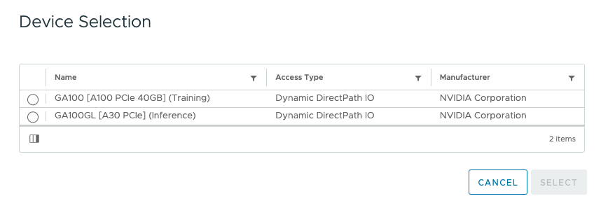

|  | **DirectPath IO** | **Dynamic DirectPath IO** |
| --- | --- | --- |
| VMX device configuration notation | pciPassthru%d.id =<SBDF> | pciPassthru%d.allowedDevices = <vendorId:deviceId>   pciPassthru%d.customLabel = <string value> |
| Example | pciPassthru0.id= 0000:AF:00.0 | pciPassthru0.allowedDevices = "0x10de:0x20f1"   pciPassthru0.customLabel = "Training" |
| Example explanation | The VM is configured with a passthrough device at SBDF address of 0000:AF:00.0 | The VM is configured with a passthrough device that has vendor ID as "0x10de" and device model id as "0x20f1" The custom label indicates this device is designated as a Training device by the organization. |
| Impact | The device is assigned statically at VM configuration time.      The VM is not migratable across ESXi hosts because it is bound to that specific device on that specific ESXi host. | The VM is configured with a passthrough device with vendor ID as "0x10de" and device model id as "0x20f1" The custom label indicates this device is designated as a Training device by the organization. |

The operations team can describe what kind of device a VM needs. Dynamic Directpath IO, with the help of the assignable hardware framework, assigns a device that satisfies the description. As DRS has a global view of all the GPU devices in the cluster, it is DRS that coordinates the matching of the VM, the ESXi host, and the GPU device. DRS selects and GPU device and moves the VM to the corresponding ESXi host. During power on, the host services follow up on DRS's decision and assign the GPU device to the VM.

[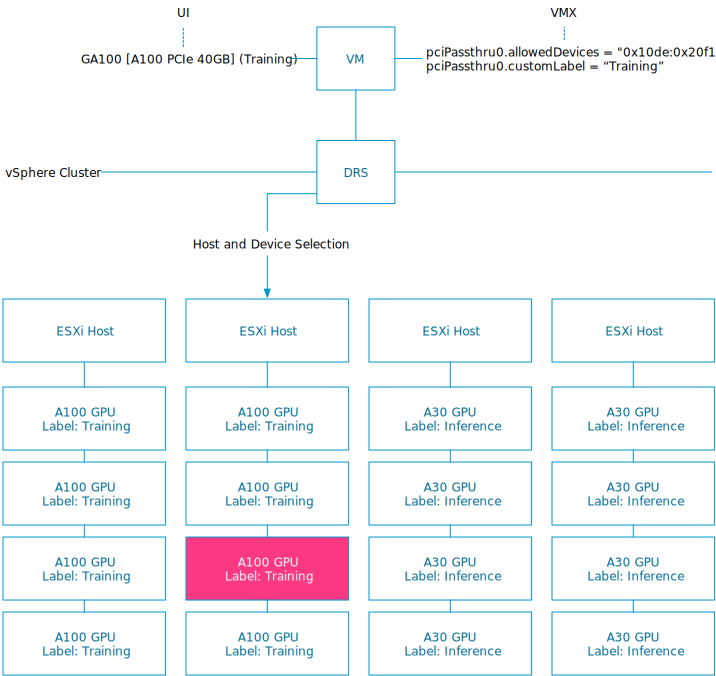](https://frankdenneman.nl/wp-content/uploads/2023/06/04-DRS-and-AH.svg)

The combination of vSphere clustering services and Dynamic DirectPath IO is a significant differentiator between running ML workloads on a virtualized platform and bare-metal hosting. Dynamic DirectPath IO allows DRS to automate the initial placement of accelerated workloads. With Dynamic DirectPath IO and vSphere HA, workloads can frictionlessly return to operation on other available hardware if the current accelerated ESXi host fails.

## Initial Placement of Accelerated Workload

Dynamic DirectPath I/O solves scalability problems within accelerated clusters. If we dive deeper into this process, the system must take many steps to assign a device to a VM. In a cluster, you must find a compatible device and match the physical device to the device listed in the VM(X) configuration. The VMkernel must perform some accounting to determine that the physical device is assigned to the VM. With DirectPath IO, the matching and accounting process uses the host, bus, and other PCIe device locator identifiers. With Dynamic DirectPath IO, the Assignable Hardware framework (AH) is responsible for the finding, matching, and accounting. AH does not expose any API functionality to user-facing systems. It is solely an internal framework that provides a search and accounting service for vCenter and DRS. NVIDIA vGPU utilizes AH as well. The ESXi host implements a performance or consolidation allocation policy using fractional GPUs. AH helps assign weights to a device instance to satisfy the allocation policy while multiple available devices in the vSphere cluster match the description. But more on that in the vGPU article. 

For Dynamic DirectPath IO, DRS uses the internal AH search engine to find a suitable host within the cluster and selects an available GPU device if multiple GPUs exist in the ESXi host. Every ESXi host reports device assignments and the GPU availability to AH. During the host selection and VM initial placement process, DRS provides GPU device selection as a hint to the VMkernel processes running within the ESXi. During the power-on process, the actual device assignment happens. 

If an ESXi host fails, vSphere High Availability restarts the VMs on the remaining ESXi hosts within the cluster. If vCenter runs, HA relies on DRS to find an appropriate ESXi host. With Dynamic DirectPath IO, AH assists DRS in finding a new host based on the device assignment availability. Workloads automatically restart on the remaining available GPUs without any human intervention. With DirectPath IO, the VM is powered down by HA during an isolation event or has crashed due to an ESXi host failure. However, it will remain powered off, as the VM is confined to running on that specific host due to its static SBDF configuration.

[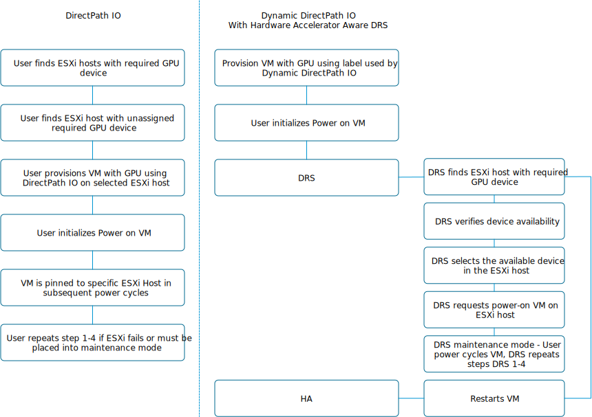](https://frankdenneman.nl/wp-content/uploads/2023/06/05-DPIO-vs-DDPIO-and-HAA-DRS.svg)

# Default ESXi GPU Setting

Although DirectPath IO and Dynamic DirectPath IO are the brand names we at VMware like to use in most public-facing collateral, most of the UI uses the term passthrough as the name of the overarching technology. (If we poke around with the esxcli, we also see Passthru.) But the two DirectPath IO types are distinguished at VM creation time as "Access Type". A freshly installed ESXi OS does not automatically configure the GPU as a passthrough device. If you select the accelerated ESXi host in the inventory view and click on the configure menu, and click on PCIe Devices.

[](https://frankdenneman.nl/wp-content/uploads/2023/06/06-Default-GPU-Passthrough-Disabled.png)

Graphics shows that the GPU device is set to Basics Graphics Type and in a Shared configuration. It is the state the device should be in before configuring either any DirectPath IO type or NVIDIA vGPU functionality. 

[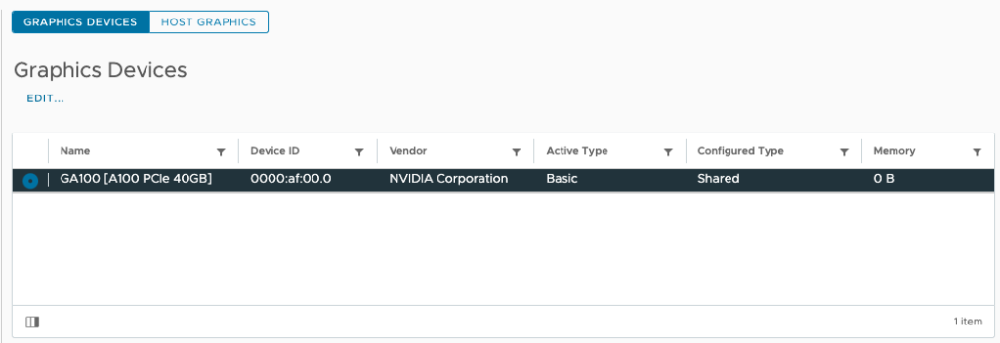](https://frankdenneman.nl/wp-content/uploads/2023/06/07-Graphics-Devices-Passthrough-Disabled.png)

You can verify these settings via the CLI: 

```
esxcli graphics device list
```

[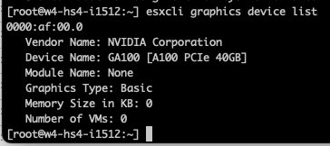](https://frankdenneman.nl/wp-content/uploads/2023/06/08-esxcli-graphics-device-list.png)

```
esxcli graphics host get
```

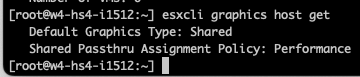

# Enable Passthrough

Once we know the GPU device is in its default state, we can go back to the PCI Devices overview, select GPU Device, and click "Toggle Passthrough."

[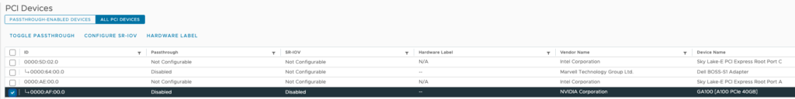](https://frankdenneman.nl/wp-content/uploads/2023/06/10-select-GPU-and-Toggle-Passthrough.png)

The UI reports that the GPU device has enabled Passthrough.

[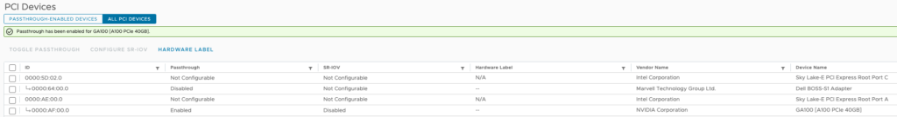](https://frankdenneman.nl/wp-content/uploads/2023/06/11-GPU-Passthrough-enabled.png)

Now, the UI list the active type of the GPU device as Direct.

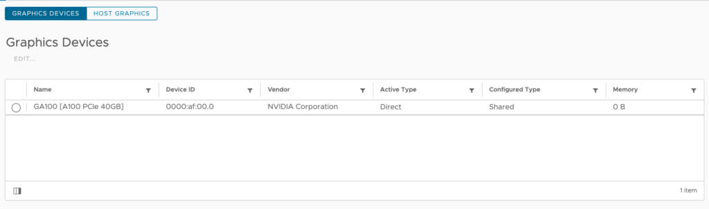

Keep the Graphics Device Settings set to shared (NVIDIA vGPU devices use Shared Direct).


You can verify these settings via the CLI.

```
esxcli graphics device list

```

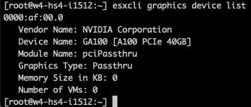

```
esxcli graphics host get

```


# Add Hardware Label to PCI Passthrough Device

Select the accelerated ESXi host in the inventory view, click on the configure menu, click on PCIe Devices, select Passthrough-enabled Devices, and select the GPU device.

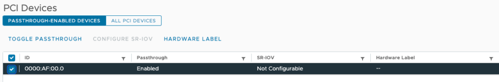

Click on the "Hardware Label" menu option and provide a custom label for the device. For example, "Training." Click on OK when finished.


You can verify the label via the CLI with the following command:

```
esxcli hardware pci list | grep NVIDIA -B 6 -A 32

```

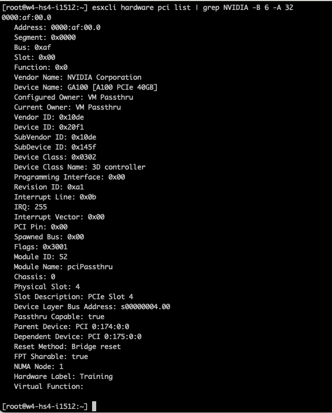

# Create VM with GPU Passthrough using Dynamic DirectPath IO

To create a VM with a GPU assigned using Dynamic DirectPath IO, VM level 17 is required. The following table lists the available vSphere functionality for VMs that have a Directpath IO and Dynamic DirectPath   
IO device associated with them.

| **Functionality** | **DirectPath IO** | **Dynamic DirectPath IO** |
| --- | --- | --- |
| Failover HA | No | Yes |
| Initial Placement DRS | No | Yes |
| Load Balance DRS | No | No |
| vMotion | No | No |
| Host Maintenance Mode | Shutdown VM and Reconfigure | Cold Migration |
| Snapshot | No | No |
| Suspend and Resume | No | No |
| Fractional GPUs | No | No |
| TKGs VMClass Support | No | Yes |

To associate a GPU device using Dynamic DirectPath IO, open the VM configuration, click "Add New Device," and select "PCI Device."

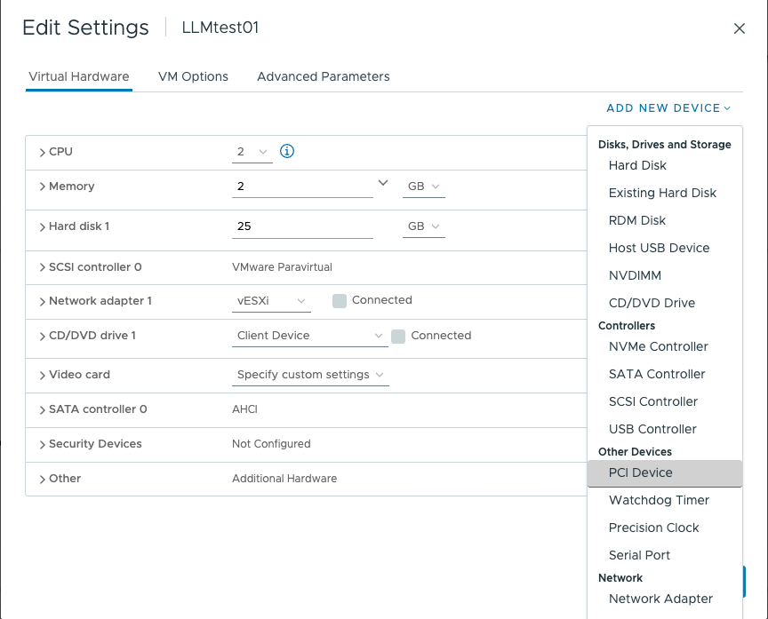

Select the appropriate GPU Device and click on Select.

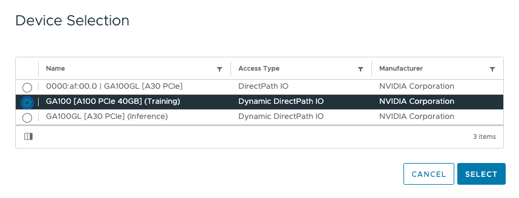

The UI shows the new PCI device using Dynamic DirectPath IO in the VM Settings.


| **Requirement** | **Notes** |
| --- | --- |
| Supported 64-bits Operating System |  |
| Reserve all guest memory | (automatically set in vSphere 8) |
| EFI firmware Boot option |  |
| Advanced Settings | pciPassthru.set.usebitMMIO = true   pciPassthru.64bitMMIOSizeGB = (size in GB) |
|  |  |

The Summary page of the VM lists the ESXi host and the PCIe Device. However, the UI shows no associated VMs connected to the GPU at the Host view. Two commands are available in the CLI. You can verify if a VM is associated with the GPU device with the following command:

```
esxcli graphics device list

```


The following command list the associated VM:

```
esxcli graphics vm list

```

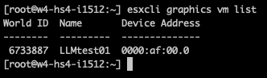

The following articles will cover NVAIE vGPU driver installation on ESXi and TKGs

Other articles in this series:

- [vSphere ML Accelerator Spectrum Deep Dive Series](https://frankdenneman.nl/2023/05/03/vsphere-ml-accelerator-spectrum-deep-dive-series/)

- [vSphere ML Accelerator Spectrum Deep Dive – Fractional and Full GPUs](https://frankdenneman.nl/2023/05/10/vsphere-ml-accelerator-deep-dive-fractional-and-full-gpus/)

- [vSphere ML Accelerator Spectrum Deep Dive – Multi-GPU for Distributed Training](https://frankdenneman.nl/2023/05/12/vsphere-ml-accelerator-spectrum-deep-dive-for-distributed-training-multi-gpu/)

- [vSphere ML Accelerator Spectrum Deep Dive – GPU Device Differentiators](https://frankdenneman.nl/2023/05/16/vsphere-ml-accelerator-spectrum-deep-dive-gpu-device-differentiators/)

- [vSphere ML Accelerator Spectrum Deep Dive – NVIDIA AI Enterprise Suite](https://frankdenneman.nl/2023/05/23/vsphere-ml-accelerator-spectrum-deep-dive-nvidia-ai-enterprise-suite/)

- [vSphere ML Accelerator Spectrum Deep Dive – ESXi Host BIOS, VM, and vCenter Settings](https://frankdenneman.nl/2023/05/30/vsphere-ml-accelerator-spectrum-deep-dive-esxi-host-bios-vm-and-vcenter-settings/)

- [vSphere ML Accelerator Spectrum Deep Dive – Using Dynamic DirectPath IO (Passthrough) with VMs](https://frankdenneman.nl/2023/06/06/vsphere-ml-accelerator-spectrum-deep-dive-using-dynamic-directpath-io-passthrough-with-vms/)

- [vSphere ML Accelerator Spectrum Deep Dive – NVAIE Cloud License Service Setup](https://frankdenneman.nl/2023/07/05/vsphere-ml-accelerator-spectrum-deep-dive-nvaie-cloud-license-service-setup/)
