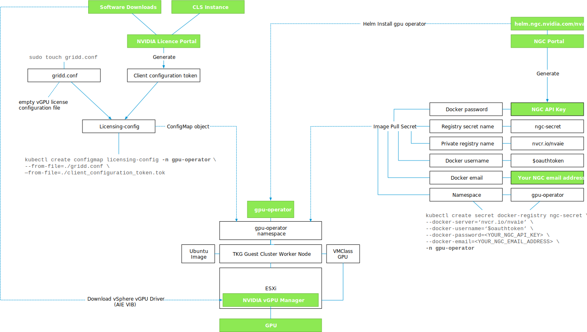
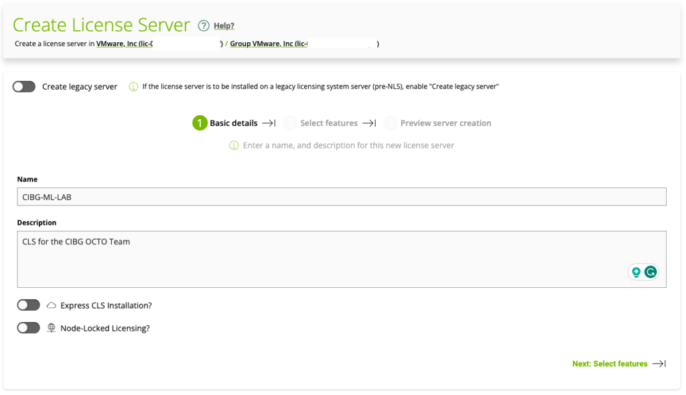
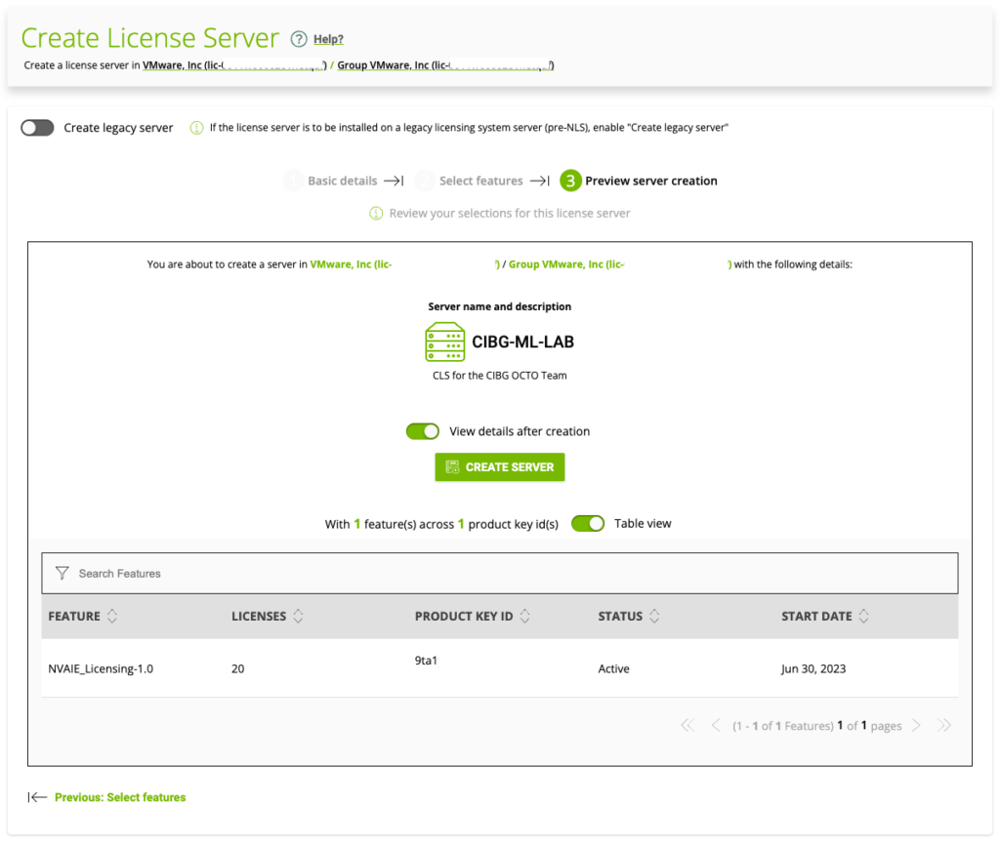
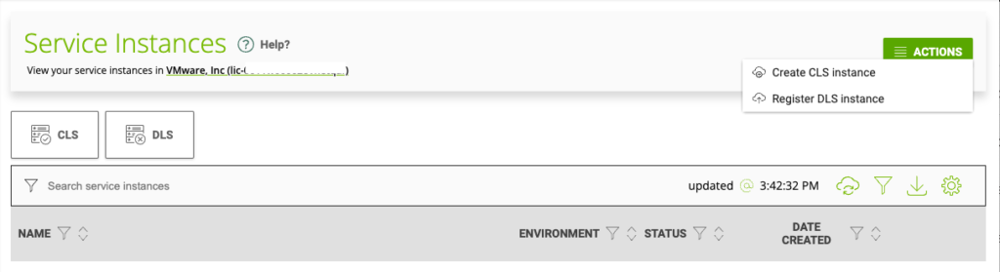
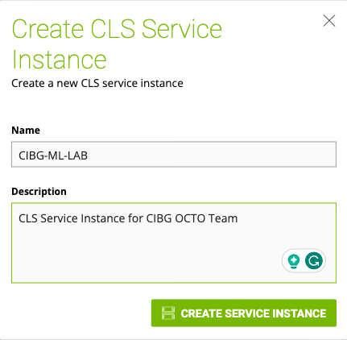
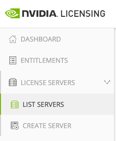
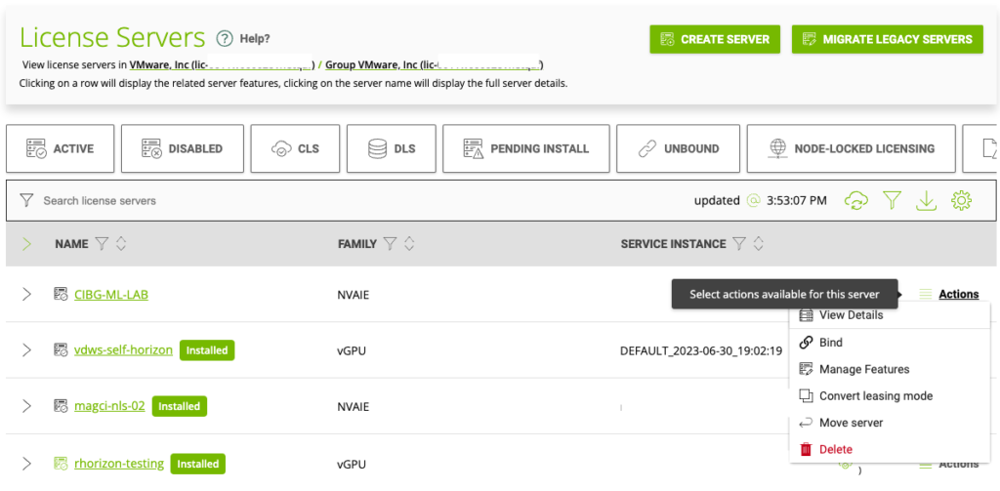
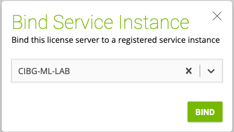
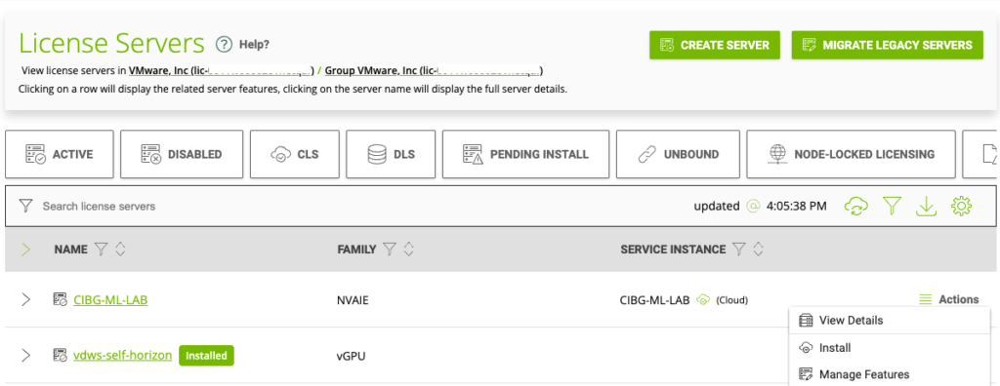
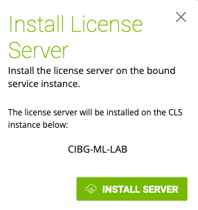

Next in this series is installing the NVAIE GPU operator on a TKGs guest cluster. However, we must satisfy a few requirements before we can get to that step.

- NVIDIA NVAIE Licence activated

- Access to NVIDIA NGC NVIDIA Enterprise Catalog and Licensing Portal

- The license Server Instance activated

- NVIDIA vGPU Manager installed on ESXi Host with NVIDIA GPU Installed

- VM Class with GPU specification configured

- Ubuntu image available in the content library for TKGs Worker Node

- vCenter and Supervisor Access

The following diagram provides an overview of all the components, settings, and commands involved.

Although I do not shy away from publishing long articles, these steps combined are too much for a single article. I've split the process up in three separate articles:

- NVAIE Cloud License Service Setup

- NVIDIA vGPU Manager Install

- TKGs GPU operator install

In this article, I follow a greenfield scenario where no NVIDIA license service instance is set up. As I cannot describe your internal licensing processes, I list the requirements of access rights and permissions to set up the NVIDIA license.

## NVIDIA NVAIE Licence activated

All commercial-supported software installations require a license key, and the NVAIE suite is no different. In NVIDIA terms, this license key is called the Product Activation Key ID (PAK ID) and it's necessary to set up a License Service Instance. The component which distributes and tracks client license allocation. Before you start your journey, ensure you have this PAK ID or have access to a fully configured License Service Instance.

## Access to NVIDIA NGC NVIDIA Enterprise Catalog and Licensing Portal

The NVIDIA AI Enterprise software is available via the [NGC](https://catalog.ngc.nvidia.com/) NVIDIA Enterprise Catalog (GPU operator repository) and the NVIDIA License Portal (ESXi VIBs). This software is only available for users linked to an NVAIE-licensed organization. The pre-configured GPU Operator differs from the open-source GPU Operator in the public NGC catalog. The differences are:

- It is configured to use a prebuilt vGPU driver image (Only available to NVIDIA AI Enterprise customers)

- It is configured to use containerd as the container runtime

- It is configured to use the [NVIDIA License System (NLS)](https://docs.nvidia.com/license-system/latest/)

In larger organizations, a liaison manages NVIDIA licensing, who can get your NGC account listed as a part of the company's NGC organization and provide you access to the NVIDIA Enterprise Application Hub licensing portal. These steps are out-of-scope for this article. The starting point for this article is that you have:

- an NGC account connected to an NGC org that has access to NGC NVIDIA Enterprise Catalog for downloading the drivers and helm charts

- an NVIDIA Enterprise Application Hub account that has access to the NVIDIA licensing portal for creating a License Service Instance or download a client configuration token

- An NVIDIA Entitlement Certificate with a valid Product Activation Key (PAK) ID if you plan to install a License Service Instance.

Please note that I'm an employee of VMware, I do not own the licenses, nor did I participate in the process of obtaining the licenses. I requested the licenses via a VMware internal process. I have no knowledge of internal NVIDIA processes which provides access to the NGC NVIDIA Enterprise Catalog or the NVIDIA licensing portal. **I cannot share my product activation key ID**. Please connect with your NVIDIA contact for these questions.

# Selecting a License Service Instance Type

The NVIDIA License system supports two license server instances:

- Cloud License Service (CLS) instance

- Delegated License Service (DLS) instance

For AI/ML workloads, most customers prefer the CLS instance hosted by the NVIDIA license portal. Since NVIDIA maintains the CLS instance, the on-prem platform operators do not have to worry about the license service instance's availability, scalability, and lifecycle management. The only requirement is that workloads can connect to the CLS instance. To establish communication between the workload clients and the CLS instance, the following firewall or proxy server ports must be open:

| **Port** | **Protocol** | **Eg-/Ingress** | **Service** | **Source** | **Destination** |
| --- | --- | --- | --- | --- | --- |
| 80 | TLS, TCP | Egress | License release | Client | CLS |
| 443 | TLS, TCP | Egress | License acquisition   License renewal | Client | CLS |

A DLS instance is necessary if you are running an ML cluster in an air-gapped data center. The DLS instance is fully disconnected from the NVIDIA licensing portal. The VI-admin must manually download the licenses from the NVIDIA license portal and upload them to the instance. A highly available DLS setup is recommended to provide licensed clients with continued access to NVAIE licenses if one DLS instance fails. A DLS instance can either run as a virtual appliance or as a containerized software image. The minimum footprint of the DLS virtual appliance is 4 vCPUs, 8GB RAM, and 10GB disk space. A fixed or reserved DHCP address and an FQDN must be registered before installing the DLS virtual appliance. It is recommended to synchronize the DLS virtual appliance with an NTP server. Please review the NVIDIA License System User Guide for a detailed installation guide and an overview of all the required firewall rules. For this example, A CLS instance is created and configured. 

# Setting up a Cloud License Service Instance

Log in to the [NVIDIA Enterprise Application Hub](http://nvid.nvidia.com/dashboard/) anc click on NVIDIA Licensing Portal to go to the "NVIDIA licensing portal".

### Creating a License Server

Expand "License Server" in the menu on the left of your screen and select "create server"

Ensure "Create legacy server" is disabled (slide to the left) and provide a name and description for your CLS. Click on "Select features". The node-locked functionality allows air-gapped client systems to obtain a node-locked vGPU software license from a file installed locally on the client system. The express CLS installation.

Find your licensed product using the PAK ID that is listed in your NVIDIA Entitlement Certificate. The PAK ID should contain 30 alphanumeric characters).

In the textbox in the **ADDED** column, enter the number of licenses for the product that you want to add. Click **Next: Preview server creation**.

On the Preview server creation page, click **CREATE SERVER**. Once the server is created, the portal shows the license server is in an "unbound state".

### Creating a CLS Instance 

In the left navigation pane of the NVIDIA Licensing Portal dashboard, click **SERVICE INSTANCES**.

Provide a name and description for the CLS Service Instance.

### Binding a License Server to a Service Instance

Binding a license server to a service instance ensures that licenses on the server are available only from that service instance. As a result, the licenses are available only to the licensed clients that are served by the service instance to which the license server is bound.

In the left menu, select **License Servers**, and click **LIST SERVERS**.

Find your license server using its name, click the **Actions** button on the right side of your screen, and select **Bind**.

In the Bind Service Instance pop-up window that opens select the CLS service instance to which you want to bind the license server and click **BIND**. The Bind Service Instance pop-up window confirms that the license server has been bound to the service instance.

The event viewer lists the successful bind action.

### Installing a License Server on a CLS Instance

This step is necessary if you are using multiple CLS instances in your organization that is registered at NVIDIA and you are using the new CLS instance, not the default CLS instance for the organization. In the left navigation pane, expand **LICENSE SERVER** and click **LIST SERVERS**. Select your License Server, click on **Actions,** and choose **Install**.

In the Install License Server pop-up window that opens, click **INSTALL SERVER**.

The event viewer lists a successful deployment of the license service on the service instance.

The next step is to install the NVIDIA NVAIE vGPU Driver on the ESXi host. This step is covered in the next article.

Previous articles in the vSphere ML Accelerator Spectrum Deep Dive Series:

- [vSphere ML Accelerator Spectrum Deep Dive Series](https://frankdenneman.nl/2023/05/03/vsphere-ml-accelerator-spectrum-deep-dive-series/)

- [vSphere ML Accelerator Spectrum Deep Dive – Fractional and Full GPUs](https://frankdenneman.nl/2023/05/10/vsphere-ml-accelerator-deep-dive-fractional-and-full-gpus/)

- [vSphere ML Accelerator Spectrum Deep Dive – Multi-GPU for Distributed Training](https://frankdenneman.nl/2023/05/12/vsphere-ml-accelerator-spectrum-deep-dive-for-distributed-training-multi-gpu/)

- [vSphere ML Accelerator Spectrum Deep Dive – GPU Device Differentiators](https://frankdenneman.nl/2023/05/16/vsphere-ml-accelerator-spectrum-deep-dive-gpu-device-differentiators/)

- [vSphere ML Accelerator Spectrum Deep Dive – NVIDIA AI Enterprise Suite](https://frankdenneman.nl/2023/05/23/vsphere-ml-accelerator-spectrum-deep-dive-nvidia-ai-enterprise-suite/)

- [vSphere ML Accelerator Spectrum Deep Dive – ESXi Host BIOS, VM, and vCenter Settings](https://frankdenneman.nl/2023/05/30/vsphere-ml-accelerator-spectrum-deep-dive-esxi-host-bios-vm-and-vcenter-settings/)

- [vSphere ML Accelerator Spectrum Deep Dive – Using Dynamic DirectPath IO (Passthrough) with VMs](https://frankdenneman.nl/2023/06/06/vsphere-ml-accelerator-spectrum-deep-dive-using-dynamic-directpath-io-passthrough-with-vms/)

- [vSphere ML Accelerator Spectrum Deep Dive – NVAIE Cloud License Service Setup](https://frankdenneman.nl/2023/07/05/vsphere-ml-accelerator-spectrum-deep-dive-nvaie-cloud-license-service-setup/)
