After setting up the [Cloud License Service Instance](https://frankdenneman.nl/2023/07/05/vsphere-ml-accelerator-spectrum-deep-dive-nvaie-cloud-license-service-setup/), the NVIDIA AI Enterprise vGPU driver must be installed on the ESXi host. A single version driver amongst all the ESXi hosts in the cluster containing NVIDIA GPU devices is recommended. The most common error during the GPU install process is using the wrong driver. And it's an easy mistake to make. In vGPU version 13 (the current NVAIE version is 15.2), NVIDIA split its ESXi host vGPU driver into two kinds. A standard vGPU driver component supports graphics, and an AI Enterprise (AIE) vGPU component supports compute. The Ampere generation devices, such as the A30 and A100 device, support compute only, so it requires an AIE vGPU component. There are AIE components available for all NVIDIA drivers since vGPU 13.

This article series focuses on building a vSphere infrastructure for ML platforms, and thus this article lists the steps to install the NVD-AIE driver. To download the NVD-AIE driver, ensure you have a user id that has access to the NVIDIA License Portal. The next step is to ensure the platform meets the requirements before installing the driver component. The installation process can be done using vSphere Lifecycle Manager or manually installing the driver component on each ESXi host in the cluster. Both methods are covered in this article.

[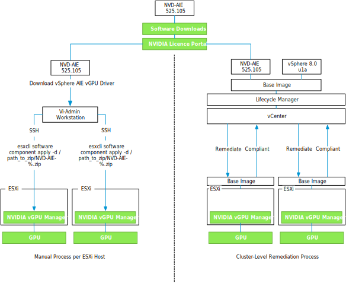](https://frankdenneman.nl/wp-content/uploads/2023/07/01-Install-ESXi-NVIDIA-AIE-1.svg)

## Requirements

Make sure to configure the ESXi Host settings as follows before installing the NVIDIA vGPU Driver:

| **Component** | **Requirements** | **Notes** |
| --- | --- | --- |
| Physical ESXi host | Must have Intel VT-d or AMD I/O VT enabled in the BIOS |  |
|  | Must have SR-IOV enabled in the BIOS | Enable on Ampere & Hopper GPUs |
|  | Must have Memory Mapping Above 4G enabled in the BIOS | Not applicable for NVIDIA T4 (32-bit BAR1) |
| vCenter | Must be configured with Advanced Setting _vgpu.hotmigrate.enabled_ | If you want to live-migrate VMs |
| vSphere GPU Device Settings | Graphics Type: Basic   Graphics Device Settings: Shared Direct |  |

The article [vSphere ML Accelerator Spectrum Deep Dive – ESXi Host BIOS, VM, and vCenter Settings](https://frankdenneman.nl/2023/05/30/vsphere-ml-accelerator-spectrum-deep-dive-esxi-host-bios-vm-and-vcenter-settings/) provides detailed information about every setting listed.

## Preparing the GPU Device for the vGPU Driver

The GPU device must be in "Basic Graphics Type" mode to successfully install the vGPU driver. It is the default setting for the device. That means that the GPU should not be configured as a Passthrough device. In vCenter, go to the **Inventory view**, select the ESXi host containing the GPU device, go to the **Configure** menu option, **Hardware**, **PCI Devices**. The GUI should present the following settings:

[](https://frankdenneman.nl/wp-content/uploads/2023/07/02-PCIe-Device-Default-Settings.png)

Go to the **Graphics** menu options

[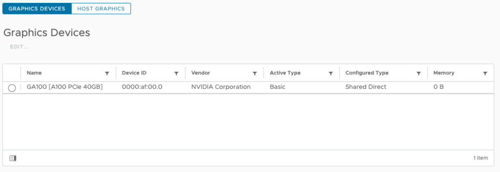](https://frankdenneman.nl/wp-content/uploads/2023/07/03-Graphics-Device-Default-Settings.png)

Select the GPU and choose **EDIT..**. The default graphics type is Shared, which provides vSGA functionality. To enable vGPU support for VMs, you must change the default graphics type to **Shared Direct**.

[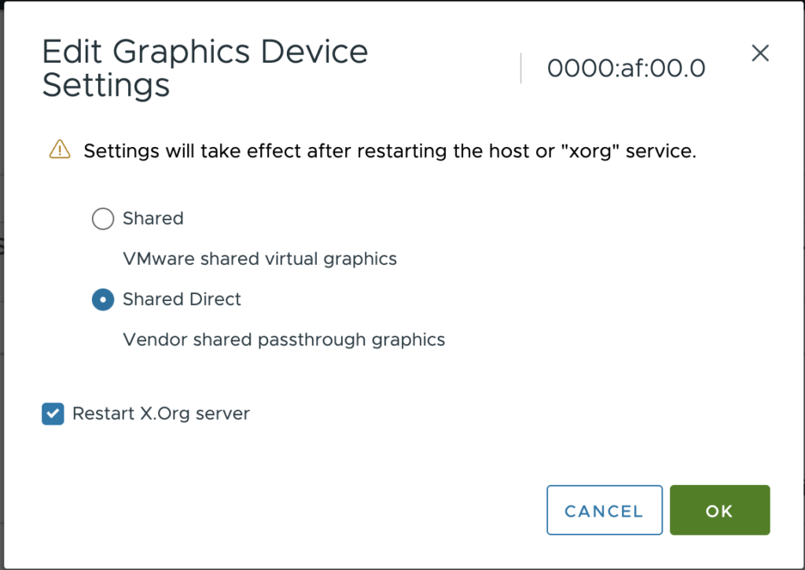](https://frankdenneman.nl/wp-content/uploads/2023/07/04-Shared-Direct-Graphics-Settings.png)

You can verify these settings via the CLI using the following command:

```
% esxcli graphics device list
0000:af:00.0
   Vendor Name: NVIDIA Corporation
   Device Name: GA100 [A100 PCIe 40GB]
   Module Name: None
   Graphics Type: Basic
   Memory Size in KB: 0
   Number of VMs: 0
```

Verify if the default graphics settings is set to **Shared Direct** using the command:

```
% esxcli graphics host get
   Default Graphics Type: SharedPassthru
   Shared Passthru Assignment Policy: Performance
```

If the UI is having an off-day and won't want to listen to your soothing mouse clicks, use the following commands to place GPU in the correct mode, and restart the X.Org server.

```
% esxcli graphics host set --default-type SharedPassthru
% /etc/init.d/xorg restart
Getting Exclusive access, please wait…
Exclusive access granted.
% esxcli graphics host get
   Default Graphics Type: SharedPassthru
 Shared Passthru Assignment Policy: Performance
```

## NVAIE Driver Download

**Selecting the correct vGPU version**

The vGPU driver is available at the NVIDIA Licensing Portal, part of the NVIDIA APPLICATION HUB. Go to the **SOFTWARE DOWNLOADS** option in the left menu, or go directly to [https://ui.licensing.nvidia.com/software](https://ui.licensing.nvidia.com/software) if logged in.

[](https://frankdenneman.nl/wp-content/uploads/2023/07/05-NVIDIA-Software-Downloads-Product-Family.png)

Two options look applicable: the vGPU product family and the NVAIE product family. For ML workloads, choose the NVAIE product family. The NVAIE product family provides vGPU capability for compute (ML/AI) workload. The vGPU family is for vGPU functionality for the VDI workload. You can recognize the correct vGPU Driver components with the NVD-AIE (NVIDIA AI Enterprise) prefix. To reduce the results shown on the screen, click **PLATFORM** and select **VMware vSphere.**

[](https://frankdenneman.nl/wp-content/uploads/2023/07/06-NVIDIA-Software-Downloads-Select-Platform.png)

Select the latest release. At the time of writing this article, the latest NVAIE version was 3.1 for both vSphere 7 and vSphere 8. 

[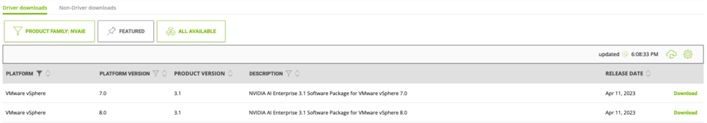](https://frankdenneman.nl/wp-content/uploads/2023/07/07-Software-Downloads-NVAIE-3.1-.png)

Since I'm running vSphere 8.0 update 1, I'm selecting NVAIE 3.1 for vSphere 8.

[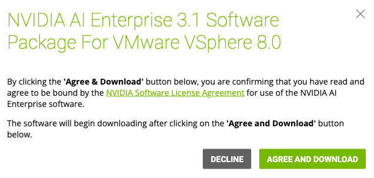](https://frankdenneman.nl/wp-content/uploads/2023/07/08-NVAIE-3.1-for-vSphere-8.png)

The file is downloaded in a zip-file format. Extract the file to review the contents.

[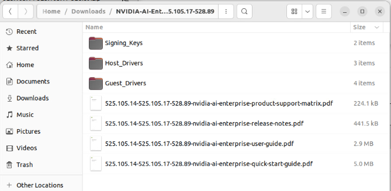](https://frankdenneman.nl/wp-content/uploads/2023/07/09-Extracted-NVAIE-zip.png)

As described in the articles "[vSphere ML Accelerator Deep Dive – Fractional and Full GPUs](https://frankdenneman.nl/2023/05/10/vsphere-ml-accelerator-deep-dive-fractional-and-full-gpus/)" and "[vSphere ML Accelerator Spectrum Deep Dive – ESXi Host BIOS, VM, and vCenter Settings](https://frankdenneman.nl/2023/05/30/vsphere-ml-accelerator-spectrum-deep-dive-esxi-host-bios-vm-and-vcenter-settings/)", two components drive the GPU. The guest OS driver controls the MMIO space and the communication of the device, and the GPU manager (the NVIDIA name for the ESXi Driver) controls the time-sharing mechanism to multiplex control across multiple workloads.

[](https://frankdenneman.nl/wp-content/uploads/2023/05/01-Vt-D-passthrough.svg)

The zip file contains the ESXi Host Drivers and the Guest Drivers. It does not contain the GPU operator for TKGs, which installs and manages the LCM of the TKGs worker node driver. The GPU operator is installed via a helm chart. Before being able to install the GPU operator, the ESXi host driver must be installed to allow the VM Class to present a vGPU device to the TKGs worker node.

# Installing the Driver

vSphere offers two possibilities to install the NVAIE vGPU driver onto all the cluster hosts, and which method is best for you depends on the cluster configuration. If every ESXi host in the cluster is equipped with at least one GPU device. Installing and managing the NVAIE vGPU driver across all hosts in the cluster using a vSphere Lifecycle Manager (vLCM) desired state image is recommended. The desired state functionality of Lifecycle Manager ensures the standardization of drivers across every ESXi host in the cluster. Visual confirmation in vCenter allows VI-admins to verify driver consistency across ESXi hosts. If an ESXi host configuration is not compliant with the base image vCenter lifecycle manager reports this violation. If a few ESXi hosts in the cluster contain a GPU card, installing the driver using the manual process might be better. You can always opt for using a desired state image in a heterogeneous cluster, but some ESXi hosts will have a driver installed without use. In general, using the desired state image throughout the cluster, even in heterogeneous clusters, is recommended to manage a consistent version of the NVAIE vGPU Driver at scale.

vSphere Lifecycle Manager

[vSphere Lifecycle Manager (vCLM)](https://core.vmware.com/resource/introducing-vsphere-lifecycle-management-vlcm#section2) integrates the NVAIE GPU driver with the vSphere base image to enforce consistency across the ESXi hosts in the cluster. To extend the base image, import the NVAIE GPU driver component by opening up the **vSphere client menu** (click on the three lines in the top left corner next to vSphere Client) select **Lifecycle Manager**, select **ACTIONS**, **Import Updates**.

[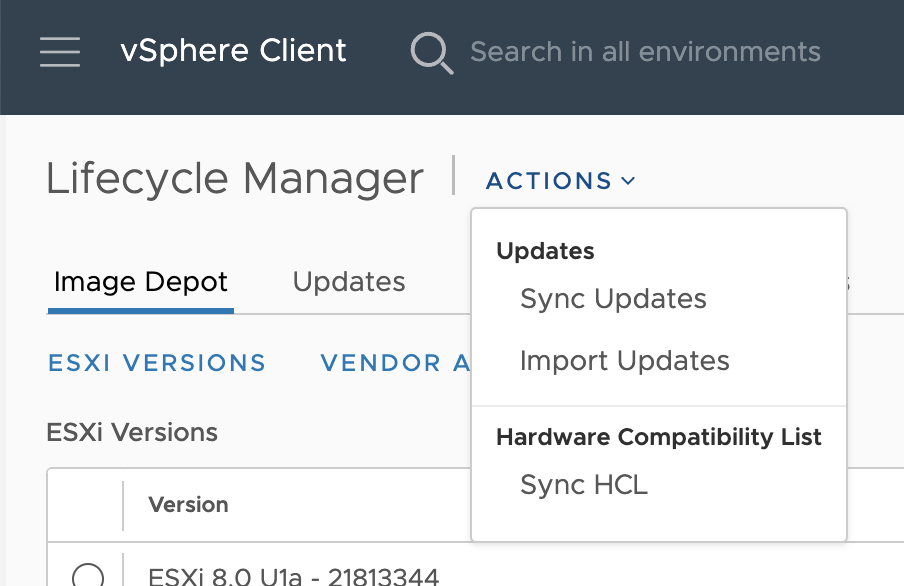](https://frankdenneman.nl/wp-content/uploads/2023/07/10-vCLM-Import-Updates.png)

Browse to the download location of the NVAIE vGPU driver and select the Host Driver Zip file to **IMPORT**.

[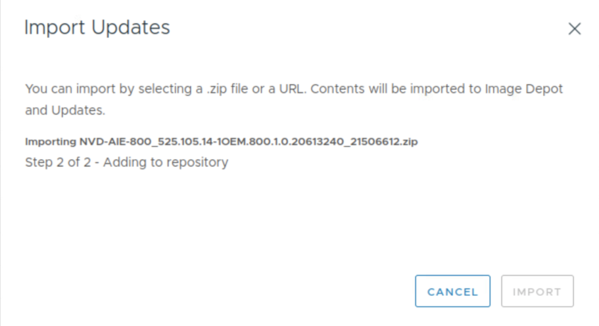](https://frankdenneman.nl/wp-content/uploads/2023/07/11-vCLM-Import-NVAIE-vGPU-Driver-zip.png)

Verify if the import of the driver component is successful by clicking on **Image Depot**. Search the **Components** list.

[](https://frankdenneman.nl/wp-content/uploads/2023/07/12-vCLM-Independent-Components.png)

To extend the base image with the newly added component, go to the vCenter **Inventory view**, right-click the **vSphere cluster**, choose **Settings**, and click the **update** tab.

[](https://frankdenneman.nl/wp-content/uploads/2023/07/13-Lifecycle-Manager-Image.png)

In the **Image** view, Click on **EDIT**, review the confirmation, and choose **RESUME EDITING**. Click on **ADD COMPONENTS**, add the NVIDIA AI Enterprise vGPU driver for VMware ESX-version number, and choose **SELECT**.

[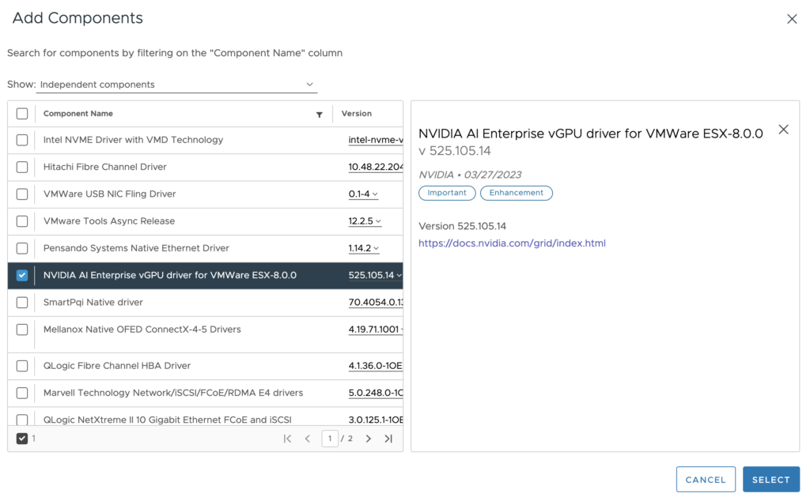](https://frankdenneman.nl/wp-content/uploads/2023/07/01-vCLM-Add-Components.png)

The driver is added to the base Image. Click on **Save.**

[](https://frankdenneman.nl/wp-content/uploads/2023/07/15-vCLM-Edit-Image-Driver-Added.png)

The ESXi hosts in the cluster should be listed as non-compliant. Select the ESXi hosts to validate and remediate to apply the new base image. Once the base image is installed on all ESXi hosts, the Image Compliance screen indicates that all ESXi hosts in the cluster are compliant.

[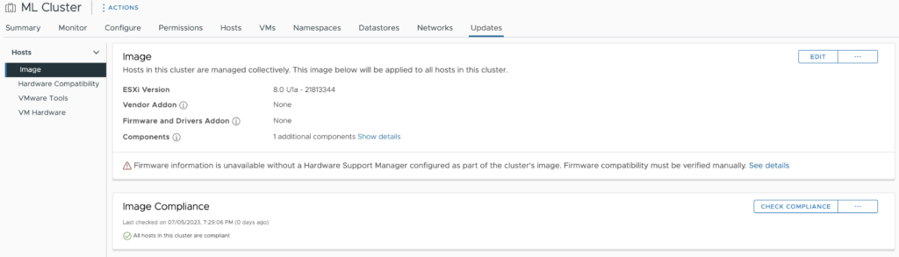](https://frankdenneman.nl/wp-content/uploads/2023/07/16-LCM-Image-Compliance.png)

The cluster is ready to deploy vGPU-enabled virtual machines.

# Manual NVAIE vGPU Driver Install

If multiple ESXi hosts in the cluster contain GPUs, it is efficient to store the ESXi host driver on a shared datastore accessible by all ESXi hosts.

## Uploading the Driver to a Shared Repository 

In this example, I upload the ESXi host driver to the vSAN datastore. SFTP requires SSH to be active. Enable it via the **Host** configuration of the **Inventory** view of vCenter, go to the **Configure** Menu option of the host, **System**, **Services**, click on **SSH**, and select **Start**. Remember, this service keeps on running until you boot the ESXi host. A folder is created iso/nvaie. Use the put command to transfer the file to the vSAN datastore

```
% sftp root@esxi host
(root@esxi host) Password: 
Connected to esxi host
sftp> lpwd
Local working directory: /home/vadmin/Downloads/NVIDIA-AI-Enterprise-vSphere-8.0-525.105.14-525.105.17-528.89/Host_Drivers
sftp> cd /vmfs/volumes/vsanDatastore/iso/nvidia/
sftp> lls
NVD-AIE-800_525.105.14-1OEM.800.1.0.20613240_21506612.zip       nvd-gpu-mgmt-daemon_525.105.14-0.0.0000_21514245.zip
NVD-AIE_ESXi_8.0.0_Driver_525.105.14-1OEM.800.1.0.20613240.vib
sftp> put NVD-AIE-800_525.105.14-1OEM.800.1.0.20613240_21506612.zip 
Uploading NVD-AIE-800_525.105.14-1OEM.800.1.0.20613240_21506612.zip to /vmfs/volumes/vsan:5255fe0bd2a28e17-a7cdc87427ad0c55/869a9363-2ca2-c917-f0f6-bc97e169cdf0/nvidia/NVD-AIE-800_525.105.14-1OEM.800.1.0.20613240_21506612.zip
NVD-AIE-800_525.105.14-1OEM.800.1.0.20613240_21506612.zip                                               100%  108MB  76.6MB/s   00:01    
```

## Install the NVAIE vGPU Driver

Before installing any software components on an ESXi host, always ensure that no workloads are running by putting the ESXi host into maintenance mode. Right-click the ESXi host in the cluster view of vCenter, select the submenu **Maintenance mode**, and select the option Enter Maintenance mode. 

Install the NVIDIA vGPU hypervisor host driver and the NVIDIA GPU Management daemon using the esxcli command: **esxcli software component apply -d /path\_to\_component/NVD-AIE-%.zip**

```
% esxcli software component apply -d /vmfs/volumes/vsanDatastore/iso/nvidia/NVD-AIE-800_525.105.14-1OEM.800.1.0.20613240_
21506612.zip
Installation Result
   Message: Operation finished successfully.
   Components Installed: NVD-AIE-800_525.105.14-1OEM.800.1.0.20613240
   Components Removed:
   Components Skipped:
   Reboot Required: false
   DPU Results:
```

Please note that the full path is required, even if you are running the esxcli command from the directory where the file is located. And although the output indicates that no reboot is required, reboot the ESXi host to load the driver.

## Verify the NVAIE vGPU Driver

Verify if the driver is operational by executing the command nvidia-smi in an SSH session. 

[](https://frankdenneman.nl/wp-content/uploads/2023/07/17-nvidia-smi.png)

Unfortunately, NVIDIA SMI doesn't show whether an NVD-AIE or a regular vGPU driver is installed. If you are using an A30, A100, or H100, NVIDIA-SMI only works if an NVD-AIE driver is installed. You can check the current loaded VIB in vSphere with the following command:

```
% esxcli software component list | grep NVD
NVD-AIE-800                     NVIDIA AI Enterprise vGPU driver for VMWare ESX-8.0.0                                            525.105.14-1OEM.800.1.0.20613240     525.105.14              NVIDIA        03-27-2023     VMwareAccepted    host
```

The UI shows that the active type configuration is now Shared Direct.

[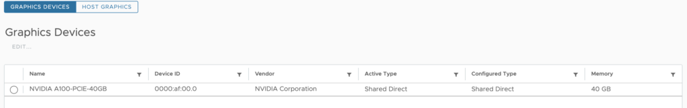](https://frankdenneman.nl/wp-content/uploads/2023/07/18-Graphics-Devices-Shared-Direct-Shared-Direct.png)

The cluster is ready to deploy vGPU-enabled virtual machines. The next article focusses on installing the TKGs NVAIE GPU Operator.

Previous articles in the vSphere ML Accelerator Spectrum Deep Dive Series:

- [vSphere ML Accelerator Spectrum Deep Dive Series](https://frankdenneman.nl/2023/05/03/vsphere-ml-accelerator-spectrum-deep-dive-series/)

- [vSphere ML Accelerator Spectrum Deep Dive – Fractional and Full GPUs](https://frankdenneman.nl/2023/05/10/vsphere-ml-accelerator-deep-dive-fractional-and-full-gpus/)

- [vSphere ML Accelerator Spectrum Deep Dive – Multi-GPU for Distributed Training](https://frankdenneman.nl/2023/05/12/vsphere-ml-accelerator-spectrum-deep-dive-for-distributed-training-multi-gpu/)

- [vSphere ML Accelerator Spectrum Deep Dive – GPU Device Differentiators](https://frankdenneman.nl/2023/05/16/vsphere-ml-accelerator-spectrum-deep-dive-gpu-device-differentiators/)

- [vSphere ML Accelerator Spectrum Deep Dive – NVIDIA AI Enterprise Suite](https://frankdenneman.nl/2023/05/23/vsphere-ml-accelerator-spectrum-deep-dive-nvidia-ai-enterprise-suite/)

- [vSphere ML Accelerator Spectrum Deep Dive – ESXi Host BIOS, VM, and vCenter Settings](https://frankdenneman.nl/2023/05/30/vsphere-ml-accelerator-spectrum-deep-dive-esxi-host-bios-vm-and-vcenter-settings/)

- [vSphere ML Accelerator Spectrum Deep Dive – Using Dynamic DirectPath IO (Passthrough) with VMs](https://frankdenneman.nl/2023/06/06/vsphere-ml-accelerator-spectrum-deep-dive-using-dynamic-directpath-io-passthrough-with-vms/)

- [vSphere ML Accelerator Spectrum Deep Dive – NVAIE Cloud License Service Setup](https://frankdenneman.nl/2023/07/05/vsphere-ml-accelerator-spectrum-deep-dive-nvaie-cloud-license-service-setup/)
