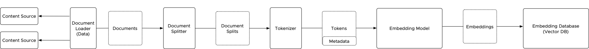
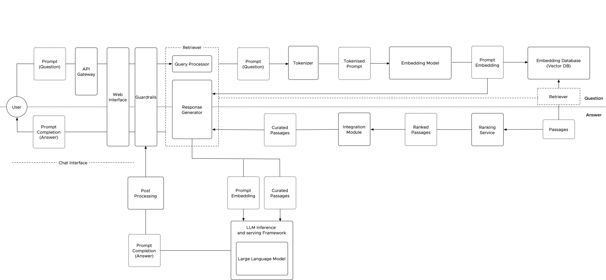

Retrieval Augmented Generation (RAG) is a way to enhance Large Language Models (LLMs) by giving them access to extra data. In a typical Gen-AI setup, the LLM answers questions using only what it learned during training. It does not look up new information beyond its training data. RAG changes this by combining retrieval and generation. It uses a retriever to find relevant information from a large text collection, called a corpus, which is stored in a vector database. The generative part, powered by the LLM, then uses this information to create responses.

Most discussions about RAG architecture focus on the retrieval process, the vector database, and the LLM. But to design the system and allocate resources properly, it's also important to understand the indexing workflow and shared components. The tokenizer and embedding model are especially important for making sure retrieval and generation work smoothly.

This is the first part of a series where I will move step by step toward Private AI foundation components for running this application in your on-premises virtual datacenter. Let's look more closely at the indexing and retrieval process and see how each component works in the main stages of retrieval augmented generation.

This diagram shows the components, their inputs, and their outputs (elements with dotted lines). Most data scientists design such a system using frameworks such as LangChain or **[Llama Index](https://www.llamaindex.ai/)**. These frameworks provide functionality, as depicted below, but sometimes without distinct, separate components for each task. This diagram shows the conceptual tasks and components used in the indexing and retrieval processes. Its primary goal is to highlight the different phases data go through and the shared components used by both processes.

## Building the Foundation for Retrieval: The Indexing Process in RAG Architectures

The indexing stage in a RAG architecture sets up efficient information retrieval. It transforms many types of data, unstructured documents like PDFs, semi-structured data like JSON, or structured data from databases, into a format that LLMs can use. This process follows a Load-Transform-Embed-Store workflow.

## Loading Diverse Data Sources

The indexing process begins with data loaders, which act as information gatherers. They retrieve data from various sources, including unstructured documents (e.g., PDFs, docs), semi-structured data (e.g., XML, JSON, CSV), and even structured data residing in SQL databases. These loaders then convert the retrieved data into a standardized document format for further processing.

## Transforming Data for Efficient Processing

Document splitters take the stage next. Their role is crucial in organizing the data and preparing it for efficient processing by the embedding model. They achieve this by segmenting the documents into logical units – sentences or paragraphs – based on predefined rules. This segmentation ensures that information remains semantically intact while preparing it for further processing.

## Tokenization: The Building Blocks of Meaning

After splitting, the tokenizer processes each unit, like a paragraph, and breaks it into tokens. Tokens can be words, parts of words, or even characters, depending on the embedding model and how detailed you want to be. Accurate tokenization is important because it shapes how the LLM understands the text. Using one shared tokenizer for all parts of the system helps keep everything consistent.

## Embedding: Capturing Semantic Meaning

After tokenization, the embedding model converts each token into a numerical vector that captures its meaning in context. Pre-trained embedding models map tokens to vector representations.

Finally, an indexing component packages the generated embedding vectors along with associated metadata (such as document source information) and sends them to a vector database for efficient storage. This database becomes the foundation for the retrieval stage.

## The Stored Foundation

The vector database plays a crucial role in efficient retrieval. It stores embedding vectors in a multi-dimensional space, enabling fast, effective search based on vector similarity.

## Retrieval: Efficiently Finding Relevant Information

The retrieval stage finds relevant information from indexed data to help the LLM generate answers. The user’s query is processed using the same tokenizer and embedding model as during indexing.

## Understanding User Queries

The process starts when a user submits a query. For private AI deployments, an API gateway validates users, enforces rate limiting, and logs requests. Guardrails ensure prompts meet safety and quality standards before processing.

The tokenizer breaks the prompt into tokens, and the embedding model converts it into a vector that captures semantic meaning.

## Matching Queries with Encoded Information

The system searches the vector database for embeddings that closely match the query vector. These matches represent relevant passages from the indexed corpus.

## Prioritizing Relevant Passages

A ranking service scores and sorts retrieved passages based on relevance, ensuring the most useful information is selected.

## Preparing Information for the LLM

The integration module formats the top-ranked passages for LLM consumption. It may summarize, extract key points, or combine passages to fit the model’s input constraints.

## Feeding the LLM

The prepared passages and embedded prompt are sent to the LLM, which generates a response. Post-processing and guardrails ensure quality, safety, and clarity.

## Polishing the Response: Post-Processing

Post-processing may include text normalization, spell checking, grammar correction, and redundancy removal. These steps improve clarity and readability.

## Tailoring the Response for Presentation

Responses are formatted for the target interface, such as a web app or chat UI, using headings, lists, or other visual elements.

## Seamless Integration: User Interface and Presentation

The response is integrated into the application interface, ensuring smooth delivery to the user.

## User Presentation and Interaction

Users receive the final response and may provide feedback or submit follow-up queries.

## Maintaining a Positive User Experience

Accuracy, relevance, and consistency are essential. Error handling and feedback loops help continuously improve system performance.

## The Unsung Heroes of RAG: Shared Components and Resource Management

The tokenizer, embedding model, and vector database form the shared foundation of indexing and retrieval. Proper resource sizing for these components is essential to avoid bottlenecks.

Batch-based scraping and ingestion can cause unpredictable resource usage. Flexible infrastructure and scalable resource allocation help manage growth as data volume and sources increase.
