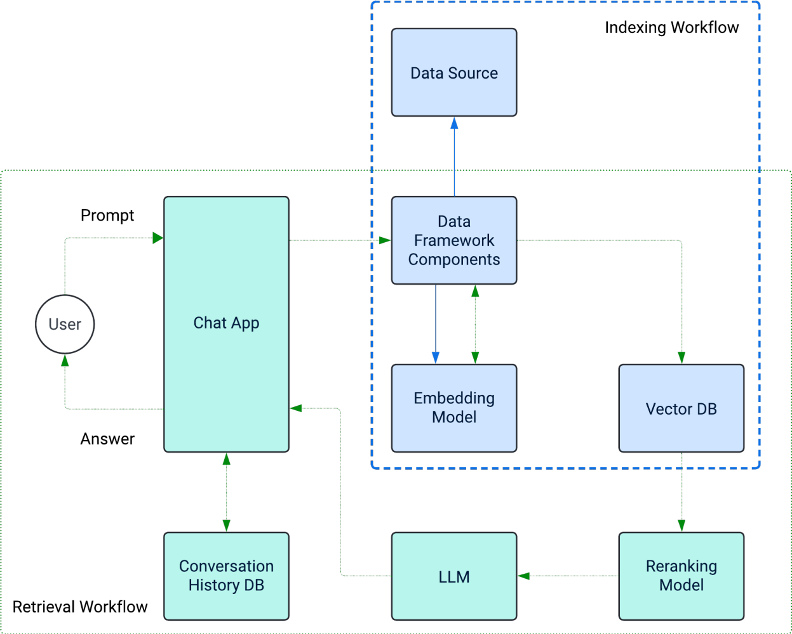
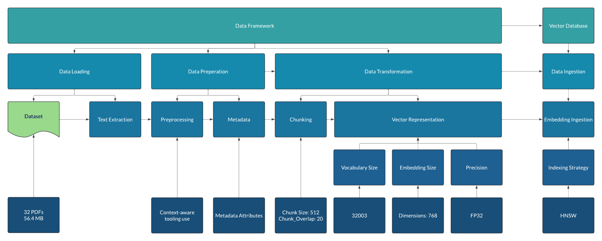
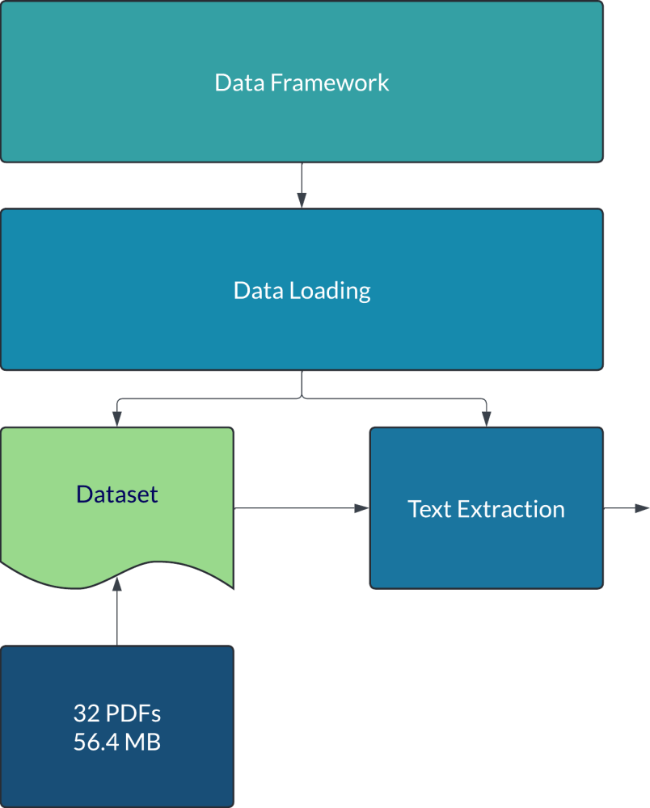
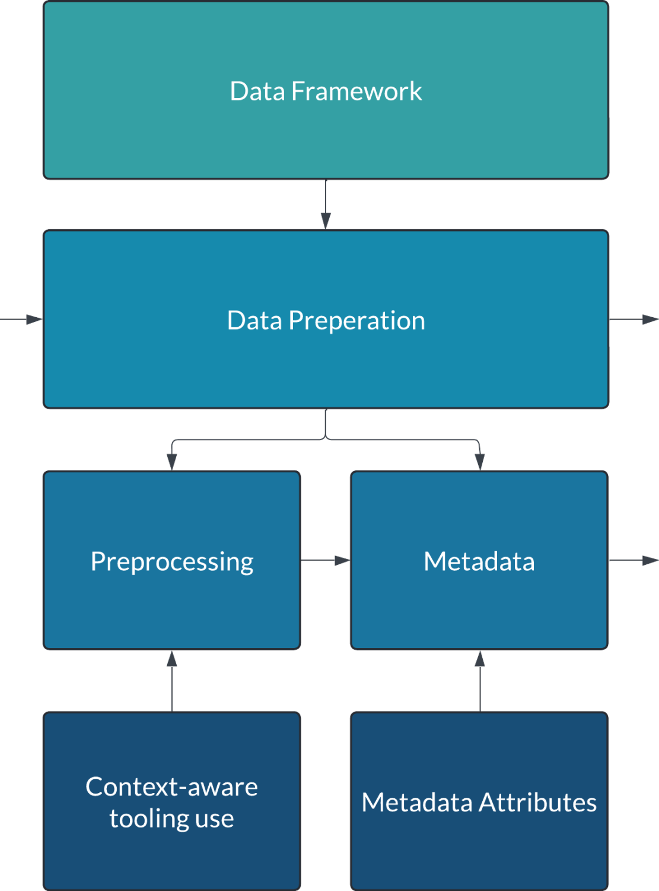
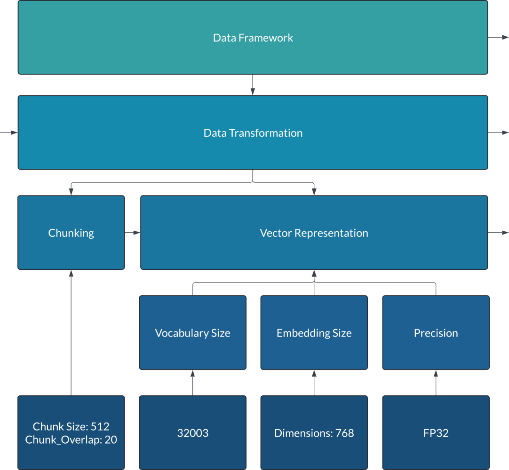
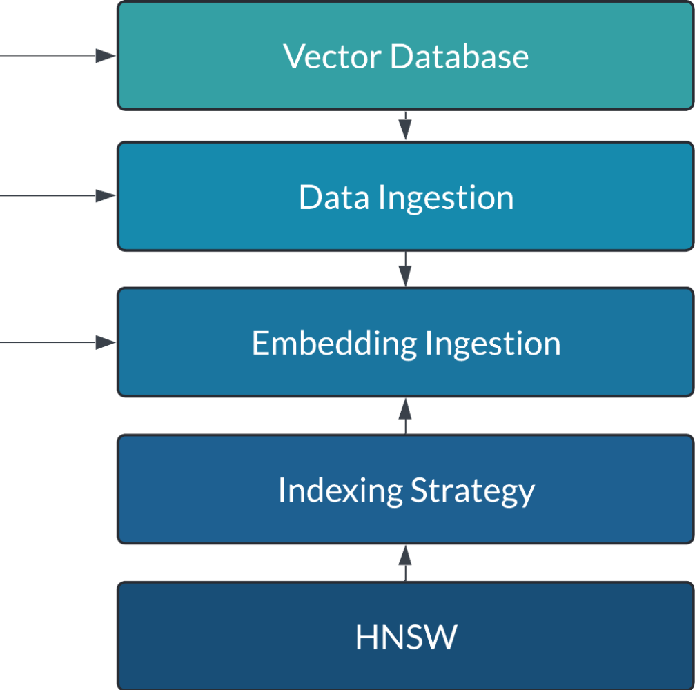

On-premises AI deployments are becoming increasingly important, but infrastructure administrators and architects often face a steep learning curve due to unfamiliar terminology. While much AI information is tailored to data scientists, there's a growing need for resources to clarify how these workloads impact infrastructure.

## Understanding the RAG Ingestion Pipeline for AI Workloads

When planning for AI, you’ll often hear terms like "embedding models," "vector embeddings," and "vector databases," especially in Retrieval-Augmented Generation (RAG) frameworks that support scalable, responsive AI. But what actually happens when you run a RAG pipeline? How much computing power do you need? How much I/O is involved when processing a 60 MB dataset? These questions, along with key scaling factors, are important for sizing your infrastructure and planning for changes.

For infrastructure teams, understanding key AI concepts and their real-world impact is essential to supporting on-premises AI workloads. The RAG process has two main parts: the ingestion pipeline, which prepares data for retrieval, and the retrieval pipeline, which handles real-time queries and responses.

This is the first article in a series that explains each part of the RAG workflow. Here, we’ll focus on the ingestion pipeline, what it does, its main parts, and how they work together. Later articles will look at resource needs in more detail and include a Jupyter notebook so infrastructure teams can test system impacts themselves.

### Understanding the Ingestion Pipeline for AI Workloads

The ingestion pipeline prepares data so large language models (LLMs) can use it efficiently in AI applications. Each step turns raw data into a format AI models can understand, which helps them respond faster and more accurately to user questions. Let’s look at each stage, from loading the data to storing it in a vector database.

## Data Ingestion: Loading & Extracting Data

LLMs need data in a format they can understand, but they can’t read raw documents, text files, PDFs, or other file types directly. Instead, an extra step turns the data into "embeddings"—numerical representations that capture the meaning and context of the text. An embedding model does this by converting the prepared text into structured vectors.

To get data ready for the embedding model, you first load, extract, and clean it. This means pulling data from places like document folders, databases, or online sources, then putting it into a standard, machine-readable format. Only after preprocessing can you send the data to the embedding model, which creates the vectors LLMs use to retrieve and understand information.

**Why this matters for infrastructure:** Preparing data for embedding uses a lot of computing power and storage. Infrastructure administrators need to make sure there are enough resources to handle each step efficiently. Extracting and cleaning large files takes CPU and memory, and organizing data in a machine-readable format needs fast, easy-to-access storage.

The data extraction tools are typically written in Python with little optimization for resource management. In reality, that means these libraries and tools run as single-threaded processes by default. The data scientist must be aware of this and how to augment the code to enable multi-processing or multi-threading. The difference between those two techniques is a topic we will save for later. As a result, loading copious amounts of data single-threaded will take a long time, and a parallel processing ingestion process will consume all the CPUs for a short but high-intense duration.

Data transfer rates and I/O performance are key when loading and processing files. High I/O throughput helps prevent bottlenecks, especially with large datasets. Depending on the data’s size and complexity, this step can use a lot of memory and temporary storage, since intermediate and cleaned data are stored before embedding.

There are three main ways to ingest data: automated batch ingestion, streaming ingestion, and manual attachment. Each method has its own purpose, benefits, and resource needs, depending on the situation. We’ll cover these strategies in another article.

## Data Preparation: Preprocessing and Metadata Handling

Preprocessing makes sure the data is clean, standardized, and free of unnecessary or sensitive information. This step includes several processes that help make the data consistent and ready for embedding.

- **Addressing regional data formats:** Dates, times, currency, and measurement units can vary by region.
- **Removing personally identifiable information (PII):** Protects privacy and ensures compliance with regulations such as GDPR and HIPAA.
- **Correcting spelling mistakes:** Improves embedding accuracy, especially for domain-specific terms.
- **Metadata handling:** Adds context such as source, date, and topic to improve retrieval accuracy.

**Why this matters for infrastructure:** Preprocessing can be CPU- and memory-intensive, especially for large datasets or complex transformations. Repeated read/write operations also increase I/O demands.

## Data Transformation: Chunking and Embedding

Data transformation converts prepared text into a format AI models can directly use by breaking it into smaller pieces and generating vector embeddings.

- **Chunking:** Splits large documents into smaller, manageable segments.
- **Embedding:** Converts each chunk into a vector that captures semantic meaning.

The embedding model choice affects infrastructure design, especially vector dimension size and database layout. Infrastructure teams must align model configuration with vector database schema design.

## Vector Database Ingestion: Storing and Indexing Embeddings

In the final ingestion stage, embeddings and metadata are stored in a vector database optimized for similarity search.

Using PostgreSQL with the Pgvector extension enables scalable, high-performance vector search on a familiar platform. Indexing methods such as HNSW and IVFFlat offer different trade-offs between build time and query performance.

**Why this matters for infrastructure:** Storage performance, index choice, and embedding dimensions directly impact query latency, I/O load, and scalability.

### Looking Ahead: Resource Consumption in the Ingestion Pipeline

This article introduced the ingestion pipeline and its core components. The next article will examine resource consumption across the pipeline in more detail and include a Jupyter notebook for hands-on testing and validation.
