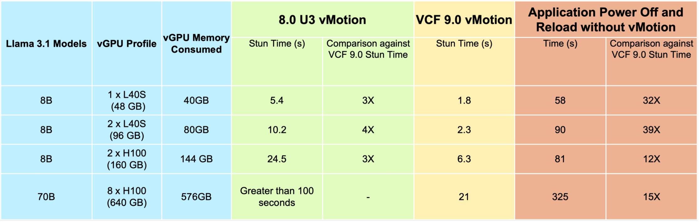

VMware's latest release of Cloud Foundation 9.0 introduces an important new feature for managing AI infrastructure: **Enhanced vMotion for vGPU VMs**. This new feature substantially improves the management of large language models (LLMs) in virtualized environments. For an in-depth technical overview, please read **[Justin Murray](https://www.linkedin.com/in/justin-murray-6118481/)**'s **[detailed article](https://blogs.vmware.com/cloud-foundation/2025/06/19/enhanced-vmotion-for-vgpu-vms-in-vmware-cloud-foundation-9-0/)** on the subject.

## The Power of vMotion

Traditionally, vMotion has been a cornerstone of VMware's value proposition, enabling two critical benefits:

1. Infrastructure maintenance without workload disruption
2. Maintenance without coordination with workload owners

These capabilities have allowed vAdmins to perform updates and maintenance with minimal impact on running services, a crucial advantage in today's always-on digital landscape.

## The Reality of Maintenance

However, the process of bringing down a model for maintenance is more complex and time-consuming than often assumed. Let's consider the steps involved in taking down and bringing back a 70B parameter model in a three-replica deployment:

1. Initiate graceful shutdown of one replica (30-60 seconds)
2. Redirect traffic to remaining replicas (immediate)
3. Wait for in-flight requests to complete (variable)
4. Unload model from GPU memory (10-20 seconds)
5. Perform maintenance or updates (variable)
6. Reload 70B model into GPU (2-5 minutes)
7. Warm up the model (1-3 minutes)
8. Re-enable the replica for traffic (30-60 seconds)
9. Rebalance load across all replicas (immediate)

This process could take 4-10 minutes, excluding maintenance time coordination, potentially impacting service levels and requiring careful coordination between the infrastructure and AI teams.

## Enhanced vMotion for vGPU VMs: A New Approach

The new Enhanced vMotion feature in VCF 9.0 addresses these challenges by dramatically reducing the impact on LLM services. For a 70B model with a massive KV cache, the service interruption is reduced to approximately 21 seconds.

This improvement is achieved through intelligent handling of different types of GPU memory:

1. **Static Memory (Model Weights):** vMotion identifies the immutable collection of weights that form the core of the LLM. These are pre-copied to the destination machine while keeping the LLM active and available for the application frontend.
2. **Dynamic Memory (KV-Cache and Activations):** The memory used for processing prompts and generating answers is continuously changing. vMotion manages this by briefly stunning the VM to control the GPU I/O flow of these dynamic bits.

The stun time depends on the amount of dynamic memory on the GPU and the bandwidth between the source and destination hosts. Crucially, this process preserves the KV cache intact, minimizing the impact on service-level behavior immediately after maintenance.

## Key Benefits

This advancement in vMotion technology offers several significant benefits for AI workload management:

1. Minimal service disruption during maintenance
2. Preserved model state, including the valuable KV cache
3. Improved operational efficiency for infrastructure maintenance
4. Reduced the need for coordination between infrastructure and AI teams
5. Consistent service level behavior post-maintenance

## Conclusion

Enhanced vMotion for vGPU VMs in VMware Cloud Foundation 9.0 represents a significant step forward in bridging the gap between the flexibility of virtualization and the demanding requirements of AI workloads. By addressing the specific needs of LLMs while leveraging the strengths of virtualization, it's setting a new standard for managing AI deployments in enterprise environments.

As organizations continue to integrate AI into their core operations, solutions like this will be crucial in maintaining the delicate balance between operational efficiency and service reliability. The impact of this technology on AI operations in various organizations will be an interesting development to watch in the coming months.
