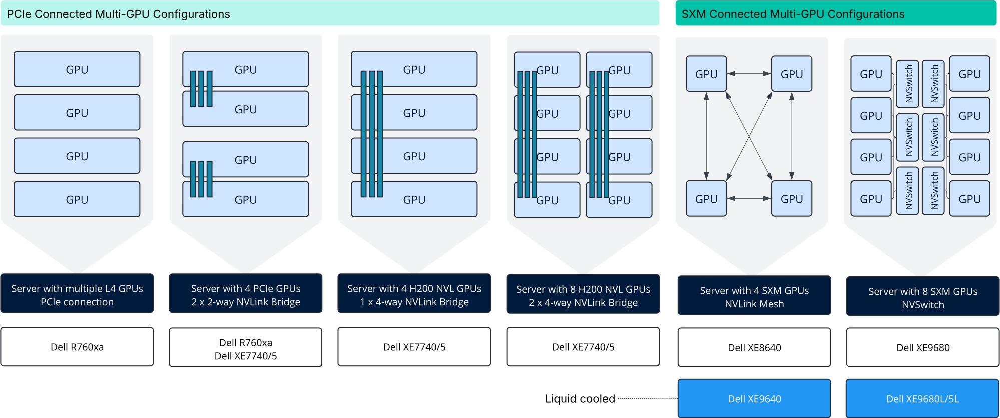

During VMware Explore, numerous conversations highlighted that most customers plan to deploy systems with two or more GPUs. The next challenge is deciding **which type of multi-GPU configuration to adopt** — a choice that depends on intra-node communication, inter-node interconnects, and cooling strategies.

To better understand where organizations are heading, I’ve created a short survey. The diagram below illustrates the options available in the NVIDIA-certified systems portfolio, which I use as a reference point in the questions. Your feedback will help map out how different configurations are being considered and provide valuable input as we align our product strategy with customer needs.  
**  
How to Read the Diagram**

The diagram is intended to illustrate the spectrum of multi-GPU configurations, ranging from PCIe-based systems to NVLink bridge topologies and NVSwitch-enabled SXM platforms. To make this more tangible, I’ve used Dell’s AI server portfolio as an example, allowing you to check out the exact systems on Dell’s website to view their specifications. As an additional detail, the boxes are color-coded:

- White boxes represent air-cooled servers

- Blue boxes represent liquid-cooled servers

### PCIe Connected GPUs

PCIe-connected systems support 1–16 GPUs as standard add-in cards. Communication between GPUs relies on PCIe lanes or, in some cases, NVLink bridges. Some NVIDIA datacenter GPUs, such as the [L4](https://www.nvidia.com/en-us/data-center/l4/?ncid=no-ncid) and the highly anticipated [RTX PRO 6000](https://www.nvidia.com/en-us/data-center/rtx-pro-6000-blackwell-server-edition/?ncid=no-ncid), do not offer NVLink capabilities. H100 and H200 GPUs can be deployed without an NVLink Bridge, resulting in a theoretical GPU-to-GPU bandwidth of between 64 GB/s and 128 GB/s, depending on the PCIe specification of the device.

### NVLink

An NVLink bridge is a direct, high-bandwidth connection between GPUs, designed to bypass the limitations of PCIe and enable GPUs to share memory and exchange data at significantly higher speeds. Unlike PCIe, which is a general-purpose bus, NVLink is purpose-built for GPU-to-GPU communication.

**2-way NVLink Bridge (H100 PCIe):** In a 2-way setup, two GPUs are directly linked, creating a fast point-to-point connection. On the [NVIDIA H100 PCIe](https://www.nvidia.com/en-us/data-center/h100/?ncid=no-ncid), each GPU can communicate with its peer at up to 600 GB/s of bandwidth (NVLink 4.0), compared to just 128 GB/s over PCIe Gen5. This is typically used in dual-GPU or paired configurations.

**4-way NVLink Bridge (H200 PCIe):** In a 4-way setup, four GPUs are interconnected in a mesh topology. Each GPU can communicate with multiple peers simultaneously, thereby improving bandwidth across the group. On the [NVIDIA H200](https://www.nvidia.com/en-us/data-center/h200/?ncid=no-ncid) PCIe, each GPU supports up to 900 GB/s of GPU-to-GPU bandwidth (NVLink 5.0). This enables stronger scaling for 4-GPU systems, though it doesn’t provide the full all-to-all fabric that NVSwitch delivers.

### NVSwitch with SXM GPUs

SXM is NVIDIA’s server GPU module format; instead of a PCIe add-in card, the GPU is mounted directly onto the motherboard using an SXM socket. This allows for higher power delivery, denser designs, and direct integration with high-bandwidth GPU interconnects.

SXM GPUs can be deployed in two main [HGX configurations](https://www.nvidia.com/en-us/data-center/hgx/?ncid=no-ncid):

**4-GPU HGX (NVLink):** In 4-GPU systems, SXM GPUs are interconnected using [NVLink](https://www.nvidia.com/en-us/data-center/nvlink/) without an NVSwitch fabric. On the H100 SXM, each GPU provides up to 900 GB/s of GPU-to-GPU bandwidth (NVLink 4.0), enabling strong scaling within the node while avoiding PCIe bottlenecks.

**8-GPU HGX (NVSwitch)**: In larger systems with eight SXM GPUs, [NVSwitch](https://www.nvidia.com/en-us/data-center/nvlink/#nvswitch) components are integrated on the motherboard to create a fully connected all-to-all fabric. Every GPU can communicate with every other GPU at NVLink speeds, eliminating peer-to-peer bottlenecks. On both the H100 SXM and H200 SXM, each GPU supports up to 900 GB/s of GPU-to-GPU bandwidth when connected through NVSwitch. The B200 HGX server supports 1.8 TB/s of GPU-to-GPU bandwidth. This design enables GPUs to operate effectively as a single, unified pool of compute and memory.

### **Call to Action**

I’d like to ask you to take a few minutes to answer the six questions in this survey. The goal is to gain a better understanding of how organizations plan their future GPU server configurations — from retrofitting versus new systems, to GPU scale, interconnects, and cooling.

Your input will help me build a clearer picture of the distribution of server choices across the industry. I’ll use this insight to take back into our discussions and help align VMware’s product strategy with the directions customers are heading.

<iframe src="https://docs.google.com/forms/d/e/1FAIpQLSeohcsGD_hkHBd9ZJv4RdMEUb6hz2WbP7siH0pUVgmPapjkHw/viewform?embedded=true" width="640" height="2080" frameborder="0" marginwidth="0" marginheight="0">Loading…</iframe>
