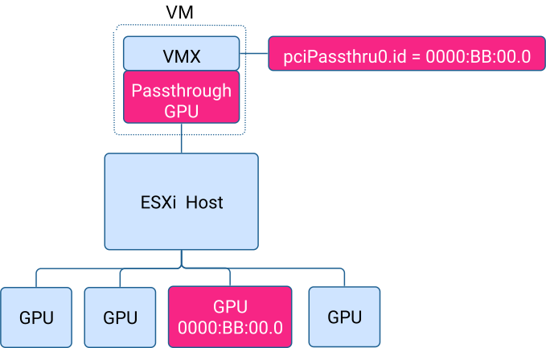

## Architecting AI Infrastructure - Part 3

In the first two articles, I looked at GPU consumption models and how AI workloads state their accelerator needs. In vSphere, these models take shape through virtual machine settings. CPU reservations, memory guarantees, and GPU profile choices together create a clear resource contract.

This article moves from discussing resource consumption to explaining placement. After a workload states its requirements, how does the platform decide where to run it? GPU placement in vSphere is not random or based on guesswork. Instead, it is a structured orchestration process that combines declarative intent, hardware awareness, and cluster-wide optimization.

## VM Configuration Defines the Resource Contract

In vSphere, a GPU-backed workload is defined by its virtual machine configuration. That configuration expresses intent: how much GPU memory is required, which profile to use, how many devices are needed, and what CPU and memory guarantees accompany them.

These needs are evaluated when the virtual machine starts. The platform ensures the cluster meets the resource contract before allowing the workload to run. Once resources are assigned, the accelerator setup remains the same throughout the workload’s lifecycle. This stability helps keep performance predictable, which is important for model behavior and service reliability.

The same principle applies in Kubernetes environments such as 

[VMware Kubernetes Service]: https://www.vmware.com/products/cloud-infrastructure/vsphere-kubernetes-service

. Worker nodes are virtual machines, and their GPU configuration determines the accelerator capacity exposed to the container runtime. Pods request GPUs through Kubernetes abstractions, but those requests are handled at the infrastructure level based on the VM configuration. Kubernetes expresses workload-level demand. vSphere enforces infrastructure-level guarantees.

## GPU Mode Defines the Device Participation Model

At the host level, GPU mode determines how devices participate in the cluster resource model. With passthrough mode, the GPU appears as a full physical device. The workload uses the whole accelerator for as long as it runs. This setup gives clear ownership and full access to the device.

With vGPU mode, the GPU uses profiles to set clear memory and compute limits. One physical device can support several workloads at once, while keeping them separate. Whether using time-sliced setups or hardware-partitioned MIG mode, allocations always stay within the device’s physical limits.

GPU memory is never oversubscribed and shared beyond its limits. In time-sliced mode, compute cores are shared, but memory stays dedicated. In the image below, two VMs with different vGPU profiles use the same physical device. VM4 is scheduled first, and feeds all the cores with the data stored in its allocated memory space. VM8 awaits its time-slice, when it's scheduled it feeds all the cores with the data stored in its memory space.

In MIG mode, hardware enforces isolation with fixed memory and compute partitions, referred to by NVIDIA as instances. VM4 and VM8 are scheduled continuously, each having access to a subset of cores and memory space that are shaped by the MIG vGPU profile (MIG instance). The selected GPU mode (MIG or time-slicing) determines how a device participates in the cluster’s allocation model.

## Allocation Shapes Device Topology

In vGPU mode, a device begins in a neutral state. The first admitted workload selects a profile, shaping how the device is partitioned or scheduled.

After that, the device’s setup matches the chosen allocation. Future workloads follow this setup. There is flexibility when assigning resources initially, but the mode (Time-slice or MIG) is maintained throughout use until the GPU is empty again.

This approach ensures the device setup matches the workload's needs and keeps things predictable across the cluster.

## From Static Device Binding to Cluster-Aware Allocation

With passthrough enabled, the GPU is presented to the virtual machine as a physical PCI device. How the device is referenced in the VM configuration directly affects placement and recovery.

With traditional static DirectPath I/O, the virtual machine configuration references a specific physical device using its Segment/Bus/Device/Function (SBDF) address. That address corresponds to a particular ESXi host and a specific PCIe slot on that host. The relationship between workload and hardware is explicit and immutable.

This model gives each device a fixed identity. The workload is bound to a specific accelerator. However, it can only run on that host-device pair. If the host goes into maintenance or the device fails, the virtual machine cannot restart elsewhere without manual changes. If the GPU is replaced or moved, the SBDF reference must be updated before the VM can start again. Placement and recovery depend on a single hardware instance.

Dynamic DirectPath I/O modernizes this approach using the Assignable Hardware framework of the vSphere cluster. Instead of using a fixed SBDF address, the virtual machine declares device characteristics such as vendor IDs, device features, and hardware labels. In this example below, a label 'Training' was assigned to the A100 GPU. When powered on, the platform evaluates all hosts in the cluster and finds the GPUs that meet the declared requirements stated in the VM configuration (Training). A compatible device is then assigned automatically.

The allocation remains exclusive and predictable during runtime. What changes is the range of eligible hosts and recovery options. Placement is now cluster-aware. If a host fails, vSphere High Availability can try to restart the virtual machine on another host that meets the device requirements, as long as there is enough capacity.

Dynamic DirectPath I/O, therefore, expands failover options from a single node to the entire compatible cluster. Hardware ownership remains explicit. Runtime allocation remains stable. Recovery behavior becomes infrastructure-driven rather than manually reconfigured. This model balances predictability with cluster-level resiliency. The workload keeps direct access to hardware, while the platform stays aware of other compatible options.

## From Resource Declaration to Cluster-Level Orchestration

When a GPU-backed virtual machine powers on, its resource contract is already set. The placement process starts by checking that contract against the cluster’s hardware setup.

The Assignable Hardware framework does the first evaluation. For passthrough configurations using Dynamic DirectPath I/O, host eligibility is determined by matching device characteristics to available hardware. For vGPU configuration, the system checks vGPU profile compatibility, device mode, available memory, and topology limits. Hosts that do not meet the GPU requirements are removed from the list. Only hosts that can provide the needed accelerator setup are left.

Once the list of compatible hosts is defined, DRS evaluates placement using its Goodness calculation. This process looks at everything together: CPU headroom, memory reservations, NUMA alignment, datastore access, network reachability, and overall cluster balance.

Consider a cluster of six ESXi hosts. Two hosts operate in passthrough mode. Three hosts operate in vGPU time-slice mode. One host operates in MIG mode. Now imagine a virtual machine configured with a 40GB time-sliced vGPU profile, 16 vCPUs, and 128GB of fully reserved memory.

The placement process begins with compatibility filtering. The two passthrough hosts are excluded because they cannot provide a time-sliced profile. The MIG host is excluded because the requested configuration requires time-slice mode. That leaves three compatible hosts.

Within the eligible host pool, DRS applies its Goodness calculation. It evaluates which host can satisfy the VM’s CPU and memory guarantees while keeping the cluster load balanced. The goal is to maximize VM Happiness while keeping the cluster healthy. VM Happiness shows how closely a virtual machine gets the resources it needs. Accelerator capacity alone does not guarantee good performance. CPU scheduling, memory location, storage access, and network placement all affect how well things run. DRS looks at all these factors together to find the best placement. GPU compatibility decides where a workload can run. The Goodness calculation determines where it should run.

------

## Heterogeneous Accelerators and Topology Awareness

This orchestration model supports heterogeneity at the device level. A cluster can simultaneously support passthrough GPUs, time-sliced vGPU devices, and MIG-partitioned accelerators. Assignable Hardware filters hosts based on declared device characteristics, allowing each virtual machine to express the accelerator model that best fits its workload.

Please note that time-sliced vGPU mode spans a broad spectrum of configurations. It can expose fractional profiles for shared inference, full-device profiles for exclusive consumption, or be captured in a topology-aware multi-GPU allocation with vSphere device groups for larger workloads.

When combined with Device Groups and integration with 

[NVIDIA Fabric Manager]: https://docs.nvidia.com/datacenter/tesla/fabric-manager-user-guide/index.html

, vSphere understands GPU interconnect topology. Multi-GPU virtual machines can be placed on devices that share 

[NVLink]: https://www.nvidia.com/en-us/data-center/nvlink/

 domains, preserving bandwidth and latency characteristics required by distributed inference. GPUs are evaluated not as abstract counters, but as structured, topology-aware resources.

------

## Placement Policy: Balancing Utilization and Fragmentation

Besides compatibility and Goodness evaluation, DRS placement can also be guided by policy.

By default, DRS operates in a Best Performance assignment model. GPU-backed workloads are distributed across compatible hosts to balance load and maximize aggregate utilization. This keeps the workload distribution balanced and avoids concentrating demand on a single host.

In fast-changing AI environments, fragmentation can become a big problem. As single-GPU and multi-GPU workloads come and go, isolated devices may be left scattered across hosts, making it harder to meet future high-demand placements.

For these situations, DRS can use Consolidation mode. In this mode, workloads are packed onto fewer hosts when possible. Reducing the spread of allocations makes it easier to place future workloads. Best Performance focuses on balanced use of resources right now. Consolidation focuses on keeping placement flexible for the future. Compatibility is always enforced. The Goodness calculation still looks at everything together. Policy guides which options are preferred within the eligible group.

------

## Complementary to Kubernetes Scheduling

This layered orchestration model aligns naturally with Kubernetes scheduling principles. Kubernetes DRA evaluates node labels, resource availability, and topology constraints before binding a Pod.

vSphere works with similar principles at the infrastructure layer. Device characteristics are declared explicitly. Hardware capabilities are surfaced through structured identifiers and topology awareness. Placement decisions respect real interconnect domains and resource boundaries. Kubernetes decides which node a workload should run on. vSphere decides how hardware resources are allocated and balanced across the infrastructure.

Together, they create a layered control system that matches workload intent with reliable hardware enforcement.

------

## Looking Ahead: GPU Policy and Long-Term Cluster Efficiency

Placement rules set correctness and best use at the time of admission. Long-term efficiency, though, depends on GPU policy decisions that guide allocation over time.

Mixed mode versus Same Size mode, profile mixing rules, device grouping, and assignment strategies all affect how flexible an accelerated cluster can be. These policies decide how GPUs are divided, how fragmentation builds up, and how likely it is that future placements will work as workloads grow.

The next article will look at these GPU policy controls in detail. Knowing how policy affects topology and allocation is key to building AI clusters that stay resilient, efficient, and scalable under heavy use.