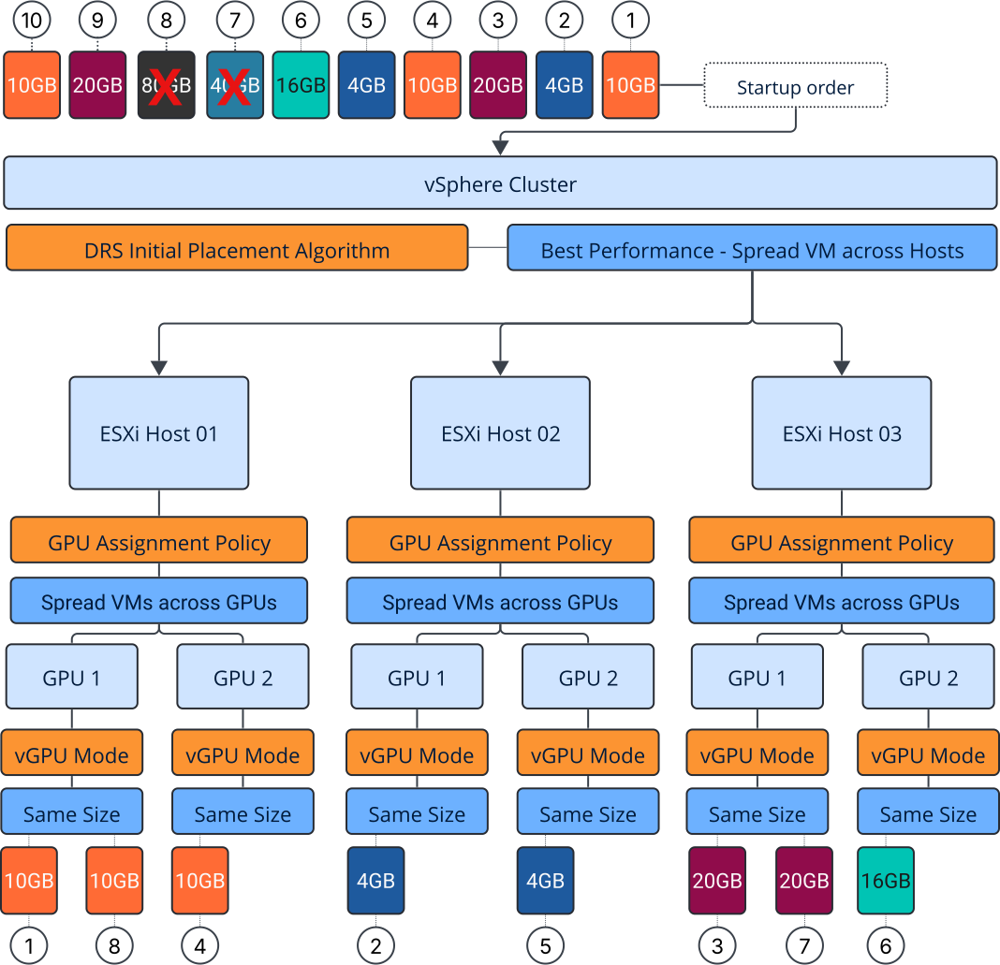
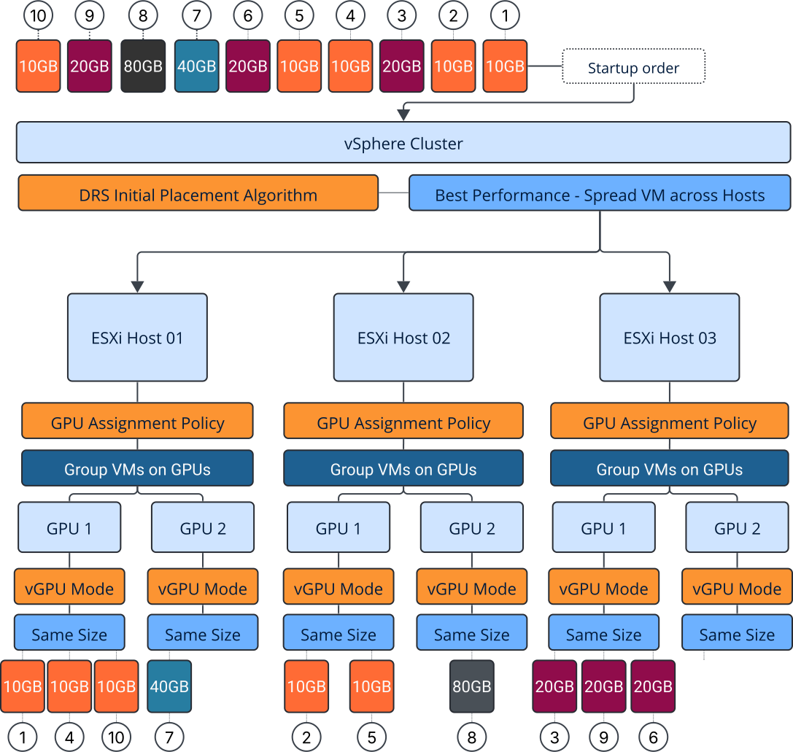

## Architecting AI Infrastructure - Part 5

In the [previous article](http://localhost:1313/posts/2026-02-17-how-vsphere-gpu-modes-and-assignment-policies-determine-host-level-placement/), we looked at how GPUs are placed within an ESXi host and how GPU modes and assignment policies determine which physical GPU a workload uses. These decisions impact more than just the initial placement of workloads. They also shape how GPU capacity changes over time, affecting fragmentation, consolidation, and how easily new workloads can be scheduled. In this article, we will look at workloads that use fractional GPU profiles and how their sizing choices impact overall platform efficiency.

AI platforms typically run a wide range of workloads. Along with large language models that use full GPUs, span several GPUs, or span across multiple hosts, most setups also include smaller but important services. Embedding models support retrieval pipelines, small language models handle tasks like moderation and security analysis, and data science notebooks support experimentation and model development. As mentioned in the earlier article about same-size and mixed-size deployments, these workloads often use fractional vGPU profiles. To get the most from the platform, you need to choose the right vGPU profile and vGPU mode. It can be tempting to size profiles as closely as possible to actual memory use, but sizing too tightly can isolate GPU capacity and lower overall efficiency.

## Slim-fitting vGPU Profiles to Workload Memory Footprint
The following examples show a representative selection of common AI workloads, their typical GPU memory consumption, and the vGPU profile each would receive when sized as closely as possible to its observed memory footprint. Instead of right-sizing (you'll see later), let's call this slim-fitting.

| Workload Type           | Model                                      | Static Memory                | Dynamic Memory                       | Total GPU Memory | Slim-Fit                   |
| ----------------------- | ------------------------------------------ | ---------------------------- | ------------------------------------ | ---------------- | -------------------------------- |
| Embedding               | BGE-M3 (560M)                              | ~1.1GB (FP16)                | 2–3GB (activations + batch)          | 3–4GB            | 4GB                              |
| Embedding               | Qwen3-Embedding-8B                         | ~16GB (FP16)                 | 4–6GB (larger batches + activations) | 20–22GB          | 20GB (lean) or 40GB (production) |
| Small LLM               | GLM-4.7-Flash (30B MoE)                    | 12–15GB (Q3–INT4)            | 3–5GB (KV cache, low concurrency)    | 18–20GB          | 20GB                             |
| Small LLM               | GPT-OSS-20B (MXFP4)                        | ~10GB static (MXFP4 weights) | 3–5GB (KV cache + activations)       | 13–15GB          | 16GB                             |
| Full-slot LLM           | GPT-OSS-120B (heuristic/security scanning) | Full model footprint         | Minimal concurrency, low context     | ~80GB            | 80GB                             |
| Notebook / Data Science | Jupyter workloads                          | Variable                     | Variable                             | Typically <20GB  | 10GB                             |

## Theoretical Slot Capacity

Before we look at placement behavior, it's useful to understand the cluster's theoretical capacity. With six 80GB GPUs, the number of possible slots depends on the vGPU profile size. The numbers below show a scenario where every GPU uses the same profile type. These are the maximum slot counts if only one vGPU profile is used. In real setups with different profile sizes, it's much harder to predict available slots because it depends on how profiles are distributed across GPUs.

| Profile Size | Slots per 80GB GPU | Total Slots (6 GPUs) |
| ------------ | ------------------ | -------------------- |
| 4GB          | 20                 | 120                  |
| 10GB         | 8                  | 48                   |
| 16GB         | 5                  | 30                   |
| 20GB         | 4                  | 24                   |
| 40GB         | 2                  | 12                   |
| 80GB         | 1                  | 6                    |

These numbers show the highest possible density. In reality, factors like vGPU mode, assignment policy, profile variety, and how workloads start will decide how much of this capacity you can actually use over time.

## Choosing the vGPU Mode

This points to a catalog of six profiles: 4GB, 10GB, 16GB, 20GB, 40GB, and 80GB. But defining the catalog is just the first step. Next, you need to decide how these profiles can share physical GPUs, which depends on the chosen vGPU mode and assignment policy. To see how these choices affect real-world behavior, let's look at practical examples of how GPU modes work when workloads start up.

Before we go through the distribution example, it's important to know the default behavior. By default, DRS uses Best Performance mode, which evenly distributes workloads across hosts rather than consolidating them. There is an advanced setting to favor consolidation, but it mainly affects full-GPU and multi-GPU setups; fractional vGPU profiles are not considered during initial placement. The example below uses an empty cluster to make the behavior clear. In real environments with running workloads, host selection can change based on cluster balance and VM scoring, which can affect where new workloads are placed.

## Same Size vGPU Mode – Best Performance Assignment Policy

With Same Size mode and the Best Performance assignment policy, vSphere spreads workloads across available GPUs to balance load. In a self-service environment where startup order is unpredictable, smaller workloads often land first, causing GPUs to lock to different profile sizes early in the process.

In this example, embedding models, notebooks, and small LLMs start before the larger 40GB and 80GB workloads. Since identical profiles are spread across hosts, GPUs quickly lock into 4GB, 10GB, 16GB, and 20GB profiles throughout the cluster. When the larger workloads try to start, there are no GPUs left that can take a 40GB or 80GB profile, even though there is still enough total memory in the environment.

Once the first workloads start, each GPU becomes locked to a specific profile size. At this stage, the cluster stops acting as a shared pool of GPU memory. Now, capacity is only available within the profile domains set during startup.

| Profile Size | Available Slots in Cluster |
| ------------ | -------------------------- |
| 4GB          | 38                         |
| 10GB         | 14                         |
| 16GB         | 4                          |
| 20GB         | 3                          |
| 40GB         | 0                          |
| 80GB         | 0                          |

## Same Size vGPU Mode – Consolidation Assignment Policy

Consolidation does not affect which host is chosen; it only changes how GPUs within the selected host are used.

If you use the same workload mix with Same Size mode but switch to the Consolidation assignment policy, the outcome changes a lot. Host selection still uses round-robin, but within each host, workloads are grouped onto compatible GPUs instead of being spread out. This means fewer GPUs get locked early, leaving some GPUs free for larger profiles later on.

As a result, the 40GB workload can use an unlocked GPU, and a full-slot 80GB workload can still be placed because at least one GPU is left completely free. The total resources in the cluster stay the same, but the assignment strategy decides whether capacity stays usable or becomes fragmented.

The failure is not caused by a lack of GPU memory, but by profile fragmentation introduced during random startup.

## Available Slot Capacity After Consolidation

The consolidation example shows that placement policy does not increase total GPU capacity, but it does affect how much of that capacity you can actually use.

| Profile Size | Spread (Best Performance) | Group (Consolidation) |
| ------------ | ------------------------- | --------------------- |
| 4GB          | 38                        | 18                    |
| 10GB         | 14                        | 6                     |
| 16GB         | 4                         | 3                     |
| 20GB         | 3                         | 2                     |
| 40GB         | 0                         | 1                     |
| 80GB         | 0                         | 0                     |

In Group mode, an empty GPU is available for any profile because it is not locked yet.

The main difference from the spread example is not total memory, but flexibility. Consolidation leaves fewer profile domains active, so larger profiles still have valid placement options.

## Re-evaluating Right-sizing

Right-sizing is therefore not only a workload decision but also a platform decision. The goal is not simply to match a workload’s minimum memory requirement, but to choose profile sizes that improve opportunities for cluster-wide capacity allocation.

| Profile Size | Spread – Placed | Spread – Available | Group – Placed | Group – Available |
| ------------ | --------------: | -----------------: | -------------: | ----------------: |
| 4GB          |               2 |                 38 |              2 |                18 |
| 10GB         |               3 |                 13 |              3 |                 5 |
| 16GB         |               1 |                  4 |              1 |                 4 |
| 20GB         |               2 |                  2 |              2 |                 2 |
| 40GB         |               0 |                  0 |              1 |                 1 |
| 80GB         |               0 |                  0 |              1 |                 0 |

*Right-sizing GPUs = workload fit + cluster efficiency*

## Same Size vGPU Mode – Best Performance (Right-sized Profiles)

In the right-sized spread scenario, the cluster converges toward only two active profile sizes: 10GB and 20GB. While this reduces profile diversity compared to the slim-fit experiment, the spreading behavior still distributes workloads across hosts and GPUs, leading to early profile locking. As a result, only a subset of the workload types can be placed, and larger profiles never become active. The diagram below illustrates how the cluster ends up operating with just two profile domains despite having sufficient raw GPU capacity.

| Profile Size | Placed | Available |
| ------------ | -----: | --------: |
| 10GB         |      5 |        27 |
| 20GB         |      3 |         5 |
| 40GB         |      0 |         0 |
| 80GB         |      0 |         0 |

## Same Size vGPU Mode – Consolidation (Right-sized Profiles)

With consolidation enabled, the same workload mix produces a very different outcome. All four profile sizes become active, meaning every workload type in the catalog is successfully deployed. Because compatible workloads are grouped onto existing GPUs, one GPU remains completely uncommitted. This fully open device represents flexible capacity that can still accept any profile size, including large or full-slot workloads. The diagram below highlights how consolidation preserves both workload coverage and future placement flexibility.

| Profile Size | Spread – Placed | Spread – Available | Group – Placed | Group – Available |
| ------------ | --------------: | -----------------: | -------------: | ----------------: |
| 10GB         |               5 |                 27 |              5 |                19 |
| 20GB         |               3 |                  5 |              3 |                 5 |
| 40GB         |               0 |                  0 |              1 |                 3 |
| 80GB         |               0 |                  0 |              1 |                 1 |

Consolidation increases the benefits of right-sizing because having fewer profiles means there are fewer lock boundaries.

## Observation

Right-sizing profiles does not add more total GPU capacity. Instead, it helps make better use of what you have. With fewer profile sizes, consolidation works better, fragmentation goes down, and the cluster acts more like a shared resource pool instead of a set of isolated profile domains.

## Looking Ahead: Mixed Size Mode

This article focused on Same Size mode, where GPUs lock to a profile after the first workload is placed. In this setup, right-sizing helps efficiency by reducing the number of profile domains and keeping placement flexible. Mixed Size mode changes things completely. Profile locking goes away, but a new challenge appears: placement IDs and how profile sizes fit into GPU memory ranges. In the next part of this series, we will repeat the experiment using Mixed Size mode to show how placement changes, why fragmentation still happens, and why right-sizing still matters even without GPU locking.

Same Size mode fragments GPUs across different profiles, while Mixed Size mode can cause fragmentation within placement ranges.
