## Architecting AI Infrastructure - Part 6

[Last time](http://localhost:1313/posts/2026-02-19-how-same-size-vgpu-mode-and-right-sizing-shape-gpu-placement-efficiency/), I looked at how Same Size vGPU mode works with different assignment policies and how right-sizing profiles can make placement more flexible. The main point was that both profile variety and assignment choices have a big impact on how much GPU capacity you can actually use over time.

## Understanding Placement IDs and Siloed Capacity

This article focuses on Mixed Size mode. Unlike locking a GPU to one profile after the first placement, Mixed Size lets you use different profile sizes on the same device. This might seem like an easy fix for fragmentation, but it brings a new challenge: placement IDs. These are fixed memory spots on the GPU where a profile can begin, so even if memory appears free, you can't always use it unless it aligns with a valid placement spot. For more details on how placement IDs work, see [Part 4](http://localhost:1313/posts/2026-02-17-how-vsphere-gpu-modes-and-assignment-policies-determine-host-level-placement/).

## Placement Flow and Local Optimization

GPU placement is not a single decision but a sequence of decisions that happen at different layers of the platform.

First, Assignable Hardware creates a list of hosts that meet the VM's GPU needs and labels. Then, DRS evaluates those hosts and selects the best one based on CPU and memory availability, cluster balance, and how well the VM will run there. Only after a host is chosen does the GPU manager pick which physical GPU will handle the workload.

To keep things simple, the examples here assume all hosts are used equally. In this setup, DRS appears to be distributing workloads in a round-robin manner. Real environments are usually more complex, but this simplification helps us focus on how GPU placement works.

This is where it gets interesting. Inside the chosen host, the GPU manager doesn't just pick any spot. It examines the memory layout, prefers the least-used GPU, checks possible placements, and picks the one that minimizes fragmentation, all while adhering to placement-ID rules for the profile size. This is a smart process. The scheduler isn't just finding an open slot—it's trying to keep future options open by making the best placement it can right now.

But even with this smart approach, there's a basic limit. Each placement is the best choice for the current situation, but the scheduler can't predict what profile sizes will come next or in what order. Over time, making the best choice each time can still result in a memory layout that future workloads can't fully utilize.

The platform focuses on making the best placement right now, not for every possible future placement. Bridging the gap between these local decisions and the overall outcome is where good profile catalog design comes in.

## Fragmentation Depends on the Profile

Fragmentation depends on the profile you want to place. A GPU might look like it has enough free memory, but you still might not be able to use it if the placement IDs don't line up. Here's an example.

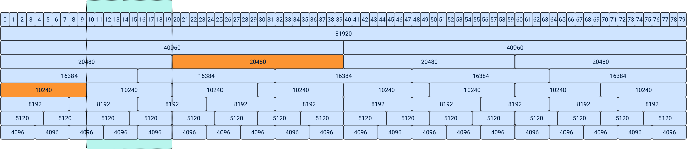

At first, the layout looks fine. There's a 10GB gap between the two placements, so it seems like an 8GB profile should fit. But placement IDs decide where profiles can start. In Mixed Size mode, 8GB profiles on an 80GB GPU can't start just anywhere. In this case, placement ID 8 is already inside the 10GB profile. The next valid placement ID is 16, but there isn't enough space there because the 20GB profile starts at placement ID 20. So, even though the memory gap is large enough, there's no valid placement ID for the 8GB profile in that spot.

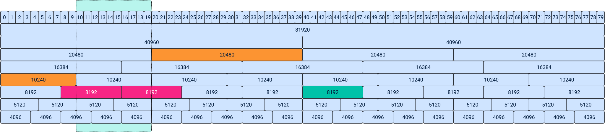

So, the vGPU manager places the profile at the next available placement ID, further along in memory. The gap persists, and fragmentation increases, even though the scheduler picked the best possible spot. This shows an important point: fragmentation depends on the profile you're trying to place. A GPU might look fragmented for one profile size but work fine for another. It's not just about free memory; placement alignment matters most.

Profiles that share the same placement-ID boundaries are more likely to fill gaps left by earlier placements. Over time, using aligned profile catalogs helps reduce fragmentation and maintain flexible placement.

## Slim-Fit versus Right-Size

Before we get into tools, it's important to look at the main design choice. Slim-fitting profiles try to match workload memory use as closely as possible. Right-sizing considers both the workload's needs and the platform's efficiency.

Siloed capacity is memory that no workload can use because there's no compatible placement ID left. Picking profiles that align well with placement boundaries reduces the risk of siloed capacity and gives workloads more room to grow.

This is important because AI workloads rarely use the same amount of memory at all times. Things like KV cache growth, changes in batch size, or more users can make memory needs go up and down, so it's hard to size exactly. That's why right-sizing is really a platform decision, not just a workload one.

## Equal Size versus Mixed Size Reality

People often say the Mixed Size mode lowers density compared to the Equal Size mode. While that's technically true, it's often misunderstood because it doesn't affect all profiles equally. Only certain profile sizes see a drop in density. For many common profiles, there's no loss at all when switching from Same Size to Mixed Size mode. The Density Delta Chart below shows the real difference.

| Profile | Equal | Mixed | Practical Impact |
|---------|-------|-------|-----------------|
| 10GB | same | same | none |
| 20GB | same | same | none |
| 40GB | same | same | none |
| 16GB | -1 slot | reduced | moderate |
| 8GB | -2 slots | reduced | situational |
| 4GB | larger drop | reduced | mostly dev |

The profiles most often used for production AI workloads, such as 10GB, 20GB, and 40GB, don't lose density in Mixed Size mode. The reductions mostly affect smaller profiles, which are usually used for development, testing, or very limited edge cases. For more details on the maximum number of vGPU profiles per GPU, check the [NVIDIA AI Enterprise documentation](https://docs.nvidia.com/ai-enterprise/release-7/7.0/infra-software/vgpu.html#virtual-gpu-types-for-supported-gpus).

So, the real trade-off isn't just about density versus flexibility. Equal Size mode avoids placement-ID issues by locking GPUs early, while Mixed Size mode skips the locking but makes placement-ID alignment the key to efficiency. Your choice should be based on how you design your profile catalog, not just on theoretical slot numbers.

## Introducing the Silo Capacity Visualizer

To help explain how placement-IDs work, I created the [Silo Capacity Visualizer](https://frankdenneman.nl/tools/vgpu-silo-capacity-calculator/).

This tool is just for learning and isn't connected to Broadcom or NVIDIA. It doesn't predict how a whole cluster will behave or simulate every scheduling decision. Instead, it answers one question: how does your choice of profile catalog affect the memory layout inside a GPU?

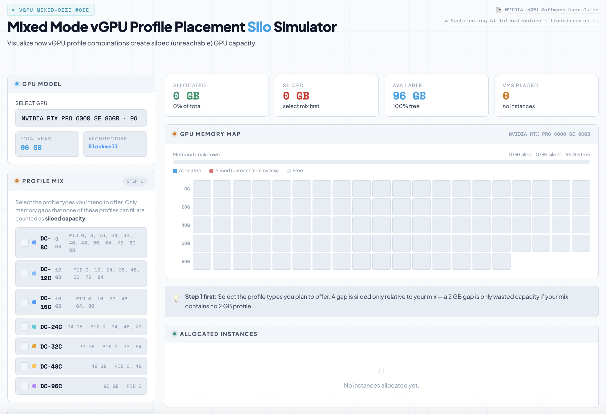

By running random placement sequences, the tool shows how different profile mixes affect the amount of capacity siloed due to placement-ID misalignment. It's not meant to give exact predictions. The goal is to help architects see why some profile combinations work better than others before using them at scale. The first step is to select the GPU model you use in your datacenter.

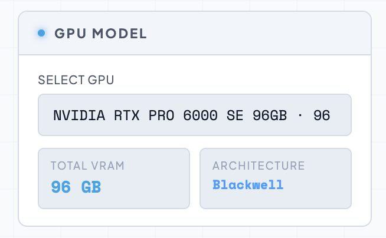

The dropdown menu lists all GPUs, showing their placement IDs as found in the official [NVIDIA vGPU User Guide](https://docs.nvidia.com/vgpu/19.0/grid-vgpu-user-guide/index.html#vgpu-placements-for-gpus-in-mixed-size-mode). These are the ones used in VCF environments.

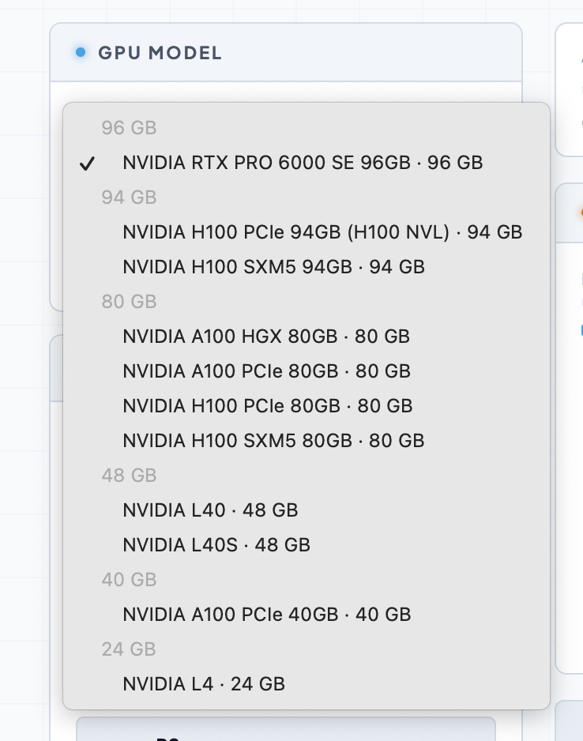

I selected the popular A100 PCIe 80GB device, and the UI displays the related vGPU time-sliced profiles.

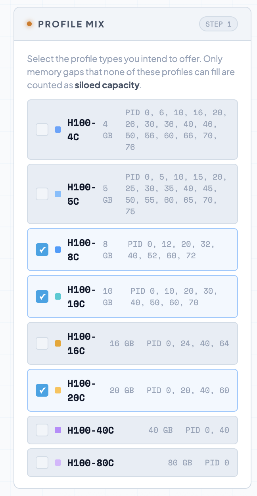

To demonstrate the tool, I picked three profiles: A100-8C (8GB), A100-10C (10GB), and A100-20C (20GB).

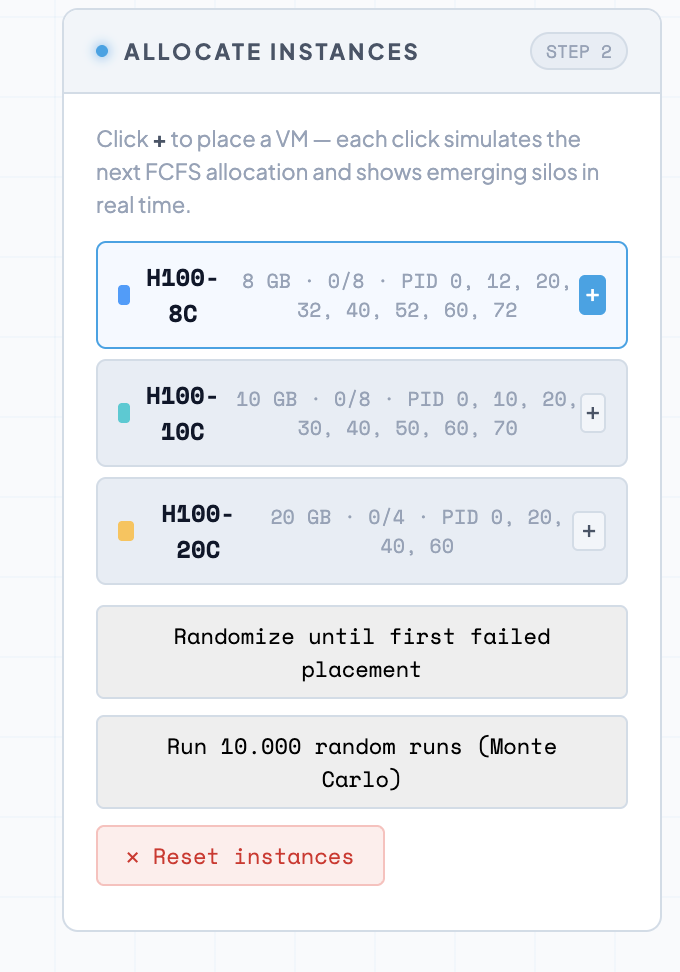

In the field below, the three profiles appear, and the tool lists the placement IDs for those vGPU profiles. The tool provides three options. In the profile, the + button lets you manually place the profile in GPU memory. When clicking the + button for the A100D-8C profile, it appears in the GPU memory map, and the allocated memory counter is incremented by the profile's memory capacity. The tool shows how much memory is free in GB (72GB) and as a percentage (90%). There is also a counter that shows how many profiles are currently on that device.

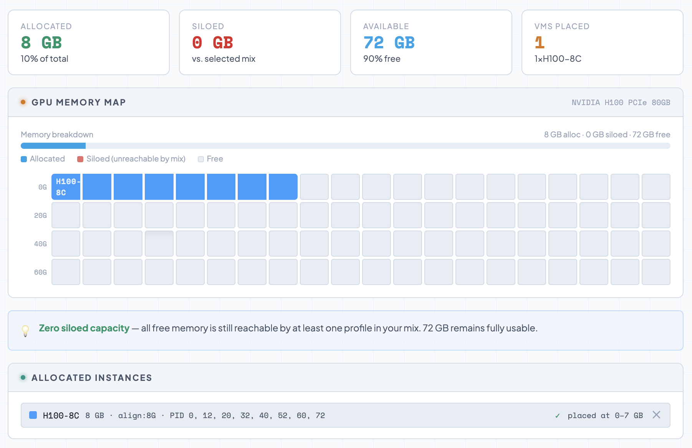

The memory map shows the placement IDs consumed by the profile in the color that matches the GPU profile shown in the allocate instances element. Beneath the GPU memory map, the allocated instances show the placed GPU profiles in order and where they are placed on the GPU. When manually adding a 10GB profile, the following happens: the 10GB profile is placed, and as it its placement ID doesn't align with the last placement ID of the 8GB profile, the memory map shows the siloed memory. Directly below the GPU memory map, a warning appears that 2GB (3%) is siloed. At the end of every profile, an option (x) is provided to remove that profile.

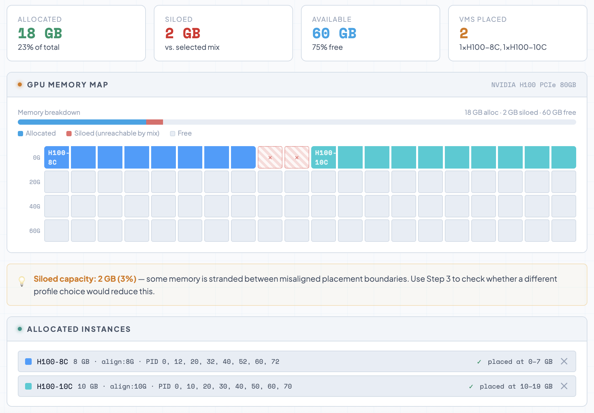

Besides manual placement, there's a randomizer that places the selected profiles in random order. It keeps going until it can't place any more profiles. This helps you see what might happen in practice. In most environments, VMs with vGPU profiles are set up through a self-service portal, so random startup and placement orders are common.

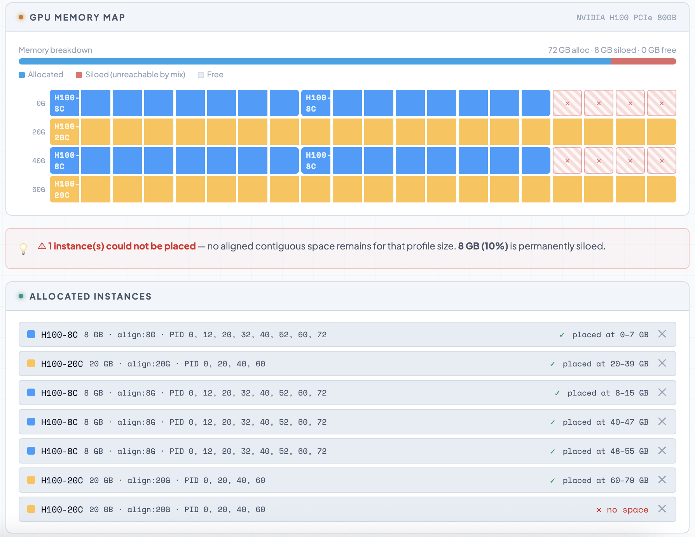

The next feature lets you randomize 10,000 times. This uses a Monte Carlo simulation, which models the chances of different outcomes by running thousands of random scenarios. Instead of checking every possible combination, this approach provides useful insights into the worst-case, median, and average siloed capacity. The tool provides a report with these results.

If you want to see more, you can display the worst-case scenario on the memory map.

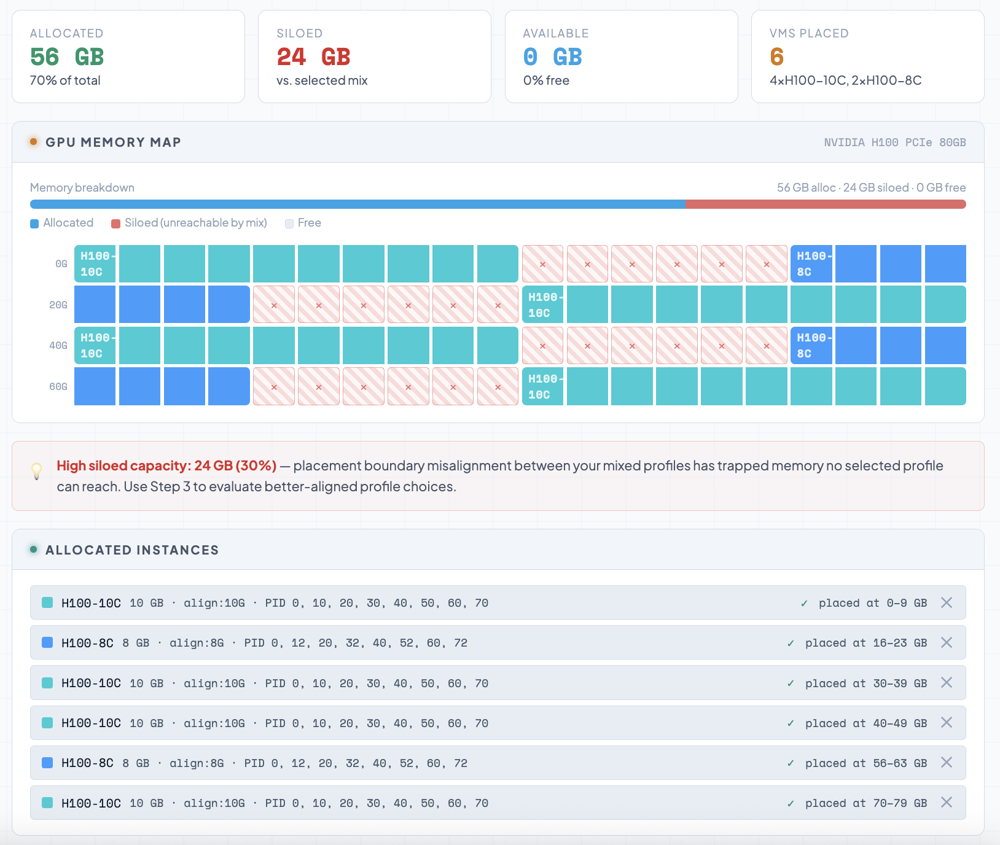

At the bottom of the screen, the profile recommender helps you pick the profile that works best with your selected profiles. It aims to avoid fragmentation and extra memory use for your workloads. In this example, I chose 7GB to see which profile would give enough resources without causing siloed memory on the GPU or across the cluster:

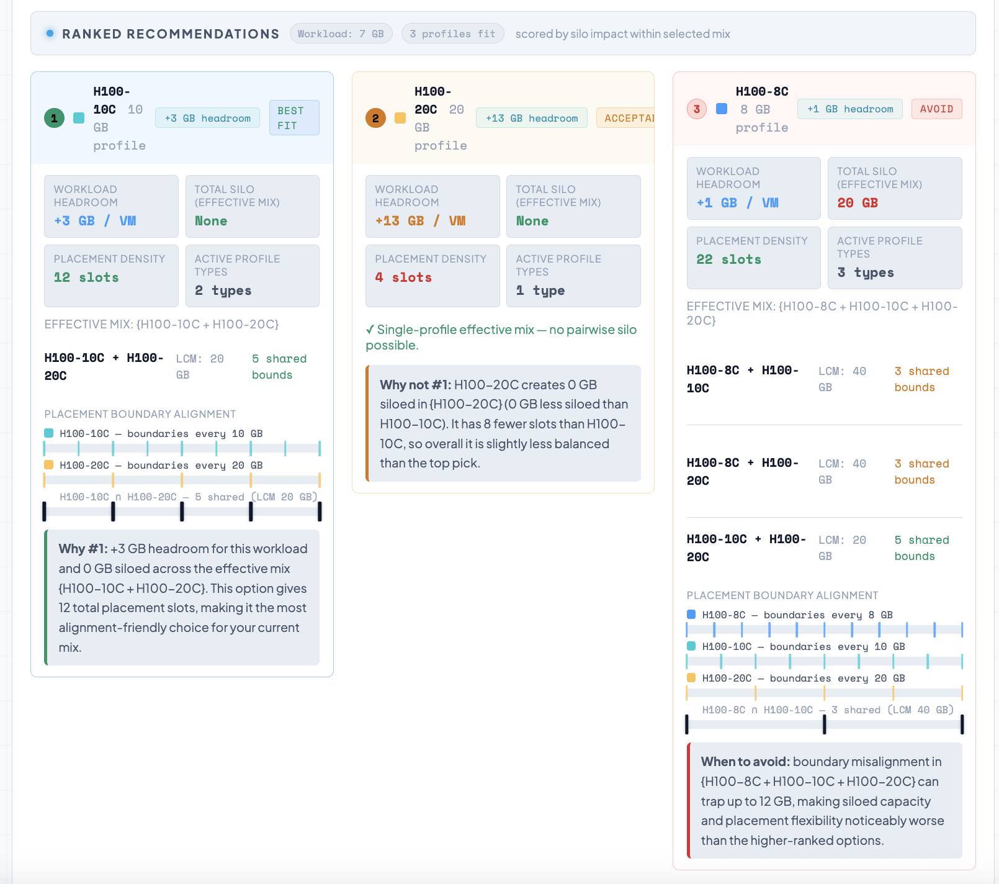

Here, the recommender suggests giving a 7GB workload an A100D-10C profile. This gives the workload an additional 3GB of space and avoids siloing issues. When used with the 20GB profile, all profiles line up perfectly, and the Placement density tile shows 12 slots. Let's break down what that means.

Placement density is the total number of single-profile slots on the GPU, summed across all the profile types you're using. For each profile size, you calculate: slots = floor(GPU total GB / profile GB). Then you add them together. For example, with an A100 80GB and profiles 10C and 20C:

* 10C (10 GB): floor(80 / 10) = 8 slots
* 20C (20 GB): floor(80 / 20) = 4 slots

Placement density is 8 + 4 = 12. So, 'placement density 12' means you can fit 12 single-VM placements in total across the 10C and 20C profiles (8 with just 10C, 4 with just 20C)(not all at the same time). The recommender uses this to measure scheduling flexibility: more slots mean more ways to fit VMs on the GPU, which usually leads to better utilization. Higher density is better when the silo impact is similar.

This matters when we look at probability calculations for the whole cluster, which I'll cover in part 7. The 'active profile types' tile shows how many profiles are used in the calculations, how their placement boundaries line up, and gives a short explanation of why a profile is the best fit, acceptable, or one to avoid for this workload.

The last tool you'll see with the profile recommender is the 'Profile not in your mix' analysis. It suggests up to three profiles you haven't picked but might want to consider. These are chosen based on headroom and good boundary alignment. There's no best fit or avoid label, but you can check the 'silo if added' tile to see if it makes sense to add them to your catalog.

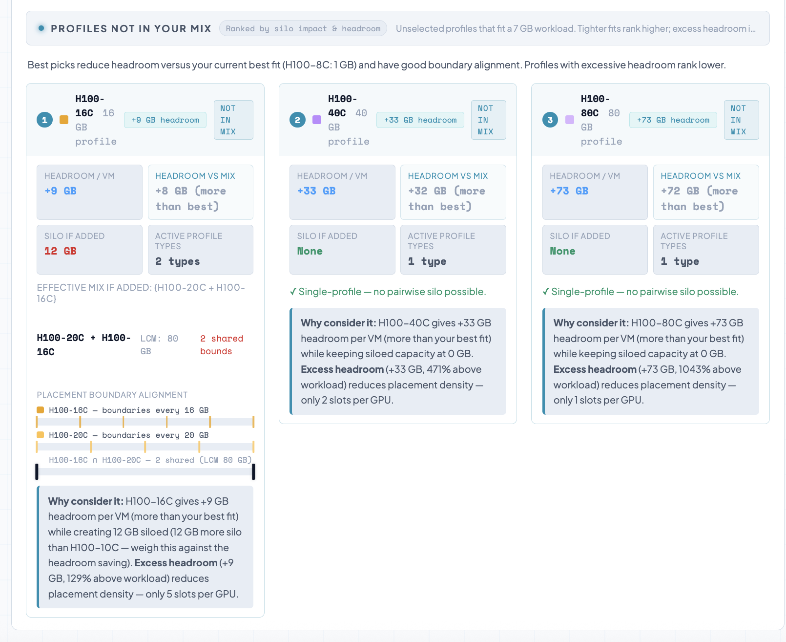

## Practical Example on an A100 80GB

Using the tool walkthrough examples, I took an A100 80GB PCIe GPU and compared two catalogs.

### Slim-Fit Approach Catalog A

This catalog seems efficient for workloads because it gives you lots of sizing options:

* A100-8C (8GB)
* A100-10C (10GB)
* A100-20C (20GB)

Running Monte Carlo simulations with random placement order shows the downside. In the worst case, you can end up with 24GB of siloed capacity on one GPU. Even though the memory is technically free, placement-ID boundaries stop more workloads from using it. The visualizer's worst-case layout makes it clear how misalignment between 8GB and 20GB profiles creates unusable gaps.

### Right-Sized Approach Catalog A

With the Profile Recommender, I looked at a workload that needs about 7GB of GPU memory. Instead of picking an 8GB profile, the tool suggests a 10GB profile because it lines up better for placement. This results in a simpler catalog:

* A100-10C (10GB)
* A100-20C (20GB)

Running the same simulation produces a striking result. Across 10,000 randomized runs, the worst-case siloed capacity observed is 0GB. The median and average siloed capacities are also zero. The reason is simple: these profiles align perfectly with placement IDs, allowing the GPU manager to continuously fill gaps without creating unusable space.

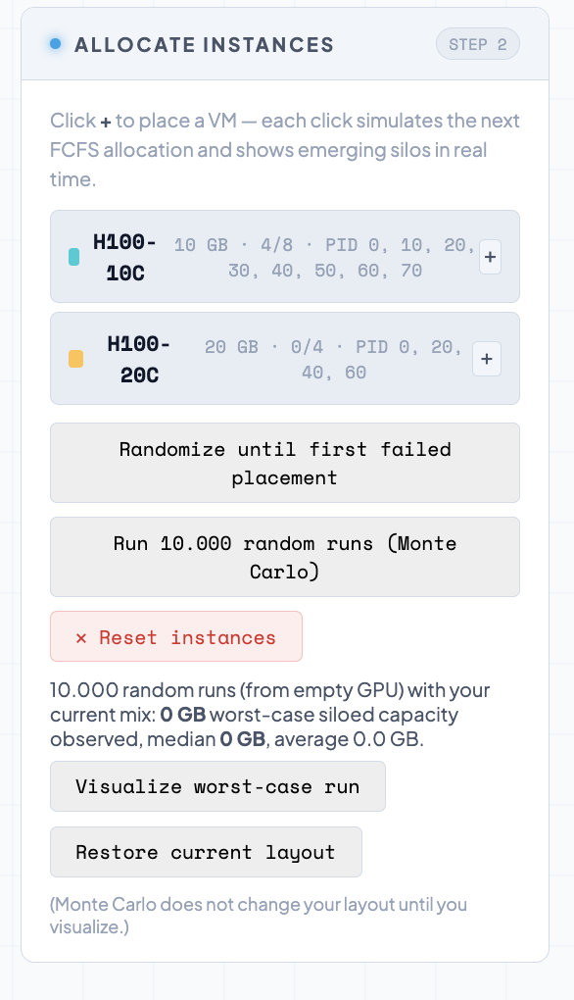

## What This Actually Shows

The lesson is not that smaller profiles are bad. The lesson is that placement alignment matters more than theoretical density. Catalog A appears flexible but creates layouts that are sensitive to startup order. Catalog B reduces profile variety slightly but produces predictable outcomes regardless of placement sequence. In other words, right-sizing is not about giving workloads more memory than they need. It is about choosing profiles that allow the platform to keep reusing capacity.

## Key Insight

Mixed-size mode doesn't automatically stop fragmentation. It just changes where the problem shows up. Instead of profile locking, efficiency now depends on alignment between placement-ID and profile selection. The platform will always try to minimize fragmentation locally, but profile catalogs that align well allow those local decisions to produce better global outcomes.

## Looking Ahead

So far, I've focused on what happens inside a single GPU. The next big question is: how do these choices affect capacity across a whole cluster?

That's where I'll introduce a new idea in the next part: Continuous Placeable Capacity (CPC). GPU capacity isn't just about what's free, but about what can still be placed. Part 7 will build on these ideas and move from looking at single GPUs to making decisions for the whole cluster.
