## Architecting AI Infrastructure — Part 7

The Silo Capacity Visualizer from [Part 6](https://frankdenneman.nl/posts/2026-02-24-mixed-size-vgpu-mode-in-practice/) shows how profile selection and placement-ID alignment affect memory layout inside a single GPU. While that's helpful for understanding the basics, real capacity planning happens at the cluster level. This article introduces the [Same-size vs Mixed-size Placement simulator](https://frankdenneman.nl/tools/same-size-vs-mixed-mode/), the second tool in the Cluster Profile Strategy Toolset. It lets you simulate vGPU placement across an entire cluster using both same-size and mixed-size policies simultaneously, with the same workload sequence for both. This way, you can directly compare their results.

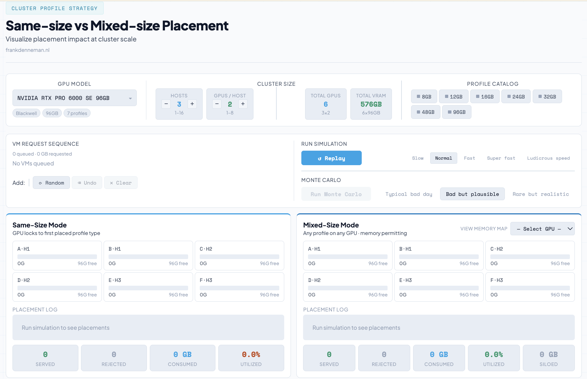

## Configuring the Cluster

Start by choosing a GPU model from the catalog, which uses the same placement-ID data as the Silo Capacity Visualizer. For this example, I picked the H100 PCIe 80GB. The cluster size and total GPU capacity depend on the number of hosts, GPUs per host, and the GPU model. Here, the cluster has 3 hosts, each with 2 GPUs, so 3 x 2 x 80GB = 480GB.

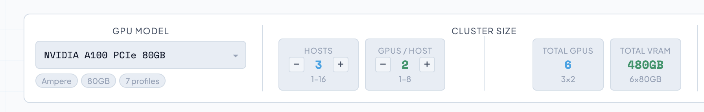

I set up a cluster with four hosts, each with four GPUs. That gives a total of sixteen GPUs and 1,280 GB of GPU memory.

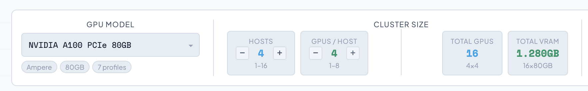

In the profile catalog, I enabled the 8GB, 10GB, 20GB, and 40GB profiles, just like in the Silo Capacity Visualizer example. When you click on a profile, it changes color and becomes available in the ‘VM Request Sequence’ section.

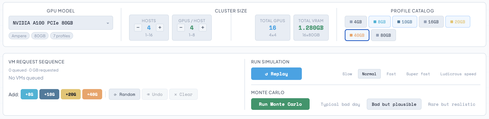

---

## Building the Workload Sequence

The workload sequence is a list of VM requests that the simulation processes in order. You can fill this sequence in three ways: manually, randomly, or by using a Monte Carlo simulation.

In **manual mode**, you click on profiles to add them to the queue. The undo button removes the last step, and clear deletes all VMs from the queue. Below the ‘VM Request Sequence’ header, you’ll see how many VMs you’ve selected and the total capacity needed for the queue.

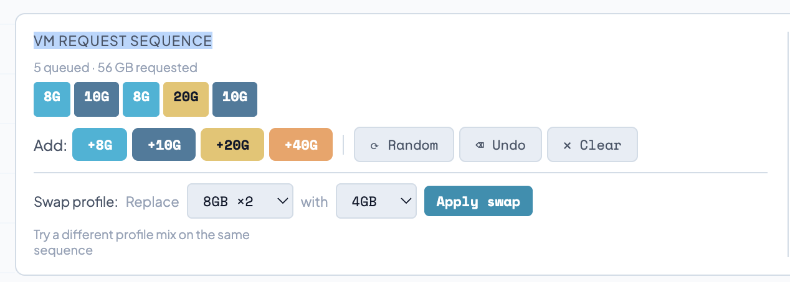

The **random** option fills the queue close to the cluster’s total capacity. You can keep pressing random until you find a sequence you like. The Randomizer suggests a startup sequence of VMs that could fit the total GPU memory. It follows placement-ID rules and can include requests that can’t be placed, just like in real self-service portals where the order is unpredictable.

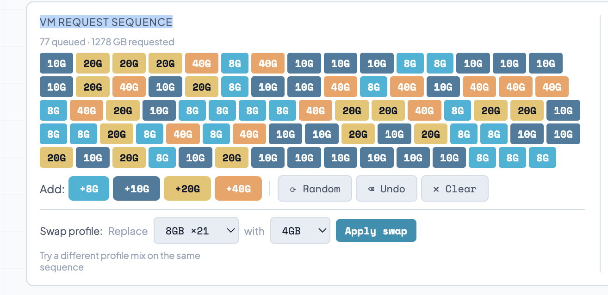

Once you’ve loaded a manual or random queue, start the simulation by clicking the ‘Run’ button in the Run Simulation section. You can choose from four speeds: slow, fast, super fast, and Ludicrous speed.

| Speed | Delay (ms) |
|---|---|
| Slow | 1,200 |
| Normal | 800 |
| Fast | 350 |
| Super fast | 175 |
| Ludicrous speed | 0 (instant) |

At any speed except Ludicrous, you can follow the placement sequence and see the difference between same-size and mixed-mode.

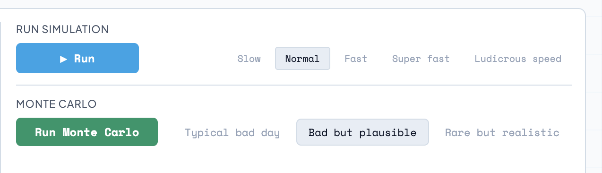

With the sequence loaded, after you click run, the simulation steps through each VM request and tries to place it under both policies at the same time. "The tool assigns VMs to hosts in round-robin order, a deliberate simplification. DRS weighs CPU and memory utilization when selecting a host, which can change which GPU receives a given request. The tool intentionally removes that variability to isolate what matters here: how the same-size and mixed-size placement policy, combined with your profile catalog, determines capacity consumption. It is a controlled environment for comparing placement behavior, not a production scheduler simulation."

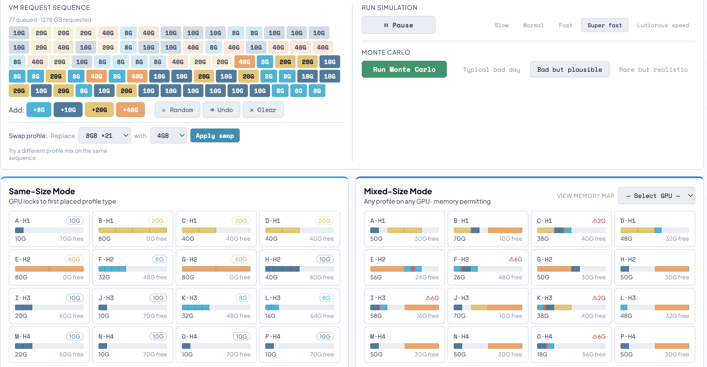

You can also run a **Monte Carlo** simulation. A single sequence only shows what happens for one arrival order, but Monte Carlo analysis runs many random sequences on the same cluster and catalog. It tracks the worst case for each mode: most rejections for same-size, most siloed capacity for mixed-size. You can load either worst-case sequence into the simulator for step-by-step review. Choose between a ‘Typical bad day’, a ‘Bad but plausible worst-case scenario’, or a ‘rare but realistic situation’.

| Tier | Runs | Label | Meaning |
|---|---|---|---|
| 1 | 2,000 | Typical bad day | ~90th percentile — operationally relevant |
| 2 | 5,000 | Bad but plausible | ~95th percentile — design target |
| 3 | 12,500 | Rare but realistic | ~99th percentile — stress test |

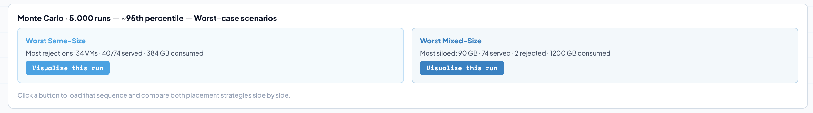

For this scenario, I picked the ‘Bad but plausible’ simulation. After running 5,000 simulations, the tool gives you two visualization options: the worst-case for Same Size and the worst-case for Mixed Mode. Click ‘visualize this run’ to see how the VMs are distributed.

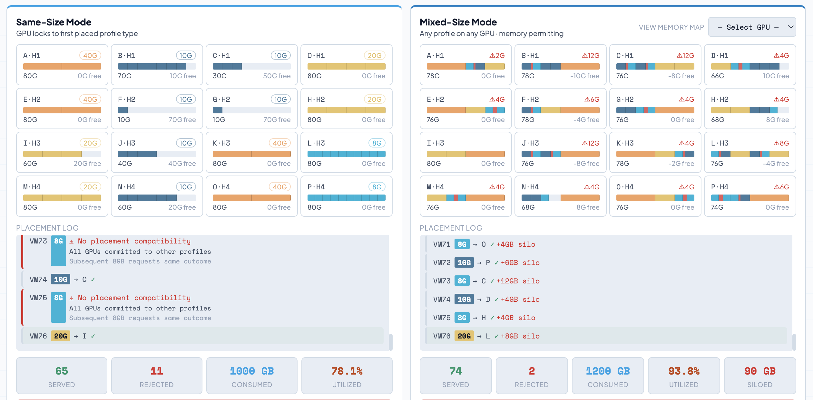

You can compare both policies side by side, since you’ll also see the distribution for the other policy when using the startup sequence that causes the worst-case scenario for each one. Interestingly, I haven’t seen a case where the startup sequence is the same for both policies.

## GPU Cards

Each of the sixteen GPUs has a card that shows a memory bar. Allocated memory is colored by profile size, siloed memory appears in red at its actual spot in the layout, and free memory is shown in gray.

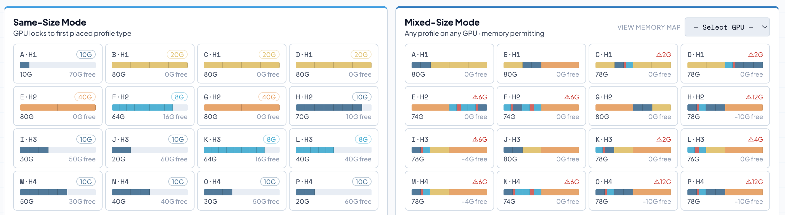

In same-size mode, a GPU locks to the first profile placed on it. Any later requests for a different profile size on that GPU are rejected. As the simulation runs, vGPU profile size badges build up, and rejection counts go up for profiles that arrive after most GPUs are already committed.

In mixed-size mode, any profile can be placed on any GPU as long as it follows placement-ID rules. The cards show silo warnings when misalignment creates memory areas that no selected profile can use. Clicking a card opens the GPU Memory Map, which gives a cell-by-cell view of allocated regions by profile, striped red silo regions, and free memory.

## Placement Log

The placement log keeps track of every decision. Successful placements show the VM, which GPU it went to, and any silo notes. For example, VM64 with a 10GB profile is placed on GPU D (Host 2, GPU 2) and creates a 2GB silo, as shown in the screenshot.

VM6410G→ D ✓+2GB silo

Rejections come with a message specific to the mode. In same-size, it says all GPUs are committed to incompatible profiles. In mixed-size, it says no valid placement slot is available because of alignment. Seeing both logs side by side makes it easy to understand how each policy fails.

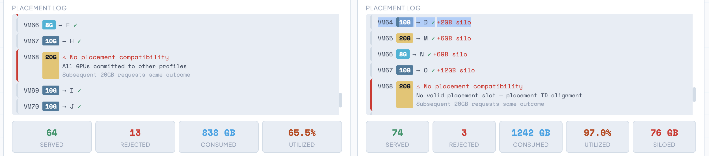

The table shows, for each placement policy, how many VMs were placed, how many were rejected, how much GPU RAM was used, and the percentage of utilization. The last two numbers can help you decide which policy gives better ROI based on your vGPU Profile catalog. In this example with four GPU profiles, Mixed Mode gives a higher utilization percentage than Same Size.

Trying to get a higher utilization percentage might feel odd for admins used to managing CPU and memory in clusters. But since GPUs don’t have overconsolidation features like system compute resources, it’s important to use every bit of GPU you have. Every customer we talk to with GPUs, whether on bare-metal K8s, DGX systems, or VCF platforms, says that fixing low GPU utilization is the top priority for their accelerated cluster operations teams.

The placement log also highlights some interesting details. In the mixed mode section, it shows the percentage of siloed capacity. 

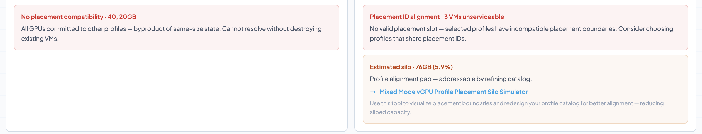

## Platform Impact Table

After the simulation, the Platform Impact Table sums up the results for each profile: planned requests, VMs placed in each mode, capacity used, and unserviceable VMs. There’s a totals row for the whole cluster and a summary line that highlights siloed capacity in mixed-size mode.

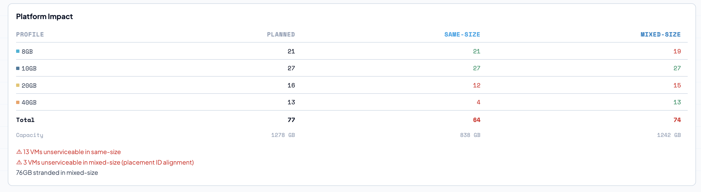

## GPU Memory Map

After a simulation run, you can use the same simulator introduced by the [‘Mixed Mode vGPU Profile Placement Silo Simulator’](https://frankdenneman.nl/tools/vgpu-silo-capacity-calculator/) by going to the ‘View memory map’ option in the Mixed-Size Mode section. The drop-down menu provides access to each GPU's memory map. You can also just click on one of the GPU tiles. In this scenario, I’m interested in taking a closer look at GPU C of Host 1. Underneath the placement log, the memory map appears:

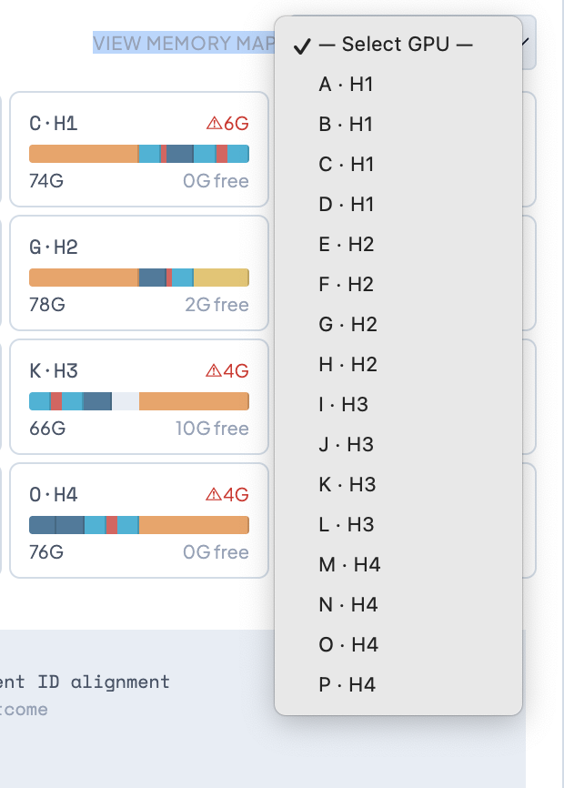

It shows that 6GB of GPU resources are siloed due to misaligned placement IDs for the chosen vGPU profiles. To see whether a different vGPU Profile Catalog improves GPU utilization or enables more placements, you can use the swap analyzer.

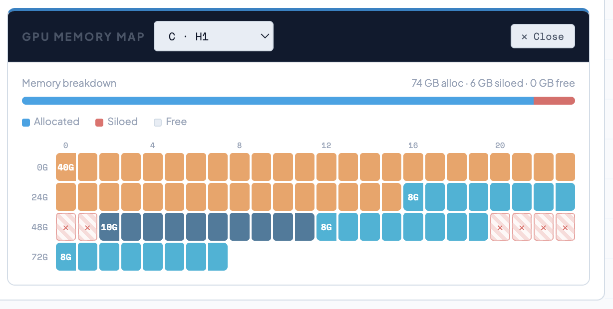

## Swap Analyzer: 8GB to 10GB

The Swap Analyzer opens when you swap profiles in the sequence. I replaced every 8GB request with 10GB and applied the swap. The tool keeps the sequence order the same. The analyzer then shows a before-and-after comparison for both modes: VMs served, VMs rejected, capacity used, and siloed capacity.

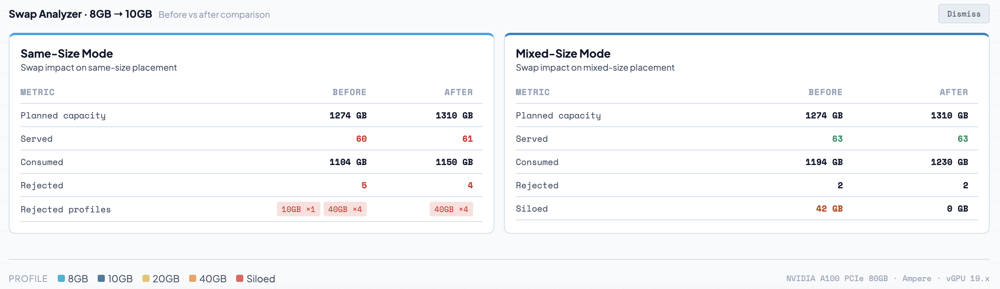

You can quickly see if your utilization improved or if you gained more placement options.

The 8GB profile doesn’t align as well with the 20GB and 40GB profiles as the 10GB profile does on the H100. As explained in [Part 6](https://frankdenneman.nl/posts/2026-02-24-mixed-size-vgpu-mode-in-practice/), profiles without clean shared boundaries leave gaps that other profiles can’t use. Swapping to 10GB improves that alignment. In mixed-size mode, this swap reduced siloed capacity and may have increased the total number of VMs placed.

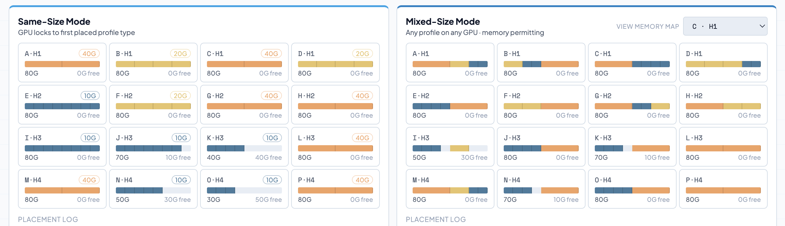

In same-size mode, the improvement was smaller because lock-in is the main reason for rejections, no matter how the boundaries align.

The difference between 8GB and 10GB is just 2GB per VM, but at the cluster level, what really matters is the compounding effect of better placement-ID alignment across all GPUs and placement decisions. This is what right-sizing means: picking profiles whose boundaries keep the cluster usable for future workloads.

To check if you improved the outcome, compare the stats at the bottom of the placement log. Since it’s hard to remember all the numbers from the previous run, a new section called the ‘Swap Analyzer’ appears at the bottom of the screen after you run the profile swap simulation. It shows before (8GB) and after (10GB) results. Here, you can see that Same Size mode improved placement because there was enough room on a GPU locked to the updated profile.

This is a powerful way to simulate your cluster setup and decide how many different profiles you want to use. If you choose your vGPU profiles carefully, you can use the minimum number needed while still giving enough resources for your workloads. In both modes, this can lead to better placement options. Try it out and let me know your thoughts on LinkedIn or X.

The **Cluster Profile Strategy Tool** is available at [Same-size vs Mixed-size Placement](/tools/same-size-vs-mixed-mode/). The full series index is at [Architecting AI Infrastructure](/ai-infrastructure/).

