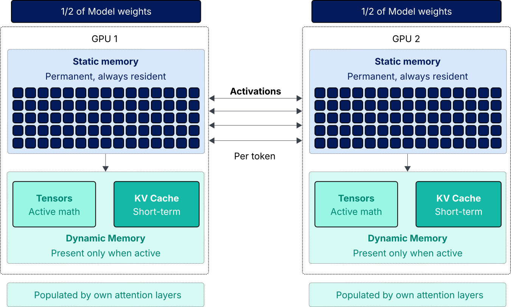
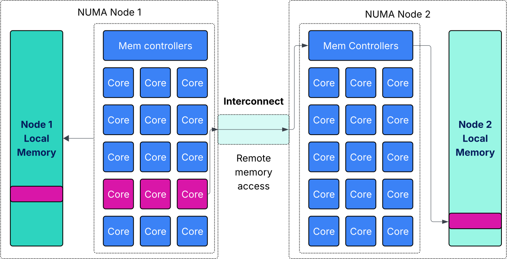
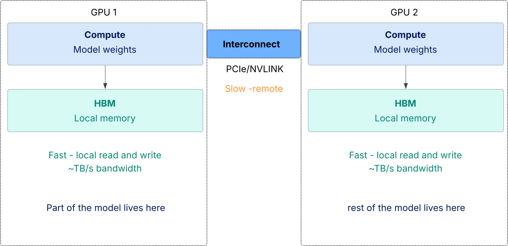

## Architecting AI Infrastructure Series - Part 9

The [AI Memory series](https://frankdenneman.nl/understanding-ai-memory/) has been showing how AI workloads use GPU memory in different ways. [The Dynamic World of LLM Runtime Memory](https://frankdenneman.nl/2026-01-12-the-dynamic-world-of-llm-runtime-memory/) explains how the KV cache grows with each new token and becomes a main user of GPU resources. [Understanding Activation Memory in Mixture of Experts Models](https://frankdenneman.nl/2026-02-05-understanding-activation-in-mixture-of-experts-models/) looks at the hardware pressure that happens when activation memory spikes during the prefill phase. The series also covers how agentic systems keep memory active to stay on track during complex tasks, as discussed in [Durable Agentic AI Sessions in GPU Memory](https://frankdenneman.nl/2026-03-12-durable-agentic-ai-sessions-in-gpu-memory/).

All these behaviors change where system pressure shows up. Inference is a two-stage dance of “Prefill” and “Decode,” and it taxes different parts of the system. In the prefill phase, large prompts need a lot of compute to process the full context. During the decode phase, dynamic (runtime) memory keeps growing. Long sessions make both demands higher. As prompts get bigger, prefill work gets more expensive, and the model’s working memory grows as more tokens are added.

At this stage, many deployments switch from using a single GPU to multiple GPUs. The main reason is straightforward: more GPUs mean more High Bandwidth Memory (HBM), giving the model access to a larger memory pool. But once a model runs across multiple GPUs, the system starts behaving differently.

## Multi-GPU changes the execution model

GPUs are usually added during training to increase compute power. For inference, they are often added to provide more memory. However, when a model runs on multiple GPUs, the way it executes changes.

When a model spans GPUs, each device holds part of the model state. The Static Memory, which is the weights or the “model’s brain”, is split across the GPUs. The Dynamic Memory, made up of intermediate tensors (the active math) and the KV cache (the short-term memory), is present only when those specific weights are triggered for computation. Because the model’s knowledge is divided, generating a single token needs a coordinated process: the dynamic math from one GPU must be sent to the next before the model can continue.

In modern Mixture-of-Experts (MoE) models, this setup is even more specialized. Tensor Parallelism splits weight matrices into smaller pieces across several GPUs, enabling them to work together on a single large calculation, with each GPU handling part of the job. Expert Parallelism then assigns different specialist weights to different GPUs. For every token, the system acts like a high-speed router, sending the active math to the GPU with the right expert. This creates a sparse activation pattern, where only part of the model is used at a time, but it puts a lot of pressure on the connections between GPUs to move data quickly.

Modern models keep this distributed math organized using Attention, which acts like the model’s train of thought during inference. When the model generates a new word, it doesn’t just look at the previous word. Instead, it scans the Dynamic Memory (the KV cache) to find the right context. For example, if the model is in the middle of a long paragraph and generates the word “it,” Attention helps it look back through earlier sentences to find what “it” refers to. In a multi-GPU setup, the model must gather pieces of this session state from across all GPUs to keep each new word connected to its original meaning.

Key Takeaway: Data has to move between GPUs to complete even a single layer of computation. If this happens quickly, the GPUs work together smoothly. If it’s slow, the GPUs end up waiting for data before they can keep computing.

## The NUMA analogy

For administrators familiar with CPU architectures, the behavior should feel familiar. [NUMA](https://frankdenneman.nl/posts/2016-07-06-introduction-2016-numa-deep-dive-series/) systems divide memory across nodes. A processor accessing memory attached to its local node can do so quickly. Accessing memory attached to a remote node takes longer because the request must traverse an interconnect.

A GPU accessing its local HBM is nearly instantaneous, but because the model's state is split, the system is constantly performing remote memory accesses to retrieve context from other devices. If the interconnect is fast, the cluster behaves like a single, massive accelerator. If it is slow, the GPUs spend more time waiting for data than performing math. Even with enough compute capacity available, performance is capped by how fast memory state moves between these nodes. When viewed this way, it is clear that topology is the deciding factor; the real question is whether the platform understands this need for locality.

## The problem with topology-unaware scheduling

In the past, many infrastructure platforms treated all GPUs as equal. If a workload needed four GPUs, it got any four that were available. This approach works for single-GPU jobs, but for distributed models, it can lead to unpredictable performance.

If a scheduler doesn’t consider how GPUs are connected, it might assign GPUs that have to communicate over slower links. The model still starts, and the system shows that the workload got the resources it requested. From a capacity standpoint, everything looks fine.

The problem appears only when the model is running. The GPUs keep exchanging tensors and KV cache state over slow links, increasing latency and slowing token generation. The real issue isn’t the model or the GPU hardware; it’s that the platform assigns the workload to GPUs that can’t communicate efficiently with each other.

## Why platforms must become topology-aware

When inference workloads use more than one GPU, the scheduler needs to know more than just how many GPUs are available. It also needs to understand how they are connected and group together devices that can communicate quickly.

These groupings also need to remain stable over time. If workloads restart or move, the platform must ensure the model continues to run on GPUs that can exchange data efficiently. This makes GPU allocation a problem that requires topology-aware scheduling. The platform should treat groups of GPUs with fast connections as single resource domains.

## Why agentic workloads amplify the problem

Agentic AI systems keep generating tokens as they work through tasks. They gather information, use tools, check results, and keep conversations going over time. The model’s runtime memory stays active throughout this process.

Because sessions last longer, deployments often use multiple GPUs to provide enough working memory for the model. The interactive nature of these systems also makes any latency more noticeable. Each reasoning step depends on the tokens from the previous step, so if GPU communication slows down, the entire reasoning process slows down too.

## Setting the stage for topology-aware infrastructure

When a model runs across several GPUs, those devices need to exchange memory state as they generate tokens. How quickly this happens depends on how the GPUs are connected and whether the platform groups them correctly.

Multi-GPU inference is similar to a NUMA-sensitive workload. Performance depends on how close the GPUs are and how fast the connections between memory areas are. Modern GPU systems offer different ways to connect devices, each with its own speed. Some setups let GPUs share data almost as if it were a single memory space, while others add extra steps and more delay.

Understanding these interconnects is the next step in building multi-GPU systems. In the next article, we’ll look at how modern GPU fabrics like [NVLink](https://www.nvidia.com/en-us/data-center/nvlink/) and NVSwitch affect communication between GPUs and why they matter for designing AI platforms.
