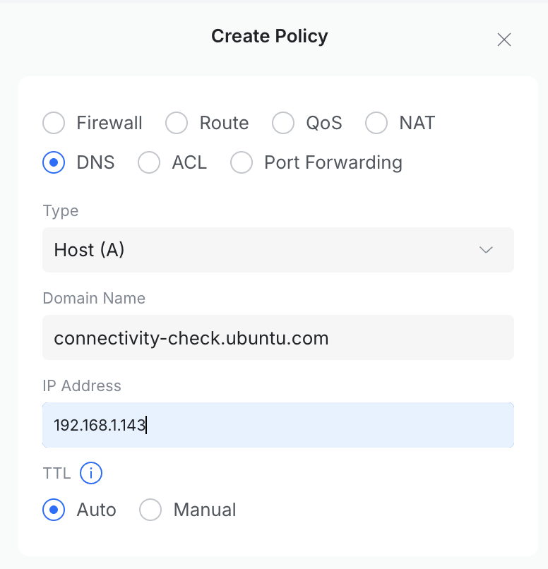
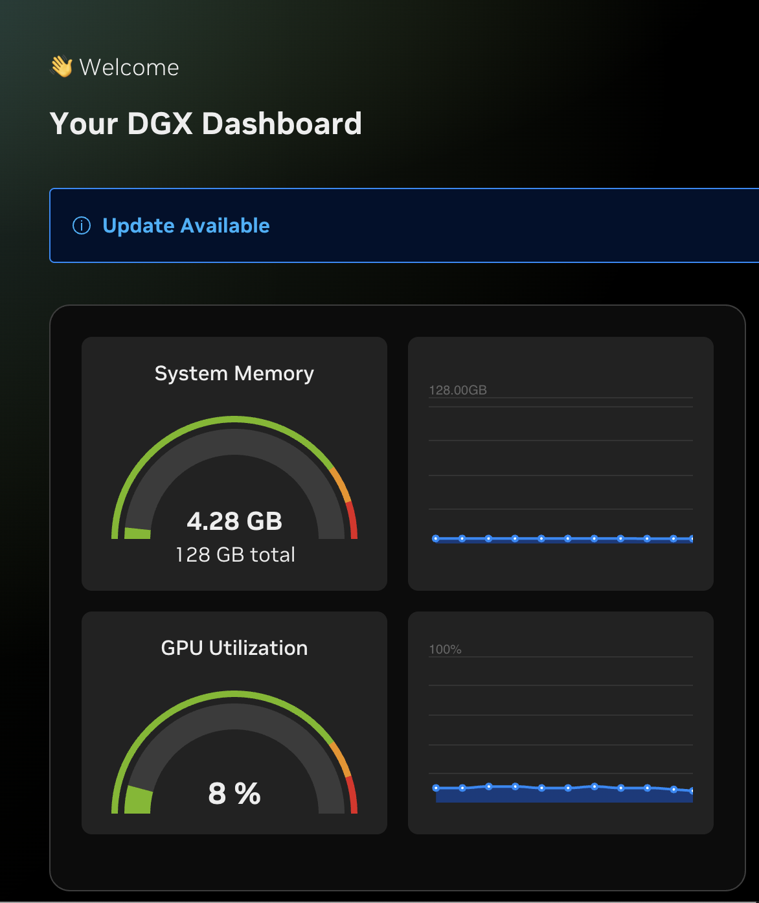

Got a DGX Spark stuck in an endless Wi-Fi setup loop even though ethernet is plugged in? I ran into the same thing. Here's a network-level fix that worked for me. Hopefully it helps you get past it and start enjoying your Spark.

## What's Going On

During initial setup, the DGX Spark's Out-of-Box Experience (OOBE) checks internet connectivity by making an HTTPS request to `connectivity-check.ubuntu.com`. If that check fails, it assumes there's no network and forces you into the Wi-Fi screen, even when ethernet is connected and working fine.

Here's what that looks like when you test it:

```
curl -v https://connectivity-check.ubuntu.com
* Host connectivity-check.ubuntu.com:443 was resolved.
* IPv6: (none)
* IPv4: 185.125.190.97, 185.125.190.98, 91.189.91.96, 185.125.190.96, 91.189.91.98, 91.189.91.97
*   Trying 185.125.190.97:443...
* Connected to connectivity-check.ubuntu.com (185.125.190.97) port 443
* ALPN: curl offers h2,http/1.1
* (304) (OUT), TLS handshake, Client hello (1):
*  CAfile: /etc/ssl/cert.pem
*  CApath: none
* Recv failure: Connection reset by peer
* LibreSSL/3.3.6: error:02FFF036:system library:func(4095):Connection reset by peer
* Closing connection
curl: (35) Recv failure: Connection reset by peer
```

I tested all six IPs individually and found they all respond fine on HTTP (port 80) but time out or reset on HTTPS (port 443). The OOBE uses HTTPS. That's the bug. A [forum thread](https://forums.developer.nvidia.com/t/setup-wizard-loop/364222) suggested overriding DNS to point at a specific IP, but since none of them respond on port 443, that won't help.

## The Fix

The idea is simple. Run a tiny HTTPS server on your local network that returns the expected 204 response, then use a DNS override on your router to point the Spark at it.

### 1. Generate a self-signed cert
On any machine on the same LAN (I used a Mac):

```bash
mkdir -p ~/connectivity-fix && cd ~/connectivity-fix
openssl req -x509 -newkey rsa:2048 -keyout key.pem -out cert.pem \
  -days 30 -nodes -subj '/CN=connectivity-check.ubuntu.com'
```

### 2. Start the server
Save this as `server.py`:

```python
from http.server import HTTPServer, BaseHTTPRequestHandler
import ssl
import threading

class Handler(BaseHTTPRequestHandler):
    def do_GET(self):
        self.send_response(204)
        self.end_headers()
    def log_message(self, format, *args):
        print(f"[{self.server.server_port}] {args[0]}")

http = HTTPServer(('0.0.0.0', 80), Handler)

https = HTTPServer(('0.0.0.0', 443), Handler)
ctx = ssl.SSLContext(ssl.PROTOCOL_TLS_SERVER)
ctx.load_cert_chain('cert.pem', 'key.pem')
https.socket = ctx.wrap_socket(https.socket, server_side=True)

print("Serving HTTP on :80 and HTTPS on :443")
threading.Thread(target=http.serve_forever, daemon=True).start()
https.serve_forever()
```

Then run it:

```bash
sudo python3 server.py
```

### 3. Test it
In another terminal:

```bash
curl -v --resolve connectivity-check.ubuntu.com:80:127.0.0.1 http://connectivity-check.ubuntu.com
curl -vk --resolve connectivity-check.ubuntu.com:443:127.0.0.1 https://connectivity-check.ubuntu.com
```

Both should return `204 No Content`.

### 4. Add a DNS override on your router
You need your router to resolve `connectivity-check.ubuntu.com` to your Mac's local IP instead of the broken upstream servers. At home I have a Unify network, so I'm using a Dream Machine SE environment as an example to show hot to set it up.  If you're on UniFi Network 10.1, the DNS settings have moved compared to older versions. The path is:

**Settings → Policy Engine → Policy Table → Create Policy**

Create a DNS **A record** with `connectivity-check.ubuntu.com` pointing to your Mac's IP (e.g. `192.168.1.143`).



### 5. Verify and reboot the DGX

Confirm the override works:

```bash
nslookup connectivity-check.ubuntu.com 192.168.1.1
```

This should return your Mac's IP. Now reboot the DGX Spark. It should sail past the Wi-Fi screen. After setup was done, I installed the DGX dashboard and ready to explore the possibilities of this thing.



## Cleanup
Once setup is done, stop the Python server, delete the DNS override from your router, and remove `~/connectivity-fix`. The connectivity check only runs during initial setup.

## Alternative
If you'd rather patch the Spark directly, [sjug's recovery image patch](https://github.com/sjug/dgx-spark-ethernet-patch) modifies the setup binary to skip the connectivity check entirely. It requires a Linux machine to prepare a patched USB recovery drive.

## Bottom Line
The OOBE insists on validating connectivity over HTTPS, but Canonical's endpoints aren't responding on port 443. Running a local stand-in server and redirecting DNS got me past it without modifying the Spark. Hopefully NVIDIA updates the OOBE to fall back to HTTP or skip the check when ethernet is already connected.

