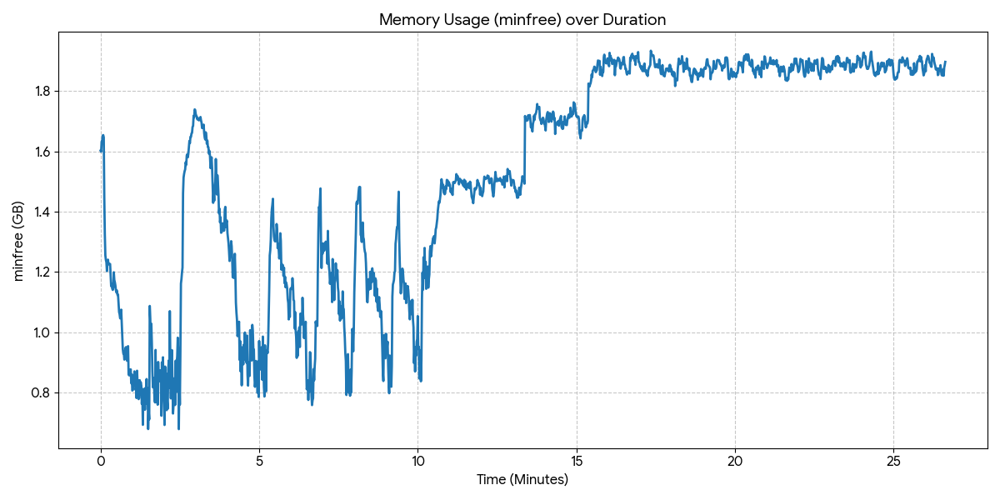

[NemoClaw](https://www.nvidia.com/en-us/ai/nemoclaw/) became the talk of GTC 2026 within hours of its announcement. It wraps OpenClaw in NVIDIA’s [OpenShell runtime](https://github.com/NVIDIA/OpenShell), adds guardrails, and gives you an always on AI agent with a single install. Jensen Huang called OpenClaw the operating system for personal AI. NemoClaw is what makes that usable.

This is part 4 of the AI Memory series and focuses on how memory behaves on real systems.

I installed NemoClaw on a [DGX Spark](https://www.nvidia.com/en-us/products/workstations/dgx-spark/) and ran Nemotron models locally to understand what actually happens in memory. The most important takeaway is simple. Unified memory breaks the usual GPU mental model.

On a traditional system, the GPU has its own memory, tools like nvidia smi show usage, and free memory roughly maps to what you can still use. On DGX Spark, CPU and GPU share one memory pool. The signals you are used to no longer tell the full story.

The models used by NemoClaw are Mixture of Experts models. Dense models activate all parameters for every token, so memory and compute scale together. MoE models behave differently. All parameters must be present in memory, but only a subset is used per token. That creates two separate budgets. Total parameters define the memory footprint. Active parameters define the compute cost. The earlier posts in this series explain this in detail:

[Part 1 - The Dynamic World of LLM Runtime Memory](https://frankdenneman.ai/2026-01-12-the-dynamic-world-of-llm-runtime-memory/)  
[Part 2 - Understanding Activation Memory in Mixture of Experts Models](https://frankdenneman.ai/2026-02-05-understanding-activation-in-mixture-of-experts-models/)  
[Part 3 - Durable Agentic AI Sessions in GPU Memory](https://frankdenneman.ai/2026-03-12-durable-agentic-ai-sessions-in-gpu-memory/)  

On a unified memory system, this separation becomes very visible. The model either fits based on total parameters or it does not. Everything that matters operationally depends on what memory remains after that.

## Installing NemoClaw and selecting a model

After following the DGX Spark NemoClaw playbook, the installer detected Ollama and suggested running locally

```
Inference options:
  1) NVIDIA Endpoint API (build.nvidia.com)
  2) Local Ollama (localhost:11434) — running (suggested)
```

The default model is [Nemotron 3 Nano](https://build.nvidia.com/nvidia/nemotron-3-nano-30b-a3b/modelcard). The larger [Nemotron 3 Super](https://build.nvidia.com/nvidia/nemotron-3-super-120b-a12b/modelcard) is available but not selected by default. That choice already hints at what matters on this system. Not just whether a model fits, but how much room is left after it does.

## Loading Nano

```
frankdenneman@spark:~$ ollama ps
NAME                   ID              SIZE     PROCESSOR    CONTEXT    UNTIL              
nemotron-3-nano:30b    b725f1117407    27 GB    100% GPU     262144     4 minutes from now 
```

Nano downloads as 24 GB and becomes 27 GB in memory. The difference comes from decompression and preallocated context buffers. Ollama reserves space for the full context window up front.

```
frankdenneman@spark:~$ free -h
               total        used        free      shared  buff/cache   available
Mem:           121Gi        32Gi        66Gi        56Mi        23Gi        89Gi
Swap:           15Gi       120Ki        15Gi
```

About 31 GB is in use and 89 GiB remains available. All model parameters are resident, which defines the memory footprint, and the remaining space is what you can use for everything else.

## Loading Super

```
frankdenneman@spark:~$ ollama ps
NAME                     SIZE     PROCESSOR    CONTEXT
nemotron-3-super:120b    94 GB    100% GPU     262144
```

Super downloads as 86 GB and becomes 94 GB in memory.

```
frankdenneman@spark:~$ free -h
               total        used        free      shared  buff/cache   available
Mem:           121Gi        94Gi       861Mi        56Mi        27Gi        27Gi
Swap:           15Gi       120Ki        15Gi
```

At first glance this looks like the system is out of memory, but it is not. The available column shows 27 GiB of usable headroom. All parameters are loaded and ready, and what remains is the space available for runtime behavior.

## Reading memory on DGX Spark

On DGX Spark there is no separate VRAM. CPU and GPU share one memory pool, which changes how you read the system. The nvidia smi memory gauge is not useful here, and the real signal comes from Linux.

```
frankdenneman@spark:~$ nvidia-smi
Mon Mar 23 15:56:03 2026       
+-----------------------------------------------------------------------------------------+
| NVIDIA-SMI 580.142                Driver Version: 580.142        CUDA Version: 13.0     |
+-----------------------------------------+------------------------+----------------------+
| GPU  Name                 Persistence-M | Bus-Id          Disp.A | Volatile Uncorr. ECC |
| Fan  Temp   Perf          Pwr:Usage/Cap |           Memory-Usage | GPU-Util  Compute M. |
|                                         |                        |               MIG M. |
|=========================================+========================+======================|
|   0  NVIDIA GB10                    On  |   0000000F:01:00.0 Off |                  N/A |
| N/A   37C    P0             10W /  N/A  | Not Supported          |      0%      Default |
|                                         |                        |                  N/A |
+-----------------------------------------+------------------------+----------------------+

+-----------------------------------------------------------------------------------------+
| Processes:                                                                              |
|  GPU   GI   CI              PID   Type   Process name                        GPU Memory |
|        ID   ID                                                               Usage      |
|=========================================================================================|
|    0   N/A  N/A            2523      G   /usr/lib/xorg/Xorg                       43MiB |
|    0   N/A  N/A            2950      G   /usr/bin/gnome-shell                     16MiB |
|    0   N/A  N/A          881931      C   /usr/local/bin/ollama                 89709MiB |
+-----------------------------------------------------------------------------------------+
```

The usual memory bar is not available. The process view still shows allocations, but it does not reflect total system headroom. For that, you need to look at the OS.

```
frankdenneman@spark:~$ free -h
               total        used        free      shared  buff/cache   available
Mem:           121Gi        94Gi       861Mi        56Mi        27Gi        27Gi
Swap:           15Gi       120Ki        15Gi
```

Free memory looks low because Linux uses spare memory as page cache, holding recently read data such as the model file that was just loaded. That memory is not locked and is reclaimed on demand.

```
$ sudo sh -c 'echo 3 > /proc/sys/vm/drop_caches'
```

After dropping cache, free memory jumps to match available. Nothing changed for the model because the weights were already in CUDA managed memory. The key mental shift is that available memory is your real headroom, while free memory is simply what is unused at that moment.

```
frankdenneman@spark:~$ free -h
               total        used        free      shared  buff/cache   available
Mem:           121Gi        93Gi        28Gi        56Mi       1.0Gi        28Gi
Swap:           15Gi       120Ki        15Gi
```

## What headroom really means

Headroom determines what you can actually run. The context window you see in ollama ps is allocated per parallel request. Each additional slot requires its own memory reservation. For Super at 262K context, that is roughly 7 GB per slot.

With about 27 GiB of headroom, running a single agent is straightforward. Running multiple agents is possible, but each additional slot reduces the margin for activation spikes and OS overhead.

Nano leaves about 89 GiB of headroom, which allows multiple agents, larger context windows, and more flexibility. This is why the installer defaults to Nano. Not because Super cannot run, but because Nano leaves room for actual usage.

## Observing behavior under load

I ran a sustained agent workload for 27 minutes and monitored memory. Available memory stayed stable at around 27 GiB. Free memory fluctuated as the kernel reclaimed and reused page cache.



This is expected behavior. The kernel does not keep large amounts of memory unused. It reclaims what it needs when it needs it. The system never touched swap.

## Swap on unified memory

Swap is disk space, not part of the memory pool. It does not increase headroom. On unified memory systems, swap introduces a different failure mode. If the kernel pages out model data and that data is needed again, inference stalls. With MoE models, where routing is dynamic, this can happen unpredictably. If swap usage increases, performance is already degraded.

## What to take away

Unified memory changes how you read GPU systems. The model fitting into memory is only the starting point. What matters is the headroom that remains.

Use free h and focus on available memory. Do not rely on free memory alone. Do not rely on nvidia smi for capacity planning. Treat swap usage as a signal that you are beyond safe operating conditions.

Most importantly, think in terms of headroom. That is what determines how many agents you can run, how much context you can support, and how stable the system will be under load.