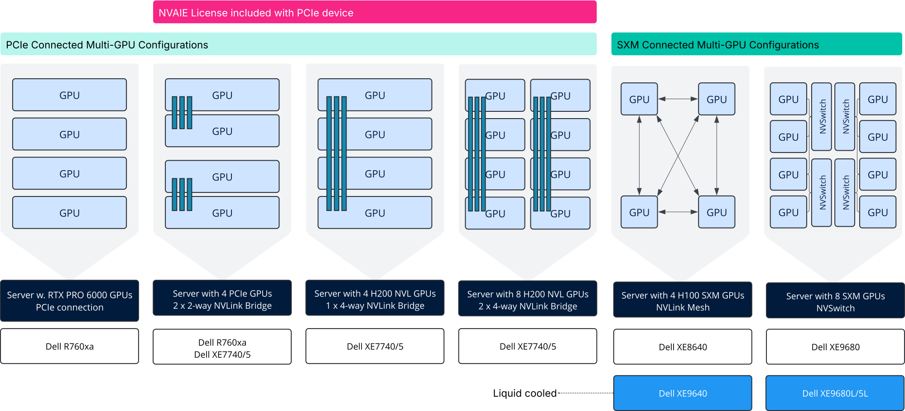
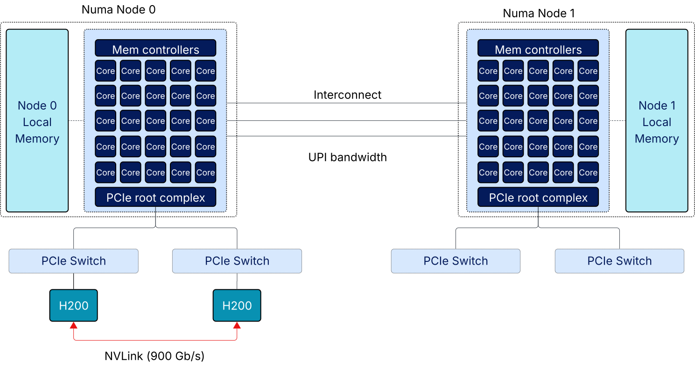
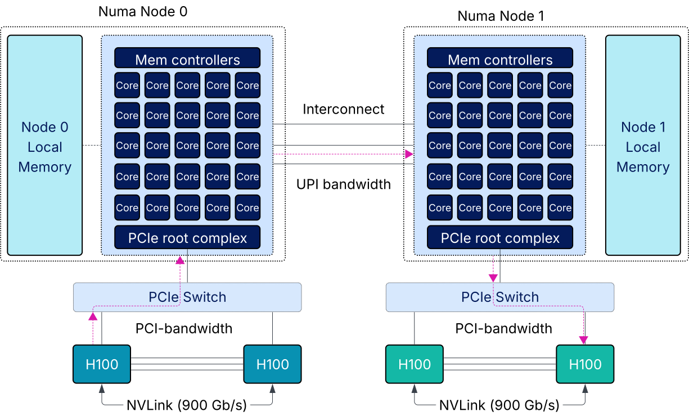
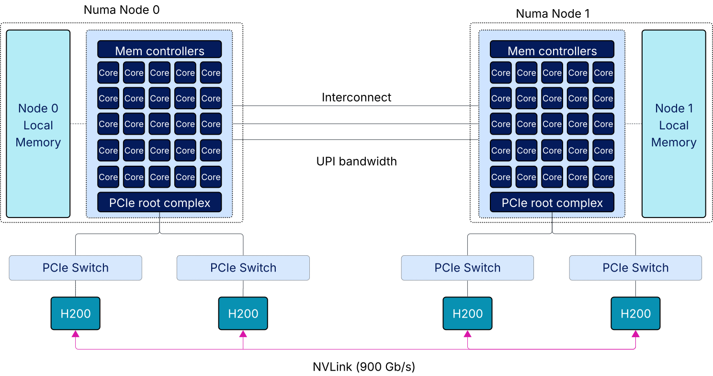
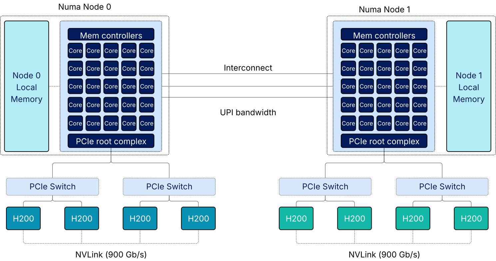
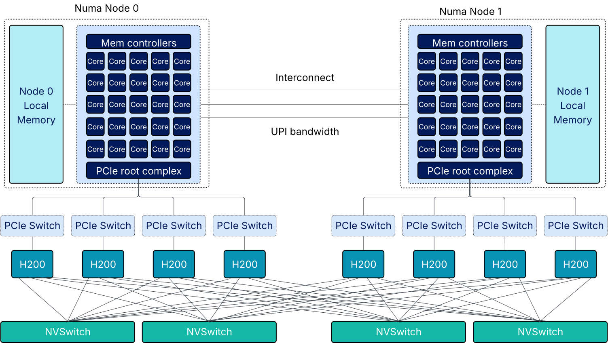

## Architecting AI Infrastructure Series - Part 10

[Part 9](https://frankdenneman.ai/2026-03-16-why-multi-gpu-requires-topology-awareness/) covered why it's important to understand the topology when using multiple GPUs. When a model runs across several GPUs, communication between them becomes part of the process. Not all GPUs in a server communicate at the same speed, and these differences can impact performance.

Many AI teams prefer to run their workloads on a single server. This helps reduce network complexity and simplify deployment. Still, there are several ways to set up multiple GPUs in a single server.

This article reviews the different ways GPUs can be connected within a single server and explains how these configurations affect distributed models.

## How distributed models use multiple GPUs

When a model uses multiple GPUs, its weights are distributed across the devices. Each GPU stores part of the model in its own memory. During inference, the GPUs share intermediate tensors and KV cache data as they process layers and tokens.

These data exchanges occur through coordinated operations in which all GPUs work simultaneously, sharing activations, KV cache pieces, and intermediate results. Communication happens in many small steps, followed by syncing up. Each step has to wait for the slowest connection. This is why the way GPUs are connected affects performance while running models.

## Understanding GPU interconnect bandwidth

Multi-GPU systems use different types of connections between GPUs. The most common are PCIe, NVLink, and NVSwitch. Each one has its own speed and way of handling communication. All these connections can send and receive data at the same time. But vendors often report bandwidth numbers differently, which can be confusing.

PCIe Gen5 x16 offers about 64 GB per second in each direction, for a total of 128 GB per second. NVLink and NVSwitch usually list bandwidth per GPU for both directions. For example, the H200 gives 900 GB/s bidirectional bandwidth per GPU. Even though PCIe can send and receive data simultaneously, actual communication speeds are often lower. PCIe traffic goes through shared components and the CPU, which adds delays. This is even more noticeable during collective operations, since everything waits for the slowest link. In practice, PCIe does not scale as well as NVLink or NVSwitch.

It's also important to know the difference between point-to-point bandwidth and aggregate bandwidth. Point-to-point is the speed between two GPUs, while aggregate is the total speed when several GPUs talk at once.

With NVLink bridges, the total bandwidth across all GPUs can exceed the bandwidth between just two GPUs. For example, a four-GPU bridge might claim 1.8 TB per second, but each GPU is still limited to 900 GB per second.

NVSwitch works differently. Each GPU connects to the switch at its full NVLink speed. The switch does not block traffic, so any GPU can talk to any other GPU without sharing connections. This means each GPU gets 900 GB/s to the network, and communication happens at full speed no matter where the GPUs are.

| Configuration | Form Factor / Topology | Interconnect | Point to Point BW |
|---------------|------------------------|--------------|-------------------|
| RTX PRO 6000 | PCIe Gen5 | PCIe | 128 GB/s bidirectional |
| H100 NVL | PCIe, 2 card bridge | NVLink | 600 GB/s bidirectional |
| H200 NVL | PCIe, 2 way bridge | NVLink | 900 GB/s bidirectional |
| H200 NVL | PCIe, 4 way bridge | NVLink | 1.8 TB/s aggregate, 900 GB/s per GPU |
| HGX H100 | SXM + NVSwitch | NVSwitch | 900 GB/s per GPU to fabric |
| HGX H200 | SXM + NVSwitch | NVSwitch | 900 GB/s per GPU to fabric |
| HGX B200 | SXM + NVSwitch | NVSwitch | 1.8 TB/s per GPU to fabric |

## The multi-GPU spectrum

There are many types of multi-GPU systems. Performance depends not only on how many GPUs you have, but also on how they are connected inside the server.

The diagram below shows some common ways to connect multiple GPUs in a single server. These setups range from PCIe connections to small NVLink groups to full-mesh NVSwitch networks. As you move from left to right in the diagram, the GPUs' ability to communicate improves. Some setups create small groups with fast connections, while others let all GPUs communicate at the same speed.

The next sections go through each setup and explain how they affect the performance of distributed models.

## PCIe connected GPUs, 4 × RTX PRO 6000

The first setup uses four RTX PRO 6000 GPUs connected by PCIe. There are no direct links between GPUs. Each GPU communicates through the host PCIe fabric.

In this setup, the system acts as four independent accelerators that can work together when needed. This makes it flexible, but it also creates topology boundaries. When a model spans multiple GPUs, communication must traverse the PCIe fabric, which becomes the shared point for collective operations.

One key thing about this setup is that communication is not only slower than NVLink-based systems, but also less predictable. Collective operations use all GPUs simultaneously, and communication paths may traverse shared PCIe switches, CPU root complexes, or NUMA boundaries. These factors introduce variability, which becomes apparent when models are tightly connected.

This is why PCIe-connected GPUs often work well for loosely connected workloads. Running several independent inference services, serving different models, or giving each workload its own GPU fits well with this setup. But when GPUs need to work closely together, communication overhead becomes more noticeable.

Another thing to note is that having more GPUs does not always mean better scaling. Going from one GPU to four gives you more memory and compute power, but distributed models might not scale evenly because of communication overhead.

This makes PCIe-connected multi-GPU systems a flexible place to start. They let you scale within one host, but they are just the first step in the multi-GPU spectrum, where communication starts to affect how models run.

## Two NVLink pairs, two NVLink domains

The next setup adds direct GPU-to-GPU connections using NVLink. Many systems have GPUs in pairs connected by an NVLink bridge. In a two-GPU setup, both GPUs form a single NVLink domain and communicate directly.

Some of these systems can also be configured with four GPUs. With GPUs like the H100, this usually means two separate NVLink pairs. Each pair is connected by NVLink, but communication between pairs goes through PCIe.

This introduces the concept of an NVLink domain. An NVLink domain is a group of GPUs directly connected by NVLink, so they can communicate without leaving the group. Within an NVLink domain, GPUs can map and access each other's memory and use a shared memory model via the appropriate APIs. The hardware still has separate HBM memory pools, not one big VRAM space. Inside the domain, communication is fast and steady. Outside the domain, it has to go through PCIe.

In dual-socket servers, which most of these systems are, each NVLink domain maps to one CPU socket. PCIe devices like GPUs, NICs, and NVMe drives connect to a specific CPU package, not to "the server" in general. This is NUMA locality for PCIe. When a GPU in one NVLink domain needs data from a GPU in the other domain, the transfer follows this path: out of the source GPU over PCIe, through a PCIe switch, up to the local CPU's root complex, across the Ultra Path Interconnect (UPI) links to the remote CPU, down through its PCIe switch, and finally into the destination GPU. That's two PCIe hops plus a UPI crossing.

UPI bandwidth is shared with everything else crossing the socket boundary: memory coherency traffic, remote memory access, and any I/O from devices attached to the other socket. If your fast NVMe storage is attached to one socket and the GPU using it sits on the other, that transfer also competes for UPI bandwidth. A single cross-domain transfer might not saturate anything, but under load, the UPI links become a shared bottleneck that affects system memory access, CPU cache lookups, GPUs, networking, and storage together.

So not all GPUs in the same host behave the same anymore. The system becomes two fast GPU islands connected by a slower, shared bridge.

Another important point is that this topology is not always obvious to developers. A system with four GPUs might look uniform, but communication speed depends on which GPUs are used. Distributed models that cross domains can perform differently based on placement. This is where topology-aware scheduling matters. Tools like device groups help show these boundaries and let you place workloads within the same NVLink domain. We'll cover this more in the next article.

This is also the first configuration where adding more GPUs does not automatically improve performance. Going from two to four GPUs in a single VM introduces a topology boundary that can reduce scaling efficiency.

## Four GPUs in a single NVLink domain

Setups like H200 NVL let you connect four GPUs in a single NVLink domain. Unlike two NVLink pairs, all GPUs can communicate evenly within the host. This is the first configuration in which four GPUs form a single compute domain, removing internal boundaries and letting distributed models scale more predictably. This evenness only applies to the four-GPU domain, and topology issues come back when you go beyond four GPUs.

With a single 4-way NVLink domain, the OEM has two choices. They can place all four GPUs on one socket, keeping everything within a single NUMA node. This gives you clean host I/O, memory, NVMe, and NICs local to that socket all reach the GPUs without crossing UPI. But it also leaves the other socket's PCIe lanes unused for GPU traffic, and concentrates all the thermal load on one side of the system. Alternatively, they can split the GPUs 2+2 across sockets. This balances PCIe bandwidth and cooling, but now half your GPUs are always remote to any given host resource. GPU-to-GPU is still fast over NVLink, but host memory access, storage, and network I/O become asymmetric. Neither choice is wrong, it depends on whether the workload is more GPU-bound or more I/O-bound. Check the server's documentation or run nvidia-smi topo -m to see which layout you actually have.

## Eight GPUs as two four-GPU NVLink domains

Some servers can support up to 8 GPUs per host. With H200 available in PCIe form from OEMs, these systems can be configured with 8 H200 GPUs. This setup isn't common, but it does show up in some OEM server options and is worth mentioning.

One reason this setup might be appealing is licensing. PCIe-based GPUs often include NVIDIA AI Enterprise licensing, whereas HGX systems usually do not. This can make an eight-GPU PCIe configuration appear attractive compared to an HGX H200 system. However, the topology is quite different. In an eight-GPU PCIe setup, the GPUs are usually split into two separate four-GPU NVLink domains. Each domain has fast, even communication within it, but communication between domains hits the same bottlenecks we discussed earlier: out through PCIe, across the UPI links between CPU sockets, and back down through PCIe on the other side.

The NVLink domains are larger here, four GPUs instead of two, but the boundary between them works the same way. Distributed models that use all eight GPUs must cross that boundary, competing for UPI bandwidth alongside memory coherency, storage, and network traffic. This setup works well if you deliberately split workloads across the two NVLink domains. But if you try to run one distributed model across all eight GPUs, you're back to the same topology constraint, just with bigger islands.

## Four H100 SXM GPUs in a single NVLink domain

This setup uses four H100 GPUs connected through the SXM socket with direct NVLink and no NVSwitch. All four GPUs form a single NVLink domain, so communication is even across the system.

With the H100 generation, this setup had a clear advantage. PCIe-based systems usually have two NVLink pairs, which means separate NVLink domains in one host. The HGX four-GPU setup avoided this by connecting all GPUs in a single domain, making placement easier and scaling better.

With H200 NVL, this difference is less noticeable. Four-GPU H200 NVL setups also form a single NVLink domain, giving similar topology and simplicity. This narrows the gap between PCIe-based systems and smaller HGX setups. This setup is still important because it shows the hardware options and another key point. The SXM socket does not always mean there is an NVSwitch. Even in HGX platforms, you can have single NVLink domains without a switching fabric. For infrastructure teams, HGX gives the same GPU fabric with familiar management tools.

## HGX with NVSwitch

The HGX eight-GPU setup adds NVSwitch, creating a GPU fabric within a single host. This is the first setup where GPU communication is managed by a non-blocking switch, not just wiring. Each GPU connects to the NVSwitch at full NVLink speed, and any GPU can communicate with any other GPU without contention.

Rather than eight GPUs with fast interconnects, an HGX system behaves more like a symmetric multiprocessor with a unified memory domain. With H200, this means 1.1 TB of aggregate GPU memory accessible across the fabric. This distinction matters because NVSwitch enables memory semantics rather than message passing. A GPU can read from or write to a peer GPU's memory directly, without CPU involvement and without packet-processing overhead. This makes HGX systems particularly effective for architectures that require frequent, fine-grained data movement, such as Mixture-of-Experts models, where routing decisions occur per token and latency compounds quickly (covered in the AI Memory series).

NVSwitch introduces a new software tool: NVIDIA Fabric Manager. It's part of the driver stack and, at boot, finds the NVSwitch topology, configures routing tables, and exposes GPU partitions to the operating system. While NVSwitch removes physical boundaries, Fabric Manager defines logical partitions based on the platform. By default, it usually creates two four-GPU partitions in an eight-GPU system. These align with the platform design and determine how you can group GPUs for workloads.

The HGX platform shares its architectural design as NVIDIA DGX systems. The motherboard layout, GPU placement, and NVSwitch fabric are the same. The main difference is in how they are used. DGX systems come as integrated appliances with NVIDIA's management tools. HGX platforms are sold by OEM vendors, so they can fit into existing data center setups. This includes out-of-band management with standard BMC interfaces and lifecycle management with vendor tools. For more information about running VMs on HGX, I recommend reviewing the [VMware Private AI Foundation with NVIDIA HGX Servers: Reference Design for Inference](https://www.vmware.com/docs/ref-design-private-ai-nvidia-hgx-inference)

Please note, that not every workload needs all eight GPUs. Smaller models or multiple jobs can be spread across GPU groups that match the platform's partitions. Device groups work with Fabric Manager to create topology-aware GPU configurations, enabling admins to efficiently use an HGX system with multiple topology-aligned VMs. The next article covers device groups and HGX topology.