## Architecting AI Infrastructure Series - Part 11

**A multi-GPU VM isn't only asking for multiple devices. It's asking for a specific communication geometry.** This distinction matters. When a platform team provisions a VM for LLM inference or fine-tuning, they're not simply allocating two units of compute. They're allocating two GPUs that can communicate at hundreds of gigabytes per second over NVLink. Two GPUs on the same server that must communicate via PCIe won't deliver the same result.

The platform must solve three distinct problems:
* **Discovery:** Identifying GPU devices and the interconnect relationships between them.
* **Exposure:** Presenting interconnect relationships as selectable resource shapes. 
* **Placement:** Ensuring that when a VM requests a specific communication geometry, the platform assigns hardware that satisfies that requirement.

VCF and vSphere addresses these challenges through a layered approach. For PCIe GPUs with direct NVLink connections, the NVIDIA GPU Manager discovers link topology and exposes it through the Device Group abstraction. For NVSwitch-based HGX systems, NVIDIA Fabric Manager provides partition discovery and activation APIs that the hypervisor integrates to manage multi-tenant GPU access.

This article focuses on topology-aware resource isolation at the VM level: how vSphere Device Groups, NVIDIA vGPU Manager, and NVIDIA Fabric Manager partitions work together to ensure that multi-GPU VMs receive the communication geometry they require. A later part in this series covers Dynamic Resource Allocation (DRA), which brings similar topology awareness to Kubernetes scheduling for containerized workloads.


## Discovery of NVLink Domains

Before the platform can expose GPU interconnect relationships, it must discover them. For PCIe GPUs with direct NVLink connections, this discovery is handled by the NVIDIA GPU Manager, the ESXi host driver component that runs within the ESXi kernel. When ESXi boots, the GPU Manager enumerates all NVIDIA GPUs and queries each GPU's NVLink ports to determine connectivity. It identifies which ports are active, what they connect to, and the aggregate bandwidth available. From this information, it constructs a map of NVLink domains: groups of GPUs that share a direct, high-bandwidth interconnect. Consider a server with four A100 80GB PCIe GPUs. The standard `nvidia-smi` output lists four devices:

```
$ nvidia-smi --query-gpu=index,gpu_bus_id,name --format=csv
index, pci.bus_id, name
0, 00000000:4A:00.0, NVIDIA A100 80GB PCIe
1, 00000000:61:00.0, NVIDIA A100 80GB PCIe
2, 00000000:CA:00.0, NVIDIA A100 80GB PCIe
3, 00000000:E1:00.0, NVIDIA A100 80GB PCIe
```

Nothing in that output indicates which GPUs share NVLink connectivity. The vCenter UI presents the same four devices without revealing this relationship.

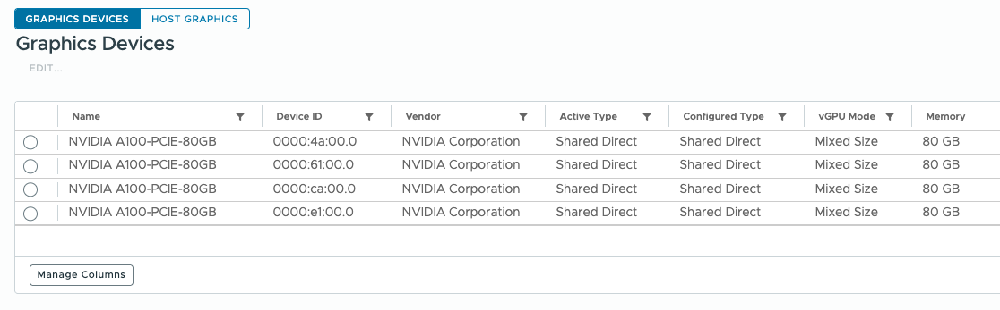

The topology only becomes visible with `nvidia-smi topo -m`:

```
$ nvidia-smi topo -m
        GPU0    GPU1    GPU2    GPU3
GPU0     X      NV12    SYS     SYS
GPU1    NV12     X      SYS     SYS
GPU2    SYS     SYS      X      NV12
GPU3    SYS     SYS     NV12     X
```

GPU0 and GPU1 connect via 12 NVLinks. GPU2 and GPU3 form a second NVLink pair. Cross-domain communication traverses PCIe and the NUMA interconnect. Two NVLink domains exist, but the PCIe bus addresses give no indication of which GPUs belong to which domain. The GPU Manager discovers both domains and registers them separately.

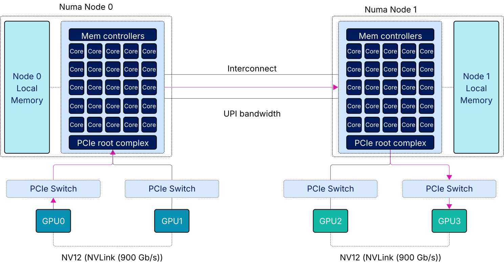

In a server with a single A100 NVL pair, the GPU Manager discovers two GPUs and detects the active NVLink connections between them. It registers this as a two-GPU NVLink domain. Both GPUs can still be assigned individually to separate VMs. Fractional vGPU profiles are also an option. In both cases, assigning GPUs individually or fractionally disables NVLink. The interconnect only functions when both GPUs are assigned together as a full-memory pair to a single VM.

For PCIe NVLink configurations, discovery is static. The physical bridge connections don't change at runtime. Once the GPU Manager identifies the NVLink domains at boot, that topology remains constant until hardware changes.


## Device Groups

The GPU Manager discovers NVLink domains. vSphere exposes them through Device Groups. Device Groups shift the operational model for multi-GPU provisioning. Instead of navigating host inventory, identifying PCIe addresses, and manually mapping which GPUs share NVLink connectivity, an administrator selects a geometry shape during VM configuration. A 2-GPU NVLink domain. A 4-GPU partition. The platform handles the translation from abstract shape to physical hardware.

A Device Group represents a set of hardware devices that share a specific interconnect relationship. When an administrator assigns a Device Group to a VM, they establish a contract: this VM requires devices with this communication geometry. vSphere enforces that contract through placement decisions and allocation tracking.
Device Groups abstract away PCIe topology. Rather than selecting GPU 0 at address 4A:00.0 and GPU 1 at address 61:00.0, an administrator selects "a two-GPU NVLink domain." The platform resolves that shape to specific hardware at placement time. This decoupling allows the same VM configuration to deploy across different hosts in a cluster, each with their own PCIe enumeration, as long as a matching Device Group is available.

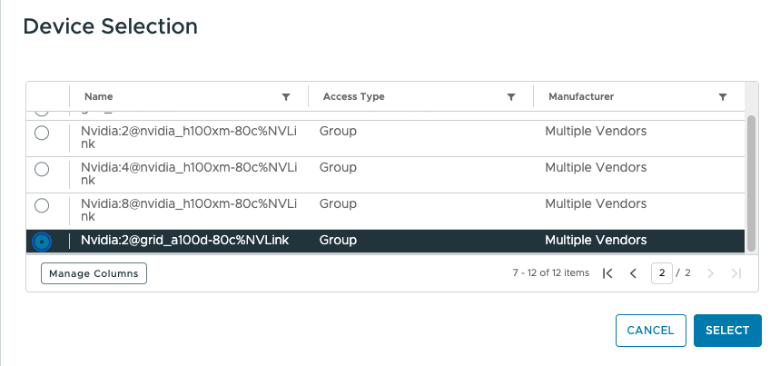

The naming convention encodes the shape. A Device Group named `Nvidia:2@grid_a100d-80c%NVLink` indicates two NVIDIA A100 80GB GPUs assigned as full-memory profiles with NVLink connectivity. The prefix denotes the GPU count, `grid_a100d-80c` identifies the full GPU profile, and the %NVLink suffix signals that this is a connected pair rather than two independent devices. A single A100 GPU without NVLink would simply be `grid_a100d-80c`. 

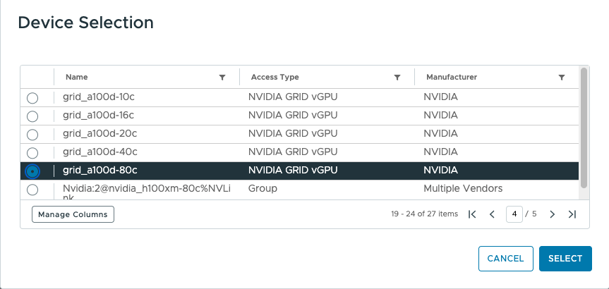

Instead of adding individual GPUs to a VM one at a time, hoping the combination preserves the desired interconnect, the administrator specifies the entire requirement as a single construct. One selection, one contract, one placement decision.

NVLink-connected GPUs are one type of Device Group. A second type pairs a GPU with a network interface card that shares the same PCIe switch. This configuration optimizes GPUDirect RDMA traffic, enabling the GPU to communicate directly with remote systems without staging data through system memory. As multi-node inference becomes more common, assigning optimal GPU and NIC combinations through Device Groups provides a path toward topology-aware distributed deployments.

## Cluster and Host Placement

A Device Group defines what a VM needs. DRS determines where that need can be satisfied. When a VM is configured with a Device Group, the requirement becomes part of its resource contract. At power-on, DRS together with Assignable Hardware evaluates which ESXi hosts can provide the specified Device Group shape. ESXi Hosts without a matching available capacity are filtered out. DRS then applies its Goodness calculation across the remaining eligible ESXi hosts to determine optimal placement. [Part 3](https://frankdenneman.ai/2026-02-13-how-vsphere-drs-makes-gpu-placement-decisions/) covers this two-phase process in detail.

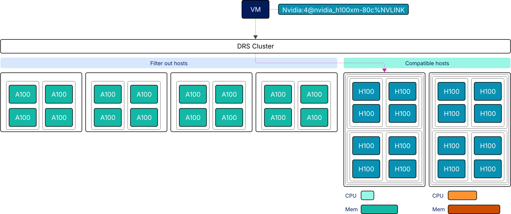

Once DRS selects a host, the platform binds specific hardware to the VM. When a VM with a 4-GPU Device Group powers on, one of the available 4-GPU NVLink domains is assigned. The specific GPUs, with their specific PCIe addresses, become bound to that VM for the duration of its lifecycle. For PCIe NVLink systems, this binding is straightforward: fixed physical bridges define which GPUs form valid pairs. HGX systems introduce a different dynamic. Eight GPUs connect through NVSwitch fabric, and valid partition configurations are defined by NVIDIA Fabric Manager at runtime.

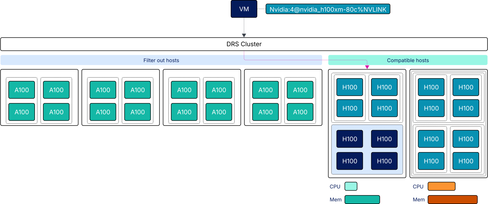

## NVSwitch and Fabric Manager

HGX systems replace physical NVLink bridges with NVSwitch fabric. Instead of fixed point-to-point connections between GPU pairs, NVSwitch provides all-to-all connectivity. This changes both the discovery model and the software stack required to manage it.

### Software Stack

Three NVIDIA components work together on NVSwitch-equipped hosts: the ESXi kernel GPU driver, the NVIDIA vGPU Manager, and [NVIDIA Fabric Manager](https://docs.nvidia.com/datacenter/tesla/pdf/fabric-manager-user-guide.pdf). The ESXi kernel GPU driver provides low-level GPU access. vGPU Manager handles device enumeration and vGPU profile management. Fabric Manager discovers the NVSwitch topology, initializes NVLink connections, and defines which GPU groupings form valid partitions.

During host initialization, Fabric Manager reports valid partition configurations to hostd. Assignable Hardware uses this information to build a tree of all possible NVSwitch GPU partitions. This tree is constructed at boot, before any VM powers on, giving the platform a complete map of valid multi-GPU configurations. For an HGX H100, the available device groups reflect these partition options:

- `Nvidia:2@nvidia_h100xm-80c%NVLink`
- `Nvidia:4@nvidia_h100xm-80c%NVLink`
- `Nvidia:8@nvidia_h100xm-80c%NVLink`

### GPU Module IDs

HGX systems introduce an additional identifier: the GPU Module ID. This value reflects the GPU's physical position and determines which partition configurations are valid. The Module ID differs from the GPU index derived from PCIe enumeration. To retrieve the mapping:

```
$ for id in $(nvidia-smi --query-gpu=index --format=csv,noheader); do
>     mod=$(nvidia-smi -a -i $id | grep "Module ID" | head -n1 | awk '{print $NF}')
>     echo "GPU $id: Module ID: $mod"
> done
GPU 0: Module ID: 2
GPU 1: Module ID: 4
GPU 2: Module ID: 1
GPU 3: Module ID: 3
GPU 4: Module ID: 7
GPU 5: Module ID: 5
GPU 6: Module ID: 6
GPU 7: Module ID: 8
```

The GPU index does not match the physical Module ID. Fabric Manager uses Module IDs when defining partitions. Module IDs 1 through 4 occupy one half of the GPU capacity. Module IDs 5 through 8 occupy the other half. These physical groupings determine valid partition boundaries. The platform maps between Module IDs and PCIe addresses when binding hardware to VMs.

### Dynamic Partitioning

Unlike PCIe NVLink, NVSwitch partition topology is not fixed at boot. Fabric Manager activates and deactivates partitions at runtime based on VM lifecycle events. Partition activation involves more than updating a routing table. Fabric Manager trains the NVLink interfaces for the GPUs in the partition, bringing those links into an operational state. It programs the NVSwitch routing to enable communication among the partition's GPUs and configures the switches to deny access to GPUs outside the partition. The result is an isolated segment of the NVSwitch fabric dedicated to that VM. Other VMs cannot send traffic into this segment, and the VM cannot reach GPUs assigned to other partitions.

When a VM is configured with a fractional vGPU profile or a single full GPU without a device group, Fabric Manager takes the opposite action: it disables NVLink for that GPU. The GPU operates in isolation, communicating only via PCIe. This ensures that individually assigned GPUs cannot interfere with active partitions and that NVLink bandwidth is reserved for workloads that explicitly request multi-GPU communication geometry.

When a VM shuts down, Fabric Manager reverses the process. The NVLink interfaces are untrained, the routing entries are removed, and the GPUs become available for reassignment. The fabric is reshaped to match the current set of running workloads. Multiple VMs can share the same HGX system, each with its own GPU partition or individual GPU assignment, each isolated at the switch fabric level.

## Partition Boundaries and Fragmentation

Not every GPU combination forms a valid partition. Fabric Manager defines supported configurations based on physical topology. For an HGX H100, the valid partition sizes are 8, 4, 2, and 1 GPU. These sizes follow a binary pattern. Binary divisions ensure clean resource allocation. Every combination of partitions sums exactly to 8. A 4-GPU partition plus two 2-GPU partitions consumes the complete GPU capacity. A 6-GPU partition would leave 2 GPUs that cannot pair efficiently with future workloads. Fabric Manager enforces these boundaries, returning only valid configurations through its API.

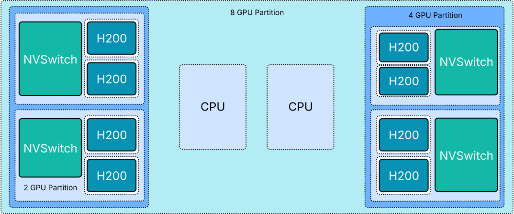

### Intelligent Partition Selection

Valid partition boundaries prevent impossible configurations. But multiple valid options often exist, and the choice shapes what remains available. Consider an HGX H100 ESXi host where DRS places three VMs in sequence. All GPU paritions are available, thus all device group placements are valid and compatible with any incoming workload.

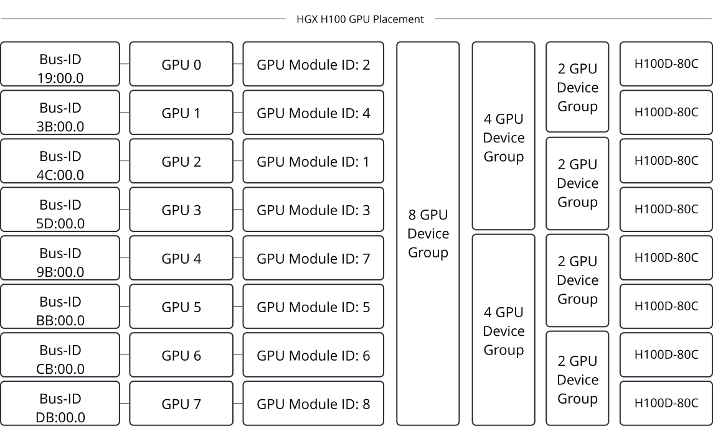

The first VM requires a 2-GPU device group. Assignable Hardware, working alongside Fabric Manager, evaluates the available 2-GPU partitions and selects Module IDs 5 and 7. Please note, that the ESXi host is not capable of deploying an 8-GPU device group and one option to place an 4-GPU device group is removed as well.

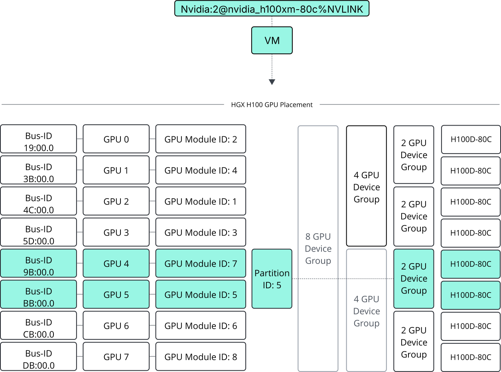

The second VM also requires a 2-GPU device group. Assignable Hardware selects Module IDs 6 and 8. These choices are deliberate. By placing both 2-GPU VMs in the second half of the GPU capacity, the platform preserves Module IDs 1 through 4 as a contiguous block.

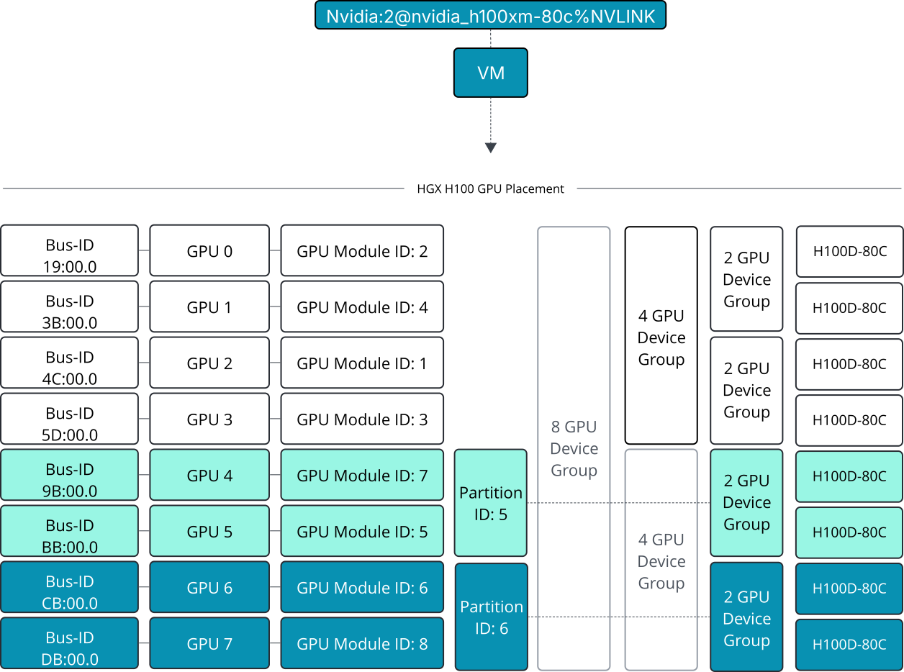

The third VM requires a 4-GPU device group. Because the first two placements were coordinated, Module IDs 1 through 4 remain available as a valid 4-GPU partition. The VM powers on successfully. This is the platform adding intelligence on top of Fabric Manager's validity constraints. Fabric Manager defines what combinations are allowed. Assignable Hardware influences which valid combination is chosen, favoring assignments that preserve larger partition options for future workloads.

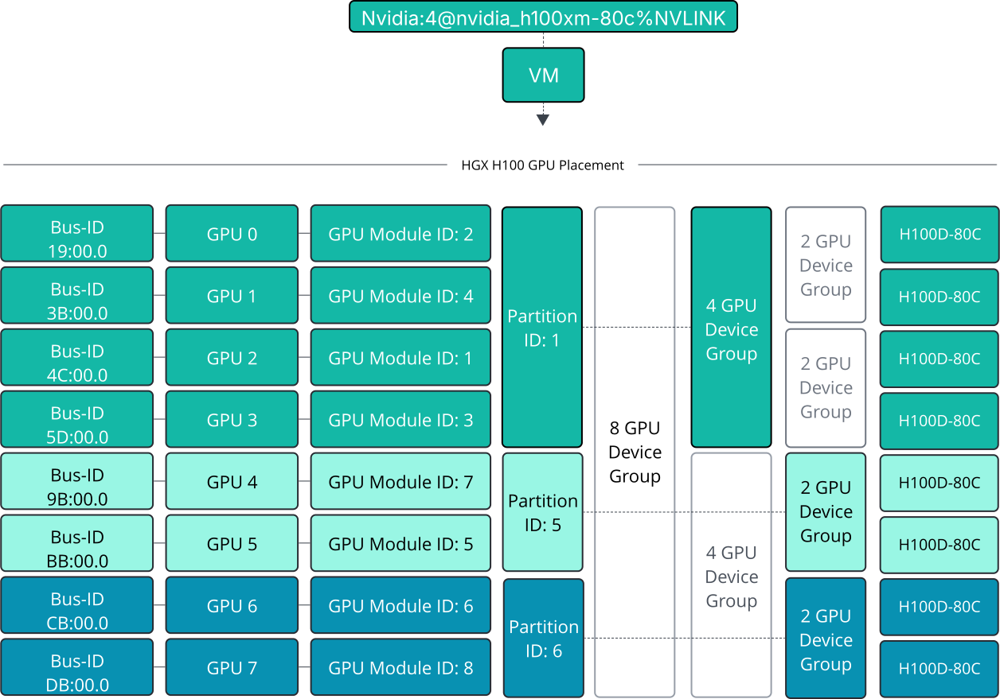

### The Alternative

Without this intelligence, the first 2-GPU VM might have received Module IDs 2 and 4. The second 2-GPU VM might have received Module IDs 7 and 5. When the 4-GPU request arrives, no valid partition exists. Module IDs 1, 3, 6, and 8 remain available, but they span both halves and cannot form a contiguous 4-GPU partition. The capacity would exist. The connectivity would not.

### Platform Considerations

Fragmentation avoidance is a scheduling optimization, not a Fabric Manager function. Fabric Manager defines what is valid. The platform decides what is optimal.

DRS placement policies influence this further. Consolidation mode packs workloads onto fewer hosts, preserving larger partition options on other hosts. Within a single HGX host, Assignable Hardware steers partition assignments toward allocations that maintain flexibility for subsequent requests. The communication geometry a VM requests is only as useful as the platform's ability to satisfy it without stranding the remaining capacity.

